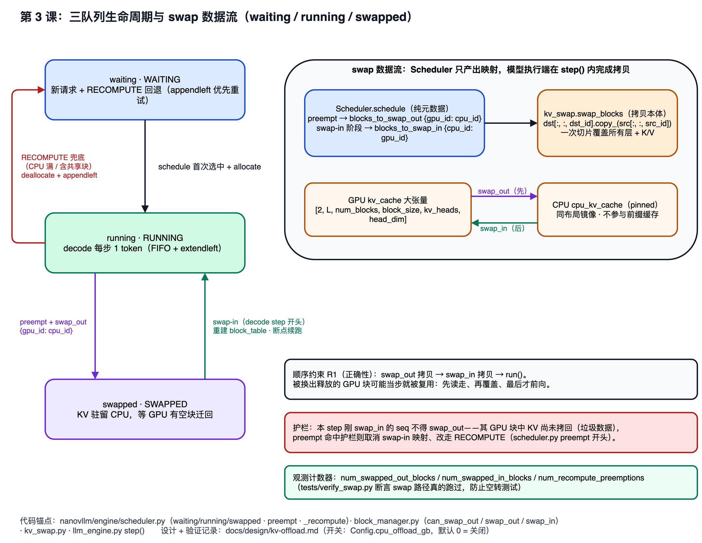
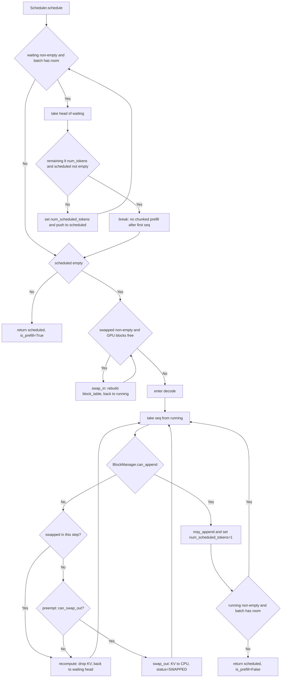

# 第 3 课：Scheduler 的队列、chunked prefill 与 preempt

## 1. 本课概述

**一句话概述**：每个 step 里谁来决定跑哪些请求、跑多少 token？答案是调度器（Scheduler），它的角色类似 OS 进程调度器——而显存不足时的 preempt，正是一道"换出（SWAP）还是丢弃重算（RECOMPUTE）"的选择题。

nano-vllm 的调度器在"吞吐量优先（即尽可能多地同时处理请求）"的约束下做批处理：prefill 阶段从 waiting 队列拼 batch（把多个请求合并处理以提高效率），decode 阶段从 running 队列逐步生成；KV cache block 不足时 preempt（抢占：暂时释放某个请求的资源，让其他请求能继续运行），被抢占的请求优先搬进 `swapped` 队列等 GPU 空出来再续跑，CPU 卸载关闭或资源不足时才退回"丢弃重算"。最终我们将得到一张调度流程图，每个分支条件都能对应到代码。

### 1.1 课时安排

| 阶段     | 时长   | 内容要点                                                                                      |
| -------- | ------ | ---------------------------------------------------------------------------------------------- |
| 概念回顾 | 10 min | 从"step 里谁决定跑哪些 seq"引出调度器的角色                           |
| 代码走读 | 40 min | waiting/running/swapped 三队列、prefill batch 拼接规则、分块预填充、preempt（SWAP/RECOMPUTE） |
| 动手练习 | 25 min | 用整数模拟 prefill 拼接，验证 chunked prefill 限制                                             |
| 答疑讨论 | 15 min | 讨论 SWAP 与 RECOMPUTE 的取舍（何时交换、何时重算）                                            |

### 1.2 学习目标

学完本课后，我们应该能回答以下问题：

- waiting、running、swapped 三个队列分别存放什么状态的请求？它们如何流转？
- `max_num_seqs` 和 `max_num_batched_tokens` 这两个配置是怎么限制 prefill batch 大小的？
- decode 阶段的 `preempt()` 在什么条件下触发？SWAP 与 RECOMPUTE 两条出路各在什么条件下被选择？
- 被 swap 的请求靠什么"断点续跑"？`step()` 里为什么必须先执行 swap_out 拷贝、再 swap_in、最后才跑模型？

---

## 2. 原理说明：为什么调度器要分两个阶段

推理引擎同时要服务很多请求，而 GPU 显存与算力都有限——调度器要在每个 step 里决定"跑哪些 seq、跑多少 token"。nano-vllm 把这件事拆成 prefill 与 decode 两个分支，理解这两个分支的动机，就能读懂本章所有代码。

### 2.1 prefill vs decode：计算特征决定批次形状

- prefill：一次处理 prompt 的几十到几千个 token，每个位置都要做完整的 Transformer 前向。这是 compute-bound（算力瓶颈）阶段——GPU 的矩阵乘越大越划算，所以单步塞尽量多的 token，不同 seq 合并成一个大 batch。
- decode：每步只生成 1 个新 token，但要读取全部历史 KV cache。这是 memory-bound（访存瓶颈）阶段——GPU 的计算单元大量空闲，瓶颈是显存带宽，所以单步尽量多塞 seq，共摊访存成本。

因此 `Scheduler.schedule` 会优先做 prefill（长 token 序列更划算），没有 prefill 可做时才转 decode——这也是为什么下一节两个分支是互斥的。

### 2.2 KV cache block 是瓶颈资源：抢占的两条出路（SWAP 与 RECOMPUTE）

GPU 显存分给 KV cache 的 block 总数是固定的。当 decode step 需要给某个 seq 追加 block 但池里没空闲时，只能牺牲一个 `RUNNING` seq——这就是 preempt。与操作系统的换出（swap out）一样，关键问题是"换到哪、怎么恢复"。nano-vllm 给了两个答案：

- **SWAP**（`cpu_offload_gb > 0` 时启用）：把该 seq 的 KV 块搬到 CPU 侧一块 pinned（页锁定，可高速 DMA）内存镜像里，seq 进入 `swapped` 队列；等 GPU 有空块再搬回来。由于已缓存的 token 数 `num_cached_tokens` 原样保留，decode 从断点直接续跑，一个 token 都不用重算。这与 OS 把页写回交换区、缺页时再读回是**字面上的同构**——旧版课程里"preempt 类似 OS swap"只是类比，如今在代码里是真实实现。
- **RECOMPUTE**（兜底，也是 CPU 卸载关闭时的唯一策略）：释放 KV 块、seq 退回 `waiting` 队首，下一轮重新 prefill。KV cache 可以由 token 序列确定性重算，这是 LLM 推理特有的"计算换空间"特权——OS 的普通页可没有这个选项。

两条路的代价结构不同：RECOMPUTE 的成本 ≈ 重跑整段 prefill（∝ 模型规模 × prompt 长度）；SWAP 的成本 ≈ KV 块经 PCIe 搬一个来回（∝ KV 字节数 ÷ 传输带宽）。在 0.6B 小模型上二者实测持平（RTX 3090，见[设计文档](../design/kv-offload.md) §10.E），模型越大、prompt 越长，重算越贵，SWAP 越划算——这也是 vLLM 在大模型场景把 swap 作为默认抢占手段的原因。

---

## 3. Scheduler 的关键逻辑

先看一张 `schedule()` 的流程图建立全局印象，再按分支对齐到代码。只围绕调度器的核心控制流展开，刻意不引入模型执行与算子细节。





### 3.1 三队列与配置约束

[`Scheduler.__init__`](../../nanovllm/engine/scheduler.py#L10-L25) 从 `Config` 读取批处理约束，并维护三个双端队列：`waiting`（新请求与被 RECOMPUTE 的请求）、`running`（正在 decode）、`swapped`（KV 驻留 CPU、等待迁回）；外加每步产出的两张块映射 `blocks_to_swap_out / blocks_to_swap_in`——调度器只决定"谁搬到哪"，张量拷贝由模型执行端完成（见 §3.6）。

- 配置默认值来源：`Config.max_num_batched_tokens/max_num_seqs`（见 [config.py:L6-L18](../../nanovllm/config.py#L6-L18)）
- 观测计数器：`num_swapped_out_blocks / num_swapped_in_blocks / num_recompute_preemptions` 累计三种事件，供 [tests/verify_swap.py](../../tests/verify_swap.py) 断言 swap 路径真的跑过（防止"内存够大没触发抢占"的空转测试）

### 3.2 prefill：从 waiting 里拼 batch（含分块预填充）

[prefill 分支](../../nanovllm/engine/scheduler.py#L40-L62)的核心循环是：只要 `waiting` 非空且 batch 仍有容量，就取队首 seq 计算本轮可以处理的 token 数，并更新 `seq.num_scheduled_tokens`。一个关键限制是：只有当 batch 中还没有其他 seq 时，才允许对首个 seq 做分块预填充（chunked prefill，即一次处理不完全部 token 时截断处理，下一轮再继续）——对应 `if remaining < num_tokens and scheduled_seqs: break`（见 [scheduler.py:L52-L53](../../nanovllm/engine/scheduler.py#L52-L53)）。注意只要本轮产出了 prefill，就会直接 return，swap-in 与 decode 都不执行。

> 逐行实现见第 1 课 §3.3.1 的嵌入片段。

### 3.3 decode：从 running 里逐步生成 1 token

当本轮无法做 prefill（`scheduled_seqs` 为空）时，[调度器进入 decode 分支](../../nanovllm/engine/scheduler.py#L80-L94)：从 `running` 里取 seq，并为其安排 `num_scheduled_tokens = 1`。在进入执行前，调度器会询问 [`BlockManager.can_append`](../../nanovllm/engine/block_manager.py#L107-L108) 是否还能为该 seq 追加 token 分配所需的 block。

> 逐行实现见第 1 课 §3.3.2 的嵌入片段。

### 3.4 preempt：SWAP 优先，RECOMPUTE 兜底

如果 `BlockManager` 判断无法 append（例如需要新 block 但空闲 block 不够），调度器会 [`preempt`](../../nanovllm/engine/scheduler.py#L97-L116)。现在的 preempt 是一个两层决策：

**护栏（先于一切）**：如果待抢占的 seq 恰好在本 step 的 swap-in 阶段刚被换入，它的 GPU 块里还没有有效 KV——CPU→GPU 的拷贝要等 `step()` 后半段才执行。此刻若把它 swap_out，拷到 CPU 的将是垃圾数据，把 CPU 里的真身覆盖掉。所以护栏命中时直接取消其 pending 的 swap-in 映射、改走 RECOMPUTE（这个 bug 是经 GPU 验证发现并修复的，见设计文档 §6）：

```python
# 护栏：本 step 刚 swap_in 的 seq，GPU 块中 KV 尚未拷回（是无效数据），绝不能再 swap_out。
def preempt(self, seq: Sequence):
    # A sequence swapped in earlier THIS step still has un-restored (garbage) KV in its GPU
    # blocks — the CPU->GPU copy only runs later in step(). Swapping it back out now would copy
    # that garbage and destroy its saved KV, so cancel its pending swap-in and RECOMPUTE instead.
    if not set(self.blocks_to_swap_in.values()).isdisjoint(seq.block_table):
        self.blocks_to_swap_in = {c: g for c, g in self.blocks_to_swap_in.items()
                                  if g not in set(seq.block_table)}
        self.num_swapped_in_blocks -= len(seq.block_table)
        self._recompute(seq)
        return
```

**主决策**：[`can_swap_out`](../../nanovllm/engine/block_manager.py#L135-L140) 同时检查两件事——CPU 空块够不够、该 seq 的所有块是否 `ref_count == 1`（全部独占）。共享块（前缀缓存命中产生的 `ref_count > 1`）不允许搬走：另一个序列可能还在 GPU 上读它。两者都满足才 SWAP，否则退回 RECOMPUTE：

```python
# 有 CPU 空位且块全独占 → SWAP（记下 {gpu_id: cpu_id} 映射，进 swapped 队列）；否则兜底 RECOMPUTE。
if self.block_manager.can_swap_out(seq):
    mapping = self.block_manager.swap_out(seq)
    self.blocks_to_swap_out.update(mapping)
    self.num_swapped_out_blocks += len(mapping)
    seq.status = SequenceStatus.SWAPPED
    self.swapped.append(seq)
else:
    self._recompute(seq)
```

RECOMPUTE 并没有被删掉，而是搬进了 [`_recompute`](../../nanovllm/engine/scheduler.py#L118-L123)——旧版 preempt 的逻辑原封不动，多了 1 行计数器：

```python
# 旧版 preempt 的四行原样住进 _recompute：状态回 WAITING、释放 block、回插 waiting 队首。
def _recompute(self, seq: Sequence):
    seq.status = SequenceStatus.WAITING
    seq.is_prefill = True
    self.block_manager.deallocate(seq)
    self.waiting.appendleft(seq)
    self.num_recompute_preemptions += 1
```

### 3.5 swap-in：被换出的请求怎么回来

swap-in 发生在 decode step 的开头：只有本轮没有任何 prefill 可做时，调度器才尝试把 `swapped` 队首迁回——只要 GPU 空块够放它的全部块就执行 [`swap_in`](../../nanovllm/engine/scheduler.py#L67-L77)。这一步是活性（liveness）的保障：若所有 running 都被换出、swapped 又无法迁回，decode 阶段将无 seq 可调度，调度循环会在 `assert scheduled_seqs`（[scheduler.py:L93](../../nanovllm/engine/scheduler.py#L93)）处中止——当前实现用断言表达"不可调度"这一不可恢复状态，而不是静默挂起。

```python
# swap-in：GPU 有空块就把 swapped 队首迁回 running；swap_in 重建 block_table，CPU 块随即释放。
while self.swapped and len(self.running) < self.max_num_seqs:
    seq = self.swapped[0]
    if not self.block_manager.can_swap_in(seq):
        break
    self.blocks_to_swap_in.update(self.block_manager.swap_in(seq))
    self.num_swapped_in_blocks += len(seq.block_table)
    seq.status = SequenceStatus.RUNNING
    self.swapped.popleft()
    self.running.append(seq)
```

"断点续跑"的关键在 [`BlockManager.swap_out`](../../nanovllm/engine/block_manager.py#L142-L156) 的最后一行：`seq.block_table = []`，旁边注释写着 *num_cached_tokens is intentionally preserved*——GPU 侧页表清空、已缓存 token 数保留。于是 swap_in 之后的 seq 以 decode 身份从 `num_cached_tokens` 继续，这就是 §2.2 说的"一个 token 都不用重算"。

> 为什么 swap-in 只在 decode step 做、而不抢占 prefill 的机会？这沿用了"prefill 优先即 return"的最简结构；vLLM 会优先迁回在飞的 swapped 序列以更快回收显存，属于可调度的策略点（设计文档 §9.4）。

### 3.6 step 的执行顺序：swap_out 拷贝 → swap_in 拷贝 → run

调度器产出的只是两张"谁搬到哪"的映射；真正的张量拷贝在 [`LLMEngine.step()`](../../nanovllm/engine/llm_engine.py#L52-L63) 里、模型前向之前执行，且顺序不可交换（设计文档中的约束 R1）：

```python
# LLMEngine.step：先换出（GPU→CPU）再换入（CPU→GPU），最后才跑模型——顺序本身是正确性约束。
if self.scheduler.blocks_to_swap_out:
    self.model_runner.call("swap_out", self.scheduler.blocks_to_swap_out)
if self.scheduler.blocks_to_swap_in:
    self.model_runner.call("swap_in", self.scheduler.blocks_to_swap_in)
token_ids = self.model_runner.call("run", seqs, is_prefill)
```

- **为什么先 out 后 in**：同一 step 内，被 swap_out 释放的 GPU 块可能立刻被 `may_append` 或 swap-in 目标复用；先把换出源的数据读走，之后任何人复用这块都安全。若某块同时是换出源与换入目标，也必须先 out 后 in。
- **为什么拷贝必须在 run 之前**：§3.4 的护栏只保护"刚换入又被抢占"的 seq；若把拷贝放到 run 之后，所有被换入序列在整个前向期间读到的都是垃圾 KV。固定"拷贝 → 前向"的顺序后，前向看到的 KV 必然有效。
- 拷贝本体只有一行（[kv_swap.py:L13-L14](../../nanovllm/engine/kv_swap.py#L13-L14)）：`dst[:, :, dst_id].copy_(src[:, :, src_id])`——一个切片覆盖该块所有层与 K/V，这是 nano 单张大张量布局的直接红利（vLLM 需要逐层的拷贝核）。

### 3.7 postprocess：回写 token 与完成条件

模型执行端返回 token 后，[`Scheduler.postprocess`](../../nanovllm/engine/scheduler.py#L125-L136) 会先把本 step 完成的 block 做哈希写回（为 prefix caching 服务），再推进 `num_cached_tokens`，最后在满足结束条件时回收资源并将 seq 从 `running` 移除。结束条件：遇到 EOS（结束标志）且不忽略，或生成 token 达到 `max_tokens`（见 [scheduler.py:L133-L136](../../nanovllm/engine/scheduler.py#L133-L136) 与 [sampling_params.py:L4-L11](../../nanovllm/sampling_params.py#L4-L11)）。

> 逐行实现见第 1 课 §3.4 的嵌入片段。

---

## 4. 练习

### 4.1 课堂练习

用整数模拟 `max_num_batched_tokens` 的消耗，推导 prefill 阶段每次给 seq 分配多少 `num_scheduled_tokens`，验证分块预填充的限制条件。

```python
# 练习：用整数模拟 Scheduler.prefill 的批拼接规则（不依赖 GPU）。
def simulate_prefill(prompt_lens, max_num_batched_tokens, block_size=256, num_cached_tokens=None):
    # num_cached_tokens 表示 prefix cache 命中后的已缓存 token 数；默认都为 0。
    if num_cached_tokens is None:
        num_cached_tokens = [0] * len(prompt_lens)
    scheduled = []
    remaining = max_num_batched_tokens
    for i, (n, cached) in enumerate(zip(prompt_lens, num_cached_tokens)):
        num_tokens = n - cached
        if remaining == 0:
            break
        if remaining < num_tokens and scheduled:
            break  # 对应 scheduler.py 的 "only allow chunked prefill for the first seq"
        scheduled_tokens = min(num_tokens, remaining)
        scheduled.append((i, scheduled_tokens))
        remaining -= scheduled_tokens
    return scheduled, remaining

print(simulate_prefill([1000, 900, 800], max_num_batched_tokens=1200))
```

- 验收要点（依据代码）：除首个 seq 外，不允许分块预填充（见 [scheduler.py:L52-L53](../../nanovllm/engine/scheduler.py#L52-L53)）

### 4.2 课后自测题

1. preempt 策略是"从 running 队尾抢占"，如果改成"从队首抢占"或"抢占占用 block 最多的 seq"，各自对吞吐和公平性有什么影响？
2. chunked prefill 限制只有 batch 中第一条 seq 可分块。如果允许任意 seq 分块，`postprocess` 的 `continue` 逻辑（[scheduler.py:L130-L131](../../nanovllm/engine/scheduler.py#L130-L131)）需要怎么改？
3. `max_num_seqs` 和 `max_num_batched_tokens` 中，哪个参数主要卡住 prefill、哪个主要卡住 decode？为什么？
4. `can_swap_out` 为什么要求 seq 的所有块 `ref_count == 1` 才允许 swap_out？如果放行共享块，swap_in 时可能出现什么不一致？
5. 本 step 刚被 swap_in 的 seq 为什么不能立即 swap_out？试着屏蔽护栏（[scheduler.py:L101-L106](../../nanovllm/engine/scheduler.py#L101-L106)），推演 KV 数据是在哪一步被破坏的。
6. 实测 0.6B 上 SWAP 与 RECOMPUTE 吞吐持平（设计文档 §10.E）。当模型换成 14B、prompt 更长时，天平向哪边倾斜？请用"重算成本 ∝ 模型规模 × prompt 长度，传输成本 ∝ KV 字节数"这个成本模型解释。
