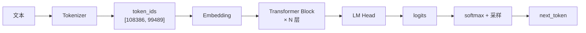
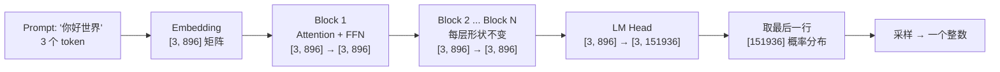
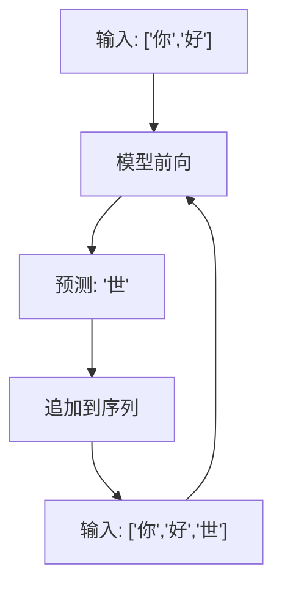
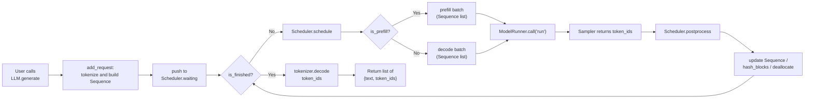
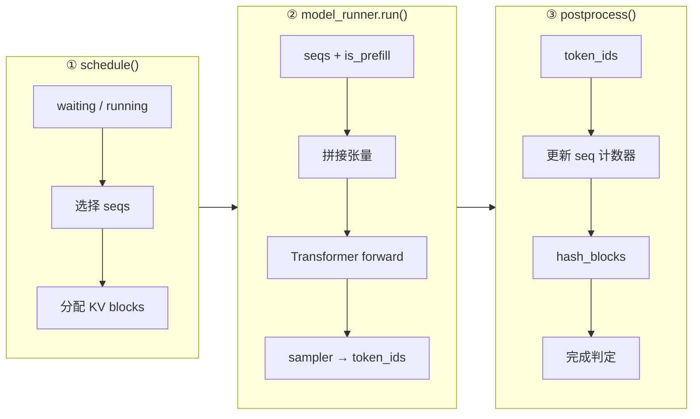
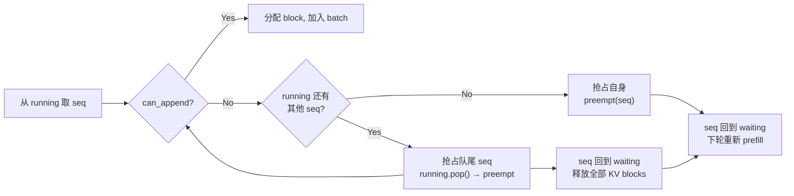

<h1 class="text-4xl font-bold!">第 1 课</h1>
<h2 class="text-2xl mt-4 font-normal opacity-80">从 LLM.generate 走到 step 循环</h2>

<div class="mt-12 text-sm opacity-60">
nano-vllm 实战课程 · 源码拆解 LLM 推理引擎
</div>

<!--
本节课从用户调用 LLM.generate("你好") 出发，追踪到引擎内部的 step() 循环，目标是建立对推理引擎主链路的"地图感"。

建议打开 nanovllm/llm.py 和 nanovllm/engine/llm_engine.py 让学生边看代码边听。
-->

---
layout: default
---

# nano-vllm 是什么？

一个从零构建的轻量级 vLLM 实现，用于学习 LLM 推理引擎的内部原理。

<div class="grid grid-cols-3 gap-4 mt-8">
<div class="bg-blue-500/10 p-4 rounded border-l-3 border-blue-500">
  <div class="text-2xl font-bold text-blue-400 mb-2">~1,400 行</div>
  <div class="text-sm opacity-80">纯 Python 代码，结构清晰，可读性强</div>
</div>
<div class="bg-green-500/10 p-4 rounded border-l-3 border-green-500">
  <div class="text-2xl font-bold text-green-400 mb-2">vLLM 同级</div>
  <div class="text-sm opacity-80">推理速度与 vLLM 相当（RTX 4070: 1434 tok/s）</div>
</div>
<div class="bg-purple-500/10 p-4 rounded border-l-3 border-purple-500">
  <div class="text-2xl font-bold text-purple-400 mb-2">8 课走读</div>
  <div class="text-sm opacity-80">从 generate 到 CUDA Graph，逐步展开</div>
</div>
</div>

<div v-click class="mt-6 text-sm text-center opacity-60">
  本节课是第一课：沿着一次 <code>LLM.generate("你好")</code> 调用，追踪代码从入口到返回的完整路径
</div>

<!--
nano-vllm 是一个从零构建的轻量级 vLLM 实现，约 1400 行 Python 代码，推理速度与 vLLM 相当。

本课是第一课，建立对 LLM 推理引擎主链路的全局认知。学生学完应能画出从 generate 到 step 的完整流程图。
-->

---
layout: default
---

# 本课在课程中的位置

<div style="height: 50px;"></div>
<div class="mt-4 text-sm max-w-2xl mx-auto">

<div class="flex justify-center gap-1 mb-2">
  <div class="bg-blue-600 text-white rounded px-3 py-1.5 font-bold w-28 text-center">L01<br/><span class="text-xs font-normal opacity-80">generate→step</span></div>
  <div class="flex items-center text-gray-400 text-lg">→</div>
  <div class="bg-gray-700 text-gray-200 rounded px-3 py-1.5 w-28 text-center">L02<br/><span class="text-xs text-gray-400">Sequence</span></div>
  <div class="flex items-center text-gray-400 text-lg">→</div>
  <div class="bg-gray-700 text-gray-200 rounded px-3 py-1.5 w-28 text-center">L03<br/><span class="text-xs text-gray-400">调度器</span></div>
  <div class="flex items-center text-gray-400 text-lg">→</div>
  <div class="bg-gray-700 text-gray-200 rounded px-3 py-1.5 w-28 text-center">L04<br/><span class="text-xs text-gray-400">Block 管理</span></div>
</div>

<div class="flex justify-center mb-1">
  <div class="text-gray-400 text-lg">↓</div>
</div>

<div class="flex justify-center gap-1">
  <div class="bg-gray-700 text-gray-200 rounded px-3 py-1.5 w-28 text-center">L05<br/><span class="text-xs text-gray-400">Prefill</span></div>
  <div class="flex items-center text-gray-400 text-lg">→</div>
  <div class="bg-gray-700 text-gray-200 rounded px-3 py-1.5 w-28 text-center">L06<br/><span class="text-xs text-gray-400">Decode</span></div>
  <div class="flex items-center text-gray-400 text-lg">→</div>
  <div class="bg-gray-700 text-gray-200 rounded px-3 py-1.5 w-28 text-center">L07<br/><span class="text-xs text-gray-400">Attention</span></div>
  <div class="flex items-center text-gray-400 text-lg">→</div>
  <div class="bg-gray-700 text-gray-200 rounded px-3 py-1.5 w-28 text-center">L08<br/><span class="text-xs text-gray-400">优化全景</span></div>
</div>

</div>

<div v-click class="mt-4 grid grid-cols-2 gap-3 text-sm">
<div class="bg-gray-800/50 p-3 rounded">
  <strong>L01-L04：引擎调度层</strong><br/>请求如何进入系统、如何被选择执行、KV cache 如何分配
</div>
<div class="bg-gray-800/50 p-3 rounded">
  <strong>L05-L08：模型执行层</strong><br/>张量如何拼装、注意力如何计算、优化手段有哪些
</div>
</div>

<!--
L01-L04 是调度层（系统如何管理请求），L05-L08 是执行层（张量如何计算）。本课作为第一课，后续所有课程都建立在本课主干基础上，务必让学生理解三段式框架。
-->

---
layout: default
---

# 1.1 课时安排

从用户调用 `generate("你好")` 开始，追踪代码到底做了什么，直到拿到生成的回答。

| 阶段     | 时长   | 内容要点                                                             |
| -------- | ------ | -------------------------------------------------------------------- |
| 课程介绍 | 5 min  | nano-vllm 项目概览、本课在课程中的位置                               |
| 原理铺垫 | 20 min | Transformer 架构总览、Tokenizer 原理、自回归生成动机                 |
| 代码走读 | 40 min | `LLM` → `add_request` → `step` 三段式 → Prefill/Decode → postprocess |
| 脚本演示 | 15 min | 运行 L01_end_to_end.py，5 个 section 逐一验证                        |
| 动手练习 | 10 min | 自测题 + 代码观察                                                    |

<!--
原理铺垫 20 分钟快速回顾 Transformer，如果学生已有基础可以加速。代码走读 40 分钟是核心，需要集中注意力。脚本演示环节建议提前确认每个人的终端环境已就绪。
-->

---
layout: default
---

# 1.2 学习目标

学完本课后，我们应该能回答以下问题：

<div class="mt-6 space-y-4">

<div v-click="1" class="flex items-start gap-3 p-3 bg-blue-500/10 border-l-3 border-blue-500 rounded-r">
  <span class="text-blue-400 font-bold">Q1</span>
  <span><code>LLM</code> 和 <code>LLMEngine</code> 是什么关系？为什么用户调 <code>LLM.generate</code> 最终执行的是 <code>LLMEngine</code> 里的代码？</span>
</div>

<div v-click="2" class="flex items-start gap-3 p-3 bg-blue-500/10 border-l-3 border-blue-500 rounded-r">
  <span class="text-blue-400 font-bold">Q2</span>
  <span>每个 step 的「三段式」是什么？（调度 → 执行 → 回写）</span>
</div>

<div v-click="3" class="flex items-start gap-3 p-3 bg-blue-500/10 border-l-3 border-blue-500 rounded-r">
  <span class="text-blue-400 font-bold">Q3</span>
  <span>prefill 和 decode 在 step 循环里分别对应什么？为什么引擎需要区分二者？</span>
</div>

<div v-click="4" class="flex items-start gap-3 p-3 bg-blue-500/10 border-l-3 border-blue-500 rounded-r">
  <span class="text-blue-400 font-bold">Q4</span>
  <span>一次 <code>generate</code> 调用最终返回的 dict 长什么样？<code>text</code> 和 <code>token_ids</code> 分别来自哪里？</span>
</div>

</div>

<!--
建议先让学生读一遍，带着问题听课。课后可以回到这页自检。Q1 关于 LLM/LLMEngine 的继承关系在 llm.py 中只有 2 行代码，非常直观，可以作为开场提问。
-->

---
layout: section
---

# 2. 原理说明

## 从文字到 token 再到生成

<!--
本节进入原理说明，覆盖 Transformer 架构、Tokenizer 和自回归生成。如果学生已有 LLM 基础可以快速翻过；如果是新手，建议在 Transformer 概览上多花时间。强调三个小节之间的递进关系：模型是什么 → 输入怎么来 → 输出怎么一步步产生。
-->

---
layout: default
---

# 2.1 Transformer 是什么？

把 Transformer 想象成一个「**黑箱函数**」：

> **输入**：一串数字编号（token_ids）
> **输出**：下一个数字编号的概率分布

<div class="mt-5"></div>



<div class="grid grid-cols-3 gap-4 mt-3 text-sm">
<div class="bg-blue-500/10 p-3 rounded border-l-3 border-blue-500">
  <strong>Embedding</strong><br/>整数编号 → 向量
</div>
<div class="bg-green-500/10 p-3 rounded border-l-3 border-green-500">
  <strong>N 层 Transformer Block</strong><br/>「互相看一看」+「各自想一想」
</div>
<div class="bg-purple-500/10 p-3 rounded border-l-3 border-purple-500">
  <strong>LM Head</strong><br/>最后位置的向量 → 词表大小概率
</div>
</div>

<!--
把 Transformer 比喻成"黑箱函数"——输入 token_ids，输出 next_token 的概率分布。不要深入注意力机制细节，第 7 课才展开。重点让学生记住 Embedding → N 层 Block → LM Head 三段结构，以及每层输入输出形状不变。
-->

---
layout: default
---

# 2.1 展开：数据在 Transformer 中如何流动

以一个 3 词输入为例，追踪每一步的数据形状变化：

<div class="mt-6">



</div>

<div v-click class="mt-3 p-3 bg-green-500/10 border-l-3 border-green-500 rounded-r text-sm">
  🔑 <strong>关键</strong>：每层的输入输出形状相同（都是 <code>[seq_len, hidden_dim]</code>），因此可以堆叠任意多层。只有 LM Head 把维度从 hidden_dim 映射到词表大小。
</div>

<!--
以"你好世界"3 token 为例追踪数据形状变化。强调形状 [seq_len, hidden_dim] 在层与层之间保持不变。这是理解 prefill/decode 的基础——prefill 一次处理整个 seq_len，decode 每次只处理 1 个 token。
-->

---
layout: default
---

# 2.2 Tokenizer：文字怎么变成数字

LLM 不直接「看」文字。Tokenizer 负责把文本拆成子词片段：

```python
# Tokenizer 把人类文字变成模型能处理的整数
from transformers import AutoTokenizer

tokenizer = AutoTokenizer.from_pretrained("Qwen/Qwen3-0.6B")

# 英文示例：空格分词
tokenizer.encode("Hello world")      # → [9707, 1879]

# 中文示例：子词拆分
tokenizer.encode("你好世界")          # → [108386, 99489]

# 混合示例
tokenizer.encode("你好, nano-vllm!") # → [108386, 11, 2037, 45, ...]
```

<div v-click class="mt-3 p-3 bg-green-500/10 border-l-3 border-green-500 rounded-r text-sm">
  💡 Qwen3-0.6B 词表大小 = <strong>151,936</strong>。每个 token_id 都是 0~151935 之间的整数。LM Head 最终输出的 logits 也是这个大小的向量。
</div>

<!--
演示英文、中文、混合三种情况的 tokenize 结果。特别点出 Qwen3 词表 151936 这个数字——LM Head 输出层的大小。可以现场打开 Python REPL 运行 tokenizer.encode("你好世界") 展示。
-->

---
layout: default
---

# 2.2 Tokenizer 在代码中的位置

<SourceCode file="nanovllm/engine/llm_engine.py" lines="43-47" />

```python
def add_request(self, prompt, sampling_params):
    # 第一步：tokenize — 把字符串变成整数列表
    token_ids = (prompt if isinstance(prompt, list)
                 else self.tokenizer.encode(prompt))

    seq = Sequence(token_ids=token_ids, sampling_params=sampling_params)
    self.scheduler.add(seq)
```

<div v-click class="mt-4 p-3 bg-yellow-500/10 border-l-3 border-yellow-500 rounded-r text-sm">
  <code>add_request</code> 是用户 prompt 进入引擎的<strong>唯一入口</strong>。它的第一行就是 <code>tokenizer.encode(prompt)</code>——没有这步，引擎不知道要处理什么。
</div>

<!--
打开 nanovllm/engine/llm_engine.py 的 add_request 方法(43-47 行)，定位 tokenizer.encode 这一行。强调 add_request 是 prompt 进入引擎的唯一入口。可以现场查看 llm_engine.py 对应代码段。
-->

---
layout: default
---

# 2.3 自回归生成：为什么要逐个产出 token

Transformer 每次只预测**一个**下一个 token。生成整句话必须循环：

<div class="grid grid-cols-2 gap-6 mt-3">
<div>

**自回归循环**



</div>

<div>

**类比：**

- 📖 把试卷题目从头到尾读一遍 → **Prefill**
- ✍️ 写答案时每个字都要参考前文 → **Decode**

**为什么区分二者？**

- Prefill: 计算量 `O(n²)`，但只做一次
- Decode: 计算量 `O(n)` per step，但重复几百次
- 不同计算模式需要不同的优化策略

</div>
</div>

<div v-click class="mt-2 text-center text-base font-semibold">
  这就是为什么 <code>generate</code> 里有一个 while 循环反复调用 <code>step()</code>
</div>

<!--
Transformer 每次只预测一个 token——这是推理引擎设计最根本的约束。用"读题目 vs 写答案"的类比帮助学生理解 prefill vs decode。关键句：这就是 generate 里有 while 循环反复调用 step() 的原因。可以追问学生：如果每一步都重新计算前文会怎样？
-->

---
layout: default
---
# Prefill vs Decode：一张表看清两种模式

| 维度                | Prefill                           | Decode                         |
| ------------------- | --------------------------------- | ------------------------------ |
| **触发时机**        | waiting 队列非空                  | waiting 为空 + running 非空    |
| **输入内容**        | prompt 的全部（或部分）token      | 每条 seq 上次生成的 1 个 token |
| **每 seq token 数** | `num_scheduled_tokens` ≥ 1        | 固定为 1                       |
| **计算特征**        | 计算量大，可并行处理多个 token    | 逐个 token，延迟敏感           |
| **KV cache**        | 首次写入（或前缀复用）            | 追加写入一个位置               |
| **调度优先级**      | 优先（`waiting` 非空就不 decode） | 次要                           |
| **num_tokens 符号** | 正数（= Σ scheduled）             | 负数（= -len(seqs)）           |

<div v-click class="mt-3 p-3 bg-green-500/10 border-l-3 border-green-500 rounded-r text-sm">
  ⚡ <strong>性能含义</strong>：Prefill 吞吐高（一次处理多个 token），Decode 延迟低（每次只推 1 token）。引擎的吞吐统计正是靠 <code>num_tokens</code> 的正负来区分两种模式。
</div>

<!--
逐一解释表格中每一行的含义。特别强调 num_tokens 符号的设计意图：正数=prefill（吞吐），负数=decode（延迟）。可以提问学生：为什么 decode 阶段每 seq 固定只有一个 token？这跟自回归的特性有什么关系？
-->

---
layout: section
---
# 3. 推理主链路

## 代码走读

<!--
建议学生打开编辑器，跟随幻灯片逐一浏览对应的源文件。本节顺序：端到端流程图 → LLM 别名 → generate 主循环 → add_request → step 三段式 → prefill/decode 分支 → postprocess。
-->

---
layout: default
---

# 端到端流程图

<div class="mt-6"></div>



<div class="mt-6"></div>

<div v-click class="mt-2 text-center text-sm opacity-80">
  这张图就是本节课的「地图」。下面我们逐框对齐到源码。
</div>

<!--
这张图是本课的"地图"。花 2 分钟讲解整个流程，强调循环结构（图中回到 is_finished? 的箭头）。告诉学生后面每一页都会对齐到这张图的某个方框。可以让学生截屏或手绘这张图作为笔记。
-->

---
layout: default
---

# 3.1 LLM 是 LLMEngine 的别名入口

<SourceCode file="nanovllm/llm.py" lines="1-5" />

```python
from nanovllm.engine.llm_engine import LLMEngine


class LLM(LLMEngine):
    pass
```

<div class="mt-4 grid grid-cols-2 gap-4 text-sm">
<div class="bg-blue-500/10 p-3 rounded border-l-3 border-blue-500">
  <strong>为什么这样设计？</strong><br/>
  <ul class="mt-1 space-y-1">
    <li><code>LLM</code> 是用户友好的「外壳」</li>
    <li>不新增任何方法，所有逻辑在 <code>LLMEngine</code></li>
    <li>未来可扩展（如异步接口）而不影响引擎</li>
  </ul>
</div>
<div class="bg-green-500/10 p-3 rounded border-l-3 border-green-500">
  <strong>验证</strong><br/>
  <code>>>> from nanovllm import LLM</code><br/>
  <code>>>> issubclass(LLM, LLMEngine)</code><br/>
  <code>True</code><br/>
  <span class="text-xs opacity-60">（L01_end_to_end.py §1）</span>
</div>
</div>

<!--
打开 nanovllm/llm.py，只有 2 行代码。LLM 直接继承 LLMEngine 且不新增任何方法。可以问学生为什么这样设计——解耦 API 和实现、方便扩展异步接口。打开 Python 用 issubclass 验证。
-->

---
layout: default
---

# 3.2 generate：入队 + 循环 step

<SourceCode file="nanovllm/engine/llm_engine.py" lines="60-90" />

```python {all|4-6|7-13|14-16}
def generate(self, prompts, sampling_params):
    # 1. 入队：把每个 prompt → tokenize → Sequence → waiting
    for prompt, sp in zip(prompts, sampling_params):
        self.add_request(prompt, sp)

    # 2. 循环 step，直到所有 seq 完成
    outputs = {}
    while not self.is_finished():
        output, num_tokens = self.step()
        for seq_id, token_ids in output:
            outputs[seq_id] = token_ids

    # 3. detokenize 返回文本
    return [{"text": self.tokenizer.decode(tids),
             "token_ids": tids} for tids in outputs.values()]
```

<div v-click class="mt-2 text-xs opacity-60">
  数据形态：输入 <code>prompts: list[str]</code> → 中间 <code>Sequence</code> → 输出 <code>list[{"text": str, "token_ids": list[int]}]</code>
</div>

<!--
打开 llm_engine.py 的 generate 方法。分三部分讲解：for 循环入队（add_request）、while 循环 step（核心循环）、最后 detokenize 返回。强调数据形态转换：list[str] → Sequence → list[dict]。动画逐行高亮代码。
-->

---
layout: default
---

# 3.2 add_request 深入：从 prompt 到 waiting 队列

<SourceCode file="nanovllm/engine/llm_engine.py" lines="43-47" />

```python
def add_request(self, prompt, sampling_params):
    # 第一步：tokenize — 字符串 → 整数列表
    token_ids = (prompt if isinstance(prompt, list)
                 else self.tokenizer.encode(prompt))

    # 第二步：包装成 Sequence（请求的「档案袋」）
    seq = Sequence(token_ids=token_ids, sampling_params=sampling_params)

    # 第三步：推入调度器的 waiting 队列
    self.scheduler.add(seq)
```

<div class="mt-4 grid grid-cols-3 gap-3 text-sm">
<div v-click="1" class="bg-blue-500/10 p-3 rounded text-center">
  <div class="font-bold mb-1">① Tokenize</div>
  <div class="opacity-70">字符串 → token_ids</div>
  <div class="opacity-50 text-xs mt-1">tokenizer.encode("你好")<br/>→ [108386]</div>
</div>
<div v-click="2" class="bg-green-500/10 p-3 rounded text-center">
  <div class="font-bold mb-1">② Sequence</div>
  <div class="opacity-70">包装请求状态</div>
  <div class="opacity-50 text-xs mt-1">token_ids + max_tokens<br/>+ temperature...</div>
</div>
<div v-click="3" class="bg-purple-500/10 p-3 rounded text-center">
  <div class="font-bold mb-1">③ scheduler.add</div>
  <div class="opacity-70">推入 waiting 队列</div>
  <div class="opacity-50 text-xs mt-1">下一轮 schedule()<br/>优先处理</div>
</div>
</div>

<!--
逐行讲解 add_request 的三个步骤：tokenize → 包装 Sequence → scheduler.add。可以用板书展示数据流：字符串 → tokenizer.encode → list[int] → Sequence → waiting。提示学生 L01 脚本 §2 会验证这一流程。
-->

---
layout: default
---

# 3.3 step：三段式总览

<SourceCode file="nanovllm/engine/llm_engine.py" lines="49-55" />

```python {all|2-3|4|5-7}
def step(self):
    seqs, is_prefill = self.scheduler.schedule()     # ① 调度
    num_tokens = sum(...) if is_prefill else -len(seqs)
    token_ids = self.model_runner.call("run", seqs, is_prefill)  # ② 执行
    self.scheduler.postprocess(seqs, token_ids, is_prefill)      # ③ 回写
    outputs = [(seq.seq_id, seq.completion_token_ids)
               for seq in seqs if seq.is_finished]
    return outputs, num_tokens
```

<div class="grid grid-cols-3 gap-3 mt-6">

<div v-click="1" class="bg-blue-500/10 p-3 rounded text-center">
  <div class="text-lg font-bold mb-1">① 调度</div>
  <div class="text-xs opacity-80">从 waiting/running 取 seq<br/>决定 prefill 还是 decode<br/>分配 KV cache block</div>
</div>

<div v-click="2" class="bg-green-500/10 p-3 rounded text-center">
  <div class="text-lg font-bold mb-1">② 执行</div>
  <div class="text-xs opacity-80">准备输入张量<br/>运行 Transformer 前向<br/>采样得到 next token</div>
</div>

<div v-click="3" class="bg-purple-500/10 p-3 rounded text-center">
  <div class="text-lg font-bold mb-1">③ 回写</div>
  <div class="text-xs opacity-80">更新 Sequence 状态<br/>hash_blocks 前缀缓存<br/>FINISHED 判定 + 资源回收</div>
</div>

</div>

<!--
step 是本课最重要的函数。强调三段式：schedule（调度）→ run（执行）→ postprocess（回写）。每次 step 只走一种模式（prefill 或 decode），由 is_prefill 标志区分。让学生记住这个框架，后续课程会对每段分别深入。
-->

---
layout: default
---

# 3.3 三段式的数据流

把三段式展开为数据流图，看清每一段的输入输出：



<div v-click class="mt-3 p-3 bg-green-500/10 border-l-3 border-green-500 rounded-r text-sm">
  三个步骤<strong>同步串行</strong>执行。一次 step 只走一种模式（prefill 或 decode），不混合。
</div>

<!--
用 mermaid 图展示三段式的输入输出。强调三个步骤同步串行执行，不混合 prefill 和 decode。可以问学生：schedule 和 allocate 的关系是什么？为什么 postprocess 需要 hash_blocks？
-->

---
layout: default
---

# 3.3.1 Prefill 分支：一次性把 prompt 读完

<SourceCode file="nanovllm/engine/scheduler.py" lines="29-55" />

```python {all|3|5-6|7-9|12-13}
# Scheduler.schedule 中的 prefill 循环
while self.waiting and len(scheduled_seqs) < self.max_num_seqs:
    seq = self.waiting[0]                         # 从 waiting 头部取
    remaining = self.max_num_batched_tokens - num_batched_tokens
    if remaining == 0:
        break
    if not seq.block_table:                       # 首次 prefill
        num_cached_blocks = self.block_manager.can_allocate(seq)
        if num_cached_blocks == -1:               # KV cache 不够
            break
        num_tokens = seq.num_tokens - num_cached_blocks * self.block_size
    else:                                         # 恢复被抢占的 seq
        num_tokens = seq.num_tokens - seq.num_cached_tokens
    if remaining < num_tokens and scheduled_seqs:  # 只允许第一条 chunk
        break
```

<div v-click class="mt-2 p-3 bg-green-500/10 border-l-3 border-green-500 rounded-r text-sm">
  🔑 <strong>三个关键概念</strong>：Chunked Prefill、前缀缓存命中、token 预算。下面逐一展开。
</div>

<!--
打开 scheduler.py 的 prefill 循环。讲解三个关键概念：Chunked Prefill（长 prompt 分片）、前缀缓存（复用已计算的 KV）、token 预算（max_num_batched_tokens）。不要深入细节，后续三页逐一展开。
-->

---
layout: default
---

# 概念 1：Chunked Prefill — 长 prompt 分批处理

当一条 prompt 的 token 数超过 `max_num_batched_tokens` 时，不能一次性塞入：

<div class="grid grid-cols-2 gap-6 mt-4">
<div>

**不分块的问题**

```text
prompt: [t1 t2 ... t8192]  ← 太长！
batch 剩余: 4096 个位置
→ 塞不进去，死锁
```

<div class="text-xs opacity-60 mt-1">waiting[0] 永远等待足够空间</div>

</div>
<div>

**Chunked Prefill 方案** (scheduler.py:L42)

```text
step 1: [t1 ... t4096] → prefill
step 2: [t4097 ... t8192] → prefill
step 3: [t8193] → decode
```

<div class="text-xs opacity-60 mt-1">分片逐步处理，每片一次 prefill</div>

</div>
</div>

<div v-click class="mt-3 p-3 bg-yellow-500/10 border-l-3 border-yellow-500 rounded-r text-sm">
  ⚠️ <strong>约束</strong>：Chunked prefill 只对 batch 的<strong>第一条</strong> seq 允许切分（<code>if remaining < num_tokens and scheduled_seqs: break</code>）。这是为了避免所有 seq 都被切分导致调度复杂度爆炸。
</div>

<!--
当 prompt 超过 max_num_batched_tokens 时需要分片处理。用 8192 token → 4096+4096 的例子演示。强调约束：只有 batch 中第一条 seq 允许分片。可以问学生：不分片会有什么问题？（waiting[0] 永远等不到足够空间，死锁）
-->

---
layout: default
---

# 概念 2：前缀缓存 — 相同 prefix 不重复计算

当多个请求共享相同的前缀（如 system prompt），前缀缓存可以复用已计算的 KV cache：

<SourceCode file="nanovllm/engine/scheduler.py" lines="35-39" />

```python
if not seq.block_table:
    num_cached_blocks = self.block_manager.can_allocate(seq)
    # ↑ 检查有多少 block 的 hash 与已缓存的匹配
    if num_cached_blocks == -1:     # 一个 block 都分不到
        break
    num_tokens = seq.num_tokens - num_cached_blocks * self.block_size
    # ↑ 只需要计算未命中部分的 token
```

<div v-click class="mt-3 p-3 bg-green-500/10 border-l-3 border-green-500 rounded-r text-sm">
  <strong>例子</strong>：prompt 有 1024 token，block_size=256，命中 2 个 cached block → 只需计算 1024 - 2×256 = <strong>512 token</strong>。详见第 4 课。
</div>

<!--
打开 scheduler.py:35-39，讲解 can_allocate 返回值含义。命中的块不需要重复计算。举例说明节省的计算量。预告第 4 课会深入 block_manager 的前缀缓存机制。
-->

---
layout: default
---

# 概念 3：token 预算 — max_num_batched_tokens

Prefill 不是无限并发的，有一个 token 预算上限：

<div class="mt-4">

<SourceCode file="nanovllm/config.py" lines="7-8" />

```python
# Config 中的默认值
max_num_batched_tokens: int = 16384  # 每轮 prefill 最多处理 16384 个 token
max_num_seqs: int = 512             # 每轮最多 512 条 seq
```

</div>

<div v-click class="mt-3">

**调度循环的退出条件**（按优先级）：

1. `remaining == 0` → token 预算用尽
2. `num_cached_blocks == -1` → KV cache 不够，分不到 block
3. `remaining < num_tokens and scheduled_seqs` → 已有 seq 在 batch 中，不再切分新 seq

</div>

<div v-click class="mt-3 p-3 bg-green-500/10 border-l-3 border-green-500 rounded-r text-sm">
  💡 <strong>为什么设上限？</strong>控制单次前向的计算量，防止延迟尖峰。16384 token ≈ 一次处理约 64 条 256-token 的短 prompt，或 1 条长 prompt 的 chunk。
</div>

<!--
三个退出条件逐一讲解。token 预算就像车辆载重限制，超载了要分批发车。16384 意味着一次最多处理约 64 条短 prompt 或 1 条长 prompt 的 chunk。这个值可以在配置中调整。
-->

---
layout: default
---

# 3.3.2 Decode 分支：每步追加一个 token

<SourceCode file="nanovllm/engine/scheduler.py" lines="57-73" />

```python {all|3|4-9|10-13}
# Scheduler.schedule 中的 decode 循环
while self.running and len(scheduled_seqs) < self.max_num_seqs:
    seq = self.running.popleft()            # FIFO 取出
    while not self.block_manager.can_append(seq):
        if self.running:
            self.preempt(self.running.pop()) # 抢占队尾，释放 block
        else:
            self.preempt(seq)                # 只剩自己也被抢占
            break
    else:
        seq.num_scheduled_tokens = 1         # decode 固定 1 token/step
        seq.is_prefill = False
        self.block_manager.may_append(seq)   # block 满了就追加新的
        scheduled_seqs.append(seq)
    assert scheduled_seqs                                  # 至少调度一条
    self.running.extendleft(reversed(scheduled_seqs))      # 未选中的放回 queue
    return scheduled_seqs, False
```

<!--
打开 scheduler.py:57-73 的 decode 循环。每个 seq 每步固定 1 个 token，FIFO 顺序调度。重点讲解 while/else 配合 preempt 的结构——当 KV cache 不够时如何抢占队尾。可以画流程图辅助理解。
-->

---
layout: default
---

# Decode 的抢占机制详解

当 KV cache 不够继续 decode 时，抢占（preemption）发生：



<div v-click class="mt-3 p-3 bg-yellow-500/10 border-l-3 border-yellow-500 rounded-r text-sm">
  ⚠️ <strong>为什么抢队尾？</strong>FIFO 队列，队尾是最后进入的 seq，抢占代价最小（已生成的 token 最少）。抢占后 seq 回到 waiting，下轮重新走 prefill 恢复——原先已生成的 token 需要重新计算。
</div>

<!--
抢占是调度器的兜底策略。强调"抢队尾不抢队首"的原因：队尾最年轻重算代价最小。抢占后 seq 回到 waiting 重新走 prefill。这是一个常见的面试题考点。可以问学生：抢占一条 seq 的代价有多大？
-->

---
layout: default
---

# 3.4 postprocess：回写 token 与完成判定

<SourceCode file="nanovllm/engine/scheduler.py" lines="81-92" />

```python {all|4|5-6|7-8|10-12}
def postprocess(self, seqs, token_ids, is_prefill):
    for seq, token_id in zip(seqs, token_ids):
        self.block_manager.hash_blocks(seq)             # 前缀缓存登记
        seq.num_cached_tokens += seq.num_scheduled_tokens
        seq.num_scheduled_tokens = 0
        if is_prefill and seq.num_cached_tokens < seq.num_tokens:
            continue                                    # chunked prefill 未写完
        seq.append_token(token_id)                      # 追加生成的 token
        if (not seq.ignore_eos and token_id == self.eos) \
           or seq.num_completion_tokens == seq.max_tokens:
            seq.status = SequenceStatus.FINISHED        # 标记完成
            self.block_manager.deallocate(seq)          # 回收 KV blocks
            self.running.remove(seq)                   # 移出运行队列
```

<div v-click class="mt-3 p-3 bg-green-500/10 border-l-3 border-green-500 rounded-r text-sm">
  ✅ <strong>两种完成条件</strong>：<code>token_id == eos</code>（模型自己说「结束了」）或 <code>num_completion_tokens == max_tokens</code>（达到用户设定的上限）
</div>

<!--
打开 scheduler.py:81-92。postprocess 做三件事：hash_blocks 注册前缀缓存、更新计数器、完成判定。特别注意 chunked prefill 的回写逻辑——只累计计数器不 append，否则会错误地追加采样 token。
-->

---
layout: default
---

# 3.5 num_tokens 的符号：区分 prefill/decode 吞吐

<SourceCode file="nanovllm/engine/llm_engine.py" lines="72-80" />

```python
# step 返回时计算（L51）
num_tokens = (sum(seq.num_scheduled_tokens for seq in seqs)
              if is_prefill
              else -len(seqs))

# generate 循环中的吞吐统计（L76-L79）
if num_tokens > 0:
    prefill_throughput = num_tokens / (perf_counter() - t)  # Prefill tok/s
else:
    decode_throughput = -num_tokens / (perf_counter() - t)  # Decode tok/s
```

<div v-click class="mt-4 grid grid-cols-2 gap-4 text-sm">
<div class="bg-blue-500/10 p-3 rounded border-l-3 border-blue-500">
  <strong>num_tokens > 0 → Prefill</strong><br/>
  = Σ(num_scheduled_tokens)<br/>
  多个 seq，每个可能处理多个 token
</div>
<div class="bg-purple-500/10 p-3 rounded border-l-3 border-purple-500">
  <strong>num_tokens < 0 → Decode</strong><br/>
  = -len(seqs)<br/>
  每个 seq 固定 +1 token，所以就是 batch size
</div>
</div>

<div v-click class="mt-3 text-xs opacity-60">
  💡 这就是进度条上 <code>Prefill: 1234 tok/s</code> 和 <code>Decode: 56 tok/s</code> 分开显示的原理。两者的吞吐量级差异很大（prefill 一次处理多个 token，decode 逐 token 串行）。
</div>

<!--
num_tokens 的符号设计很巧妙：正数=∑num_scheduled_tokens（prefill），负数=-len(seqs)（decode）。这个设计使 generate 循环可分开统计两种吞吐。进度条上的 Prefill tok/s 和 Decode tok/s 就是基于这个区分。
-->

---
layout: section
---

# 4. L01 验证脚本

## L01_end_to_end.py 走读

<!--
过渡页。从代码走读进入验证脚本环节。本节通过运行 L01_end_to_end.py 来验证前面讲解的所有概念。提醒学生准备好模型权重路径，可以用环境变量 NANOVLLM_MODEL_PATH 指定。
-->

---
layout: default
---
# L01_end_to_end.py：5 个 section

<SourceCode file="docs/llm-inference-visual/scripts/L01_end_to_end.py" lines="1-13" />

```python
#!/usr/bin/env python3
"""
L01 练习：从 LLM.generate 走到 step 循环

验证要点：
- LLM = LLMEngine（类别名）
- generate: for prompt in prompts → add_request → while loop step() → decode
- step: schedule → run → postprocess 三段式
- 返回 {"text": str, "token_ids": list[int]}

依赖：GPU + nano-vllm 包 + Qwen3-0.6B 模型权重
用法：python L01_end_to_end.py [model_path]
"""
```

<div class="mt-4 grid grid-cols-5 gap-2 text-xs text-center">
<div class="bg-blue-500/10 p-2 rounded border-l-3 border-blue-500">§1<br/><strong>LLM 别名验证</strong></div>
<div class="bg-green-500/10 p-2 rounded border-l-3 border-green-500">§2<br/><strong>add_request<br/>内部流程</strong></div>
<div class="bg-purple-500/10 p-2 rounded border-l-3 border-purple-500">§3<br/><strong>step 三段式</strong></div>
<div class="bg-yellow-500/10 p-2 rounded border-l-3 border-yellow-500">§4<br/><strong>generate<br/>输出结构</strong></div>
<div class="bg-red-500/10 p-2 rounded">§5<br/><strong>prefill/decode<br/>吞吐统计</strong></div>
</div>

<!--
展示 5 个 section 的分布图。每个 section 对应一个验证要点：LLM 别名 → add_request → step 三段式 → generate 输出 → 吞吐统计。建议按顺序依次运行，每次 pause 解释关键断言。
-->

---
layout: default
---

# §1-2：LLM 别名 + add_request 验证

```python {all|3-4|7-10}
# §1: 验证 LLM 就是 LLMEngine
from nanovllm import LLM
from nanovllm.engine.llm_engine import LLMEngine

assert issubclass(LLM, LLMEngine)    # True — LLM 不新增任何方法

# §2: 演示 tokenize 流程
llm = LLM(model_path, enforce_eager=True, tensor_parallel_size=1)
prompt = "Hello, nano-vllm!"
token_ids = llm.tokenizer.encode(prompt)
print(f"tokenizer.encode('{prompt}') → {token_ids}")
# 输出: [9707, 11, 2037, 45, 12, 5794, 0]  ← 对应 Hello , nano - vllm !
```

<div v-click class="mt-3 p-3 bg-green-500/10 border-l-3 border-green-500 rounded-r text-sm">
  <strong>add_request 的输入/输出契约</strong>：<code>prompt(str)</code> → <code>tokenizer.encode</code> → <code>token_ids(list[int])</code> → <code>Sequence</code> → <code>scheduler.add(seq)</code> → <code>waiting 队列</code>
</div>

<!--
§1 用 assert issubclass(LLM, LLMEngine) 验证别名关系。§2 演示 tokenize 流程。可以现场运行这两段代码，让学生看到实际输出值。强调 token_ids 对应关系：Hello → 9707 等。
-->

---
layout: default
---

# §3-4：step 三段式 + generate 输出结构

```python {all|3-6|8-12}
# §3: 三段式数据流
# ① schedule() → 从 waiting/running 选取 seqs, 决定 prefill/decode
# ② model_runner.run() → 拼接张量 → Transformer 前向 → 采样 → token_ids
# ③ postprocess() → 回写 token、计数器、hash_blocks、回收 KV cache
# num_tokens > 0 → prefill    num_tokens < 0 → decode

# §4: 跑一次真实推理, 检查返回值结构
params = SamplingParams(temperature=0.6, max_tokens=32)
outputs = llm.generate(["Hello, nano-vllm!"], params)

output = outputs[0]
assert isinstance(output, dict)
assert "text" in output and "token_ids" in output
assert llm.tokenizer.decode(output["token_ids"]) == output["text"]
```

<div v-click class="mt-2 p-3 bg-green-500/10 border-l-3 border-green-500 rounded-r text-sm">
  ✅ <strong>返回结构保证</strong>：<code>list[{"text": str, "token_ids": list[int]}]</code>，text = tokenizer.decode(token_ids)
</div>

<!--
§3 展示三段式数据流。§4 演示一次真实推理，检查返回值是否满足 {"text": str, "token_ids": list[int]} 契约。强调 text = tokenizer.decode(token_ids) 的等价性验证可以现场运行验证。
-->

---
layout: default
---

# §5：prefill/decode 吞吐分开统计

```python
# generate 循环内（llm_engine.py:L76-L79）
for prompt in prompts:
    self.add_request(prompt, sampling_params)

while not self.scheduler.is_finished():
    step_outputs, num_tokens = self.step()
    # num_tokens > 0:  本轮是 prefill  → 计入 prefill_ts
    # num_tokens < 0:  本轮是 decode   → 计入 decode_ts
```

<div class="mt-4 grid grid-cols-2 gap-4 text-sm">
<div class="bg-blue-500/10 p-3 rounded border-l-3 border-blue-500">
  <strong>Prefill 吞吐 =</strong><br/>
  Σ(num_scheduled_tokens) / Δt<br/>
  <span class="opacity-60">一次处理多个 token，吞吐高</span>
</div>
<div class="bg-purple-500/10 p-3 rounded border-l-3 border-purple-500">
  <strong>Decode 吞吐 =</strong><br/>
  len(seqs) / Δt<br/>
  <span class="opacity-60">每条 seq 只产出 1 token，吞吐低</span>
</div>
</div>

<div v-click class="mt-3 p-3 bg-green-500/10 border-l-3 border-green-500 rounded-r text-sm">
  📊 <strong>运行脚本时的实际输出</strong>：进度条会同时显示 <code>Prefill tok/s</code> 和 <code>Decode tok/s</code>。对于短 prompt + 长输出，Prefill 阶段的数值远大于 Decode。
</div>

<!--
§5 演示 num_tokens 的正负符号如何影响吞吐统计。实际运行时进度条上 Prefill tok/s 远大于 Decode tok/s。让学生观察短 prompt + 长输出场景下的吞吐变化趋势。
-->

---
layout: default
---

# 4.1 课堂练习

运行 `L01_end_to_end.py` 观察每一步的源码片段和断言结果：

```bash
# 用法
cd docs/llm-inference-visual/scripts/
python L01_end_to_end.py /path/to/Qwen3-0.6B

# 或设置环境变量
export NANOVLLM_MODEL_PATH=/path/to/Qwen3-0.6B
python L01_end_to_end.py
```

<div v-click class="mt-3 text-sm">

脚本执行后会依次打印 5 个 section 的源码片段（用 `show_source` 函数直接读取仓库源码），并在关键节点运行断言。观察以下三点：

1. **每个 `[PASS]` 旁边标注的源码行号**，与幻灯片中的代码段对得上吗？
2. **`num_tokens` 的正负**——在生成过程中始终为正还是先正后负？
3. **`output["text"]` 和 `output["token_ids"]`** 的对应关系——试着 decode 一段 token_ids 验证

</div>

<!--
三个观察要点：源码行号是否对齐幻灯片、num_tokens 正负变化趋势、text 与 token_ids 的对应关系。建议学生打开两个终端窗口，一个运行脚本一个查看源码，逐一比对。
-->

---
layout: default
---

# 4.2 课后自测题

<SelfTest
  id="l01-q1"
  type="text"
  question="1. LLM 继承 LLMEngine 但不新增任何方法，这种设计的目的是什么？如果不解耦直接暴露 LLMEngine 会有什么问题？"
  answer="<strong>目的</strong>：<code>LLM</code> 作为用户友好的 API 外壳，隐藏引擎内部的调度、KV cache 管理等实现细节。未来如果需要提供不同的 API 形态（比如异步接口），可以在 <code>LLM</code> 层扩展而不影响引擎。<br><strong>不分离的问题</strong>：用户代码会直接耦合引擎内部方法，引擎重构时破坏所有用户代码。命名空间混在一起，用户分不清哪些是公开 API、哪些是内部实现。"
/>

<SelfTest
  id="l01-q2"
  type="text"
  question="2. 如果 step() 返回的 num_tokens 始终为 0，代码中哪些地方会受到影响？"
  answer="<code>generate</code> 中的进度统计（<code>Prefill tok/s</code> 和 <code>Decode tok/s</code>）无法区分阶段，吞吐量显示全为 0；终端进度条无法展示 prefill/decode 进度分离。但从执行逻辑上，<code>step</code> 的三段式（调度→执行→回写）依然正常运行，因为 <code>num_tokens</code> 只是统计量，不参与控制流。"
/>

<!--
Q1-Q2。如果时间充裕可现场让学生讨论答案，否则布置为课后作业。Q1 关注 LLM/LLMEngine 的解耦设计意图，Q2 关注 num_tokens 作为统计量而非控制流的角色。
-->

---
layout: default
---

# 4.2 课后自测题（续）

<SelfTest
  id="l01-q3"
  type="text"
  question="3. generate 的 while 循环为什么用 scheduler.is_finished() 而非 while True + break？"
  answer="<code>scheduler.is_finished()</code> 委托给调度器判断所有 seq 的状态，考虑了 waiting 和 running 两个队列。用 <code>while True + break</code> 需要在循环体内手动检查每一步的输出，容易漏掉边界条件（比如：最后一个 step 同时结束 vs 已经全部结束但还有一次空循环）。好处是将完成判定的职责集中到调度器，符合单一职责原则。"
/>

<SelfTest
  id="l01-q4"
  type="text"
  question="4. 什么时候会触发 Chunked Prefill？被切分的 seq 在下一次 step 中会发生什么？"
  answer="<strong>触发条件</strong>：当 waiting[0] 的待处理 token 数超过 <code>max_num_batched_tokens - num_batched_tokens</code>（本轮剩余 token 预算），且 scheduled_seqs 为空（本条是 batch 的第一条）时，触发 chunked prefill。seq 被切分，<code>num_scheduled_tokens</code> 设为分片大小而非全量。<br><strong>下一次 step</strong>：seq 仍留在 waiting（未完成 prefill），下一轮 schedule 再次选择它继续处理剩余的 token。此时 <code>block_table</code> 已存在，走 <code>else</code> 分支。直到 <code>num_cached_tokens == num_tokens</code>，最后一轮不再进入 chunked 分支，<code>append_token</code> 才被调用。"
/>

<!--
Q3-Q4。Q3 关于 is_finished 的设计哲学（单一职责），Q4 关于 Chunked Prefill 的触发条件和恢复流程。建议学生画流程图辅助回答。
-->

---
layout: default
---

# 4.2 课后自测题（续二）

<SelfTest
  id="l01-q5"
  type="text"
  question="5. 在 decode 阶段，为什么被抢占的 seq 总是队尾的而不是其他位置？"
  answer="running 是 FIFO 队列（<code>deque</code>），队尾是最后入队的 seq。在 decode 阶段，后入队的 seq 通常更「年轻」——已生成的 token 更少，抢占后重新 prefill 的代价更小。相比之下，队首的 seq 可能已经生成了几十个 token，如果抢占它，下次 prefill 恢复时需要重新计算大量历史 token，造成更多浪费。<br>此外，<code>popleft()</code> 从队首取是调度策略，<code>pop()</code> 从队尾抢是抢占策略，两者配合使得 running 就像一个「优先调度早到的、优先牺牲晚到的」的缓冲区。"
/>

<!--
Q5 关于抢占机制原理，难度较高。需要理解 deque 的 FIFO 特性和抢占策略。running 的 popleft/pop 配合使得"早到的优先调度、晚到的优先牺牲"。这是一个很好的系统设计思维训练题。
-->

---
layout: center
---

# 🎉 第 1 课完成

<div class="mt-6 text-lg opacity-80">
  掌握了 LLM.generate → add_request → step 三段式
</div>

<div class="mt-4 grid grid-cols-4 gap-3 text-sm max-w-2xl mx-auto">
  <div class="bg-blue-500/10 p-3 rounded border-l-3 border-blue-500">✅ 端到端流程</div>
  <div class="bg-green-500/10 p-3 rounded border-l-3 border-green-500">✅ Prefill vs Decode</div>
  <div class="bg-purple-500/10 p-3 rounded border-l-3 border-purple-500">✅ 调度→执行→回写</div>
  <div class="bg-yellow-500/10 p-3 rounded border-l-3 border-yellow-500">✅ L01 脚本验证</div>
</div>

<div class="mt-10">
  <a href="#" class="text-blue-400 hover:underline text-lg">下一课：Sequence 生命周期 →</a>
</div>

<!--
本课四个核心要点：端到端流程、Prefill vs Decode、调度→执行→回写三段式、L01 脚本验证。提醒学生下一课深入 Sequence 生命周期。可以留出 5 分钟答疑时间，或请一位学生用自己的话总结 generate 到 step 的完整路径。
-->
