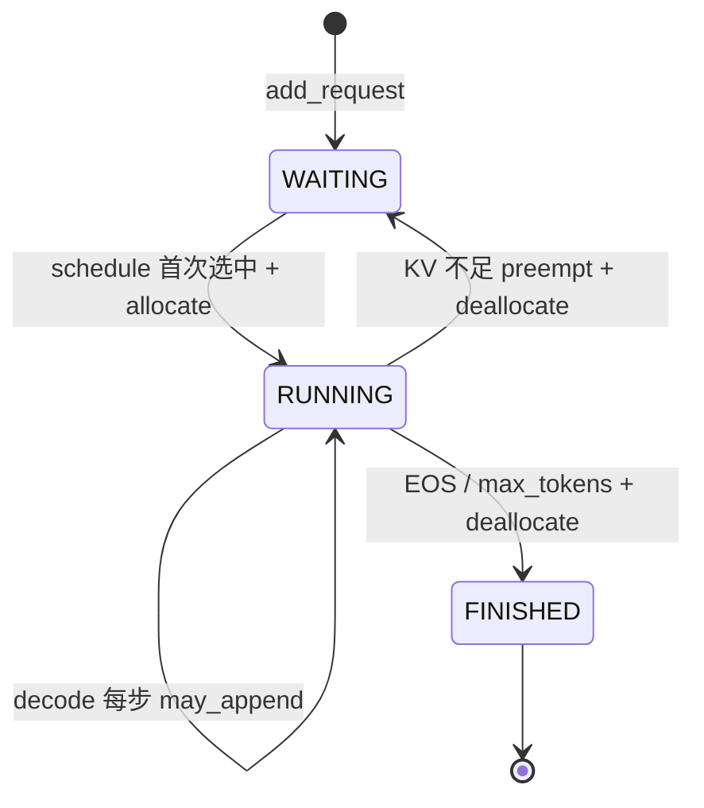
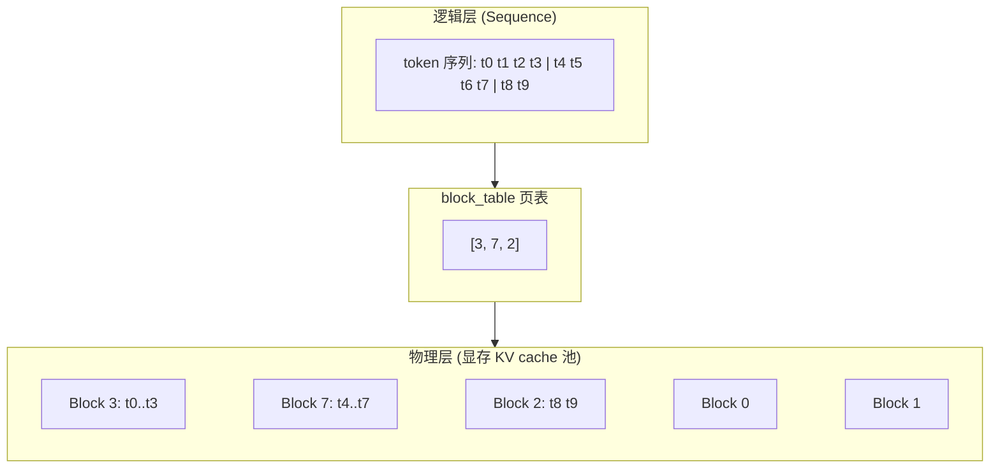
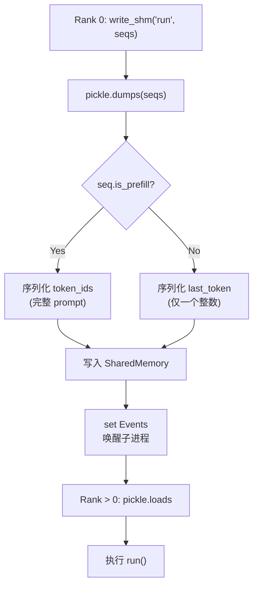

<h1 class="text-4xl font-bold!">第 2 课</h1>
<h2 class="text-2xl mt-4 font-normal opacity-80">Sequence 数据结构与请求生命周期</h2>

<div class="mt-12 text-sm opacity-60">
nano-vllm 实战课程 · 源码拆解 LLM 推理引擎
</div>


<!--
本节课主题：Sequence 数据结构与请求生命周期。Sequence 是 nano-vllm 中最核心的数据结构，承载 token 数据、调度计数器和 KV cache 映射三类信息。建议先回顾 L01 中 step 循环，引出 Sequence 是操作中心。
-->

---
layout: default
---

# 本课在课程中的位置

<div style="height: 50px;"></div>
<div class="mt-4 text-sm max-w-2xl mx-auto">

<div class="flex justify-center gap-1 mb-2">
  <div class="bg-gray-700 text-gray-200 rounded px-3 py-1.5 w-28 text-center">L01<br/><span class="text-xs text-gray-400">generate→step</span></div>
  <div class="flex items-center text-gray-400 text-lg">→</div>
  <div class="bg-blue-600 text-white rounded px-3 py-1.5 font-bold w-28 text-center">L02<br/><span class="text-xs font-normal opacity-80">Sequence</span></div>
  <div class="flex items-center text-gray-400 text-lg">→</div>
  <div class="bg-gray-700 text-gray-200 rounded px-3 py-1.5 w-28 text-center">L03<br/><span class="text-xs text-gray-400">调度器</span></div>
  <div class="flex items-center text-gray-400 text-lg">→</div>
  <div class="bg-gray-700 text-gray-200 rounded px-3 py-1.5 w-28 text-center">L04<br/><span class="text-xs text-gray-400">Block 管理</span></div>
</div>

<div class="flex justify-center mb-1">
  <div class="text-gray-400 text-lg">↓</div>
</div>

<div class="flex justify-center gap-1">
  <div class="bg-gray-700 text-gray-200 rounded px-3 py-1.5 w-28 text-center">L05<br/><span class="text-xs text-gray-400">Prefill</span></div>
  <div class="flex items-center text-gray-400 text-lg">→</div>
  <div class="bg-gray-700 text-gray-200 rounded px-3 py-1.5 w-28 text-center">L06<br/><span class="text-xs text-gray-400">Decode</span></div>
  <div class="flex items-center text-gray-400 text-lg">→</div>
  <div class="bg-gray-700 text-gray-200 rounded px-3 py-1.5 w-28 text-center">L07<br/><span class="text-xs text-gray-400">Attention</span></div>
  <div class="flex items-center text-gray-400 text-lg">→</div>
  <div class="bg-gray-700 text-gray-200 rounded px-3 py-1.5 w-28 text-center">L08<br/><span class="text-xs text-gray-400">优化全景</span></div>
</div>

</div>

<div v-click class="mt-4 text-sm opacity-80">
  L01 我们追踪了 <code>generate → step</code> 的大循环。L02 打开循环中反复操作的核心对象——<strong>Sequence</strong>。
</div>


<!--
课程路线图。本课处于第 2 节——L01 建立全局印象后，打开 step 循环反复操作的核心对象 Sequence。后续 L03 调度器、L04 Block 管理都建立在 Sequence 之上。
-->

---
layout: default
---

# 1.1 课时安排

Sequence 是每个请求的"身份证"，承载推理请求的全部状态。

| 阶段 | 时长 | 内容要点 |
|------|------|----------|
| 概念回顾 | 10 min | 从 L01 step 循环引出 Sequence 作为操作对象 |
| 代码走读 | 40 min | Sequence 字段分组、计数器不变量、block_table、序列化 |
| 脚本演示 | 10 min | L02_sequence.py 的 4 个验证 section |
| 动手练习 | 15 min | 构造 Sequence 验证 num_blocks / last_block_num_tokens |
| 答疑讨论 | 15 min | 为什么 decode 只需发 last_token、block_size 设计讨论 |


<!--
课时安排。概念回顾 10min 用 OS 进程三态类比引入；代码走读 40min 覆盖字段分组、计数器和 block_table；脚本演示+练习 15min。
-->

---
layout: default
---

# 1.2 学习目标

<div class="mt-6 space-y-4">

<div v-click="1" class="flex items-start gap-3 p-3 bg-blue-500/10 border-l-3 border-blue-500 rounded-r">
  <span class="text-blue-400 font-bold">Q1</span>
  <span><code>Sequence</code> 保存哪三类信息？（token_ids、调度计数器、KV cache 映射）</span>
</div>

<div v-click="2" class="flex items-start gap-3 p-3 bg-blue-500/10 border-l-3 border-blue-500 rounded-r">
  <span class="text-blue-400 font-bold">Q2</span>
  <span><code>num_cached_tokens</code>、<code>num_scheduled_tokens</code>、<code>num_tokens</code> 分别表示什么？何时更新？</span>
</div>

<div v-click="3" class="flex items-start gap-3 p-3 bg-blue-500/10 border-l-3 border-blue-500 rounded-r">
  <span class="text-blue-400 font-bold">Q3</span>
  <span><code>__getstate__</code> / <code>__setstate__</code> 的作用是什么？Tensor Parallel 场景下为什么需要不同的序列化策略？</span>
</div>

</div>


<!--
学习目标。三个问题对应 Sequence 三条主线：字段分类（数据容器）、计数器更新（调度辅助）、TP 序列化（跨进程传输）。建议先留悬念，课后回看。
-->

---
layout: section
---

# 2. 原理说明
## Sequence 是什么，为什么需要它


<!--
进入原理说明。用 OS 类比建立直觉：Sequence 就像进程 PCB，block_table 就像虚拟内存页表。这些类比贯穿整个课程。
-->

---
layout: default
---

# 2.1 Sequence = 请求的「档案袋」

一个请求从进入引擎到返回结果，需要携带大量状态信息。Sequence 把这些信息打包在一起：

<div class="grid grid-cols-3 gap-4 mt-6 text-sm">
<div class="bg-blue-500/10 p-4 rounded border-l-3 border-blue-500">
  <div class="text-lg font-bold text-blue-400 mb-2">📝 Token 数据</div>
  <ul class="space-y-1">
    <li><code>token_ids</code> — prompt token 列表</li>
    <li><code>completion_token_ids</code> — 已生成的 token</li>
    <li><code>num_prompt_tokens</code> — prompt 长度（不变）</li>
  </ul>
</div>
<div class="bg-green-500/10 p-4 rounded border-l-3 border-green-500">
  <div class="text-lg font-bold text-green-400 mb-2">⏱ 调度计数器</div>
  <ul class="space-y-1">
    <li><code>num_cached_tokens</code> — 已完成的 token</li>
    <li><code>num_scheduled_tokens</code> — 本轮要算的</li>
    <li><code>num_tokens</code> — 总 token 数（动态增长）</li>
  </ul>
</div>
<div class="bg-purple-500/10 p-4 rounded border-l-3 border-purple-500">
  <div class="text-lg font-bold text-purple-400 mb-2">🗺 KV Cache 映射</div>
  <ul class="space-y-1">
    <li><code>block_table</code> — 逻辑→物理 block 映射</li>
    <li><code>block_size</code> — 每个 block 的 token 容量</li>
    <li><code>status</code> — WAITING/RUNNING/FINISHED</li>
  </ul>
</div>
</div>


<!--
Sequence 的三类信息用三个彩色卡片呈现：蓝色 Token 数据、绿色调度计数器、紫色 KV Cache 映射。用「档案袋」比喻——请求从入门到完成，所有信息装在 Sequence 里。打开 sequence.py L14-L32 对照查看。
-->

---
layout: default
---

# 2.2 状态机：WAITING → RUNNING → FINISHED



<div v-click class="mt-3 p-3 bg-green-500/10 border-l-3 border-green-500 rounded-r text-sm">
  类比操作系统的进程<strong>三态模型</strong>：WAITING = ready、RUNNING = running、FINISHED = terminated。preempt 类似被换出（swap out）。
</div>


<!--
状态机图展示 Sequence 完整生命周期。关键点是 preempt 状态转换（RUNNING → WAITING），这是调度策略的核心。可参考 02-sequence-lifecycle.md §2.1。
-->

---
layout: default
---

# 2.2 状态转换由谁触发？

每个状态转换都对应代码中的具体调用点：

| 转换 | 触发者 | 代码位置 |
|------|--------|----------|
| `→ WAITING` | `Scheduler.add()` | `scheduler.py` |
| `WAITING → RUNNING` | `schedule()` prefill 分支分配 block | `scheduler.py:L29-L56` |
| `RUNNING → RUNNING` | decode 每步 `may_append` | `scheduler.py:L57-L73` |
| `RUNNING → WAITING` | `Scheduler.preempt()` | `scheduler.py:L75-L79` |
| `RUNNING → FINISHED` | `postprocess()` 判定 EOS/max_tokens | `scheduler.py:L81-L92` |

<div v-click class="mt-4 p-3 bg-green-500/10 border-l-3 border-green-500 rounded-r text-sm">
  💡 <strong>关键</strong>：Sequence 本身不驱动状态转换——它只是状态容器。所有转换由 <code>Scheduler</code> 和 <code>BlockManager</code> 协同完成。
</div>


<!--
将每个状态转换映射到具体代码位置。强调：Sequence 是被动方，只负责承载状态；Scheduler 才是主动驱动状态转换的引擎。打开 scheduler.py 对照查看。
-->

---
layout: default
---

# 2.3 block_table ≈ 虚拟内存页表

PagedAttention 的核心思想：将 KV cache 分页管理，类比操作系统虚拟内存。

<div class="flex justify-center">



</div>

<div v-click class="mt-3 p-3 bg-green-500/10 border-l-3 border-green-500 rounded-r text-sm">
  <strong>好处</strong>：小粒度分配（按 block 而非整条序列）、碎片少、可动态追加、共享前缀时只需引用同一批 block
</div>


<!--
PagedAttention 核心思想——用页表管理 KV cache。类比虚拟内存：Sequence 持有逻辑地址，block_table 是页表，物理层是显存中的 KV cache 块池。L04 和 L07 会进一步深化。
-->

---
layout: section
---

# 3. 代码走读
## Sequence 字段与方法逐组展开


<!--
进入代码走读。这是本节核心，约 40min。将 Sequence 字段和方法按功能逐组展开。建议打开 sequence.py 跟随阅读，逐行对照。
-->

---
layout: default
---

# 3.1 Sequence 字段全景

<SourceCode file="nanovllm/engine/sequence.py" lines="14-32" />

```python
class Sequence:
    block_size = 256

    def __init__(self, token_ids, sampling_params):
        self.seq_id = next(Sequence.counter)
        self.status = SequenceStatus.WAITING
        self.token_ids = copy(token_ids)
        self.last_token = token_ids[-1]
        self.num_tokens = len(self.token_ids)
        self.num_prompt_tokens = len(token_ids)      # 固定不变
        self.num_cached_tokens = 0                   # 已处理完成的 token
        self.num_scheduled_tokens = 0                # 本轮要处理的 token
        self.is_prefill = True
        self.block_table = []                        # 逻辑→物理映射
        self.temperature = sampling_params.temperature
        self.max_tokens = sampling_params.max_tokens
        self.ignore_eos = sampling_params.ignore_eos
```

<div v-click class="mt-2 p-2 bg-yellow-500/10 border-l-3 border-yellow-500 rounded-r text-xs">
  注意：<code>block_size</code> 是<strong>类变量</strong>（默认 256），所有 Sequence 共享；<code>sampling_params</code> 被解构为独立字段存储。
</div>


<!--
展示 Sequence.__init__ 完整字段(共 13 个)。强调 block_size 是类变量(默认 256)，所有实例共享。字段分三大类：Token 数据、调度计数器、KV Cache 映射。
-->

---
layout: default
---

# 3.1 逐字段走读：初始化参数

<SourceCode file="nanovllm/engine/sequence.py" lines="14-32" />

```python
def __init__(self, token_ids, sampling_params, block_size=256, eos=-1):
    # ── Token 数据 ──
    self.token_ids = list(token_ids)              # ①
    self.num_prompt_tokens = len(token_ids)       # ②
    self.completion_token_ids: list[int] = []     # ③

    # ── 调度计数器 ──
    self.status = SequenceStatus.WAITING          # ④
    self.is_prefill = True                        # ⑤
    self.num_cached_tokens = 0                    # ⑥
    self.num_scheduled_tokens = 0                 # ⑦

    # ── KV Cache 映射 ──
    self.block_table: list[int] = []              # ⑧
    self.block_size = block_size                  # ⑨
    self.sampling_params = sampling_params        # ⑩
```

<div v-click="1">
<div class="grid grid-cols-2 gap-x-6 gap-y-2 text-sm mt-4">
<div><span class="text-blue-400 font-bold">①</span> <code>token_ids</code> — prompt token 列表，推理中不断追加新 token</div>
<div><span class="text-blue-400 font-bold">②</span> <code>num_prompt_tokens</code> — prompt 长度，初始化后永久不变</div>
<div><span class="text-blue-400 font-bold">③</span> <code>completion_token_ids</code> — 生成 token 记录，仅用于统计和 max_tokens 判断</div>
<div><span class="text-blue-400 font-bold">④</span> <code>status</code> — WAITING / RUNNING / FINISHED 三态</div>
<div><span class="text-blue-400 font-bold">⑤</span> <code>is_prefill</code> — 是否为 prefill 阶段，影响序列化和调度策略</div>
<div><span class="text-blue-400 font-bold">⑥</span> <code>num_cached_tokens</code> — 已写入 KV cache 的 token 数量</div>
<div><span class="text-blue-400 font-bold">⑦</span> <code>num_scheduled_tokens</code> — 本轮计划处理的 token 数量</div>
<div><span class="text-blue-400 font-bold">⑧</span> <code>block_table</code> — 逻辑 block 到物理 block 的映射数组</div>
<div><span class="text-blue-400 font-bold">⑨</span> <code>block_size</code> — 每个 KV cache block 的大小（类变量，所有实例共享）</div>
<div><span class="text-blue-400 font-bold">⑩</span> <code>sampling_params</code> — 采样参数（temperature、top_p、max_tokens 等）</div>
</div>
</div>

<div v-click="2" class="mt-3 p-3 bg-yellow-500/10 border-l-3 border-yellow-500 rounded-r text-sm">
  <strong>注意</strong>：以上字段覆盖了 Token 数据、调度计数器、KV Cache 映射三大类。<code>is_prefill</code> 最容易被忽略，但它是决定序列化和调度策略的枢纽。接下来逐一展开。
</div>


<!--
逐字段注释初始化参数，按编号顺序讲解。特别强调 is_prefill——虽然只是布尔值，但决定了序列化和调度策略的分支。
-->

---
layout: default
---

# 3.2 Token 字段：prompt 与 completion 分离

<SourceCode file="nanovllm/engine/sequence.py" lines="14-23" />

```python
# 初始化时
self.token_ids = copy(token_ids)              # prompt 的 token
self.num_prompt_tokens = len(token_ids)       # 固定不变

# completion_token_ids 是 @property，自动计算（token_ids[num_prompt_tokens:]）

# append_token 追加生成 token
def append_token(self, token_id: int):
    self.token_ids.append(token_id)
    self.last_token = token_id
    self.num_tokens += 1
```

<div class="grid grid-cols-2 gap-4 mt-4 text-sm">
<div v-click="1" class="bg-blue-500/10 p-3 rounded border-l-3 border-blue-500">
  <strong>num_prompt_tokens</strong><br/>
  初始化后<strong>永远不变</strong><br/>
  用于区分 prompt 和 completion
</div>
<div v-click="2" class="bg-purple-500/10 p-3 rounded border-l-3 border-purple-500">
  <strong>num_completion_tokens</strong><br/>
  <code>len(completion_token_ids)</code><br/>
  是 <code>@property</code>，返回 <code>num_tokens - num_prompt_tokens</code><br/>
  决定 max_tokens 判断
</div>
</div>


<!--
prompt 与 completion 分离的设计：token_ids 保存完整序列，completion_token_ids 是 @property 自动计算。append_token 更新 token_ids、last_token 和 num_tokens 三个字段。
-->

---
layout: default
---

# 3.3 调度计数器的三个关键属性

<SourceCode file="nanovllm/engine/sequence.py" lines="25-27" />

```python
self.num_cached_tokens = 0       # 已处理完成、写入 KV cache 的 token 数
self.num_scheduled_tokens = 0    # 本轮 step 计划处理的 token 数
# num_tokens = len(self.token_ids)，随 append_token 动态增长
```

<div class="mt-4 grid grid-cols-3 gap-3 text-sm">
<div v-click="1" class="bg-blue-500/10 p-3 rounded text-center">
  <div class="font-bold mb-1">num_cached_tokens</div>
  <div class="opacity-70">已完成 + 已写入 KV cache</div>
  <div class="text-xs mt-1 opacity-50">postprocess 中累加<br/>scheduled → cached</div>
</div>
<div v-click="2" class="bg-green-500/10 p-3 rounded text-center">
  <div class="font-bold mb-1">num_scheduled_tokens</div>
  <div class="opacity-70">本轮计划处理</div>
  <div class="text-xs mt-1 opacity-50">schedule() 中设定<br/>postprocess 中清零</div>
</div>
<div v-click="3" class="bg-purple-500/10 p-3 rounded text-center">
  <div class="font-bold mb-1">num_tokens</div>
  <div class="opacity-70">= len(token_ids)</div>
  <div class="text-xs mt-1 opacity-50">动态增长<br/>= prompt + completion</div>
</div>
</div>

<div v-click="4" class="mt-3 p-3 bg-yellow-500/10 border-l-3 border-yellow-500 rounded-r text-sm">
  <strong>不变量</strong>：<code>num_tokens = num_prompt_tokens + num_completion_tokens</code>。在 prefill 过程中：<code>num_cached_tokens ≤ num_tokens</code>，当两者相等时 prefill 完成。
</div>


<!--
三个调度计数器及其关系。强调不变量：num_cached_tokens ≤ num_tokens，当二者相等时 prefill 结束。
-->

---
layout: default
---

# 3.3 计数器在 postprocess 中的更新时机

<SourceCode file="nanovllm/engine/scheduler.py" lines="81-87" />

```python
def postprocess(self, seqs, token_ids, is_prefill):
    for seq, token_id in zip(seqs, token_ids):
        self.block_manager.hash_blocks(seq)
        seq.num_cached_tokens += seq.num_scheduled_tokens  # ① 累计
        seq.num_scheduled_tokens = 0                       # ② 清零
        if is_prefill and seq.num_cached_tokens < seq.num_tokens:
            continue                                       # ③ chunked-prefill 未竟
        seq.append_token(token_id)                         # ④ 追加采样 token
```

<div v-click class="mt-3 p-3 bg-green-500/10 border-l-3 border-green-500 rounded-r text-sm">
  <strong>生命周期</strong>：<code>schedule()</code> 设定 → <code>run()</code> 不变 → <code>postprocess()</code> 累加到 cached 然后清零。下一轮 <code>schedule()</code> 从 <code>num_cached_tokens</code> 开始取下一段。
</div>


<!--
展示 postprocess 中计数器的更新时机。四条操作线：哈希 block、累加 scheduled→cached、清空 scheduled、追加采样 token。chunked-prefill 时 continue 跳过 append_token。
-->

---
layout: default
---

# 3.4 block_table 与 block 分割公式

<SourceCode file="nanovllm/engine/sequence.py" lines="55-62" />

```python
@property
def num_blocks(self) -> int:
    return (self.num_tokens + self.block_size - 1) // self.block_size

@property
def last_block_num_tokens(self) -> int:
    return self.num_tokens - (self.num_blocks - 1) * self.block_size

def block(self, i):
    assert 0 <= i < self.num_blocks
    return self.token_ids[i*self.block_size: (i+1)*self.block_size]
```

<div class="grid grid-cols-3 gap-3 mt-4 text-sm">
<div v-click="1" class="bg-blue-500/10 p-3 rounded text-center">
  <strong>num_blocks</strong><br/>
  = ⌈num_tokens / block_size⌉<br/>
  <span class="text-xs opacity-60">例: 9 tokens / 4 = 3 blocks</span>
</div>
<div v-click="2" class="bg-green-500/10 p-3 rounded text-center">
  <strong>last_block_num_tokens</strong><br/>
  = num_tokens − (num_blocks − 1) × block_size<br/>
  <span class="text-xs opacity-60">最后一个 block 的实际 token 数</span>
</div>
<div v-click="3" class="bg-purple-500/10 p-3 rounded text-center">
  <strong>block(i)</strong><br/>
  取第 i 个 block 的 token_ids<br/>
  <span class="text-xs opacity-60">用于 prefix cache 哈希计算</span>
</div>
</div>


<!--
block_table 与 block 分割公式。三个 property 在 block_table 分配、prefix cache 哈希、attention mask 构造时反复使用。打开 sequence.py L55-L62 对照阅读。
-->

---
layout: default
---

# 3.4 示例：用具体数值走一遍公式

<SourceCode file="nanovllm/engine/sequence.py" lines="55-62" />

<div class="text-sm">

**设定**：block_size = 256，num_tokens = 1000

```python
num_blocks = (1000 + 256 - 1) // 256     # = 1255 // 256 = 4
last_block_num_tokens = 1000 - (4 - 1) * 256  # = 1000 - 768 = 232
```

</div>

<div v-click="1" class="mt-4">
<h4 class="text-sm font-bold mb-2">物理视图：各 block 包含的 token 范围</h4>

| block 索引 | token 区间 | slot 数量 |
|:---------:|:-----------:|:--------:|
| block(0)  | token_ids[0:256]   | 256（满） |
| block(1)  | token_ids[256:512] | 256（满） |
| block(2)  | token_ids[512:768] | 256（满） |
| block(3)  | token_ids[768:1000]| **232**（不满） |
</div>

<div v-click="2" class="mt-4 p-3 bg-green-500/10 border-l-3 border-green-500 rounded-r text-sm">
  <strong>观察</strong>：前 3 个 block 各装满 256 个 token，最后一块只装 232 个。<code>last_block_num_tokens = num_tokens % block_size</code>（余数为 0 时等于 block_size）。
</div>

<div v-click="3" class="mt-3">
<h4 class="text-sm font-bold mb-1">快速验证（block_size = 4）</h4>

| num_tokens | num_blocks | last_block_num_tokens | block(0) | block(1) | block(2) |
|:----------:|:----------:|:---------------------:|:--------:|:--------:|:--------:|
| 1 | 1 | 1 | [0:1] | — | — |
| 4 | 1 | 4 | [0:4] | — | — |
| 5 | 2 | 1 | [0:4] | [4:5] | — |
| 8 | 2 | 4 | [0:4] | [4:8] | — |
| 9 | 3 | 1 | [0:4] | [4:8] | [8:9] |
</div>

<div v-click="4" class="mt-3 text-xs opacity-70">
  此公式在 block_table 分配、prefix cache 哈希、以及 attention 计算 mask 时反复使用。
</div>


<!--
用 block_size=256, num_tokens=1000 走一遍公式。前三个 block 各装 256 token，最后一个只装 232。翻到下一页看快速验证表。
-->

---
layout: default
---

# 3.4 block_size 从哪里来

<SourceCode file="nanovllm/config.py" lines="6-18" />

```python
@dataclass(slots=True)
class Config:
    model: str
    kvcache_block_size: int = 256          # block 大小，必须是 256 的倍数
    ...
    def __post_init__(self):
        assert self.kvcache_block_size % 256 == 0
```

<div class="mt-4 text-sm">
  <strong>传递链</strong>：<code>Config.kvcache_block_size</code> → <code>LLMEngine.__init__</code> → <code>Sequence.block_size</code>（类变量，所有 Sequence 共享）
</div>

<div class="mt-3 p-3 bg-green-500/10 border-l-3 border-green-500 rounded-r text-sm">
  💡 <strong>为什么必须是 256 的倍数？</strong> FlashAttention 的 Triton kernel 以 256 为 tile 大小读写 KV cache。block_size 对齐到这个 tile 可以避免跨 tile 的额外处理。
</div>


<!--
快速验证表(block_size=4)展示从 1 到 9 个 token 时的分块结果。建议学员在 Python 交互环境中手动运行验证。
-->

---
layout: default
---

# 3.4 last_token property

<SourceCode file="nanovllm/engine/sequence.py" lines="22-22" />

```python
# 初始化时赋值（line 22）
self.last_token = token_ids[-1]

# append_token 中更新（line 69）
def append_token(self, token_id: int):
    ...
    self.last_token = token_id
```

<div v-click="1" class="mt-4">
<h4 class="text-sm font-bold mb-2">为什么需要 last_token？</h4>

<div class="grid grid-cols-2 gap-4 text-sm">
<div class="bg-blue-500/10 p-3 rounded border-l-3 border-blue-500">
  <div class="font-bold text-blue-400">Prefill 阶段</div>
  <ul class="mt-2 space-y-1 text-xs">
    <li>需要完整 token_ids 计算 KV cache</li>
    <li>模型输入：<code>token_ids[0:N]</code></li>
    <li>数据量：N 个整数</li>
  </ul>
</div>
<div class="bg-green-500/10 p-3 rounded border-l-3 border-green-500">
  <div class="font-bold text-green-400">Decode 阶段</div>
  <ul class="mt-2 space-y-1 text-xs">
    <li>只需最后 1 个 token 做前向传播</li>
    <li>模型输入：<code>token_ids[-1:]</code></li>
    <li>数据量：1 个整数</li>
  </ul>
</div>
</div>
</div>

<div v-click="2" class="mt-3 p-3 bg-purple-500/10 border-l-3 border-purple-500 rounded-r text-sm">
  <strong>关键</strong>：decode 阶段每次只输入最后一个 token，KV cache 中已保存之前的全部 KV 值。<code>last_token</code> 正是为这个目的设计的快捷属性。它也是 TP 场景下 decode 序列化时传输的核心数据。
</div>


<!--
block_size 的来源链：Config.kvcache_block_size → LLMEngine → Sequence.block_size(类变量)。必须是 256 的倍数——与 FlashAttention Triton kernel tile 大小对齐。打开 config.py L6-L18。
-->

---
layout: default
---

# 3.5 序列化：为 Tensor Parallel 服务

<SourceCode file="nanovllm/engine/sequence.py" lines="72-83" />

```python
def __getstate__(self):
    last_state = self.last_token if not self.is_prefill else self.token_ids
    return (self.num_tokens, self.num_prompt_tokens, self.num_cached_tokens,
            self.num_scheduled_tokens, self.block_table, last_state)

def __setstate__(self, state):
    (self.num_tokens, self.num_prompt_tokens, self.num_cached_tokens,
     self.num_scheduled_tokens, self.block_table, last_state) = state
    if isinstance(last_state, list):
        self.token_ids = last_state                # prefill: 完整恢复
        self.last_token = self.token_ids[-1]
    else:
        self.token_ids = []                        # decode: 丢弃历史
        self.last_token = last_state               # 只保留最后一个
```

<div v-click class="mt-3 p-3 bg-green-500/10 border-l-3 border-green-500 rounded-r text-sm">
  <strong>为什么区分？</strong>prefill 阶段子进程需要全部 prompt token 计算 KV；decode 阶段只需最后一个 token 做前向。减少 decode 的 IPC 带宽是关键优化。
</div>


<!--
last_token 是实例字段(非 @property)，在 __init__ L22 初始化，在 append_token L69 更新。对比 prefill 和 decode 两个阶段的数据需求差异。对照 sequence.py L22 和 L69。
-->

---
layout: default
---

# 3.5 TP 场景下的序列化流程图



<div v-click class="mt-3 p-3 bg-green-500/10 border-l-3 border-green-500 rounded-r text-sm">
  这正是 <code>Sequence.__getstate__</code> 只传输必要字段的原因：prefill 传输完整 <code>token_ids</code> 列表，decode 只传 <code>last_token</code>（一个 int）。
</div>


<!--
__getstate__/__setstate__ 使 Sequence 可在多进程中 pickle 传输。核心优化：is_prefill=True 时序列化完整 token_ids，False 时只序列化 last_token。打开 sequence.py L72-L83。
-->

---
layout: default
---

# 3.5 对比：prefill vs decode 的 IPC 数据量

<div class="text-sm">

TP 场景下，Rank 0 通过 SharedMemory 向其他 Rank 传输序列化后的 Sequence 数据。prefill 和 decode 的 IPC 负载差异巨大：

</div>

<div v-click="1" class="mt-4">
<h4 class="text-sm font-bold mb-2">序列化数据量对比（假设 prompt=1024 tokens, completion=128 tokens）</h4>

| 维度 | Prefill | Decode |
|:----|:--------|:-------|
| 序列化字段 | 完整 <code>token_ids</code> + 完整字段 | <code>last_token</code>（1 个 int）+ 必要字段 |
| 整数数量 | ~1500 个 | ~10 个 |
| 预估字节数（pickle 后） | ~12 KB | ~0.5 KB |
| 传输内容 | 全部 prompt token 用于 KV 计算 | 仅需最后 1 个 token 做单步前向 |
| 调用频率 | 每个请求仅 1 次（或 chunk-prefill 若干次） | 每个生成步调用 1 次 |
</div>

<div v-click="2" class="mt-4 grid grid-cols-2 gap-4 text-sm">
<div class="bg-blue-500/10 p-3 rounded border-l-3 border-blue-500">
  <div class="font-bold text-blue-400 mb-1">Prefill 数据量大，但次数少</div>
  <div class="text-xs">一次传完整个 prompt，后续 decode 无需重复传输。如果被抢占（preempt），重新 prefill 时会再次传输完整 token_ids。</div>
</div>
<div class="bg-green-500/10 p-3 rounded border-l-3 border-green-500">
  <div class="font-bold text-green-400 mb-1">Decode 数据量小，但次数多</div>
  <div class="text-xs">每次 decode 只传 1 个 int，IPC 开销极低。这是 <code>__getstate__</code> 区分 prefill/decode 的核心优化动机。</div>
</div>
</div>

<div v-click="3" class="mt-3 p-3 bg-yellow-500/10 border-l-3 border-yellow-500 rounded-r text-sm">
  <strong>结论</strong>：prefill 是 I/O 密集型（大量数据传输），decode 是 compute 密集型（少量数据传输）。<code>is_prefill</code> 标志在序列化阶段实现了按需传输的优化策略。
</div>


<!--
TP 序列化流程图：Rank 0 通过 SharedMemory 写入 pickle 数据，Event 唤醒子进程。is_prefill 条件分支清晰展示 prefill/decode 不同传输策略。
-->

---
layout: default
---

# 3.6 状态与 is_prefill 标志的联动

<h4 class="text-sm font-bold mb-3">两个关键标志的关系</h4>

<div class="grid grid-cols-2 gap-4 text-sm">
<div class="bg-blue-500/10 p-3 rounded border-l-3 border-blue-500">
  <div class="font-bold text-blue-400 mb-1"><code>status</code></div>
  <div>WAITING / RUNNING / FINISHED 三态，由 Scheduler 在 schedule() 和 postprocess() 中修改。</div>
</div>
<div class="bg-green-500/10 p-3 rounded border-l-3 border-green-500">
  <div class="font-bold text-green-400 mb-1"><code>is_prefill</code></div>
  <div>True / False，表示当前是否处于 prefill 阶段，决定序列化和调度行为。</div>
</div>
</div>

<div v-click="1" class="mt-4">
<h4 class="text-sm font-bold mb-2">状态转换中的 is_prefill 变化</h4>

| 事件 | status | is_prefill | 说明 |
|:----|:------:|:----------:|:-----|
| <code>add_request()</code> 后 | WAITING | True | 新请求，尚未分配 block |
| schedule() 首次选中 | RUNNING | True | 进入 prefill 阶段 |
| prefill 完成（num_cached == num_tokens） | RUNNING | **False** | 进入 decode 阶段 |
| decode 中 append_token | RUNNING | False | 持续生成 |
| **preempt 回到 waiting** | WAITING | **True** | 被抢占后重新进入 waiting，下一轮重新 prefill |
| EOS / max_tokens | FINISHED | — | 推理结束 |
</div>

<div v-click="2" class="mt-4 p-3 bg-purple-500/10 border-l-3 border-purple-500 rounded-r text-sm">
  <strong>联动逻辑</strong>：<code>is_prefill</code> 跟随 <code>num_cached_tokens &lt; num_tokens</code> 条件自动变化。当 <code>is_prefill = True</code> 时，<code>__getstate__</code> 序列化完整 token_ids；当 <code>is_prefill = False</code> 时，只序列化 last_token。
</div>

<div v-click="3" class="mt-3 p-3 bg-purple-500/10 border-l-3 border-purple-500 rounded-r text-sm">
  <strong>关键设计</strong>：<code>is_prefill</code> 不是由 status 推导的。preempt 时 status 变为 WAITING，同时必须显式设置 <code>is_prefill = True</code>。这是因为 WAITING 状态本身不意味着需要 prefill（新请求和抢占后的请求都需要重新 prefill，但调度逻辑不同）。
</div>


<!--
对比 prefill 和 decode 的 IPC 数据量。prefill 约 12KB(数据量大但次数少)，decode 约 0.5KB(数据量小但次数多)。这是 __getstate__ 区分策略的核心动机。
-->

---
layout: section
---

# 4. L02 验证脚本
## L02_sequence.py 走读


<!--
本页用表格展示 status 和 is_prefill 在整个生命周期中的联动变化。重点观察 preempt 行：status 虽回 WAITING，但 is_prefill 显式置 True。对照 scheduler.py L75-L79。翻下一页继续。
-->

---
layout: default
---

# L02_sequence.py：4 个验证 section

<SourceCode file="docs/llm-inference-visual/scripts/L02_sequence.py" lines="1-13" />

```python
"""
L02 练习：Sequence 数据结构与请求生命周期

验证要点：
- Sequence 三大类字段（token、调度计数器、KV cache 映射）
- block 分割公式：num_blocks = ⌈num_tokens / block_size⌉
- append_token 更新 completion_token_ids
- pickle 序列化：prefill 发 token_ids，decode 发 last_token

依赖：仅 CPU（nano-vllm 包），不需要模型权重
"""
```

<div class="mt-4 grid grid-cols-4 gap-2 text-xs text-center">
<div class="bg-blue-500/10 p-2 rounded border-l-3 border-blue-500">§1<br/><strong>字段分类</strong></div>
<div class="bg-green-500/10 p-2 rounded border-l-3 border-green-500">§2<br/><strong>Block 公式验证</strong></div>
<div class="bg-purple-500/10 p-2 rounded border-l-3 border-purple-500">§3<br/><strong>append_token</strong></div>
<div class="bg-yellow-500/10 p-2 rounded border-l-3 border-yellow-500">§4<br/><strong>Pickle 协议</strong></div>
</div>


<!--
续页。从上一页状态转换表看到 is_prefill 随阶段变化——本页解释为什么这样设计。关键结论：is_prefill 不是由 status 推导的，preempt 时需显式设置。
-->

---
layout: default
---

# §1：字段分类验证

```python
from nanovllm.engine.sequence import Sequence

seq = Sequence([1, 2, 3], sampling_params=None)

# token 数据
print("token_ids:", seq.token_ids)                # [1, 2, 3]
print("num_prompt_tokens:", seq.num_prompt_tokens) # 3
print("completion_token_ids:", seq.completion_token_ids)  # []

# 调度计数器
print("status:", seq.status)                      # WAITING
print("is_prefill:", seq.is_prefill)              # True
print("num_cached_tokens:", seq.num_cached_tokens) # 0
print("num_scheduled_tokens:", seq.num_scheduled_tokens) # 0

# KV Cache 映射
print("block_table:", seq.block_table)            # []
print("block_size:", seq.block_size)              # 256
```

<div v-click class="mt-3 p-3 bg-green-500/10 border-l-3 border-green-500 rounded-r text-sm">
  脚本执行后会打印以上所有字段，验证 2.1 节的三大分类。<code>token_ids</code> 保存完整 token 序列，其他字段均从它衍生。
</div>


<!--
进入第四节——通过 L02_sequence.py 脚本验证前面所学。4 个 Section 覆盖字段分类、Block 公式、append_token 和 Pickle 序列化。纯 CPU 可运行。
-->

---
layout: default
---

# §2：Block 分割公式验证

```python
Sequence.block_size = 4  # 设为 4 方便手算

for n in [1, 4, 5, 8, 9]:
    seq = Sequence(list(range(n)), sampling_params=None)
    print(f"n={n}: num_blocks={seq.num_blocks}, "
          f"last_block_num_tokens={seq.last_block_num_tokens}")
    for i in range(seq.num_blocks):
        print(f"  block[{i}] = {seq.block(i)}")
```

<div v-click="1" class="mt-3">
<h4 class="text-sm font-bold mb-1">输出结果</h4>

| n | num_blocks | last_block_num_tokens | block(0) | block(1) | block(2) |
|:-:|:----------:|:---------------------:|:--------:|:--------:|:--------:|
| 1 | 1 | 1 | [0] | — | — |
| 4 | 1 | 4 | [0,1,2,3] | — | — |
| 5 | 2 | 1 | [0,1,2,3] | [4] | — |
| 8 | 2 | 4 | [0,1,2,3] | [4,5,6,7] | — |
| 9 | 3 | 1 | [0,1,2,3] | [4,5,6,7] | [8] |
</div>

<div v-click="2" class="mt-3 p-3 bg-green-500/10 border-l-3 border-green-500 rounded-r text-sm">
  <strong>公式</strong>：<code>num_blocks = (num_tokens + block_size - 1) // block_size</code>。<code>last_block_num_tokens</code> 在 num_tokens 为 block_size 的整数倍时等于 block_size（满块），否则为余数。
</div>


<!--
4 个验证 Section 概览。§1 字段分类、§2 Block 公式验证、§3 append_token 更新逻辑、§4 Pickle 序列化两种模式。建议逐 section 运行并观察输出。
-->

---
layout: default
---

# §3-4：append_token + Pickle 序列化

```python
# §3: append_token 追踪
seq = Sequence([1, 2, 3])          # prompt: [1,2,3]
seq.append_token(4)                 # 追加 completion
seq.append_token(5)
assert seq.num_completion_tokens == 2
assert seq.completion_token_ids == [4, 5]
assert seq.num_prompt_tokens == 3   # 不变！

# §4: Pickle 协议的两种模式
# Prefill pickling → 传输完整 token_ids
seq.is_prefill = True
seq2 = pickle.loads(pickle.dumps(seq))
assert seq2.token_ids == [1, 2, 3, 4, 5]  # 全部恢复

# Decode pickling → 只传输 last_token
seq.is_prefill = False
seq2 = pickle.loads(pickle.dumps(seq))
assert seq2.last_token == 5               # 只有一个 int
assert seq2.token_ids == []               # 空！
```


<!--
运行 §1 部分打印 Sequence 实例的所有字段。演示创建 Sequence([1,2,3]) 后输出三大类字段初始值，与 2.1 节三类卡片对应。
-->

---
layout: default
---

# §3-4 总结：数据流一览

<div class="text-sm">

两个核心操作的效果对比表：

</div>

<div v-click="1" class="mt-3">
<h4 class="text-sm font-bold mb-2"><code>append_token</code> 操作前后</h4>

| 字段 | 操作前 | 操作后（append 5） | 说明 |
|:----|:-----:|:----------------:|:-----|
| <code>token_ids</code> | [1,2,3] | [1,2,3,5] | 追加新 token |
| <code>completion_token_ids</code> | [] | [5] | 记录生成 token |
| <code>num_prompt_tokens</code> | 3 | 3 | **不变** |
| <code>num_tokens</code> | 3 | 4 | = len(token_ids) |
</div>

<div v-click="2" class="mt-4">
<h4 class="text-sm font-bold mb-2">Pickle 序列化两种模式</h4>

| 模式 | <code>is_prefill</code> | 传输内容 | 反序列化后 <code>token_ids</code> |
|:----|:---------------------:|:-------:|:------------------------------:|
| Prefill 序列化 | True | 完整 <code>token_ids</code> 列表 | [1,2,3,5]（完整恢复） |
| Decode 序列化 | False | <code>last_token</code>（1 个 int） | []（为空！） |
</div>

<div v-click="3" class="mt-4 p-3 bg-purple-500/10 border-l-3 border-purple-500 rounded-r text-sm">
  <strong>重点</strong>：decode 序列化只传 last_token 是重要的 IPC 优化。如果子进程需要完整 token_ids（如被抢占），Rank 0 会重设 <code>is_prefill=True</code>，下一轮 prefill 自然发送完整数据。
</div>


<!--
运行 §2 部分验证 Block 分割公式。block_size 设为 4 便于手算，遍历 n=1,4,5,8,9。鼓励学员在 Python 交互环境中手动运行观察。
-->

---
layout: default
---

# 4.1 课堂练习

纯 CPU 练习：手工计算 block_size 与 num_blocks 的关系

```python
# 在 Python 交互环境中验证
from nanovllm.engine.sequence import Sequence

Sequence.block_size = 4  # 设为 4 方便手算

for n in [1, 4, 5, 8, 9]:
    seq = Sequence(list(range(n)), sampling_params=None)
    print(f"n={n}: num_blocks={seq.num_blocks}, "
          f"last_block_num_tokens={seq.last_block_num_tokens}")
    for i in range(seq.num_blocks):
        print(f"  block[{i}] = {seq.block(i)}")
```

<div v-click class="mt-3 p-3 bg-green-500/10 border-l-3 border-green-500 rounded-r text-sm">
  📍 验收要点：<code>num_blocks = (num_tokens + block_size - 1) // block_size</code>；<code>last_block_num_tokens = num_tokens - (num_blocks - 1) * block_size</code>（<code>sequence.py:L55-L62</code>）
</div>


<!--
运行 §3-4 部分。§3 演示 append_token 效果(completion_token_ids 增长、num_prompt_tokens 不变)；§4 演示 Pickle 两种模式下反序列化结果差异。
-->

---
layout: default
---

# 4.2 课后自测题

<SelfTest
  id="l02-q1"
  type="text"
  question="1. block_size 作为类变量，所有 Sequence 共享同一个值。如果多组请求需要不同的 block_size，当前设计有何问题？如何改进？"
  answer="<strong>问题</strong>：<code>block_size</code> 是类变量，修改会影响所有 Sequence 实例。如果在同一个引擎中混用不同 block_size 的 seq，block_table 的索引计算会出错。<br><strong>改进</strong>：将 block_size 改为实例变量（<code>__init__</code> 参数），每个 Sequence 持有自己的 block_size。但 BlockManager 也需要支持多 block_size 的分配，这会大幅增加 KV cache 管理复杂度——这也是为什么实际部署中通常统一 block_size。"
/>

<SelfTest
  id="l02-q2"
  type="text"
  question="2. decode 阶段 __getstate__ 只传输 last_token，丢失了完整 token_ids。在什么场景下子进程需要完整的 prompt？"
  answer="<strong>需要完整 prompt 的场景</strong>：<ol><li>子进程被抢占（preempt），需要重新 prefill——此时 rank0 会重设 <code>is_prefill=True</code>，下一轮序列化会发送完整 token_ids</li><li>需要做 prefix caching 哈希校验时，子进程需要完整的 token 序列计算哈希</li><li>如果 decode 过程中需要 logprobs 或 token 级别的调试信息</li></ol>实际上，<code>is_prefill</code> 标志决定了序列化策略：被抢占的 seq 返回 waiting 后会设置 <code>is_prefill=True</code>，下一轮 prefill 自然会发送完整 token_ids。"
/>


<!--
总结 append_token 和 Pickle 序列化的数据流。两张表分别展示字段变化和传输模式差异。decode 只传 last_token 造成 token_ids 为空——被抢占后可通过重设 is_prefill 自动恢复。
-->

---
layout: default
---

# 4.2 课后自测题（续）

<SelfTest
  id="l02-q3"
  type="text"
  question="3. num_cached_tokens 和 num_scheduled_tokens 都在 postprocess 中更新。如果改为在 Sequence.append_token 中更新，需要额外传入什么信息？哪种设计更好？"
  answer="<strong>分析</strong>：如果移到 <code>append_token</code> 中更新，需要额外传入 <code>num_scheduled_tokens</code> 和 <code>is_prefill</code> 参数（判断是否 chunked prefill 未完）。<br><strong>当前设计更好</strong>：计数器更新与调度逻辑紧密相关，放在 <code>postprocess</code> 中可以集中管理。Sequence 只需提供数据存储，调度逻辑由 Scheduler 负责——这是单一职责原则的体现。如果 Sequence 自己更新计数器，它就需要理解调度语义，耦合度会增加。"
/>


<!--
课堂练习：在 Python 交互环境中验证 block_size 与 num_blocks 的关系。验收重点：num_blocks 和 last_block_num_tokens 的计算公式。参考 02-sequence-lifecycle.md §4.1。
-->

---
layout: center
---

# 🎉 第 2 课完成

<div class="mt-6 text-lg opacity-80">
  掌握了 Sequence 的三类字段、状态机、block 分割逻辑
</div>

<div class="mt-4 grid grid-cols-4 gap-3 text-sm max-w-2xl mx-auto">
  <div class="bg-blue-500/10 p-3 rounded border-l-3 border-blue-500">✅ 三大类字段</div>
  <div class="bg-green-500/10 p-3 rounded border-l-3 border-green-500">✅ 状态机转移</div>
  <div class="bg-purple-500/10 p-3 rounded border-l-3 border-purple-500">✅ block 公式</div>
  <div class="bg-yellow-500/10 p-3 rounded border-l-3 border-yellow-500">✅ TP 序列化</div>
</div>

<div class="mt-10">
  <a href="#" class="text-blue-400 hover:underline text-lg">下一课：Scheduler 的队列与抢占 →</a>
</div>

<!--
总结 L02 四个知识点：三大类字段（sequence.py L14-L32）、状态机（WAITING→RUNNING→FINISHED）、block 分割公式（L55-L62）、TP 序列化（L72-L83）。下一课进入 Scheduler 调度逻辑。
-->

<!--
结束页。总结本节课核心收获：Sequence 的三类字段、状态机转移、block 分割公式和 TP 序列化策略。预告下一课：Scheduler 的队列与抢占机制。
-->
