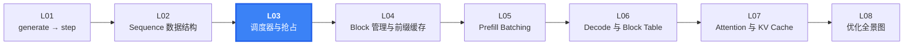
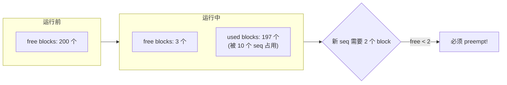
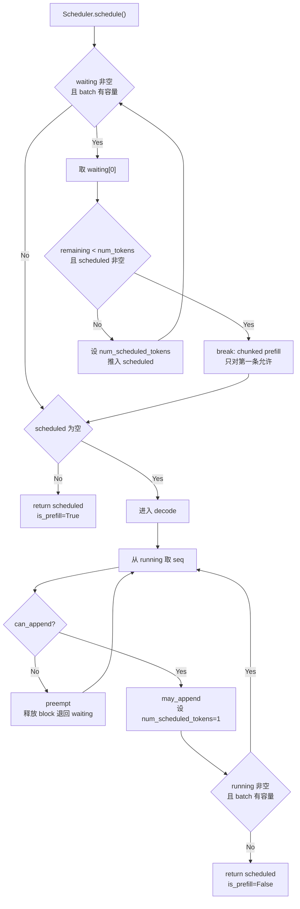
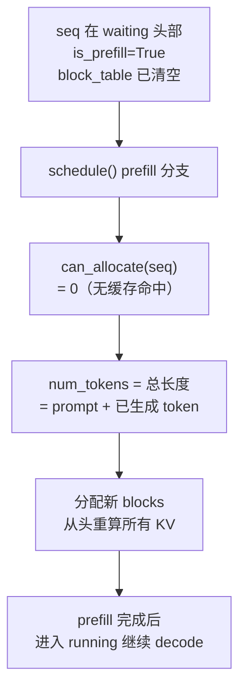

<h1 class="text-4xl font-bold!">第 3 课</h1>
<h2 class="text-2xl mt-4 font-normal opacity-80">Scheduler 的队列、Chunked Prefill 与 Preempt</h2>

<div class="mt-12 text-sm opacity-60">
nano-vllm 实战课程 · 从源码走读 LLM 推理引擎
</div>

---
layout: default
---

# 本课在课程中的位置



<div v-click class="mt-4 text-sm opacity-80">
  L02 拆解了 Sequence 字段。L03 打开 step 循环中的核心决策者——<strong>Scheduler</strong>：它在每个 step 决定跑哪些请求、跑多少 token。
</div>

---
layout: default
---

# 1.1 课时安排

调度器在每个 step 决定跑哪些请求、跑多少 token，其角色类似操作系统进程调度器。

| 阶段 | 时长 | 内容要点 |
|------|------|----------|
| 概念回顾 | 10 min | 从 step 中"谁决定跑哪些 seq"引出 Scheduler |
| 代码走读 | 40 min | waiting/running 队列、prefill 拼接规则、chunked prefill、preempt |
| 脚本演示 | 10 min | L03_scheduler.py 的 6 个 section（含真实调度器对比） |
| 动手练习 | 15 min | 整数模拟 prefill 拼接，验证 chunked prefill 限制 |
| 答疑讨论 | 15 min | preempt 策略权衡、chunked prefill 设计讨论 |

---
layout: default
---

# 1.2 学习目标

<div class="mt-6 space-y-4">

<div v-click="1" class="flex items-start gap-3 p-3 bg-blue-500/10 border-l-3 border-blue-500 rounded-r">
  <span class="text-blue-400 font-bold">Q1</span>
  <span>waiting 和 running 队列分别存放什么状态的请求？它们如何流转？</span>
</div>

<div v-click="2" class="flex items-start gap-3 p-3 bg-blue-500/10 border-l-3 border-blue-500 rounded-r">
  <span class="text-blue-400 font-bold">Q2</span>
  <span><code>max_num_seqs</code> 和 <code>max_num_batched_tokens</code> 如何限制 prefill batch 大小？Chunked prefill 为什么只允许第一条 seq 切分？</span>
</div>

<div v-click="3" class="flex items-start gap-3 p-3 bg-blue-500/10 border-l-3 border-blue-500 rounded-r">
  <span class="text-blue-400 font-bold">Q3</span>
  <span>decode 阶段的 <code>preempt()</code> 在什么条件下触发？触发后请求的状态如何变化？被抢占的 seq 如何恢复？</span>
</div>

</div>

---
layout: section
---

# 2. 原理说明
## 为什么调度器要区分 Prefill 和 Decode

---
layout: default
---

# 2.1 Prefill vs Decode 的计算特性

两个阶段的瓶颈完全不同，需要不同的调度策略：

<div class="grid grid-cols-2 gap-6 mt-4">
<div class="bg-blue-500/10 p-4 rounded">

**Prefill：compute-bound（算力瓶颈）**
- 一次处理几十到几千 token
- 注意力计算量 `O(n²)`，矩阵乘法密集
- 策略：尽量打满 batch，最大化 GPU 利用率
- `max_num_batched_tokens = 16384` 控制 token 总量

</div>
<div class="bg-purple-500/10 p-4 rounded">

**Decode：memory-bound（访存瓶颈）**
- 每步只算 1 个新 token
- 瓶颈在从显存读取历史 KV cache
- 策略：多请求一起 decode 分摊访存
- `max_num_seqs = 512` 控制请求数量

</div>
</div>

<div v-click class="mt-4 text-center font-semibold text-lg">
  <code>Scheduler.schedule()</code> 优先 prefill，没有 prefill 可做才转 decode——两种模式互斥
</div>

---
layout: default
---

# 2.2 KV cache Block 作为瓶颈资源

显存中 KV cache block 的总数是固定的（由 `Config` 中的内存利用率决定）：



<div v-click class="mt-3 text-sm">
  <strong>preempt 的本质</strong>：当 decode 需要追加 block 但空闲池不足时，牺牲一个 RUNNING 序列——释放其全部 block，将其退回 WAITING。下一轮该序列走 prefill 恢复（KV cache 要重算）。
</div>

---
layout: default
---

# 2.2 Preempt ≈ 操作系统换出（Swap Out）

| OS 概念 | nano-vllm 对应 |
|---------|---------------|
| 物理内存页框 | KV cache blocks |
| 进程的页表 | `Sequence.block_table` |
| 内存不足时换出 | `preempt()` — 释放 blocks，退回 waiting |
| 换入恢复 | 下一轮 prefill — 重算 KV cache |
| 换出策略（LRU/FIFO） | nano-vllm：从 running 队尾出队 |

<div v-click class="mt-4 p-3 bg-yellow-500/10 border-l-3 border-yellow-500 rounded-r text-sm">
  ⚠️ <strong>与 OS 的关键区别</strong>：OS 换出会把页面写入磁盘，回来时读回。但 nano-vllm 的 KV cache block 被释放后<strong>不做持久化</strong>——seq 回来时重新 prefill 重算 KV。这是计算换空间的取舍。
</div>

---
layout: section
---

# 3. 代码走读
## Scheduler 的完整决策逻辑

---
layout: default
---

# Scheduler 整体架构

<SourceCode file="nanovllm/engine/scheduler.py" lines="10-17" />

```python
class Scheduler:
    def __init__(self, config: Config, block_manager: BlockManager):
        self.max_num_seqs = config.max_num_seqs              # 512
        self.max_num_batched_tokens = config.max_num_batched_tokens  # 16384
        self.block_manager = block_manager
        self.waiting: deque[Sequence] = deque()              # 等待队列
        self.running: deque[Sequence] = deque()              # 运行队列
        self.eos = config.eos
```

<div class="mt-4 text-sm">
  <strong>两个双端队列</strong>：<code>waiting</code> 存新请求 + 被抢占的请求；<code>running</code> 存正在 decode 的请求。<br/>
  <strong>两个约束</strong>：<code>max_num_seqs</code> 限制同时运行的 seq 数；<code>max_num_batched_tokens</code> 限制每轮 prefill 的 token 总量。
</div>

---
layout: default
---

# Scheduler 初始化详解

<SourceCode file="nanovllm/engine/scheduler.py" lines="8-17" />

```python {all|2|3-4|5-6|7-8}
class Scheduler:
    def __init__(self, config: Config):
        self.max_num_seqs = config.max_num_seqs
        self.max_num_batched_tokens = config.max_num_batched_tokens
        self.eos = config.eos
        self.block_size = config.kvcache_block_size
        self.block_manager = BlockManager(
            config.num_kvcache_blocks, config.kvcache_block_size)
        self.waiting: deque[Sequence] = deque()
        self.running: deque[Sequence] = deque()
```

<div class="grid grid-cols-2 gap-4 mt-4 text-sm">
<div class="bg-blue-500/10 p-3 rounded">
  <strong>(1) Config 控制参数</strong><br/>
  <code>max_num_seqs</code>（默认 512）：每轮最多调度多少条 seq<br/>
  <code>max_num_batched_tokens</code>（16384）：每轮 prefill 的 token 预算<br/>
  <code>kvcache_block_size</code>（256）：每个 KV block 的 token 容量<br/>
  <code>num_kvcache_blocks</code>：由 <code>gpu_memory_utilization</code> 自动计算
</div>
<div class="bg-purple-500/10 p-3 rounded">
  <strong>(2) 队列生命周期</strong><br/>
  <span class="text-green-400">waiting</span> → prefill 完成 → <span class="text-yellow-400">running</span>（append）<br/>
  <span class="text-yellow-400">running</span> → preempt 触发 → <span class="text-green-400">waiting</span>（appendleft 优先恢复）
</div>
</div>

<div v-click class="mt-2 text-sm opacity-80">
  <strong>注意</strong>：构造函数不接收外部传入的 block_manager——它根据 config 的显存参数在内部创建 BlockManager。所有调度决策都源自这两个队列和四个 config 常量。
</div>

---
layout: default
---

# schedule() 完整控制流



---
layout: default
---

# schedule() 逐行代码走读

<SourceCode file="nanovllm/engine/scheduler.py" lines="25-73" />

```python {all|1-3|5-13|17-18|19-27|29-30|32-44|45-47}
def schedule(self) -> tuple[list[Sequence], bool]:
    scheduled_seqs = []
    num_batched_tokens = 0
    # ── Prefill ──
    while self.waiting and len(scheduled_seqs) < self.max_num_seqs:
        seq = self.waiting[0]
        remaining = self.max_num_batched_tokens - num_batched_tokens
        if remaining == 0:
            break                           # ① token 预算耗尽
        if not seq.block_table:
            n = self.block_manager.can_allocate(seq)
            if n == -1:
                break                       # ② KV block 耗尽
            num_tokens = seq.num_tokens - n * self.block_size
        else:
            num_tokens = seq.num_tokens - seq.num_cached_tokens
        if remaining < num_tokens and scheduled_seqs:
            break                           # ③ chunked 限制
        if not seq.block_table:
            self.block_manager.allocate(seq, n)
        seq.num_scheduled_tokens = min(num_tokens, remaining)
        num_batched_tokens += seq.num_scheduled_tokens
        if seq.num_cached_tokens + seq.num_scheduled_tokens == seq.num_tokens:
            seq.status = SequenceStatus.RUNNING
            self.waiting.popleft()
            self.running.append(seq)
        scheduled_seqs.append(seq)
    if scheduled_seqs:
        return scheduled_seqs, True          # → prefill 结果
    # ── Decode ──
    while self.running and len(scheduled_seqs) < self.max_num_seqs:
        seq = self.running.popleft()
        while not self.block_manager.can_append(seq):
            if self.running:
                self.preempt(self.running.pop())
            else:
                self.preempt(seq)
                break
        else:
            seq.num_scheduled_tokens = 1
            seq.is_prefill = False
            self.block_manager.may_append(seq)
            scheduled_seqs.append(seq)
    assert scheduled_seqs
    self.running.extendleft(reversed(scheduled_seqs))
    return scheduled_seqs, False             # → decode 结果
```

<div class="grid grid-cols-5 gap-2 mt-2 text-xs">
<div class="bg-blue-500/10 p-2 rounded text-center"><strong>初始化</strong><br/>L1-3</div>
<div class="bg-blue-500/10 p-2 rounded text-center"><strong>Prefill 三退出</strong><br/>L5-18</div>
<div class="bg-blue-500/10 p-2 rounded text-center"><strong>分配/迁移</strong><br/>L19-27</div>
<div class="bg-green-500/10 p-2 rounded text-center"><strong>Decode 循环</strong><br/>L32-44</div>
<div class="bg-green-500/10 p-2 rounded text-center"><strong>队列恢复</strong><br/>L45-47</div>
</div>

---
layout: default
---

# 3.1 Prefill 批拼接逻辑

<SourceCode file="nanovllm/engine/scheduler.py" lines="29-56" />

```python {all|5-7|8-11|12-14}
# Scheduler.schedule 中的 prefill 循环
while self.waiting and len(scheduled_seqs) < self.max_num_seqs:
    seq = self.waiting[0]                       # 从 waiting 头部看
    remaining = self.max_num_batched_tokens - num_batched_tokens
    if remaining == 0:
        break                                   # ① token 预算耗尽
    if not seq.block_table:
        num_cached_blocks = self.block_manager.can_allocate(seq)
        if num_cached_blocks == -1:
            break                               # ② KV cache 不够
        num_tokens = seq.num_tokens - num_cached_blocks * self.block_size
    else:
        num_tokens = seq.num_tokens - seq.num_cached_tokens
    if remaining < num_tokens and scheduled_seqs:
        break                                   # ③ chunked prefill 限制
```

---
layout: default
---

# Prefill 分支：三个退出条件的优先级

prefill 循环中有三个 <code>break</code>，它们的执行顺序决定批拼接行为：

```python {all|5|7-9|10-16|17-18}
while self.waiting and len(scheduled_seqs) < self.max_num_seqs:
    seq = self.waiting[0]
    remaining = self.max_num_batched_tokens - num_batched_tokens

    if remaining == 0:                      # 条件①
        break                               # 优先级最高

    if not seq.block_table:
        n = self.block_manager.can_allocate(seq)
        if n == -1:                         # 条件②
            break                           # 优先级次之
        num_tokens = seq.num_tokens - n * self.block_size
    else:
        num_tokens = seq.num_tokens - seq.num_cached_tokens

    if remaining < num_tokens and scheduled_seqs:
        break                               # 条件③ — 优先级最低
```

<div class="grid grid-cols-3 gap-3 mt-4 text-sm">
<div class="bg-red-500/10 p-3 rounded">
  <strong>① remaining == 0</strong><br/>
  Token 预算已用尽。本轮无法再添加任何 seq——立即停止循环。
</div>
<div class="bg-yellow-500/10 p-3 rounded">
  <strong>② can_allocate == -1</strong><br/>
  全局 KV block 池耗尽。后面的 seq 都需要新 block，但一个也分不到。
</div>
<div class="bg-green-500/10 p-3 rounded">
  <strong>③ chunked 限制</strong><br/>
  当前 seq 太长且 batch 已有其他 seq。软限制——终止 prefill 阶段，下轮再处理它。
</div>
</div>

<div v-click class="mt-3 p-3 bg-blue-500/10 border-l-3 border-blue-500 rounded-r text-sm">
  <strong>为什么条件③放最后？</strong>条件①和②是硬限制——无论如何都无法继续。条件③是设计约束——如果 <code>scheduled_seqs</code> 为空（当前 seq 是 batch 的第一条），条件③不触发，允许 chunked prefill。如果非空，<code>break</code> 退出 while 循环，已调度的 seq 进入下一阶段，该 seq 留在 waiting 等待下一轮 prefill。</div>

---
layout: default
---

# Chunked Prefill 详解

当一条 seq 的待处理 token 超过本轮剩余预算时，只允许 batch 的第一条做切分：

<SourceCode file="nanovllm/engine/scheduler.py" lines="42-43" />

```python
if remaining < num_tokens and scheduled_seqs:
    break   # 已有其他 seq 在 batch 中，不允许再切分新 seq
```

<div class="mt-4 grid grid-cols-2 gap-4 text-sm">
<div v-click="1" class="bg-green-500/10 p-3 rounded">
  <strong>允许的场景</strong><br/>
  waiting[0] 有 5000 token，预算剩 3000<br/>
  scheduled_seqs = []<br/>
  → seq 被切分，处理 3000 token<br/>
  → 剩余 2000 token 下一轮继续
</div>
<div v-click="2" class="bg-red-500/10 p-3 rounded">
  <strong>不允许的场景</strong><br/>
  waiting[0] 有 5000 token，预算剩 3000<br/>
  scheduled_seqs = [seq_a] （已有一条）<br/>
  → break！不继续往 batch 加 seq<br/>
  → 避免所有 seq 都被切分
</div>
</div>

<div v-click="3" class="mt-3 text-sm opacity-80">
  <strong>设计意图</strong>：如果允许多条 seq 同时被切分，调度器需要追踪每条 seq 的部分进度——状态空间爆炸。限制只切第一条，调度器只需记住这"一条"的下次起始位置。
</div>

---
layout: default
---

# Chunked Prefill 的具体示例

```
max_num_batched_tokens = 1200

prompt长度:  [1000, 900, 800]

第 1 轮:
  seq[0]: remaining=1200, num_tokens=1000
    → 1000 < 1200, 整条塞入, num_batched_tokens=1000
  seq[1]: remaining=200, num_tokens=900
    → 900 > 200, 但 scheduled_seqs=[seq[0]] ≠ []
    → break! seq[1] 不能切分
  结果: [seq[0](1000)], 剩余 200 token 预算浪费

第 2 轮 (seq[0] 进入 running):
  seq[1]: remaining=1200, num_tokens=900
    → 900 < 1200, 整条塞入, num_batched_tokens=900
  seq[2]: remaining=300, num_tokens=800
    → 800 > 300, scheduled_seqs=[seq[1]] ≠ []
    → break!
  结果: [seq[1](900)]

第 3 轮:
  seq[2]: remaining=1200, num_tokens=800
    → 整条塞入
  结果: [seq[2](800)]
```

---
layout: default
---

# Chunked Prefill：切分后的状态追踪

chunked prefill 的 seq 通过 <code>num_cached_tokens</code> 追踪处理进度：

```python
# 全程示例：seq.num_tokens = 5000, block_size = 256

# 第1轮：预算 max_num_batched_tokens = 3000，被切分
seq.num_scheduled_tokens = 3000            # 本轮处理 3000 token
# postprocess 中累加：
seq.num_cached_tokens = 0 -> 3000           # 3000 < 5000 -> continue（不 append_token）
# seq 状态：仍在 waiting（未完成 prefill）

# 第2轮：预算 16384（新轮次），剩余 2000 < 16384
seq.num_scheduled_tokens = 2000            # 剩余 2000 全部处理
# postprocess 中累加：
seq.num_cached_tokens = 3000 -> 5000        # 5000 == 5000 -> 执行 append_token
# seq 状态：num_cached_tokens == num_tokens -> 迁移到 running
```

<div class="mt-4 grid grid-cols-2 gap-4 text-sm">
<div class="bg-blue-500/10 p-3 rounded">
  <strong>postprocess 中的判断</strong><br/>
  <code>seq.num_cached_tokens += seq.num_scheduled_tokens</code><br/>
  <code>if is_prefill and seq.num_cached_tokens &lt; seq.num_tokens: continue</code><br/><br/>
  未完成 prefill 时 <code>continue</code> 跳过 <code>append_token</code>，seq 继续留在 waiting 等待下一轮。
</div>
<div class="bg-purple-500/10 p-3 rounded">
  <strong>与整条 prefill 的区别</strong><br/>
  整条预填充的 seq 一轮内处理完所有 token，<code>num_cached_tokens</code> 直接从 0 跳到 <code>num_tokens</code>。<br/><br/>
  Chunked prefill 的 seq 需要"记住"已处理位置——<code>num_cached_tokens</code> 就是跨轮次的累积游标。</div>
</div>

---
layout: default
---

# 3.2 Decode 分支

<SourceCode file="nanovllm/engine/scheduler.py" lines="57-73" />

```python {all|3|4-9|10-13}
# decode 循环：从 running 逐条取出
while self.running and len(scheduled_seqs) < self.max_num_seqs:
    seq = self.running.popleft()           # FIFO 从队首取出
    while not self.block_manager.can_append(seq):
        if self.running:
            self.preempt(self.running.pop())  # 抢占队尾
        else:
            self.preempt(seq)                 # 只剩自己
            break
    else:
        seq.num_scheduled_tokens = 1          # decode 固定 1 token
        seq.is_prefill = False
        self.block_manager.may_append(seq)    # 满则追加新 block
        scheduled_seqs.append(seq)
```

<div v-click class="mt-2 text-sm">
  🔑 <strong>may_append</strong>：检查 <code>len(seq) % block_size == 1</code> 时，说明上一个 block 刚好写满，需要分配新 block 来存即将生成的 token 的 KV。
</div>

---
layout: default
---

# Decode: can_append 与 may_append 的协作

<SourceCode file="nanovllm/engine/block_manager.py" lines="103-108" />

```python {all|1-2|3-5}
def can_append(self, seq: Sequence) -> bool:
    return len(self.free_block_ids) >= (len(seq) % self.block_size == 1)

def may_append(self, seq: Sequence):
    if len(seq) % self.block_size == 1:
        seq.block_table.append(self._allocate_block())
```

<div class="grid grid-cols-2 gap-4 mt-4 text-sm">
<div class="bg-blue-500/10 p-3 rounded">
  <strong>can_append：检查与决策</strong><br/>
  <code>len(seq) % block_size == 1</code> 判断当前 seq 长度是否刚好跨过 block 边界（即下一个 token 需要新 block）。<br/><br/>
  Python 中 <code>True == 1</code>，<code>False == 0</code>。所以表达式等价于："需要新 block 吗？需要的话 free 里至少要有 1 个。" <br/><br/>
  既判断"是否需要"，也判断"是否有"——两个条件合并为一行。
</div>
<div class="bg-purple-500/10 p-3 rounded">
  <strong>may_append：执行分配</strong><br/>
  与 can_append 使用<strong>相同的判断条件</strong>：<code>len(seq) % block_size == 1</code><br/><br/>
  条件为真时才真正分配并追加 block table。<br/><br/>
  两个方法必须保持条件一致——如果 can_append 说需要但 may_append 不分配，block table 会越界。
</div>
</div>

<div v-click class="mt-3 p-3 bg-yellow-500/10 border-l-3 border-yellow-500 rounded-r text-sm">
  <strong>为什么分开？</strong>典型的"检查与执行分离"模式。<code>can_append</code> 仅做检查（不修改状态），用于调度决策——判断是否需要 preempt 腾出空间。<code>may_append</code> 在确认可调度后才真正分配 block。
</div>

---
layout: default
---

# 3.3 Preempt：从队尾牺牲

<SourceCode file="nanovllm/engine/scheduler.py" lines="75-79" />

```python
def preempt(self, seq: Sequence):
    seq.status = SequenceStatus.WAITING
    seq.is_prefill = True                 # 标记需要重新 prefill
    self.block_manager.deallocate(seq)    # 释放所有 KV blocks
    self.waiting.appendleft(seq)          # 插回 waiting 队首（优先恢复）
```

<div class="mt-4 grid grid-cols-3 gap-3 text-sm">
<div v-click="1" class="bg-blue-500/10 p-3 rounded text-center">
  <div class="font-bold mb-1">① 状态重置</div>
  <div class="opacity-70">WAITING + is_prefill=True</div>
</div>
<div v-click="2" class="bg-green-500/10 p-3 rounded text-center">
  <div class="font-bold mb-1">② 资源回收</div>
  <div class="opacity-70">deallocate 释放所有 blocks</div>
</div>
<div v-click="3" class="bg-purple-500/10 p-3 rounded text-center">
  <div class="font-bold mb-1">③ 优先恢复</div>
  <div class="opacity-70">appendleft 插队到 waiting 头部</div>
</div>
</div>

<div v-click="4" class="mt-3 p-3 bg-yellow-500/10 border-l-3 border-yellow-500 rounded-r text-sm">
  <strong>为什么抢队尾？</strong>FIFO 队列中，队尾是最后入队的 seq，通常已生成的 token 最少。抢占它意味着恢复时的重计算代价最小。被抢占的 seq 通过 <code>waiting.appendleft</code> 获得"优先恢复权"。
</div>

---
layout: default
---

# 3.3 Preempt 的恢复流程

被抢占的 seq 回到 waiting 后，下一轮 schedule 会发生什么：



<div v-click class="mt-3 text-sm opacity-80">
  ⚠️ <strong>代价</strong>：之前生成的 token 的 KV cache 全部丢失，需要重新计算。这是"计算换空间"的代价——如果显存足够大，就不会触发 preempt。
</div>

---
layout: default
---

# Preempt vs OS Swap：实现对比

| 对比维度 | OS Swap Out | nano-vllm Preempt |
|---------|------------|-------------------|
| 被驱逐资源 | 物理内存页面 | KV cache blocks |
| 持久化 | 写入磁盘 swap 分区 | 不持久化——直接释放 |
| 恢复路径 | 缺页中断 → 从磁盘读回 | 重新 prefill → 重算 KV |
| 恢复成本主导 | 磁盘 I/O（毫秒级随机读） | GPU 计算（微秒级/token 前向） |
| 驱逐策略 | LRU/Clock 等内核算法 | 固定：队尾出队（FIFO） |
| 被驱逐者感知 | 透明——进程无感知 | 非透明——seq 变回 WAITING |
| 资源粒度 | 4 KB 页框 | 256 token / block |

<div class="mt-4 grid grid-cols-2 gap-4 text-sm">
<div class="bg-blue-500/10 p-3 rounded">
  <strong>为什么 nano-vllm 不做持久化？</strong><br/>
  GPU 显存带宽 >> 磁盘带宽。KV cache 重算开销（GPU 前向传播）小于从磁盘读回——尽管完整重算几百 token 比读页慢，但省去了数据传输路径和磁盘寿命开销。这是"计算换存储"。
</div>
<div class="bg-purple-500/10 p-3 rounded">
  <strong>队尾抢占的合理性</strong><br/>
  队尾 seq 生成的 token 最少，释放的 block 虽少但恢复代价最小（重算量小）。与 OS 的 LRU 对比：LRU 换出"最久未访问"的页；nano-vllm 队尾 ≈ 最"新"的请求，关联的 KV 状态最少。
</div>
</div>

---
layout: section
---

# 4. L03 验证脚本
## L03_scheduler.py 走读

---
layout: default
---

# L03_scheduler.py：6 个验证 section

<SourceCode file="docs/llm-inference-visual/scripts/L03_scheduler.py" lines="1-13" />

```python
"""
L03 练习：Scheduler 的队列、chunked prefill 与 preempt

验证要点：
- prefill batch 拼接规则与 chunked prefill 限制
- prefix cache 对 batch 拼接的影响
- decode 调度与 preempt 机制
- 真实 Scheduler 类对比验证
"""
```

<div class="mt-4 grid grid-cols-3 gap-2 text-xs text-center">
<div class="bg-blue-500/10 p-2 rounded">§1<br/><strong>基本 Prefill 拼接</strong></div>
<div class="bg-green-500/10 p-2 rounded">§2<br/><strong>Chunked 约束</strong></div>
<div class="bg-purple-500/10 p-2 rounded">§3<br/><strong>Prefix cache 批处理</strong></div>
<div class="bg-yellow-500/10 p-2 rounded">§4<br/><strong>Decode + Preempt</strong></div>
<div class="bg-red-500/10 p-2 rounded">§5<br/><strong>Preempt 状态机</strong></div>
<div class="bg-gray-500/10 p-2 rounded">§6<br/><strong>真实调度器对比</strong></div>
</div>

---
layout: default
---

# §1-2：Prefill 拼接与 Chunked 约束

```python
# §1: 基本 prefill — 三条短 seq 轻松放入
simulate_prefill([100, 200, 300], max_batched=16384)
# → [(0, 100), (1, 200), (2, 300)]  全部整条塞入

# §1: 单条长 seq 被切分 (chunked prefill)
simulate_prefill([2000], max_batched=1200)
# → 第1轮: [(0, 1200)]  ← 被切分，只处理1200
#    第2轮: [(0, 800)]   ← 剩余800继续

# §2: chunked prefill 只对第一条有效
simulate_prefill([300, 800, 200], max_batched=1000)
# → [(0, 300)]  ← seq[0] 300, 剩余 700 < 800
#   seq[1] 被跳过 (chunked 限制)
#   断言: scheduled == [(0, 300)]
```

---

layout: default
---

# §3：Prefix Cache 对 Prefill 的影响

```python
# §3: prefix cache 命中减少 token 消耗
simulate_prefill([1000, 800], max_batched=1200,
                 num_cached_tokens=[512, 0])
# → seq[0] 只需 1000-512=488 token
#   seq[1] 需要 800, 488+800 > 1200 → break
#   断言: scheduled == [(0, 488)], 剩余 512
```

<div class="mt-4 p-3 bg-blue-500/10 border-l-3 border-blue-500 rounded-r text-sm">
  <strong>prefix cache 如何影响 batched prefill？</strong>seq[0] 的 512 token 被缓存命中，实际只需计算 488 token。这释放出预算空间——<code>488 + 800 = 1288</code> 虽然仍超预算 1200，但比 <code>1000 + 800</code> 至少让 seq[0] 有机会与短 seq 同批。缓存命中率直接影响 prefill 吞吐。
</div>

---
layout: default
---

# §4-6：Decode 调度 + 真实调度器对比

```python
# §4: decode 调度模拟 (block_size=4)
# A: free_blocks=10, 3条 seq — can_append 全部 True → 3 条调度
# B: free_blocks=0, seq[0].len%4==1 → can_append=False
#    → preempt seq[2] → 释放 3 blocks → seq[0] 可以了
#    断言: scheduled=2, preempted=[2]
# C: free=0, seq.len%4!=1 → 不需要新 block → can_append=True
#    断言: scheduled=1, preempted=[]
# D: free=0, 只有自己, len%4==1 → 自身被抢占
#    断言: scheduled=0, preempted=[0]

# §5: preempt 状态转换
# WAITING → is_prefill=True → deallocate → waiting.appendleft

# §6: 真实 Scheduler 类对比
# 初始化真实 Scheduler, 创建 3条 seq, schedule()
# 断言: len(scheduled) == 3  (模拟 == 真实)
# postprocess() → schedule() → 断言: num_scheduled_tokens == 1
```

---
layout: default
---

# 4.1 课堂练习

用整数模拟 prefill 批拼接：

```python
def simulate_prefill(prompt_lens, max_batched_tokens,
                     block_size=256, num_cached_tokens=None):
    """模拟一轮 prefill 的批拼接结果"""
    scheduled = []
    batched = 0
    for i, length in enumerate(prompt_lens):
        remaining = max_batched_tokens - batched
        if remaining == 0:
            break
        cached = num_cached_tokens[i] if num_cached_tokens else 0
        need = length - cached
        if remaining < need and scheduled:
            break  # chunked prefill 限制
        take = min(remaining, need)
        scheduled.append((i, take))
        batched += take
    return scheduled

print(simulate_prefill([1000, 900, 800], max_batched_tokens=1200))
# → [(0, 1000)]  — seq[1] 和 seq[2] 被跳过
```

---
layout: default
---

# 4.2 课后自测题

<SelfTest
  id="l03-q1"
  type="text"
  question="1. preempt 策略改为「队首抢占」或「抢占占用 block 最多的 seq」各自对吞吐和公平性有什么影响？"
  answer="<strong>队首抢占</strong>：队首是最早加入的 seq，通常已生成最多 token。抢占它意味着重算代价最大——吞吐量会大幅下降。但公平性好：长请求不会因为后来的短请求而被饿死。<br><strong>抢占占用 block 最多的 seq</strong>：释放的 block 最多，可以立即服务多个等待的请求，吞吐最高。但会导致长文本生成被反复抢占，永远无法完成（饥饿）。<br><strong>当前策略（队尾抢占）</strong>：折中——牺牲最年轻的请求，重算代价小，且通过 <code>appendleft</code> 给予优先恢复权。"
/>

<SelfTest
  id="l03-q2"
  type="text"
  question="2. chunked prefill 限制仅第一条 seq 可分块。如果允许任意 seq 分块，postprocess 的 continue 逻辑需要如何修改？"
  answer="当前 <code>postprocess</code> 中，<code>if is_prefill and seq.num_cached_tokens < seq.num_tokens: continue</code> 对任何未完成 prefill 的 seq 跳过 append_token。逻辑上已经支持任意 seq 被切分——<code>continue</code> 的判断条件是 <code>num_cached_tokens < num_tokens</code>，与它是第几条 seq 无关。<br>但问题在 <code>schedule()</code> 中：如果允许多条 seq 同时被切分，需要为每条未竟 seq 记住已处理到哪里（目前 <code>num_cached_tokens</code> 字段已经支持），并且需要处理第二轮 schedule 时这些「半截」seq 的排序问题。限制只切第一条简化了这个状态管理。"
/>

---
layout: default
---

# 4.2 课后自测题（续）

<SelfTest
  id="l03-q3"
  type="text"
  question="3. max_num_seqs 和 max_num_batched_tokens 中，哪个参数主要约束 prefill、哪个主要约束 decode？为什么？"
  answer="<strong>max_num_batched_tokens 主要约束 prefill</strong>：prefill 阶段每条 seq 可能处理几十到几千 token，用 token 总预算控计算量比控数量更合理。如果只控 seq 数，一条 8192 token 的长 prompt 和一条 8 token 的短 prompt 计算量差三个数量级。<br><strong>max_num_seqs 主要约束 decode</strong>：decode 阶段每条 seq 只处理 1 个 token，计算量很均匀，直接控 seq 数量就够了。同时也限定了 prefill batch 的 seq 数上限——虽然 prefill 主要受 token 预算约束，但 seq 数也不能无限多（每个 seq 的 CUDA Graph 需要预留 buffer）。"
/>

---
layout: center
---

# 🎉 第 3 课完成

<div class="mt-6 text-lg opacity-80">
  掌握了 Scheduler 的队列管理、Chunked Prefill、Preempt 机制
</div>

<div class="mt-4 grid grid-cols-4 gap-3 text-sm max-w-2xl mx-auto">
  <div class="bg-blue-500/10 p-3 rounded">✅ Prefill 拼接规则</div>
  <div class="bg-green-500/10 p-3 rounded">✅ Chunked Prefill</div>
  <div class="bg-purple-500/10 p-3 rounded">✅ Decode 调度</div>
  <div class="bg-yellow-500/10 p-3 rounded">✅ Preempt 策略</div>
</div>

<div class="mt-10">
  <a href="#" class="text-blue-400 hover:underline text-lg">下一课：BlockManager 与 Prefix Caching →</a>
</div>
