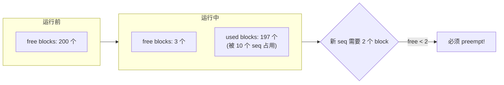
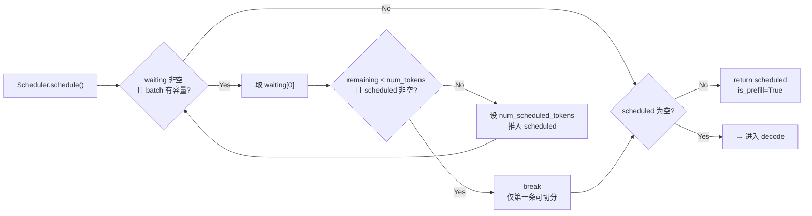
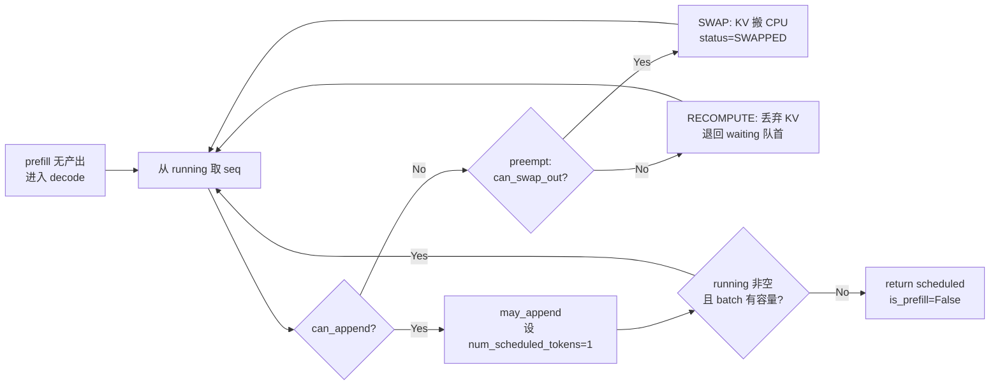
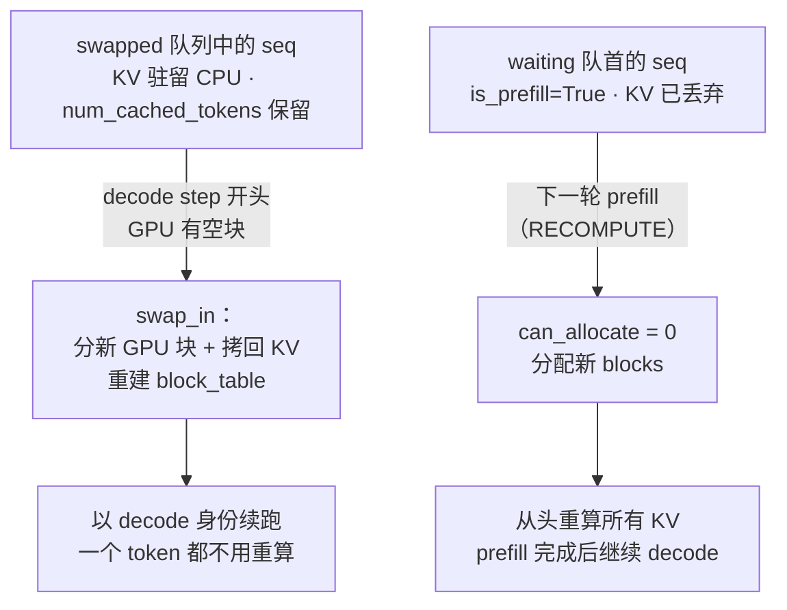

<h1 class="text-4xl font-bold!">第 3 课</h1>
<h2 class="text-2xl mt-4 font-normal opacity-80">Scheduler 的队列、Chunked Prefill 与 Preempt</h2>

<div class="mt-12 text-sm opacity-60">
nano-vllm 实战课程 · 源码拆解 LLM 推理引擎
</div>


<!--
封面页，介绍本课主题：Scheduler 的队列管理、Chunked Prefill 和 Preempt 三个核心机制。点明调度器在推理引擎中的「决策者」角色。
-->
---
layout: default
---

# 本课在课程中的位置

<div style="height: 50px;"></div>
<div class="mt-4 text-sm max-w-2xl mx-auto">

<div class="flex justify-center gap-1 mb-2">
  <div class="bg-gray-700 text-gray-200 rounded px-3 py-1.5 w-28 text-center">L01<br/><span class="text-xs text-gray-400">generate→step</span></div>
  <div class="flex items-center text-gray-400 text-lg">→</div>
  <div class="bg-gray-700 text-gray-200 rounded px-3 py-1.5 w-28 text-center">L02<br/><span class="text-xs text-gray-400">Sequence</span></div>
  <div class="flex items-center text-gray-400 text-lg">→</div>
  <div class="bg-blue-600 text-white rounded px-3 py-1.5 font-bold w-28 text-center">L03<br/><span class="text-xs font-normal opacity-80">调度器</span></div>
  <div class="flex items-center text-gray-400 text-lg">→</div>
  <div class="bg-gray-700 text-gray-200 rounded px-3 py-1.5 w-28 text-center">L04<br/><span class="text-xs text-gray-400">Block 管理</span></div>
</div>

<div class="flex justify-center mb-1">
  <div class="text-gray-400 text-lg">↓</div>
</div>

<div class="flex justify-center gap-1">
  <div class="bg-gray-700 text-gray-200 rounded px-3 py-1.5 w-28 text-center">L05<br/><span class="text-xs text-gray-400">Prefill</span></div>
  <div class="flex items-center text-gray-400 text-lg">→</div>
  <div class="bg-gray-700 text-gray-200 rounded px-3 py-1.5 w-28 text-center">L06<br/><span class="text-xs text-gray-400">Decode</span></div>
  <div class="flex items-center text-gray-400 text-lg">→</div>
  <div class="bg-gray-700 text-gray-200 rounded px-3 py-1.5 w-28 text-center">L07<br/><span class="text-xs text-gray-400">Attention</span></div>
  <div class="flex items-center text-gray-400 text-lg">→</div>
  <div class="bg-gray-700 text-gray-200 rounded px-3 py-1.5 w-28 text-center">L08<br/><span class="text-xs text-gray-400">优化全景</span></div>
</div>

</div>

<div v-click class="mt-4 p-3 bg-blue-500/10 border-l-3 border-blue-500 rounded-r text-sm">
  L02 拆解了 Sequence 字段。L03 打开 step 循环中的核心决策者——<strong>Scheduler</strong>：它在每个 step 决定跑哪些请求、跑多少 token。
</div>


<!--
展示课程路线图，L03 位于 L02（Sequence）和 L04（Block 管理）之间。强调 Scheduler 是 step 循环中的「核心决策者」。
-->
---
layout: default
---

# 1.1 课时安排

调度器在每个 step 决定跑哪些请求、跑多少 token，其角色类似操作系统进程调度器。

| 阶段 | 时长 | 内容要点 |
|------|------|----------|
| 概念回顾 | 10 min | 从 step 中"谁决定跑哪些 seq"引出 Scheduler |
| 代码走读 | 40 min | waiting/running/swapped 三队列、prefill 拼接规则、chunked prefill、preempt（SWAP/RECOMPUTE） |
| 脚本演示 | 10 min | L03_scheduler.py 的 7 个 section（含 swap 元数据往返、真实调度器对比） |
| 动手练习 | 15 min | 整数模拟 prefill 拼接，验证 chunked prefill 限制 |
| 答疑讨论 | 15 min | SWAP 与 RECOMPUTE 的取舍（何时交换、何时重算）、chunked prefill 设计讨论 |


<!--
介绍本课时间分配：概念回顾 10min、代码走读 40min、脚本演示 10min、动手练习 15min、答疑讨论 15min。提醒学员关注 prefill 拼接规则和 preempt。
-->
---
layout: default
---

# 1.2 学习目标

<div class="mt-6 space-y-4">

<div v-click="1" class="flex items-start gap-3 p-3 bg-blue-500/10 border-l-3 border-blue-500 rounded-r">
  <span class="text-blue-400 font-bold">Q1</span>
  <span>waiting、running、swapped 三个队列分别存放什么状态的请求？它们如何流转？</span>
</div>

<div v-click="2" class="flex items-start gap-3 p-3 bg-blue-500/10 border-l-3 border-blue-500 rounded-r">
  <span class="text-blue-400 font-bold">Q2</span>
  <span><code>max_num_seqs</code> 和 <code>max_num_batched_tokens</code> 如何限制 prefill batch 大小？Chunked prefill 为什么只允许第一条 seq 切分？</span>
</div>

<div v-click="3" class="flex items-start gap-3 p-3 bg-blue-500/10 border-l-3 border-blue-500 rounded-r">
  <span class="text-blue-400 font-bold">Q3</span>
  <span>decode 阶段的 <code>preempt()</code> 在什么条件下触发？SWAP 与 RECOMPUTE 两条出路各在什么条件下被选择？被 swap 的 seq 靠什么断点续跑？</span>
</div>

</div>


<!--
列出三个核心问题作为学习目标：队列流转、batch 限制与 chunked prefill、preempt 触发与恢复。引导学员带着问题听课。
-->
---
layout: section
---

# 2. 原理说明
## 为什么调度器要区分 Prefill 和 Decode


<!--
过渡页，进入原理说明。抛出问题「为什么调度器要区分 Prefill 和 Decode」，引导学员思考两者计算特性差异。
-->
---
layout: default
---

# 2.1 Prefill vs Decode 的计算特性

两个阶段的瓶颈完全不同，需要不同的调度策略：

<div class="grid grid-cols-2 gap-6 mt-4">
<div class="bg-blue-500/10 p-4 rounded">

**Prefill：compute-bound（算力瓶颈）**
- 一次处理几十到几千 token
- 注意力计算量 `O(n²)`，矩阵乘法密集
- 策略：尽量打满 batch，最大化 GPU 利用率
- `max_num_batched_tokens = 16384` 控制 token 总量

</div>
<div class="bg-purple-500/10 p-4 rounded">

**Decode：memory-bound（访存瓶颈）**
- 每步只算 1 个新 token
- 瓶颈在从显存读取历史 KV cache
- 策略：多请求一起 decode 分摊访存
- `max_num_seqs = 512` 控制请求数量

</div>
</div>

<div v-click class="mt-4 text-center font-semibold text-lg">
  <code>Scheduler.schedule()</code> 优先 prefill，没有 prefill 可做才转 decode——两种模式互斥
</div>


<!--
对比 Prefill（compute-bound）和 Decode（memory-bound）的瓶颈差异。强调 schedule() 优先 prefill 且两个阶段互斥。对照 scheduler.py 中 schedule 函数结构。
-->
---
layout: default
---

# 2.2 KV cache Block 作为瓶颈资源

显存中 KV cache block 的总数是固定的（由 `Config` 中的内存利用率决定）：

<div class="flex justify-center">



</div>

<div v-click class="mt-3 p-3 bg-yellow-500/10 border-l-3 border-yellow-500 rounded-r text-sm">
  <strong>preempt 的本质</strong>：当 decode 需要追加 block 但空闲池不足时，牺牲一个 RUNNING 序列，且有两条出路——<strong>SWAP</strong>（<code>cpu_offload_gb&gt;0</code> 时优先）：把它的 KV block 搬到 CPU 内存、进入 swapped 队列，空出来后搬回断点续跑；<strong>RECOMPUTE</strong>（兜底）：释放 block 退回 WAITING，下一轮重新 prefill 重算 KV。
</div>


<!--
用 mermaid 图展示 KV cache block 从运行前到运行中的变化。引出 preempt 的本质：空闲 block 不足时牺牲 RUNNING 序列，SWAP（KV 到 CPU，断点续跑）与 RECOMPUTE（丢弃重算）双路径。
-->
---
layout: default
---

# Preempt ≈ 操作系统换出（Swap Out）

| OS 概念 | nano-vllm 对应 |
|---------|---------------|
| 物理内存页框 | KV cache blocks |
| 进程的页表 | `Sequence.block_table` |
| 内存不足时换出 | `preempt()` — SWAP：KV 搬到 CPU；RECOMPUTE 兜底：退回 waiting |
| 换入恢复 | SWAP：swap_in 后断点续跑；RECOMPUTE：下一轮 prefill 重算 |
| 换出目的地 | OS：磁盘 swap 分区；nano SWAP：CPU pinned 内存 |
| 触发开关 | OS 自动；nano 由 `Config.cpu_offload_gb` 控制（>0 启用 SWAP） |
| 换出策略（LRU/FIFO） | nano-vllm：从 running 队尾出队 |

<div v-click class="mt-4 p-3 bg-yellow-500/10 border-l-3 border-yellow-500 rounded-r text-sm">
  💡 <strong>类比的演进</strong>：旧版只有 RECOMPUTE 时，"类比 OS swap" 只是同构——KV 被释放后直接重算。现在 <code>cpu_offload_gb&gt;0</code> 后 SWAP 路径让类比<strong>字面成立</strong>：KV 真的被写到交换区（CPU pinned 内存），回来直接续跑，一个 token 都不用重算。默认（<code>cpu_offload_gb=0</code>）仍走重算——实现最简，且小模型上两者开销相当。
</div>


<!--
用 OS Swap 类比：页框→KV block、页表→block_table、换出→preempt（SWAP/RECOMPUTE 双路径）、换入→swap_in 续跑或重算。强调类比演进：SWAP 路径让"换出到交换区"字面成立，重算降级为兜底。
-->
---
layout: section
---

# 3. 代码走读
## Scheduler 的完整决策逻辑


<!--
过渡页，进入 Scheduler 源代码走读部分。提示学员对照 scheduler.py 阅读。
-->
---
layout: default
---

# 3.1 Scheduler 整体架构

<SourceCode file="nanovllm/engine/scheduler.py" lines="10-25" />

```python
class Scheduler:
    def __init__(self, config: Config):
        self.max_num_seqs = config.max_num_seqs              # 512
        self.max_num_batched_tokens = config.max_num_batched_tokens  # 16384
        self.eos = config.eos
        self.block_size = config.kvcache_block_size
        self.block_manager = BlockManager(
            config.num_kvcache_blocks, config.kvcache_block_size,
            config.num_cpu_kvcache_blocks)
        self.waiting: deque[Sequence] = deque()              # 等待队列
        self.running: deque[Sequence] = deque()              # 运行队列
        self.swapped: deque[Sequence] = deque()              # 换出队列（KV 驻留 CPU）
```

<div class="mt-4 p-3 bg-green-500/10 border-l-3 border-green-500 rounded-r text-sm">
  <strong>Scheduler 架构总览</strong>：<code>Scheduler</code> 管理三个双端队列——<code>waiting</code>（待处理的新请求和被 RECOMPUTE 的请求）、<code>running</code>（进行中的 decode）、<code>swapped</code>（KV 驻留 CPU、等待迁回），以及一个 <code>BlockManager</code>（KV cache 分配器，含 CPU 块池）。两个约束参数控制调度边界：<code>max_num_seqs</code>（最大 seq 数）和 <code>max_num_batched_tokens</code>（每轮 token 预算上限）。
</div>


<!--
展示 Scheduler.__init__ 的三个双端队列和约束参数。强调 waiting 存新请求和被 RECOMPUTE 请求，running 存正在 decode 的请求，swapped 存 KV 已搬到 CPU 的请求（cpu_offload_gb>0 时启用）。对照 scheduler.py L10-L25。
-->
---
layout: default
---

# Scheduler 初始化详解

<SourceCode file="nanovllm/engine/scheduler.py" lines="8-25" />

```python {all|2|3-4|5-6|7-9|10-11|12}
class Scheduler:
    def __init__(self, config: Config):
        self.max_num_seqs = config.max_num_seqs
        self.max_num_batched_tokens = config.max_num_batched_tokens
        self.eos = config.eos
        self.block_size = config.kvcache_block_size
        self.block_manager = BlockManager(
            config.num_kvcache_blocks, config.kvcache_block_size,
            config.num_cpu_kvcache_blocks)
        self.waiting: deque[Sequence] = deque()
        self.running: deque[Sequence] = deque()
        self.swapped: deque[Sequence] = deque()
```

<div class="grid grid-cols-2 gap-4 mt-4 text-sm">
<div class="bg-blue-500/10 border-l-3 border-blue-500 p-3 rounded">
  <strong>(1) Config 控制参数</strong><br/>
  <code>max_num_seqs</code>（默认 512）：每轮最多调度多少条 seq<br/>
  <code>max_num_batched_tokens</code>（16384）：每轮 prefill 的 token 预算<br/>
  <code>kvcache_block_size</code>（256）：每个 KV block 的 token 容量<br/>
  <code>num_kvcache_blocks</code>：由 <code>gpu_memory_utilization</code> 自动计算<br/>
  <code>num_cpu_kvcache_blocks</code>：由 <code>cpu_offload_gb</code> 换算（0 = 关闭 swap）
</div>
<div class="bg-purple-500/10 border-l-3 border-purple-500 p-3 rounded">
  <strong>(2) 队列生命周期</strong><br/>
  <span class="text-green-400">waiting</span> → prefill 完成 → <span class="text-yellow-400">running</span>（append）<br/>
  <span class="text-yellow-400">running</span> → preempt+RECOMPUTE → <span class="text-green-400">waiting</span>（appendleft 优先恢复）<br/>
  <span class="text-yellow-400">running</span> → preempt+SWAP → <span class="text-purple-400">swapped</span>（KV 驻留 CPU）<br/>
  <span class="text-purple-400">swapped</span> → swap-in（GPU 有空块）→ <span class="text-yellow-400">running</span>（断点续跑）
</div>
</div>

<div v-click class="mt-2 text-sm opacity-80">
  <strong>注意</strong>：构造函数不接收外部传入的 block_manager——它根据 config 的显存参数在内部创建 BlockManager。所有调度决策都源自这三个队列和 config 常量。
</div>


<!--
逐行拆解 __init__，分两组讲解：(1) Config 控制参数（含 cpu_offload_gb 开关）；(2) 三队列生命周期流转（含 swap 的出去和回来）。强调所有决策源自三个队列和 config 常量。
-->
---
layout: default
---

# schedule() 控制流：Prefill 分支

<div class="flex justify-center">



</div>

<div v-click class="mt-3 p-3 bg-green-500/10 border-l-3 border-green-500 rounded-r text-sm">
  <strong>Prefill 优先</strong>：只要 waiting 非空且 batch 有容量，就不断从队首取 seq。三个 break 条件控制退出。有产出就 <code>return True</code>，否则转入 decode。
</div>

<!--
prefill 分支控制流。重点讲三个退出条件的位置和优先级，以及 scheduled 为空时转入 decode 的逻辑。
-->

---
layout: default
---

# schedule() 控制流：Decode 分支

<div class="flex justify-center">



</div>

<div v-click class="mt-3 p-3 bg-green-500/10 border-l-3 border-green-500 rounded-r text-sm">
  <strong>Decode 逐条处理</strong>：从 running 队首 FIFO 取出，can_append 失败则抢占腾空间（SWAP 优先、RECOMPUTE 兜底，循环重试），成功则固定 1 token。batch 满或 running 空时 <code>return False</code>。
</div>

<!--
decode 分支控制流。重点讲 can_append/preempt 的 while 循环，以及 preempt 的双路径（SWAP：KV 搬 CPU 进 swapped；RECOMPUTE：丢弃 KV 回 waiting 队首）。may_append 只在确认可调度后才分配 block。与教案 §3 的 decode 流程图保持一致。
-->
---
layout: default
---

# schedule()：Prefill 判断条件

<SourceCode file="nanovllm/engine/scheduler.py" lines="40-53" />

```python {all|5-6|9-10|14-15}
# Prefill 循环 — 三个 break 退出条件
while self.waiting and len(scheduled_seqs) < self.max_num_seqs:
    seq = self.waiting[0]
    remaining = self.max_num_batched_tokens - num_batched_tokens
    if remaining == 0:                                        # ① token 预算耗尽
        break                           
    if not seq.block_table:
        num_cached_blocks = self.block_manager.can_allocate(seq)
        if num_cached_blocks == -1:                                           # ② KV block 耗尽
            break                       
        num_tokens = seq.num_tokens - num_cached_blocks * self.block_size
    else:
        num_tokens = seq.num_tokens - seq.num_cached_tokens
    if remaining < num_tokens and scheduled_seqs:             # ③ chunked 限制
        break                           
```

<div v-click class="mt-3 p-3 bg-green-500/10 border-l-3 border-green-500 rounded-r text-sm">
  三个退出条件按优先级：① token 预算用尽 → ② KV block 池耗尽 → ③ chunked prefill 仅首条可分片。条件通过后，下一页看执行动作。
</div>

<!--
prefill 分支上半段：展示三个 break 条件的优先级。①② 是硬限制，③ 是设计约束。对照 scheduler.py L40-L53。
-->

---
layout: default
---

# schedule()：Prefill 执行动作

<SourceCode file="nanovllm/engine/scheduler.py" lines="54-65" />

```python {all|2-3|4|5-10|12-13}
# 条件通过后，执行调度动作
    if not seq.block_table:
        self.block_manager.allocate(seq, num_cached_blocks)             # ① 分配 KV block
    seq.num_scheduled_tokens = min(num_tokens, remaining)                # ② 设定 token 数
    num_batched_tokens += seq.num_scheduled_tokens
    if seq.num_cached_tokens + seq.num_scheduled_tokens == seq.num_tokens:
        seq.status = SequenceStatus.RUNNING                              # ③ WAITING → RUNNING
        self.waiting.popleft()
        self.running.append(seq)
    scheduled_seqs.append(seq)

if scheduled_seqs:
    return scheduled_seqs, True                                          # ④ 本轮走 prefill
```

<div v-click class="mt-3 p-3 bg-green-500/10 border-l-3 border-green-500 rounded-r text-sm">
  四个动作：① allocate 分配 block ② 设定 num_scheduled_tokens ③ 完成的 seq 从 waiting 迁入 running ④ return True，本轮只走 prefill。
</div>

<!--
prefill 分支下半段：四个执行动作。重点状态转换 WAITING→RUNNING 和 return True 后就不再 decode。
-->
---

# schedule()：Decode 分支

<SourceCode file="nanovllm/engine/scheduler.py" lines="80-94" />

```python {all|3|4-9|10-12}
    # ── Decode ──
    while self.running and len(scheduled_seqs) < self.max_num_seqs:
        seq = self.running.popleft()                            # ① FIFO 取 seq
        while not self.block_manager.can_append(seq):
            if self.running:
                self.preempt(self.running.pop())                # ② 抢占队尾腾空间
            else:
                self.preempt(seq)
                break
        else:
            seq.num_scheduled_tokens = 1                        # ③ 固定 1 token/step
            seq.is_prefill = False
            self.block_manager.may_append(seq)
            scheduled_seqs.append(seq)
    assert scheduled_seqs
    self.running.extendleft(reversed(scheduled_seqs))
    return scheduled_seqs, False
```

<div class="mt-4 p-3 bg-green-500/10 border-l-3 border-green-500 rounded-r text-sm">
  <strong>Decode 分支三步走</strong>：从 running 队首 FIFO 取出 seq；若 block 不足则抢占队尾腾出空间（preempt 双路径：SWAP 优先、RECOMPUTE 兜底，见 §3.4）；每条 seq 固定处理 1 个 token，满块时通过 <code>may_append</code> 追加新 block。
</div>

---
layout: default
---

# 3.2 Prefill 批拼接逻辑

<SourceCode file="nanovllm/engine/scheduler.py" lines="40-53" />

```python {all|5-6|9-10|14-15}
# Scheduler.schedule 中的 prefill 循环
while self.waiting and len(scheduled_seqs) < self.max_num_seqs:
    seq = self.waiting[0]                                          # 从 waiting 头部看
    remaining = self.max_num_batched_tokens - num_batched_tokens
    if remaining == 0:
        break                                                      # ① token 预算耗尽
    if not seq.block_table:
        num_cached_blocks = self.block_manager.can_allocate(seq)
        if num_cached_blocks == -1:                                # ② KV cache 不够
            break                                                  
        num_tokens = seq.num_tokens - num_cached_blocks * self.block_size
    else:
        num_tokens = seq.num_tokens - seq.num_cached_tokens
    if remaining < num_tokens and scheduled_seqs:                  # ③ chunked prefill 限制
        break                                                  
```

<div class="mt-4 p-3 bg-green-500/10 border-l-3 border-green-500 rounded-r text-sm">
  <strong>Prefill 三个退出条件</strong>：① token 预算耗尽（<code>remaining == 0</code>）——硬限制；② KV cache 不够（<code>can_allocate == -1</code>）——硬限制；③ chunked prefill 限制（<code>remaining &lt; num_tokens and scheduled_seqs</code>）——设计约束，仅允许第一条 seq 做切分。
</div>


<!--
聚焦 prefill 循环核心代码（L40-L53），展示三个 break 条件对应的退出场景。强调 remaining 变量计算方式和 chunked prefill 的条件。对照 scheduler.py L40-L53。
-->
---
layout: default
---

# Prefill 分支：三个退出条件的优先级

prefill 循环中有三个 <code>break</code>，它们的执行顺序决定批拼接行为：

```python {all|4-5|8-9|13-14}
while self.waiting and len(scheduled_seqs) < self.max_num_seqs:
    seq = self.waiting[0]
    remaining = self.max_num_batched_tokens - num_batched_tokens
    if remaining == 0:                                                       # 条件①
        break                                                                # 优先级最高
    if not seq.block_table:
        num_cached_blocks = self.block_manager.can_allocate(seq)
        if num_cached_blocks == -1:                                          # 条件②
            break                                                            # 优先级次之
        num_tokens = seq.num_tokens - num_cached_blocks * self.block_size
    else:
        num_tokens = seq.num_tokens - seq.num_cached_tokens
    if remaining < num_tokens and scheduled_seqs:                            # 条件③ — 优先级最低
        break                                                                 
```

<div class="grid grid-cols-3 gap-3 mt-4 text-xs">
<div class="bg-red-500/10 p-3 rounded">
  <strong>① remaining == 0</strong><br/>
  Token 预算已用尽。本轮无法再添加任何 seq——立即停止循环。
</div>
<div class="bg-yellow-500/10 p-3 rounded">
  <strong>② can_allocate == -1</strong><br/>
  全局 KV block 池耗尽。后面的 seq 都需要新 block，但一个也分不到。
</div>
<div class="bg-green-500/10 p-3 rounded">
  <strong>③ chunked 限制</strong><br/>
  当前 seq 太长且 batch 已有其他 seq。软限制——终止 prefill 阶段，下轮再处理它。
</div>
</div>

<div v-click class="mt-3 p-3 bg-blue-500/10 border-l-3 border-blue-500 rounded-r text-xs">
  <strong>为什么条件③放最后？</strong>条件①和②是硬限制——无论如何都无法继续。条件③是设计约束——如果 <code>scheduled_seqs</code> 为空（当前 seq 是 batch 的第一条），条件③不触发，允许 chunked prefill。如果非空，<code>break</code> 退出 while 循环，已调度的 seq 进入下一阶段，该 seq 留在 waiting 等待下一轮 prefill。</div>


<!--
深入讲解三个 break 条件的优先级排序。条件①②是硬限制，条件③是软限制。用三个色块对比展示，讲解条件③放最后的原因。
-->
---
layout: default
---

# Chunked Prefill 详解

当一条 seq 的待处理 token 超过本轮剩余预算时，只允许 batch 的第一条做切分：

<SourceCode file="nanovllm/engine/scheduler.py" lines="52-53" />

```python
if remaining < num_tokens and scheduled_seqs:
    break   # 已有其他 seq 在 batch 中，不允许再切分新 seq
```

<div class="mt-4 grid grid-cols-2 gap-4 text-sm">
<div v-click="1" class="bg-green-500/10 border-l-3 border-green-500 p-3 rounded">
  <strong>允许的场景</strong><br/>
  waiting[0] 有 5000 token，预算剩 3000<br/>
  scheduled_seqs = []<br/>
  → seq 被切分，处理 3000 token<br/>
  → 剩余 2000 token 下一轮继续
</div>
<div v-click="2" class="bg-red-500/10 border-l-3 border-red-500 p-3 rounded">
  <strong>不允许的场景</strong><br/>
  waiting[0] 有 5000 token，预算剩 3000<br/>
  scheduled_seqs = [seq_a] （已有一条）<br/>
  → break！不继续往 batch 加 seq<br/>
  → 避免所有 seq 都被切分
</div>
</div>

<div v-click="3" class="mt-3 p-3 bg-blue-500/10 border-l-3 border-blue-500 rounded-r text-sm">
  <strong>设计意图</strong>：如果允许多条 seq 同时被切分，调度器需要追踪每条 seq 的部分进度——状态空间爆炸。限制只切第一条，调度器只需记住这"一条"的下次起始位置。
</div>


<!--
用允许和不允许两个场景对比讲解 chunked prefill 规则。强调判断条件 remaining < num_tokens and scheduled_seqs。讲解设计意图。对照 scheduler.py L52-L53。
-->
---
layout: default
---

# Chunked Prefill 的具体示例

```
max_num_batched_tokens = 1200

prompt长度:  [1000, 900, 800]

第 1 轮:
  seq[0]: remaining=1200, num_tokens=1000
    → 1000 < 1200, 整条塞入, num_batched_tokens=1000
  seq[1]: remaining=200, num_tokens=900
    → 900 > 200, 但 scheduled_seqs=[seq[0]] ≠ []
    → break! seq[1] 不能切分
  结果: [seq[0](1000)], 剩余 200 token 预算浪费

第 2 轮 (seq[0] 进入 running):
  seq[1]: remaining=1200, num_tokens=900
    → 900 < 1200, 整条塞入, num_batched_tokens=900
  seq[2]: remaining=300, num_tokens=800
    → 800 > 300, scheduled_seqs=[seq[1]] ≠ []
    → break!
  结果: [seq[1](900)]

第 3 轮:
  seq[2]: remaining=1200, num_tokens=800
    → 整条塞入
  结果: [seq[2](800)]
```


<!--
用具体数字举例：三条 prompt [1000, 900, 800] 在 max_num_batched_tokens=1200 下三轮调度的完整过程。让学员感受 chunked prefill 限制。
-->
---
layout: default
---

# Chunked Prefill：切分后的状态追踪

chunked prefill 的 seq 通过 <code>num_cached_tokens</code> 追踪处理进度：

```python
# 全程示例：seq.num_tokens = 5000, block_size = 256

# 第1轮：预算 max_num_batched_tokens = 3000，被切分
seq.num_scheduled_tokens = 3000            # 本轮处理 3000 token
# postprocess 中累加：
seq.num_cached_tokens = 0 -> 3000           # 3000 < 5000 -> continue（不 append_token）
# seq 状态：仍在 waiting（未完成 prefill）

# 第2轮：预算 16384（新轮次），剩余 2000 < 16384
seq.num_scheduled_tokens = 2000            # 剩余 2000 全部处理
# postprocess 中累加：
seq.num_cached_tokens = 3000 -> 5000        # 5000 == 5000 -> 执行 append_token
# seq 状态：num_cached_tokens == num_tokens -> 迁移到 running
```

<div class="mt-4 grid grid-cols-2 gap-4 text-sm">
<div class="bg-blue-500/10 border-l-3 border-blue-500 p-3 rounded">
  <strong>postprocess 中的判断</strong><br/>
  <code>seq.num_cached_tokens += seq.num_scheduled_tokens</code><br/>
  <code>if is_prefill and seq.num_cached_tokens &lt; seq.num_tokens: continue</code><br/><br/>
  未完成 prefill 时 <code>continue</code> 跳过 <code>append_token</code>，seq 继续留在 waiting 等待下一轮。
</div>
<div class="bg-purple-500/10 border-l-3 border-purple-500 p-3 rounded">
  <strong>与整条 prefill 的区别</strong><br/>
  整条预填充的 seq 一轮内处理完所有 token，<code>num_cached_tokens</code> 直接从 0 跳到 <code>num_tokens</code>。<br/><br/>
  Chunked prefill 的 seq 需要"记住"已处理位置——<code>num_cached_tokens</code> 就是跨轮次的累积游标。</div>
</div>


<!--
讲解被切分 seq 如何通过 num_cached_tokens 跨轮次追踪进度。展示 5000 token seq 在两轮中被切分的完整流程。强调 postprocess 判断逻辑。
-->
---
layout: default
---

# 3.3 Decode 分支

<SourceCode file="nanovllm/engine/scheduler.py" lines="80-94" />

```python {all|3|4-9|10-14}
# decode 循环：从 running 逐条取出
while self.running and len(scheduled_seqs) < self.max_num_seqs:
    seq = self.running.popleft()                            # ① FIFO 取 seq
    while not self.block_manager.can_append(seq):
        if self.running:
            self.preempt(self.running.pop())                # ② 抢占队尾腾空间
        else:
            self.preempt(seq)
            break
    else:
        seq.num_scheduled_tokens = 1                        # ③ 固定 1 token/step
        seq.is_prefill = False
        self.block_manager.may_append(seq)
        scheduled_seqs.append(seq)
```

<div class="mt-4 p-3 bg-green-500/10 border-l-3 border-green-500 rounded-r text-sm">
  <strong>Decode 循环三步走</strong>：① 从 running 队首 FIFO 取出 seq；② 若 block 不足则抢占队尾腾出空间；③ 每条 seq 固定处理 1 个 token，满块时通过 <code>may_append</code> 追加新 block。
</div>

<div v-click class="mt-2 p-3 bg-yellow-500/10 border-l-3 border-yellow-500 rounded-r text-sm">
  🔑 <strong>may_append</strong>：检查 <code>len(seq) % block_size == 1</code> 时，说明上一个 block 刚好写满，需要分配新 block 来存即将生成的 token 的 KV。
</div>

<div v-click class="mt-2 p-3 bg-purple-500/10 border-l-3 border-purple-500 rounded-r text-sm">
  🔑 <strong>前置的 swap-in 阶段</strong>（<code>scheduler.py:L67-L77</code>）：进入 decode 循环之前，若 <code>swapped</code> 队列非空且 GPU 空块够，先把队首 seq 迁回 <code>running</code>——KV 从 CPU 拷回后断点续跑，无需重算。这一步也是活性保障：所有 running 都被换出时，靠它 refill。
</div>


<!--
讲解 decode 循环（L80-L92）：FIFO 从 running 队首取出，先检查 can_append，失败则 preempt 队尾（SWAP/RECOMPUTE 双路径）。每条 seq 固定调度 1 token。补充 decode step 开头的 swap-in 阶段。对照 scheduler.py L80-L94。
-->
---
layout: default
---

# Decode: can_append 与 may_append 的协作

<SourceCode file="nanovllm/engine/block_manager.py" lines="107-112" />

```python {all|1-2|3-5}
def can_append(self, seq: Sequence) -> bool:
    return len(self.free_block_ids) >= (len(seq) % self.block_size == 1)

def may_append(self, seq: Sequence):
    if len(seq) % self.block_size == 1:
        seq.block_table.append(self._allocate_block())
```

<div class="grid grid-cols-2 gap-4 mt-4 text-sm">
<div class="bg-blue-500/10 border-l-3 border-blue-500 p-3 rounded">
  <strong>can_append：检查与决策</strong><br/>
  <code>len(seq) % block_size == 1</code> 判断当前 seq 长度是否刚好跨过 block 边界（即下一个 token 需要新 block）。<br/><br/>
  Python 中 <code>True == 1</code>，<code>False == 0</code>。所以表达式等价于："需要新 block 吗？需要的话 free 里至少要有 1 个。" <br/><br/>
  既判断"是否需要"，也判断"是否有"——两个条件合并为一行。
</div>
<div class="bg-purple-500/10 border-l-3 border-purple-500 p-3 rounded">
  <strong>may_append：执行分配</strong><br/>
  与 can_append 使用<strong>相同的判断条件</strong>：<code>len(seq) % block_size == 1</code><br/><br/>
  条件为真时才真正分配并追加 block table。<br/><br/>
  两个方法必须保持条件一致——如果 can_append 说需要但 may_append 不分配，block table 会越界。
</div>
</div>

<div v-click class="mt-3 p-3 bg-yellow-500/10 border-l-3 border-yellow-500 rounded-r text-sm">
  <strong>为什么分开？</strong>典型的"检查与执行分离"模式。<code>can_append</code> 仅做检查（不修改状态），用于调度决策——判断是否需要 preempt 腾出空间。<code>may_append</code> 在确认可调度后才真正分配 block。
</div>


<!--
聚焦 block_manager.py 中「检查与执行分离」模式：can_append 仅检查不修改状态，may_append 确认可调度后分配。对照 block_manager.py L107-L112。
-->
---
layout: default
---

# 3.4 Preempt：SWAP 优先，RECOMPUTE 兜底

<SourceCode file="nanovllm/engine/scheduler.py" lines="97-116" />

```python
def preempt(self, seq: Sequence):
    # 护栏：本 step 刚 swap_in 的 seq，GPU 块中 KV 尚未拷回（是垃圾数据）
    if not set(self.blocks_to_swap_in.values()).isdisjoint(seq.block_table):
        self.blocks_to_swap_in = {c: g for c, g in self.blocks_to_swap_in.items()
                                  if g not in set(seq.block_table)}
        self._recompute(seq)                          # 取消其 swap-in，改走重算
        return
    if self.block_manager.can_swap_out(seq):          # CPU 空块够 且 所有块 ref_count==1
        mapping = self.block_manager.swap_out(seq)    # {gpu_id: cpu_id}
        seq.status = SequenceStatus.SWAPPED           # KV 即将搬到 CPU
        self.swapped.append(seq)                      # 入 swapped 队列，等空位续跑
    else:
        self._recompute(seq)                          # 兜底：CPU 满 / 含共享块
```

<div class="mt-4 p-3 bg-green-500/10 border-l-3 border-green-500 rounded-r text-sm">
  <strong>Preempt 双路径</strong>：先过护栏——本 step 刚 swap_in 的 seq 其 GPU 块里还是垃圾 KV，绝不能再 swap_out（会把垃圾拷去 CPU 覆盖真身），直接 <code>_recompute</code>。主决策看 <code>can_swap_out</code>：CPU 有空位<strong>且</strong>所有块独占（<code>ref_count==1</code>，共享块不能搬走）才 SWAP；否则 <code>_recompute</code>——旧版 preempt 的四步（WAITING + is_prefill=True + deallocate + appendleft）原样住在里面。
</div>

<div class="mt-4 grid grid-cols-3 gap-3 text-sm">
<div v-click="1" class="bg-blue-500/10 border-l-3 border-blue-500 p-3 rounded text-center">
  <div class="font-bold mb-1">① 护栏校验</div>
  <div class="opacity-70">刚 swap_in 的 seq → 强制 RECOMPUTE</div>
</div>
<div v-click="2" class="bg-purple-500/10 border-l-3 border-purple-500 p-3 rounded text-center">
  <div class="font-bold mb-1">② SWAP 优先</div>
  <div class="opacity-70">swap_out → SWAPPED → swapped 队列</div>
</div>
<div v-click="3" class="bg-red-500/10 border-l-3 border-red-500 p-3 rounded text-center">
  <div class="font-bold mb-1">③ RECOMPUTE 兜底</div>
  <div class="opacity-70">丢弃 KV → waiting 队首，重新 prefill</div>
</div>
</div>

<div v-click="4" class="mt-3 p-3 bg-yellow-500/10 border-l-3 border-yellow-500 rounded-r text-sm">
  <strong>为什么抢队尾？</strong>FIFO 队列中，队尾是最后入队的 seq，通常已生成的 token 最少。抢占它意味着恢复代价最小——RECOMPUTE 路径重算量小，SWAP 路径搬运的 KV 也少。被 RECOMPUTE 的 seq 通过 <code>waiting.appendleft</code> 获得"优先恢复权"。
</div>


<!--
讲解 preempt 双路径：护栏（本 step 刚 swap_in 的 seq 不能再 swap_out，GPU 块里 KV 还没拷回）→ SWAP 优先（can_swap_out 要求 CPU 空位 + 全部块独占）→ RECOMPUTE 兜底（_recompute 即旧版四步 + 计数器）。解释抢队尾的原因——队尾 seq token 最少，两条路径的代价都最小。对照 scheduler.py L97-L123。
-->
---
layout: default
---

# Preempt 的恢复流程

被抢占的 seq 有两条恢复路径，取决于它被抢占时走了哪条出路：

<div class="flex justify-center">



</div>

<div v-click class="mt-3 p-3 bg-yellow-500/10 border-l-3 border-yellow-500 rounded-r text-sm">
  ⚠️ <strong>RECOMPUTE 的代价</strong>：之前生成的 token 的 KV cache 全部丢失，需要重新计算——这是"计算换空间"。SWAP 路径没有这笔重算账，代价是 KV 经 PCIe 搬一个来回；<code>cpu_offload_gb=0</code>（默认）时重算是唯一出路。
</div>


<!--
用 mermaid 图展示被抢占 seq 的两条恢复路径：SWAP 路径（swap-in 阶段迁回，断点续跑零重算）与 RECOMPUTE 路径（waiting 队首重新 prefill，全量重算）。强调两条路径各自的代价。
-->
---
layout: default
---

# Preempt vs OS Swap：实现对比

| 对比维度 | OS Swap Out | nano-vllm Preempt |
|---------|------------|-------------------|
| 被驱逐资源 | 物理内存页面 | KV cache blocks |
| 换出目的地 | 磁盘 swap 分区 | SWAP：CPU pinned 内存；RECOMPUTE：不换出，直接释放 |
| 恢复路径 | 缺页中断 → 从磁盘读回 | SWAP：swap_in → 断点续跑；RECOMPUTE：重新 prefill 重算 |
| 恢复成本主导 | 磁盘 I/O（毫秒级随机读） | SWAP：PCIe 传输；RECOMPUTE：GPU 重算前向 |
| 触发开关 | 内存不足时内核自动 | `Config.cpu_offload_gb`（>0 启用 SWAP，默认 0 仅 RECOMPUTE） |
| 驱逐策略 | LRU/Clock 等内核算法 | 固定：队尾出队（FIFO） |
| 资源粒度 | 4 KB 页框 | 256 token / block |

<div class="mt-4 grid grid-cols-2 gap-4 text-xs">
<div class="bg-blue-500/10 border-l-3 border-blue-500 p-3 rounded">
  <strong>为什么默认仍是重算？</strong><br/>
  交换与重算是一对成本权衡：SWAP 付 PCIe 传输（∝ KV 字节数 ÷ 带宽），RECOMPUTE 付重算前向（∝ 模型规模 × prompt 长度）。RTX 3090 + Qwen3-0.6B 实测两者吞吐持平（设计文档 §10.E）；模型越大、prompt 越长，重算越贵，SWAP 越划算——这也是 vLLM 在大模型场景默认 swap 的原因。
</div>
<div class="bg-purple-500/10 border-l-3 border-purple-500 p-3 rounded">
  <strong>队尾抢占的合理性</strong><br/>
  队尾 seq 生成的 token 最少，恢复代价最小——RECOMPUTE 路径重算量小，SWAP 路径搬运的 KV 也少。与 OS 的 LRU 对比：LRU 换出"最久未访问"的页；nano-vllm 队尾 ≈ 最"新"的请求，关联的 KV 状态最少。
</div>
</div>


<!--
用对比表格总结 preempt 和 OS Swap 的差异维度（含换出目的地与触发开关）。延伸讲解：SWAP 与 RECOMPUTE 是传输 vs 重算的成本权衡，0.6B 实测持平、大模型 SWAP 占优（设计文档 §10.E）；队尾抢占的合理性。
-->
---
layout: section
---

# 4. L03 验证脚本
## L03_scheduler.py 走读


<!--
过渡页，进入脚本演示部分。提示学员打开 L03_scheduler.py 文件准备跟随。
-->
---
layout: default
---

# L03_scheduler.py：7 个验证 section

<SourceCode file="docs/llm-inference-visual/scripts/L03_scheduler.py" lines="1-15" />

<div class="mt-4 grid grid-cols-4 gap-2 text-xs text-center">
<div class="bg-blue-500/10 p-2 rounded">§1<br/><strong>基本 Prefill 拼接</strong></div>
<div class="bg-green-500/10 p-2 rounded">§2<br/><strong>Chunked 约束</strong></div>
<div class="bg-purple-500/10 p-2 rounded">§3<br/><strong>Prefix cache 批处理</strong></div>
<div class="bg-yellow-500/10 p-2 rounded">§4<br/><strong>Decode + Preempt</strong></div>
<div class="bg-red-500/10 p-2 rounded">§5<br/><strong>Preempt 双路径</strong></div>
<div class="bg-orange-500/10 p-2 rounded">§6<br/><strong>swap 元数据往返</strong></div>
<div class="bg-gray-500/10 p-2 rounded">§7<br/><strong>真实调度器对比<br/>+ SWAP 全流程</strong></div>
</div>


<!--
概览七个验证 section：Prefill 拼接、Chunked 约束、Prefix cache、Decode+Preempt、Preempt 双路径状态机、BlockManager swap 元数据往返（纯 CPU）、真实调度器对比。对照 L03_scheduler.py L1-L15。
-->
---
layout: default
---

# §1-2：Prefill 拼接与 Chunked 约束

```python
# §1: 基本 prefill — 三条短 seq 轻松放入
simulate_prefill([100, 200, 300], max_batched_tokens=16384)
# → [(0, 100), (1, 200), (2, 300)]  全部整条塞入

# §1: 单条长 seq 被切分 (chunked prefill)
simulate_prefill([2000], max_batched_tokens=1200)
# → 第1轮: [(0, 1200)]  ← 被切分，只处理1200
#    第2轮: [(0, 800)]   ← 剩余800继续

# §2: chunked prefill 只对第一条有效
simulate_prefill([300, 800, 200], max_batched_tokens=1000)
# → [(0, 300)]  ← seq[0] 300, 剩余 700 < 800
#   seq[1] 被跳过 (chunked 限制)
#   断言: scheduled == [(0, 300)]
```


<!--
展示 §1-2 模拟代码和预期输出：三条短 seq 全部塞入、一条长 seq 被切分、chunked prefill 对第一条有效。逐行解释模拟函数逻辑。
-->

---
layout: default
---

# §3：Prefix Cache 对 Prefill 的影响

```python
# §3: prefix cache 命中减少 token 消耗
simulate_prefill([1000, 800], max_batched_tokens=1200,
                 num_cached_tokens=[512, 0])
# → seq[0] 只需 1000-512=488 token
#   seq[1] 需要 800, 488+800 > 1200 → break
#   断言: scheduled == [(0, 488)], 剩余 512
```

<div class="mt-4 p-3 bg-blue-500/10 border-l-3 border-blue-500 rounded-r text-sm">
  <strong>prefix cache 如何影响 batched prefill？</strong>seq[0] 的 512 token 被缓存命中，实际只需计算 488 token。这释放出预算空间——<code>488 + 800 = 1288</code> 虽然仍超预算 1200，但比 <code>1000 + 800</code> 至少让 seq[0] 有机会与短 seq 同批。缓存命中率直接影响 prefill 吞吐。
</div>


<!--
展示 prefix cache 命中如何节省 token 预算：seq[0] 缓存命中只需 488 token。强调缓存命中率直接影响 prefill 吞吐。
-->
---
layout: default
---

# §4-7：Decode 调度 + swap 往返 + 真实调度器对比

```python
# §4: decode 调度模拟 (block_size=4)
# A: free_blocks=10, 3条 seq — can_append 全部 True → 3 条调度
# B: free_blocks=0, seq[0].len%4==1 → can_append=False
#    → preempt seq[2] → 释放 3 blocks → seq[0] 可以了
#    断言: scheduled=2, preempted=[2]
# C: free=0, seq.len%4!=1 → 不需要新 block → can_append=True
#    断言: scheduled=1, preempted=[]
# D: free=0, 只有自己, len%4==1 → 自身被抢占
#    断言: scheduled=0, preempted=[0]

# §5: preempt 双路径
# ① 护栏: 本 step 刚 swap_in → 强制 RECOMPUTE
# ② can_swap_out? (CPU 空位 + 全部块 ref_count==1)
#    Yes → SWAP；No → _recompute（旧版四步 + 计数器）

# §6: BlockManager swap 元数据往返（纯 CPU，无需 GPU）
# swap_out: {gpu_id: cpu_id}，GPU 块归还，num_cached_tokens 保留
# swap_in : 重建 block_table，CPU 块释放
# 断言: 往返后块数不变；can_swap_out 两条否决（CPU 满 / 共享块）

# §7: 真实 Scheduler 类对比
# 初始化真实 Scheduler, 创建 3条 seq, schedule()
# 断言: len(scheduled) == 3  (模拟 == 真实)
# postprocess() → schedule() → 断言: num_scheduled_tokens == 1
# 场景 E: 强制抢占的 SWAP 全流程（num_kvcache_blocks=2, CPU 块=8, eos=0）
#   prefill 占满 GPU → decode 抢占队尾 → blocks_to_swap_out, status=SWAPPED
#   等 A 完成释放 block → swap_in 迁回（num_cached_tokens=256 原样）
# 场景 E2 对照: CPU 块=0 → RECOMPUTE（num_cached_tokens 归零）
```


<!--
简要过 §4-7 的测试要点：A/B/C/D 四种 decode 场景、preempt 双路径状态机、BlockManager swap 元数据往返（swap_out/swap_in 保 num_cached_tokens）、真实调度器对比——§7 末尾的场景 E/E2 在真实引擎里跑完整的 SWAP 全流程（抢占搬出 → 等空块 → 迁回断点续跑）并给出 RECOMPUTE 对照。建议运行脚本验证输出一致性。
-->
---
layout: default
---

# 4.1 课堂练习

用整数模拟 prefill 批拼接，验证 chunked prefill 限制：

```python
def simulate_prefill(prompt_lens, max_batched_tokens,
                     block_size=256, num_cached_tokens=None):
    """模拟一轮 prefill 的批拼接结果"""
    scheduled = []
    batched = 0
    for i, length in enumerate(prompt_lens):
        remaining = max_batched_tokens - batched
        if remaining == 0:
            break
        cached = num_cached_tokens[i] if num_cached_tokens else 0
        need = length - cached
        if remaining < need and scheduled:
            break  # chunked prefill 限制
        take = min(remaining, need)
        scheduled.append((i, take))
        batched += take
    return scheduled

print(simulate_prefill([1000, 900, 800], max_batched_tokens=1200))
# → [(0, 1000)]  — seq[1] 和 seq[2] 被跳过
```

<div v-click class="mt-3 p-3 bg-green-500/10 border-l-3 border-green-500 rounded-r text-sm">
  💡 <strong>观察要点</strong>：seq[0] 的 1000 token 被整条塞入后只剩 200 预算。seq[1] 需要 900 > 200，且 <code>scheduled</code> 已非空，触发 chunked prefill 限制 → <code>break</code>。seq[1] 和 seq[2] 本轮被跳过。
</div>

<!--
展示 simulate_prefill 函数，要求学员用整数模拟 prefill 批拼接。让学员手动计算并对比输出，观察 chunked prefill 限制。
-->
---
layout: default
---

# 4.2 课后自测题

<SelfTest
  id="l03-q1"
  type="text"
  question="1. preempt 策略改为「队首抢占」或「抢占占用 block 最多的 seq」各自对吞吐和公平性有什么影响？"
  answer="<strong>队首抢占</strong>：队首是最早加入的 seq，通常已生成最多 token。抢占它意味着重算代价最大——吞吐量会大幅下降。但公平性好：长请求不会因为后来的短请求而被饿死。<br><strong>抢占占用 block 最多的 seq</strong>：释放的 block 最多，可以立即服务多个等待的请求，吞吐最高。但会导致长文本生成被反复抢占，永远无法完成（饥饿）。<br><strong>当前策略（队尾抢占）</strong>：折中——牺牲最年轻的请求，重算代价小，且通过 <code>appendleft</code> 给予优先恢复权。"
/>

<SelfTest
  id="l03-q2"
  type="text"
  question="2. chunked prefill 限制仅第一条 seq 可分块。如果允许任意 seq 分块，postprocess 的 continue 逻辑需要如何修改？"
  answer="当前 <code>postprocess</code> 中，<code>if is_prefill and seq.num_cached_tokens < seq.num_tokens: continue</code> 对任何未完成 prefill 的 seq 跳过 append_token。逻辑上已经支持任意 seq 被切分——<code>continue</code> 的判断条件是 <code>num_cached_tokens < num_tokens</code>，与它是第几条 seq 无关。<br>但问题在 <code>schedule()</code> 中：如果允许多条 seq 同时被切分，需要为每条未竟 seq 记住已处理到哪里（目前 <code>num_cached_tokens</code> 字段已经支持），并且需要处理第二轮 schedule 时这些「半截」seq 的排序问题。限制只切第一条简化了这个状态管理。"
/>


<!--
展示两道自测题：(1) preempt 策略选型对吞吐和公平性的影响；(2) 允许任意 seq 分块需要如何修改。建议作为课后思考题。
-->
---
layout: default
---

# 课后自测题（续）

<SelfTest
  id="l03-q3"
  type="text"
  question="3. max_num_seqs 和 max_num_batched_tokens 中，哪个参数主要约束 prefill、哪个主要约束 decode？为什么？"
  answer="<strong>max_num_batched_tokens 主要约束 prefill</strong>：prefill 阶段每条 seq 可能处理几十到几千 token，用 token 总预算控计算量比控数量更合理。如果只控 seq 数，一条 8192 token 的长 prompt 和一条 8 token 的短 prompt 计算量差三个数量级。<br><strong>max_num_seqs 主要约束 decode</strong>：decode 阶段每条 seq 只处理 1 个 token，计算量很均匀，直接控 seq 数量就够了。同时也限定了 prefill batch 的 seq 数上限——虽然 prefill 主要受 token 预算约束，但 seq 数也不能无限多（每个 seq 的 CUDA Graph 需要预留 buffer）。"
/>

<SelfTest
  id="l03-q4"
  type="text"
  question="4. preempt 时 seq 什么情况下走 SWAP、什么情况下走 RECOMPUTE？SWAP 为什么要求所有块 ref_count == 1？两条路径的成本结构有何不同？"
  answer="<strong>走 SWAP 的条件</strong>（<code>can_swap_out</code>）：CPU 空块足够，且该 seq 的所有块 ref_count == 1（全部独占）——含共享前缀块的 seq 整体退回 RECOMPUTE，因为共享块可能还被其他 seq 在 GPU 上读取，搬走会破坏一致性。<strong>成本结构</strong>：RECOMPUTE 付重算前向（∝ 模型规模 × prompt 长度），SWAP 付 PCIe 传输（∝ KV 字节数 ÷ 带宽）。0.6B 小模型实测两者持平；模型越大、prompt 越长，SWAP 越占优——vLLM 在大模型场景默认 swap。另注意护栏：本 step 刚 swap_in 的 seq 不能立即 swap_out（GPU 块里 KV 还没拷回），只能 RECOMPUTE。"
/>


<!--
第四道自测题：SWAP/RECOMPUTE 的选择条件、ref_count==1 的原因（共享块一致性）、两条路径的成本权衡与护栏。建议作为课后思考题。
-->
---
layout: center
---

# 🎉 第 3 课完成

<div class="mt-6 text-lg opacity-80">
  掌握了 Scheduler 的三队列管理、Chunked Prefill、Preempt（SWAP/RECOMPUTE）机制
</div>

<div class="mt-4 grid grid-cols-4 gap-3 text-sm max-w-2xl mx-auto">
  <div class="bg-blue-500/10 p-3 rounded">✅ Prefill 拼接规则</div>
  <div class="bg-green-500/10 p-3 rounded">✅ Chunked Prefill</div>
  <div class="bg-purple-500/10 p-3 rounded">✅ Decode 调度</div>
  <div class="bg-yellow-500/10 p-3 rounded">✅ Preempt：SWAP/RECOMPUTE</div>
</div>

<div class="mt-10">
  <a href="#" class="text-blue-400 hover:underline text-lg">下一课：BlockManager 与 Prefix Caching →</a>
</div>


<!--
结束页，总结四个知识点：Prefill 拼接规则、Chunked Prefill、Decode 调度、Preempt 双路径（SWAP/RECOMPUTE）。提醒预习下一课 BlockManager 与 Prefix Caching。留 5 分钟答疑。
-->