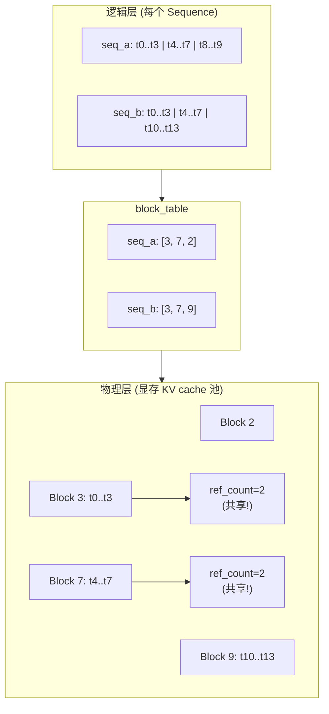
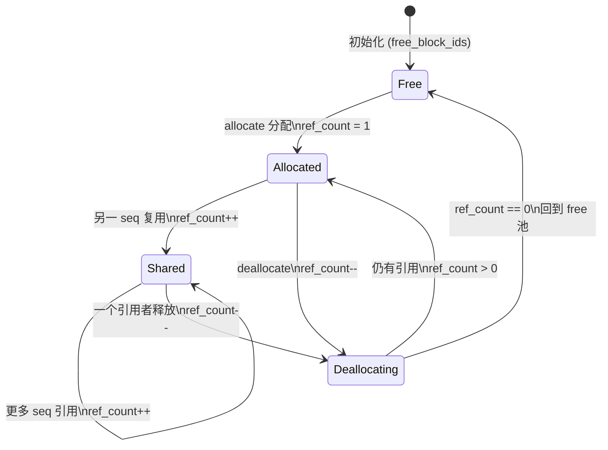
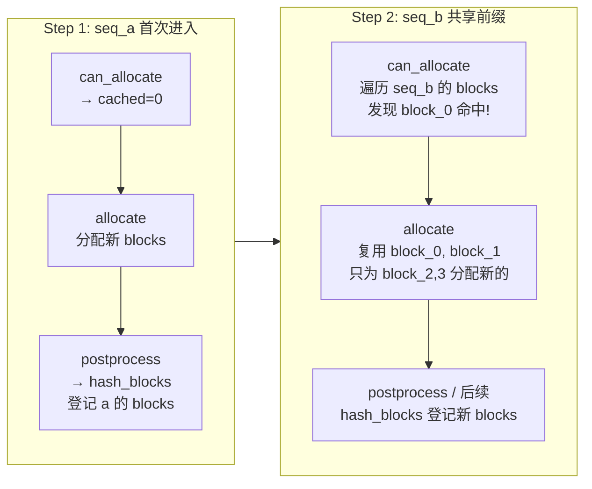
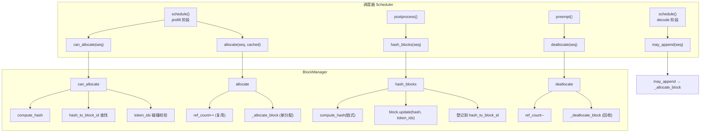

<h1 class="text-4xl font-bold!">第 4 课</h1>
<h2 class="text-2xl mt-4 font-normal opacity-80">BlockManager 与 Prefix Caching</h2>

<div class="mt-12 text-sm opacity-60">
nano-vllm 实战课程 · 源码拆解 LLM 推理引擎
</div>

<!-- L04 封面，介绍 BlockManager 与 Prefix Caching 主题 -->

---
layout: default
---

# 本课在课程中的位置

<div style="height: 50px;"></div>
<div class="mt-4 text-sm max-w-2xl mx-auto">

<div class="flex justify-center gap-1 mb-2">
  <div class="bg-gray-700 text-gray-200 rounded px-3 py-1.5 w-28 text-center">L01<br/><span class="text-xs text-gray-400">generate→step</span></div>
  <div class="flex items-center text-gray-400 text-lg">→</div>
  <div class="bg-gray-700 text-gray-200 rounded px-3 py-1.5 w-28 text-center">L02<br/><span class="text-xs text-gray-400">Sequence</span></div>
  <div class="flex items-center text-gray-400 text-lg">→</div>
  <div class="bg-gray-700 text-gray-200 rounded px-3 py-1.5 w-28 text-center">L03<br/><span class="text-xs text-gray-400">调度器</span></div>
  <div class="flex items-center text-gray-400 text-lg">→</div>
  <div class="bg-blue-600 text-white rounded px-3 py-1.5 font-bold w-28 text-center">L04<br/><span class="text-xs font-normal opacity-80">Block 管理</span></div>
</div>

<div class="flex justify-center mb-1">
  <div class="text-gray-400 text-lg">↓</div>
</div>

<div class="flex justify-center gap-1">
  <div class="bg-gray-700 text-gray-200 rounded px-3 py-1.5 w-28 text-center">L05<br/><span class="text-xs text-gray-400">Prefill</span></div>
  <div class="flex items-center text-gray-400 text-lg">→</div>
  <div class="bg-gray-700 text-gray-200 rounded px-3 py-1.5 w-28 text-center">L06<br/><span class="text-xs text-gray-400">Decode</span></div>
  <div class="flex items-center text-gray-400 text-lg">→</div>
  <div class="bg-gray-700 text-gray-200 rounded px-3 py-1.5 w-28 text-center">L07<br/><span class="text-xs text-gray-400">Attention</span></div>
  <div class="flex items-center text-gray-400 text-lg">→</div>
  <div class="bg-gray-700 text-gray-200 rounded px-3 py-1.5 w-28 text-center">L08<br/><span class="text-xs text-gray-400">优化全景</span></div>
</div>

</div>

<div v-click class="mt-4 p-3 bg-blue-500/10 border-l-3 border-blue-500 rounded-r text-sm">
  L03 调度器调用 <code>can_allocate</code>、<code>may_append</code>、<code>deallocate</code>。L04 打开这些方法背后的管理器——<strong>BlockManager</strong>：显存分页 + 前缀缓存。
</div>

<!-- 参考 slides.03.md 的课程路线图，定位 L04 在完整课程中的位置 -->

---
layout: default
---

# 1.1 课时安排

BlockManager 就像操作系统课里的内存分页管理器，把显存切成固定大小的 block 来分配和回收。

| 阶段 | 时长 | 内容要点 |
|------|------|----------|
| 概念回顾 | 10 min | "注意力需要所有历史 KV"→ 显存占用大 → 需要精细管理 |
| 代码走读 | 40 min | free/used 池、ref_count、can_allocate、哈希链、prefix cache 闭环 |
| 脚本演示 | 10 min | L04_block_manager.py 的 4 个 section |
| 动手练习 | 15 min | 构造哈希链 + 手算 prefix cache 命中 |
| 答疑讨论 | 15 min | 为什么哈希链而不是直接比较 token_ids、碰撞处理 |

<!-- 课程时间安排，参考 block_manager.py 整体结构 -->

---
layout: default
---

# 1.2 学习目标

<div class="mt-6 space-y-4">

<div v-click="1" class="flex items-start gap-3 p-3 bg-blue-500/10 border-l-3 border-blue-500 rounded-r">
  <span class="text-blue-400 font-bold">Q1</span>
  <span><code>Sequence.block_table</code> 在「逻辑序列」与「物理 KV cache」之间起什么桥接作用？</span>
</div>

<div v-click="2" class="flex items-start gap-3 p-3 bg-blue-500/10 border-l-3 border-blue-500 rounded-r">
  <span class="text-blue-400 font-bold">Q2</span>
  <span>prefix caching 的命中条件是什么？它如何减少新分配的 block 数量？链式哈希为什么是 <code>hash(curr_block, prefix=prev_hash)</code>？</span>
</div>

<div v-click="3" class="flex items-start gap-3 p-3 bg-blue-500/10 border-l-3 border-blue-500 rounded-r">
  <span class="text-blue-400 font-bold">Q3</span>
  <span><code>ref_count</code> 的意义是什么？为什么同一个 block 可以被多个 seq 复用而不会冲突？</span>
</div>

</div>

<!-- 三个核心问题引导：block_table 桥接、prefix caching 命中、ref_count 共享 -->

---
layout: section
---

# 2. 原理说明
## KV Cache 分页管理与前缀复用

<!-- 进入原理说明部分，类比 OS 分页管理 -->

---
layout: default
---

# 2.1 KV Cache 池 ≈ 虚拟内存分页

<div class="flex justify-center">



</div>

<div v-click class="mt-3 p-3 bg-green-500/10 border-l-3 border-green-500 rounded-r text-sm">
  两条 seq 的前 8 个 token 共享相同前缀 → 共享 Block 3 和 Block 7。BlockManager 通过引用计数追踪每个 block 被多少 seq 引用。
</div>

<!-- 对应 block_manager.py 的 Block 类 + block_table 映射，类比虚拟内存分页 -->

---
layout: default
---

# 2.2 ref_count 与 Prefix Caching ≈ 共享只读段

| OS 概念 | nano-vllm 对应 |
|---------|---------------|
| 共享库的只读页面 | 共享的 KV cache block |
| 页面引用计数 | `Block.ref_count` |
| 写时复制（COW） | 不适用 — KV cache block **写入后永不修改** |
| 内容寻址 | `hash_to_block_id` 字典 |

<div v-click class="mt-4 text-sm">

**为什么 KV cache block 可以安全共享？**
- 一个 block 一旦被填满并写入 KV cache，其内容**永不改变**
- 新 seq 只需"引用"它，不需要复制
- `ref_count` 确保 block 只有在所有引用者都释放后才回收

</div>

<div v-click class="mt-3 p-3 bg-yellow-500/10 border-l-3 border-yellow-500 rounded-r text-sm">
  <strong>链式哈希</strong>：<code>hash(block_i) = hash(token_ids_i, prefix=hash(block_{i-1}))</code>。前缀作为种子链入，确保「相同前缀、相同当前 block」→ 相同哈希值。
</div>

<!-- 对应 block_manager.py 的 ref_count 机制，类比 OS 共享只读段 -->

---
layout: section
---

# 3. 代码走读
## BlockManager 的数据结构与核心方法

<!-- 进入代码走读部分，打开 block_manager.py -->

---
layout: default
---

# 3.1 全局池与映射表

<SourceCode file="nanovllm/engine/block_manager.py" lines="26-34" />

```python
class BlockManager:
    def __init__(self, num_blocks: int, block_size: int):
        self.block_size = block_size
        self.blocks = [Block(i) for i in range(num_blocks)]
        self.free_block_ids: deque[int] = deque(range(num_blocks))
        self.used_block_ids: set[int] = set()
        self.hash_to_block_id: dict[int, int] = {}   # 哈希 → block_id
```

<div class="mt-4 grid grid-cols-3 gap-3 text-sm">
<div class="bg-blue-500/10 p-3 rounded text-center">
  <strong>blocks</strong><br/>所有 block 元数据数组<br/>通过 block_id 索引
</div>
<div class="bg-green-500/10 p-3 rounded text-center">
  <strong>free/used 集合</strong><br/>空闲/已用 block 追踪<br/>allocate 从 free 取
</div>
<div class="bg-purple-500/10 p-3 rounded text-center">
  <strong>hash_to_block_id</strong><br/>内容寻址字典<br/>prefix cache 的索引
</div>
</div>

<!-- 对应 block_manager.py L26-34，三个全局数据结构：blocks、free/used 集合、hash_to_block_id -->

---
layout: default
---

# 3.2 Block 元数据：ref_count 与 token_ids

<SourceCode file="nanovllm/engine/block_manager.py" lines="8-23" />

```python
class Block:
    def __init__(self, block_id):
        self.block_id = block_id
        self.ref_count: int = 0
        self.hash: int = -1
        self.token_ids: list[int] = []    # 二次校验，防哈希碰撞
```

<div v-click class="mt-3 text-sm">
  <strong>三个关键字段</strong>：
  <ul class="mt-1 space-y-1">
    <li><code>ref_count</code>：引用计数，0 时 block 可回收</li>
    <li><code>hash</code>：链式哈希值，用于 <code>hash_to_block_id</code> 快速查找</li>
    <li><code>token_ids</code>：完整 token 序列——哈希碰撞时做全等校验</li>
  </ul>
</div>

<!-- 对应 block_manager.py L8-23，Block 类的三个核心字段：ref_count、hash、token_ids -->

---
layout: default
---


# Block 的完整生命周期

<div class="flex justify-center">



</div>

<div class="mt-3 text-sm">
  <strong>两条核心规则</strong>：
  <ul class="mt-1 space-y-1">
    <li><strong>共享不复制</strong>：ref_count 递增时不做 KV 数据拷贝——指针语义</li>
    <li><strong>延迟回收</strong>：block 只有 ref_count 归零后才回到 free 池——确保正在使用该 block 的 seq 不会读到被覆写的数据</li>
  </ul>
</div>

<div v-click class="mt-3 p-3 bg-yellow-500/10 border-l-3 border-yellow-500 rounded-r text-sm">
  <strong>OS 类比</strong>：ref_count &gt; 1 的 block ≈ 多个进程的共享只读页面（mmap MAP_SHARED）。当所有进程都 unmap 后物理页面才释放。nano-vllm 的 <code>hash_to_block_id</code> 则相当于文件系统 inode——即使所有引用者都释放了 block，哈希索引仍保留，可以按内容重新找回。
</div>

<!-- Block 状态转移图：Free → Allocated → Shared → Deallocating → Free -->

---

# 链式哈希的计算

<SourceCode file="nanovllm/engine/block_manager.py" lines="35-41" />

```python
@classmethod
def compute_hash(cls, token_ids: list[int], prefix: int = -1):
    h = xxhash.xxh64()
    if prefix != -1:
        h.update(prefix.to_bytes(8, "little"))
    h.update(np.array(token_ids).tobytes())
    return h.intdigest()
```

<div v-click class="mt-3 text-sm">
  <strong>举例</strong>：block_size=4，token_ids=[1,2,3,4]，prefix=-1 → <code>h1 = hash([1,2,3,4])</code>；下一块 token_ids=[5,6,7,8]，prefix=h1 → <code>h2 = hash(prefix=h1, [5,6,7,8])</code>。h2 ≠ hash([5,6,7,8]) 直接算的结果——因为前缀参与计算。
</div>

<!-- 对应 block_manager.py L35-41，compute_hash 的链式哈希实现，使用 xxhash -->

---
layout: default
---


# 链式哈希的具体示例

<div class="text-sm">

假设 `block_size = 4`，一条请求的 token 序列为 [1,2,3,4, 5,6,7,8, 9,10,11,12]：

| Block | token_ids | prefix | 计算过程 | 结果哈希 |
|-------|-----------|--------|----------|----------|
| block0 | [1,2,3,4] | -1 | `xxhash([1,2,3,4])` | `h0 = 0xA3F1...` |
| block1 | [5,6,7,8] | h0 | `xxhash(seed=h0, [5,6,7,8])` | `h1 = 0x7B2E...` |
| block2 | [9,10,11,12] | h1 | `xxhash(seed=h1, [9,10,11,12])` | `h2 = 0xC4D9...` |

</div>

```python
h0 = BlockManager.compute_hash([1,2,3,4], prefix=-1)
h1 = BlockManager.compute_hash([5,6,7,8], prefix=h0)
h2 = BlockManager.compute_hash([9,10,11,12], prefix=h1)

# 如果另一条 seq 的 block0 内容相同 → h0 相同 → 可命中
# 如果 block1 内容也相同，且前缀 h0 相同 → h1 相同 → 继续命中
# 如果 block2 内容不同 → h2 必然不同 → 不命中，链中断
```

<div v-click class="mt-3 p-3 bg-blue-500/10 border-l-3 border-blue-500 rounded-r text-sm">
  <strong>链式 vs 独立哈希</strong>：如果每个 block 独立哈希（不考虑前缀），那么内容为 [9,10,11,12] 的 block 无论在位置 0 还是位置 2 哈希值都一样。<br/>
  链式保证 <strong>位置语义</strong>：同一个内容出现在不同位置 → 前缀不同 → 哈希值不同。这是 prefix cache 正确性的关键——只有「从头开始的连续前缀」才能命中。
</div>

<!-- 链式哈希的具体数值示例，展示链式与独立哈希的区别 -->

---

# 3.3 can_allocate：逐块检查前缀命中

<SourceCode file="nanovllm/engine/block_manager.py" lines="58-73" />

```python
def can_allocate(self, seq: Sequence) -> int:
    h = -1
    num_cached_blocks = 0
    num_new_blocks = seq.num_blocks
    for i in range(seq.num_blocks - 1):
        token_ids = seq.block(i)
        h = self.compute_hash(token_ids, h)
        block_id = self.hash_to_block_id.get(h, -1)
        if block_id == -1 or self.blocks[block_id].token_ids != token_ids:
            break
        num_cached_blocks += 1
        if block_id in self.used_block_ids:
            num_new_blocks -= 1
    if len(self.free_block_ids) < num_new_blocks:
        return -1
    return num_cached_blocks
```

<!-- 对应 block_manager.py L58-73，can_allocate 逐块检查前缀命中 -->

---
layout: default
---


# can_allocate 逐行走读（上）：链式遍历

<SourceCode file="nanovllm/engine/block_manager.py" lines="58-73" />

```python {all|2-3|4|5-7|8-9|10}
def can_allocate(self, seq: Sequence) -> int:
    h = -1
    num_cached_blocks = 0
    for i in range(seq.num_blocks - 1):            # ① 跳过最后一个不完整 block
        token_ids = seq.block(i)                     # ② 取第 i 块的 token
        h = self.compute_hash(token_ids, h)           # ③ 链式哈希计算
        block_id = self.hash_to_block_id.get(h, -1)   # ④ 查全局哈希表
        if block_id == -1 or self.blocks[block_id].token_ids != token_ids:
            break                                       # ⑤ 未命中 / 碰撞 → 中断
        num_cached_blocks += 1                          # ⑥ 命中计数
```

<div class="mt-3 text-sm">

  <div class="grid grid-cols-2 gap-2">
  <div class="bg-blue-500/10 p-2 rounded">
    <strong>① h = -1</strong> 首块无前缀<br/>
    <strong>② seq.block(i)</strong> 从 token_ids 中切片取第 i 个 block 的 token
  </div>
  <div class="bg-blue-500/10 p-2 rounded">
    <strong>③ 链式计算</strong> 前一块的哈希作为 seed 参与当前块的哈希计算<br/>
    <strong>④ hash_to_block_id</strong> 内容寻址——O(1) 查找
  </div>
  </div>
  <div class="mt-2 p-2 bg-yellow-500/10 border-l-3 border-yellow-500 rounded">
    <strong>⑤ break 条件</strong>：哈希未命中（全局字典不含该哈希）或哈希碰撞但 token_ids 不匹配。<br/>
    break 之后不再检查后面的 block——因为「链断了」，后续 block 即使内容匹配也应因前缀不同而不同，不应共享。
  </div>
  <div class="mt-2 p-2 bg-green-500/10 border-l-3 border-green-500 rounded">
    <strong>⑥ 命中计数</strong>：<code>num_cached_blocks += 1</code>。哈希命中且 token_ids 全等校验通过后，该 block 可被复用。累加器同时用于 <code>allocate</code> 的两种分配路径判断。
  </div>
</div>

<!-- 对应 block_manager.py L58-67，链式遍历逻辑：计算哈希 → 查表 → 碰撞校验 → break -->

---

# can_allocate 逐行走读（下）：空闲检查与返回值

```python {all|2-3|5-6|7}
        ...
        if block_id in self.used_block_ids:       # ① 命中的 block 是否在用？
            num_new_blocks -= 1                    # ② 是 → 不需新分配
        # 继续循环直到 break 或遍历完
    if len(self.free_block_ids) < num_new_blocks:
        return -1                                  # ③ 空闲不够 → scheduler trigger preempt
    return num_cached_blocks                       # ④ 返回命中数
```

<div class="mt-3 grid grid-cols-2 gap-3 text-sm">
<div class="bg-green-500/10 border-l-3 border-green-500 p-3 rounded">
  <strong>①② used_block_ids 检查</strong><br/>
  命中的 block 如果仍被使用（ref_count &gt; 0），原地共享，<code>num_new_blocks</code> 减 1。<br/>
  如果已被释放（从 used 移除但哈希映射还在），需要从 free 池<strong>重新取出</strong>给当前 seq——但 KV 数据不必重算。
</div>
<div class="bg-purple-500/10 border-l-3 border-purple-500 p-3 rounded">
  <strong>③④ 返回 -1 与命中数</strong><br/>
  ③ 空闲不够时返回 -1，调度器触发 preempt 腾空间后重试。<br/>
  ④ 返回 <code>num_cached_blocks</code>——<code>allocate</code> 据此决定复用多少 block。
</div>
</div>

<!-- 对应 block_manager.py L68-73，空闲检查与返回值，-1 触发 preempt -->

---

# can_allocate 命中场景示例

<div class="text-sm">

两条 seq 共享前 8 个 token，`block_size = 4`：

```text
seq_a: [A,B,C,D, E,F,G,H, I,J]                 (10 tokens → 3 blocks)
seq_b: [A,B,C,D, E,F,G,H, K,L,M,N]             (14 tokens → 4 blocks)
         block_0    block_1    block_2/3
```

</div>

```python
# 假设 seq_a 已完成前两块（完整 block）的 hash_blocks 登记
# block_0 的哈希 h0 和 block_1 的哈希 h1 已写入 hash_to_block_id

# seq_b 进入 can_allocate 的逐块检查：
# i=0: token=[A,B,C,D], h=hash(A,B,C,D, prefix=-1)=h0
#      → hash_to_block_id[h0]=block_0, token_ids 匹配 → num_cached_blocks=1
#      → block_0 in used_block_ids → num_new_blocks=3
# i=1: token=[E,F,G,H], h=hash(E,F,G,H, prefix=h0)=h1
#      → hash_to_block_id[h1]=block_1, token_ids 匹配 → num_cached_blocks=2
#      → block_1 in used_block_ids → num_new_blocks=2
# i=2: token=[K,L,M,N], h=hash(K,L,M,N, prefix=h1)=??
#      → hash_to_block_id 未命中 → break
# → 返回 num_cached_blocks = 2
```

<div v-click class="mt-3 grid grid-cols-2 gap-3 text-sm">
<div class="bg-green-500/10 border-l-3 border-green-500 p-3 rounded">
  <strong>分配结果</strong><br/>
  block_table = [block_0, block_1, new_block_0, new_block_1]<br/>
  block_0.ref_count=2, block_1.ref_count=2<br/>
  新分配 block 的 ref_count=1
</div>
<div class="bg-blue-500/10 border-l-3 border-blue-500 p-3 rounded">
  <strong>节省</strong><br/>
  相比从头分配 4 个新 block：<br/>
   • 节省 2 个 block 的显存（8×hidden KV 空间）<br/>
   • 节省 2 个 block 的注意力前向计算<br/>
   • block_table 共享 + ref_count 递增 → O(1)
</div>
</div>

<!-- can_allocate 的完整命中场景示例，展示 num_cached_blocks 和 num_new_blocks 的计算 -->

---

# 3.4 allocate：复用命中的 block + 分配新的

<SourceCode file="nanovllm/engine/block_manager.py" lines="75-92" />

```python
def allocate(self, seq: Sequence, num_cached_blocks: int):
    assert not seq.block_table
    h = -1
    for i in range(num_cached_blocks):
        token_ids = seq.block(i)
        h = self.compute_hash(token_ids, h)
        block_id = self.hash_to_block_id[h]
        block = self.blocks[block_id]
        if block_id in self.used_block_ids:
            block.ref_count += 1
        else:
            block.ref_count = 1
            self.free_block_ids.remove(block_id)
            self.used_block_ids.add(block_id)
        seq.block_table.append(block_id)
    for i in range(num_cached_blocks, seq.num_blocks):
        seq.block_table.append(self._allocate_block())
    seq.num_cached_tokens = num_cached_blocks * self.block_size
```

<div v-click class="mt-2 text-sm">
  💡 引用计数规则：cached block → ref_count+1（共享）；新 block → ref_count=1（独占）。
</div>

<!-- 对应 block_manager.py L75-92，allocate 的两种路径：复用 cached block + 分配新 block -->

---
layout: default
---


# allocate 的两种分配路径对比

```python
def allocate(self, seq: Sequence, num_cached_blocks: int):
    # 路径 A：复用 cached blocks
    for i in range(num_cached_blocks):
        ...
        self.blocks[block_id].ref_count += 1      # 共享，ref_count++

    # 路径 B：从 free 池分配新 block
    for i in range(num_cached_blocks, seq.num_blocks):
        seq.block_table.append(self._allocate_block())  # 独占，ref_count=1
```

<div class="mt-4 text-sm">

| 方面 | 路径 A：复用 cached block | 路径 B：分配新 block |
|------|-------------------------|---------------------|
| 触发条件 | 命中 hash_to_block_id | 未命中或链中断 |
| ref_count | 递增（共享） | 设为 1（独占） |
| KV 计算 | 不需要——值已存在 | 需要——模型前向计算 |
| used_block_ids | 若 block 不在 used 中，先移入 | 由 _allocate_block 加入 |
| free_block_ids | 若 block 在 free 中，先移除 | popleft 弹出 |

</div>

<div v-click class="mt-3 p-3 bg-blue-500/10 border-l-3 border-blue-500 rounded-r text-sm">
  <strong>路径 A 的两种子场景</strong><br/>
  • block 在 used 中（ref_count &gt; 0）：直接 ref_count++，无需改动 free/used 集合<br/>
  • block 在 free 中（ref_count == 0，但哈希映射还在）：从 free 取出放回 used，ref_count = 1<br/>
  两种子场景的共性：不重新计算 KV cache，不重新分配显存——所以 prefix cache 的核心收益在于节省计算而非节省显存。
</div>

<!-- allocate 两种路径的详细对比表，包括 ref_count 和 KV 计算的区别 -->

---

# 3.5 hash_blocks：将完成的 block 登记到哈希表

<SourceCode file="nanovllm/engine/block_manager.py" lines="110-120" />

```python
def hash_blocks(self, seq: Sequence):
    start = seq.num_cached_tokens // self.block_size
    end = (seq.num_cached_tokens + seq.num_scheduled_tokens) // self.block_size
    if start == end: return
    h = self.blocks[seq.block_table[start - 1]].hash if start > 0 else -1
    for i in range(start, end):
        block = self.blocks[seq.block_table[i]]
        token_ids = seq.block(i)
        h = self.compute_hash(token_ids, h)
        block.update(h, token_ids)
        self.hash_to_block_id[h] = block.block_id
```

<div v-click class="mt-3 text-sm">
  🔑 <strong>只登记完整 block</strong>：最后一个不完整 block 不参与前缀复用——因为它的 token 还不全，哈希值不代表最终内容。这也是为什么 <code>postprocess</code> 在每轮之后调用 <code>hash_blocks</code>。
</div>

<!-- 对应 block_manager.py L110-120，hash_blocks 只登记完整 block 到全局哈希表 -->

---
layout: default
---


# hash_blocks：为什么只登记完整 block？

<SourceCode file="nanovllm/engine/block_manager.py" lines="110-120" />

```python {all|4-5|6-11}
def hash_blocks(self, seq: Sequence):
    start = seq.num_cached_tokens // self.block_size
    end = (seq.num_cached_tokens + seq.num_scheduled_tokens) // self.block_size
    if start == end: return
    h = self.blocks[seq.block_table[start - 1]].hash if start > 0 else -1
    for i in range(start, end):
        block = self.blocks[seq.block_table[i]]
        token_ids = seq.block(i)
        h = self.compute_hash(token_ids, h)
        block.update(h, token_ids)
        self.hash_to_block_id[h] = block.block_id
```

<div class="mt-3 text-sm">

**为什么最后一个不完整 block 不登记？**

</div>

```text
举例：block_size = 4
seq_a = [1,2,3,4, 5,6,7]       → block0 完整，block1 不完整
seq_b = [1,2,3,4, 5,6,7,8]     → 前 7 个与 seq_a 相同，但第 8 个不同

如果登记了 block1 = hash([5,6,7])——seq_b 的 block1 = [5,6,7,8]
内容不同，即使哈希链计算出来也会因 token_ids != 而跳过。
更严重：如果 block1 被错误登记，另一个 seq 的 block1 命中后将
读到 [5,6,7] 的 KV cache，但实际需要 [5,6,7,8]——导致推理结果错误。
```

<div v-click class="mt-3 p-3 bg-yellow-500/10 border-l-3 border-yellow-500 rounded-r text-sm">
  <strong>安全性</strong>：不完整 block 的 KV cache 只有部分 token——如果被误认为完整 block 并复用，解码阶段会读到垃圾数据。hash_blocks 只在 postprocess 中调用，随着解码推进，越来越多的 block 变完整并被登记。<code>start</code>/<code>end</code> 范围通过 <code>num_cached_tokens</code> 与 <code>num_scheduled_tokens</code> 精确界定本轮新填满的 block。
</div>

<!-- 不完整 block 不登记的安全性原因：防止读到垃圾 KV 数据 -->

---

# 完整闭环：从分配到回写

<div class="flex justify-center">



</div>

<!-- 从分配 (can_allocate+allocate) 到回写 (hash_blocks) 的完整流程 mermaid 图 -->

---
layout: default
---

# deallocate：引用计数的递减与回收

<SourceCode file="nanovllm/engine/block_manager.py" lines="94-101" />

```python {all|2-3|4|5-6|7-8}
def deallocate(self, seq: Sequence):
    for block_id in reversed(seq.block_table):
        block = self.blocks[block_id]
        block.ref_count -= 1
        if block.ref_count == 0:
            self._deallocate_block(block_id)
    seq.num_cached_tokens = 0
    seq.block_table.clear()
```

<div class="mt-3 text-sm">

  <div v-click="1" class="p-3 bg-blue-500/10 border-l-3 border-blue-500 rounded mb-2">
    <strong>为什么逆序遍历 block_table？</strong><br/>
    越靠后的 block 共享可能性越低，逆序使 ref_count 更早归零。如果正序先处理共享 block（ref_count=2 → 1），不会触发回收，但逻辑同样正确。
  </div>
  <div v-click="2" class="p-3 bg-blue-500/10 border-l-3 border-blue-500 rounded mb-2">
    <strong>ref_count == 0 才真正回收</strong><br/>
    <code>_deallocate_block</code> 把 block_id 从 used 移回 free 池。注意：<strong>不删除 hash_to_block_id</strong>——这是 prefix cache 持久化的关键：哈希索引还在，block 的物理内容仍在。
  </div>
  <div v-click="3" class="p-3 bg-green-500/10 border-l-3 border-green-500 rounded">
    <strong>示例</strong>：共享 block 被两个 seq 引用（ref_count=2）。seq_a deallocate → ref_count=1（未释放）。seq_b deallocate → ref_count=0 → 回到 free 池。后续新 seq 如果哈希链匹配，仍可从 hash_to_block_id 找到它——block 的 KV cache 数据不需要重新计算。
  </div>
</div>

<!-- 对应 block_manager.py L94-101，deallocate 逆序遍历 + ref_count 递减回收 -->

---

# BlockManager 方法调用链总结

<div class="flex justify-center">



</div>

<div class="mt-2 grid grid-cols-2 gap-2 text-xs">
<div class="bg-blue-500/10 p-2 rounded text-center">
  BlockManager 的 4 个主入口方法
</div>
<div class="bg-green-500/10 p-2 rounded text-center">
  全部通过 Scheduler 的 3 个触发点串联
</div>
</div>

<!-- BlockManager 四个主入口方法与 Scheduler 三个触发点的完整调用链 mermaid 图 -->

---
layout: section
---

# 4. L04 验证脚本
## L04_block_manager.py 走读

<!-- 进入 L04_block_manager.py 验证脚本走读 -->

---
layout: default
---

# L04_block_manager.py：4 个验证 section

<div class="grid grid-cols-2 gap-4 mt-4">
<div class="bg-blue-500/10 p-4 rounded">
  <strong>§1: 哈希链构造</strong><br/>
  验证 <code>compute_hash</code> 的链式特性<br/>
  断言：链式哈希 ≠ 直接哈希<br/>
  断言：相同输入 → 相同哈希
</div>
<div class="bg-green-500/10 p-4 rounded">
  <strong>§2: can_allocate 与命中</strong><br/>
  创建 seq_a (10 tokens)，hash_blocks<br/>
  创建 seq_b (12 tokens，前 8 共享)<br/>
  断言：cached_b == 2，block_table 前 2 项相同
</div>
<div class="bg-purple-500/10 p-4 rounded">
  <strong>§3: 只登记完整 block</strong><br/>
  9-token seq 分两轮 prefill<br/>
  断言：第 1 轮后 hash_count=1<br/>
  第 2 轮后 hash_count=2
</div>
<div class="bg-yellow-500/10 p-4 rounded">
  <strong>§4: 引用计数</strong><br/>
  seq_a 2 blocks, seq_b 共享前 2 个<br/>
  断言：共享 block ref_count=2<br/>
  deallocate 后 ref_count=1
</div>
</div>

<!-- L04_block_manager.py 的四个验证 section 简介 -->

---
layout: default
---

# §1-2：哈希链 + can_allocate

```python
# §1: 构造哈希链
from nanovllm.engine.block_manager import BlockManager
h0 = BlockManager.compute_hash([1,2,3,4], prefix=-1)
h1_chain = BlockManager.compute_hash([5,6,7,8], prefix=h0)
h1_direct = BlockManager.compute_hash([5,6,7,8], prefix=-1)
assert h1_chain != h1_direct  # 链式哈希 ≠ 直接哈希

# §2: can_allocate 检查命中
# 预分配 seq_a (10 tokens, block_size=4)
# hash_blocks → 登记 block0([1,2,3,4]) 和 block1([5,6,7,8])
# 分配 seq_b (12 tokens, 前 8 个与 seq_a 相同)
cached_b = bm.can_allocate(seq_b)
assert cached_b == 2          # 前两块命中
bm.allocate(seq_b, cached_b)
assert seq_b.block_table[:2] == seq_a.block_table[:2]  # 共享
assert bm.blocks[0].ref_count == 2                     # 两个引用
```

<!-- §1 哈希链构造 + §2 can_allocate 命中的代码示例和断言 -->

---
layout: default
---

# 4.1 课堂练习

```python
# 练习 1: 构造哈希链
from nanovllm.engine.block_manager import BlockManager
h0 = BlockManager.compute_hash([1,2,3,4], -1)
h1 = BlockManager.compute_hash([5,6,7,8], h0)
print(f"链式哈希: h0={h0}, h1={h1}")

# 练习 2: 手算 prefix cache 命中 (block_size=4)
# seq_a: [1,2,3,4, 5,6,7,8, 9,10]  → 2 完整 block 登记
# seq_b: [1,2,3,4, 5,6,7,8, 11,12,13,14]  → 前两块共享
#
# 手算: num_cached_blocks = 2
#       new_blocks_needed = 4 - 2 = 2
#       seq_b.num_cached_tokens = 2 * 4 = 8
```

<div v-click class="mt-3 p-3 bg-green-500/10 border-l-3 border-green-500 rounded-r text-sm">
  📍 验收：最后一个不完整 block（[9,10]）不参与 hash——所以 seq_a 只登记 2 个 block，seq_b 的前两块可以命中。
</div>

<!-- 课堂练习：构造哈希链和手算 prefix cache 命中 -->

---
layout: default
---

# 4.2 课后自测题

<SelfTest
  id="l04-q1"
  type="text"
  question="1. 链式哈希为什么是 compute_hash(current_block, prefix=prev_hash) 而不是对每个 block 单独哈希后拼接？哈希碰撞时，代码在哪个环节兜底？"
  answer="<strong>链式 vs 拼接</strong>：链式保证「相同前缀 + 相同内容」→ 相同哈希；单独哈希拼接等价于「只看内容不看顺序」。前缀决定了位置——block[0] 的哈希和 block[2] 的哈希即使内容相同，链式哈希值也不同（因为前缀不同）。<br><strong>碰撞兜底</strong>：在 <code>can_allocate</code> 中，即使 <code>hash_to_block_id</code> 命中，还要检查 <code>self.blocks[block_id].token_ids == token_ids</code>——逐 token 全等校验。只有在哈希值和 token_ids 都匹配时才计数。"
/>

<SelfTest
  id="l04-q2"
  type="text"
  question="2. hash_blocks 只写回完整 block。如果一条请求只有 3 个 token（不满一个 block），其 KV cache 就永远不会被 prefix cache 复用。这在什么场景下影响最大？"
  answer="<strong>影响最大的场景</strong>：系统级别的 prompt 前缀复用。例如所有请求共享一个 100-token 的 system prompt，只有最后几个 token 落在不完整 block 中。前几个完整 block 可以被复用，但最后一个不完整 block 每次都要重新计算。<br><strong>系统 prompt 场景</strong>：如果 system prompt 长度恰好多出几个 token 不满一个 block，这些 token 的 KV cache 浪费了——每次新请求都要重算最后几个 token。一个缓解方式是把 system prompt 截断/补齐到 block 边界。"
/>

<!-- 课后自测题 Q1-Q2：链式哈希的意义和完整 block 登记的边界情况 -->

---
layout: default
---

# 课后自测题（续）

<SelfTest
  id="l04-q3"
  type="text"
  question="3. can_allocate 中，对于已命中但不在 used_block_ids 中的 block 不扣减 num_new_blocks。这个 block 处于什么状态？何时会出现这种状态？"
  answer="<strong>状态</strong>：block 在 <code>hash_to_block_id</code> 中有记录（曾经被填写过），但不在 <code>used_block_ids</code> 中——说明它已经被 <code>deallocate</code> 释放了。<br><strong>何时出现</strong>：一个 seq 完成了前缀写回（hash_blocks），然后被 preempt（deallocate）。block 回到 free 池，但哈希映射还在。后续 seq 的 <code>can_allocate</code> 可以在 <code>hash_to_block_id</code> 中找到它。如果这个 block 仍在 free 池中，可以重新分配给新 seq 使用（不必重新计算 KV）。这是 prefix cache 的威力——即使原 seq 已经结束，已计算的 KV block 仍可被后续请求复用。"
/>

<!-- 课后自测题 Q3：已命中但不在 used_block_ids 中的 block 状态分析 -->

---
layout: center
---

# 🎉 第 4 课完成

<div class="mt-6 p-3 bg-blue-500/10 border-l-3 border-blue-500 rounded-r text-lg">
  掌握了 BlockManager 的分页管理、引用计数与 Prefix Caching 闭环
</div>

<div class="mt-4 grid grid-cols-4 gap-3 text-sm max-w-2xl mx-auto">
  <div class="bg-blue-500/10 p-3 rounded">✅ 分页管理</div>
  <div class="bg-green-500/10 p-3 rounded">✅ 链式哈希</div>
  <div class="bg-purple-500/10 p-3 rounded">✅ Prefix Cache</div>
  <div class="bg-yellow-500/10 p-3 rounded">✅ ref_count</div>
</div>

<div class="mt-10">
  <a href="#" class="text-blue-400 hover:underline text-lg">下一课：Prefill Batching 与 Context →</a>
</div>

<!-- 第 4 课总结：分页管理、链式哈希、Prefix Cache、ref_count 四个要点 -->
