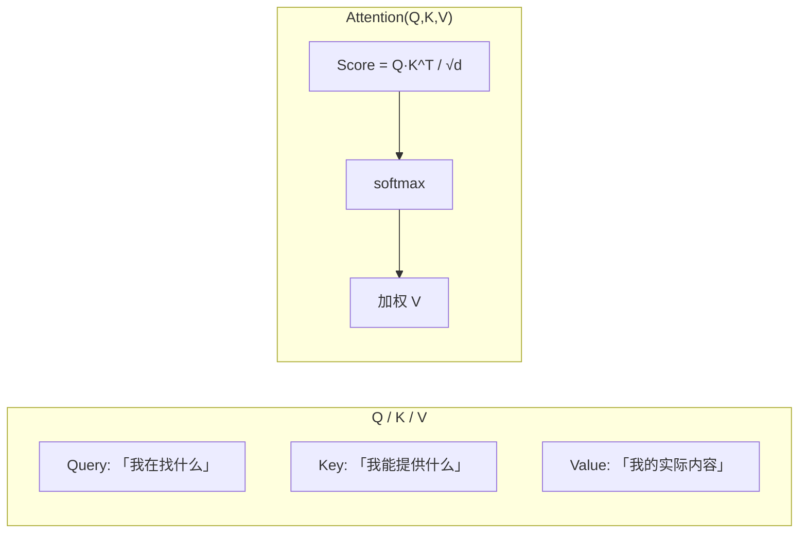
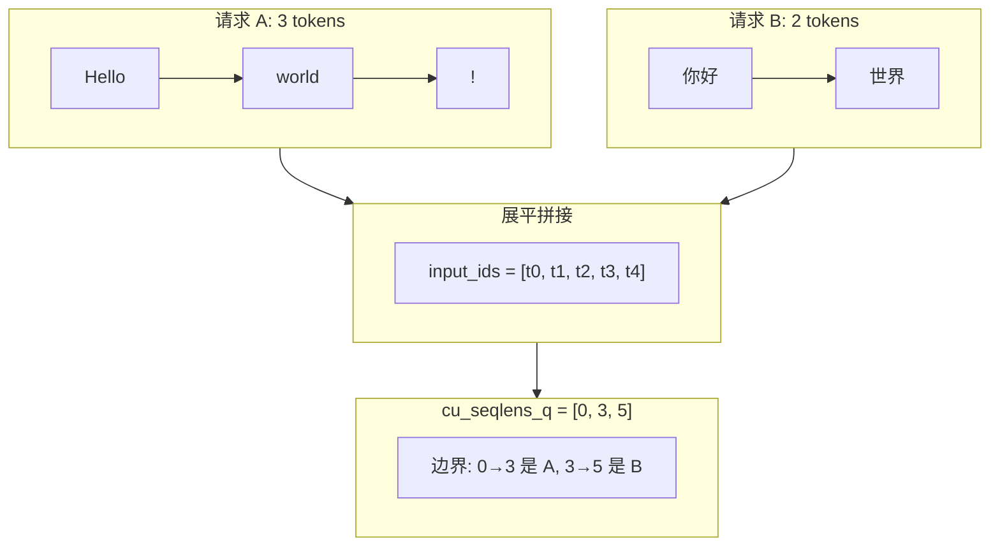
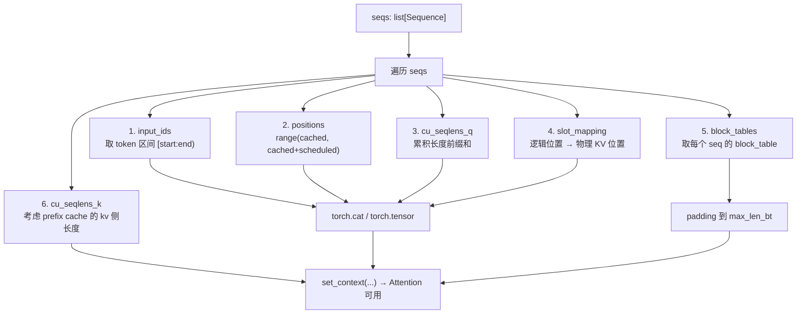
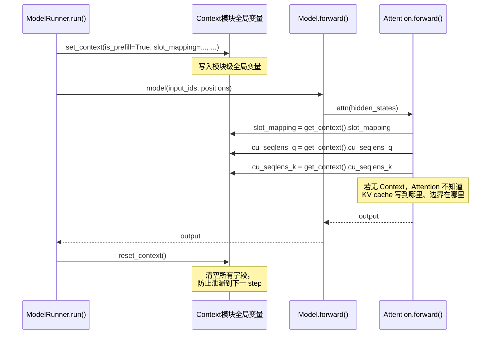

<h1 class="text-4xl font-bold!">第 5 课</h1>
<h2 class="text-2xl mt-4 font-normal opacity-80">Prefill 批构建与 Context 注入</h2>

<div class="mt-12 text-sm opacity-60">
nano-vllm 实战课程 · 源码拆解 LLM 推理引擎
</div>

<!-- 封面页：本课主题为 Prefill 批构建与 Context 注入，属于模型执行层的核心环节。 -->

---
layout: default
---

# 本课在课程中的位置

<div style="height: 50px;"></div>
<div class="mt-4 text-sm max-w-2xl mx-auto">

<div class="flex justify-center gap-1 mb-2">
  <div class="bg-gray-700 text-gray-200 rounded px-3 py-1.5 w-28 text-center">L01<br/><span class="text-xs text-gray-400">generate→step</span></div>
  <div class="flex items-center text-gray-400 text-lg">→</div>
  <div class="bg-gray-700 text-gray-200 rounded px-3 py-1.5 w-28 text-center">L02<br/><span class="text-xs text-gray-400">Sequence</span></div>
  <div class="flex items-center text-gray-400 text-lg">→</div>
  <div class="bg-gray-700 text-gray-200 rounded px-3 py-1.5 w-28 text-center">L03<br/><span class="text-xs text-gray-400">调度器</span></div>
  <div class="flex items-center text-gray-400 text-lg">→</div>
  <div class="bg-gray-700 text-gray-200 rounded px-3 py-1.5 w-28 text-center">L04<br/><span class="text-xs text-gray-400">Block 管理</span></div>
</div>

<div class="flex justify-center mb-1">
  <div class="text-gray-400 text-lg">↓</div>
</div>

<div class="flex justify-center gap-1">
  <div class="bg-blue-600 text-white rounded px-3 py-1.5 font-bold w-28 text-center">L05<br/><span class="text-xs font-normal opacity-80">Prefill</span></div>
  <div class="flex items-center text-gray-400 text-lg">→</div>
  <div class="bg-gray-700 text-gray-200 rounded px-3 py-1.5 w-28 text-center">L06<br/><span class="text-xs text-gray-400">Decode</span></div>
  <div class="flex items-center text-gray-400 text-lg">→</div>
  <div class="bg-gray-700 text-gray-200 rounded px-3 py-1.5 w-28 text-center">L07<br/><span class="text-xs text-gray-400">Attention</span></div>
  <div class="flex items-center text-gray-400 text-lg">→</div>
  <div class="bg-gray-700 text-gray-200 rounded px-3 py-1.5 w-28 text-center">L08<br/><span class="text-xs text-gray-400">优化全景</span></div>
</div>

</div>

<div v-click class="mt-4 p-3 bg-blue-500/10 border-l-3 border-blue-500 rounded-r text-sm">
  L01-L04 覆盖了引擎调度层。L05 进入<strong>模型执行层</strong>：prefill 阶段模型实际"吃进去"的张量长什么样——多个请求被展平拼接成一个大批次。
</div>

<!-- 展示课程路线图，L05 聚焦 Prefill 批构建——模型实际"吃进去"的张量长什么样。 -->

---
layout: default
---

# 1.1 课时安排

prefill 阶段多个请求如何被编码为一批张量送入 Transformer。

| 阶段 | 时长 | 内容要点 |
|------|------|----------|
| 原理铺垫 | 20 min | Self-Attention 直觉（Q/K/V 语义、N² 计算量、变长边界） |
| 代码走读 | 35 min | prepare_prefill: input_ids 展平、cu_seqlens、slot_mapping、block_tables |
| 脚本演示 | 10 min | L05_prefill_batching.py 的 4 个 section |
| 动手练习 | 15 min | 手算 cu_seqlens_q 与 positions |
| 答疑讨论 | 10 min | 为什么是 1D 展平而不是 2D padding？Context 全局注入的 trade-off |

<!-- 本课分为原理铺垫、代码走读、脚本演示和动手练习四个阶段，共 90 分钟。 -->

---
layout: default
---

# 1.2 学习目标

<div class="mt-6 space-y-4">

<div v-click="1" class="flex items-start gap-3 p-3 bg-blue-500/10 border-l-3 border-blue-500 rounded-r">
  <span class="text-blue-400 font-bold">Q1</span>
  <span>prefill 时 <code>input_ids</code> 为什么是 1D 展平张量而不是 2D padding 矩阵？</span>
</div>

<div v-click="2" class="flex items-start gap-3 p-3 bg-blue-500/10 border-l-3 border-blue-500 rounded-r">
  <span class="text-blue-400 font-bold">Q2</span>
  <span><code>cu_seqlens_q</code> 与 <code>cu_seqlens_k</code> 分别代表什么？prefix cache 何时让两者不同？</span>
</div>

<div v-click="3" class="flex items-start gap-3 p-3 bg-blue-500/10 border-l-3 border-blue-500 rounded-r">
  <span class="text-blue-400 font-bold">Q3</span>
  <span><code>slot_mapping</code> 如何告诉 KV cache「这个 token 应该写到哪个位置」？Context 为什么通过模块级全局变量而不是参数传入？</span>
</div>

</div>

<!-- 三个核心学习目标：展平拼接的原因、cu_seqlens_q/k 的语义、slot_mapping 与 Context 的设计。 -->

---
layout: section
---

# 2. 原理说明
## Self-Attention 与变长批处理

<!-- 进入原理铺垫环节：理解 Self-Attention 机制与变长批处理问题。 -->

---
layout: default
---

# 2.1 Self-Attention 为什么需要看所有 token

注意力机制让每个 token "看到"序列中的其他 token：

<div class="flex justify-center">



</div>
<div v-click class="mt-3 text-xs">

- **Q（Query）**：每个 token 问"谁和我相关？"
- **K（Key）**：每个 token 回答"我能提供这些信息"
- **V（Value）**：每个 token 说"我的实际内容是这些"
- 注意力 = 用 Q 和 K 算相似度 → softmax 归一化 → 加权取 V

</div>

<!-- 用 Q/K/V 的比喻解释注意力机制：每个 token 通过 Q 查询、K 匹配、V 加权来融合上下文信息。 -->

---
layout: default
---

# 2.2 为什么 prefill 需要变长边界

多个不等长请求展平拼接时，需要 `cu_seqlens` 标记边界，防止请求 A 的 token 错误地"看到"请求 B：

<div class="flex justify-center">



</div>

<div v-click class="mt-3 p-3 bg-yellow-500/10 border-l-3 border-yellow-500 rounded-r text-sm">
  <strong>不这样做的后果</strong>：如果不标记边界，请求 B 的 token 会在注意力计算中「看到」请求 A 的 token——产生错误的语义混合（cross-contamination）。
</div>

<!-- 不等长请求展平后需要 cu_seqlens 标记边界，否则产生 cross-contamination。 -->

---
layout: default
---

# 为什么是 1D 展平而不是 2D padding？

| 方案 | 优点 | 缺点 |
|------|------|------|
| **2D padding** | 形状规整，直接做 batch matmul | 无效 token 浪费计算、浪费显存 |
| **1D 展平 + cu_seqlens** | 零浪费、计算量精确 | 需要变长注意力算子支持 |

<div v-click class="mt-3 p-3 bg-green-500/10 border-l-3 border-green-500 rounded-r text-sm">
  <strong>举例</strong>：A 有 1024 token，B 有 8 token。2D padding 需要 (2, 1024) 矩阵，其中 1016 个位置是无效的 padding token。1D 展平只需要 1032 个有效位置。FlashAttention 的 <code>varlen</code> API 原生支持这种变长格式。
</div>

<!-- 对比 1D 展平和 2D padding，1D 展平零浪费但需要变长注意力算子支持。 -->

---
layout: section
---

# 3. 代码走读
## prepare_prefill 的六大步

<!-- 进入代码走读环节，跟踪 prepare_prefill 的六大步骤：从 Sequence 列表到批张量的完整流程。 -->

---
layout: default
---

# prepare_prefill 全景图

<div class="flex justify-center">



</div>

<div v-click class="mt-3 p-3 bg-green-500/10 border-l-3 border-green-500 rounded-r text-sm">
  <strong>六大步</strong>：遍历 seqs → 逐条收集 ① input_ids ② positions ③ cu_seqlens_q ④ slot_mapping → 拼接为 1D 张量 → ⑤ block_tables padding → ⑥ cu_seqlens_k + set_context 注入。六步完成后 Attention 即可从 Context 读取全部调度元数据。
</div>

<!-- 先看全景图建立全局印象：六步将 Sequence 列表转换为批张量并注入 Context。 -->

---
layout: default
---

# 3.1 input_ids 与 positions

<SourceCode file="nanovllm/engine/model_runner.py" lines="129-148" />

```python
input_ids = []
positions = []
cu_seqlens_q = [0]

for seq in seqs:
    start = seq.num_cached_tokens
    end = start + seq.num_scheduled_tokens
    input_ids.extend(seq[start:end])                          # 取出区间
    positions.extend(range(start, end))                       # 位置编码
    cu_seqlens_q.append(cu_seqlens_q[-1] + (end - start))    # 累积长度

input_ids = torch.tensor(input_ids, dtype=torch.int64)        # 1D!
positions = torch.tensor(positions, dtype=torch.int64)        # 1D!
cu_seqlens_q = torch.tensor(cu_seqlens_q, dtype=torch.int32) # [bs+1]
```

<div v-click class="mt-2 p-3 text-sm bg-green-500/10 border-l-3 border-green-500 rounded-r">
  <strong>三步总览</strong>：① 截取 token 区间 extend 到列表 → ② 生成绝对位置 range(start, end) → ③ 累积 cu_seqlens_q 前缀和。input_ids/positions 转为 int64 张量，cu_seqlens_q 转为 int32 张量。
</div>

<div v-click class="mt-2 p-3 bg-yellow-500/10 border-l-3 border-yellow-500 rounded-r text-sm">
  💡 <code>num_cached_tokens</code> 和 <code>num_scheduled_tokens</code> 由调度器设定，决定本轮处理 prompt 的哪一段。prefix cache 场景下 start > 0。
</div>

<!-- input_ids 和 positions 的展平拼接逻辑：遍历 seqs，截取 [start, end) 区间，拼接为 1D 张量。 -->

---
layout: default
---

# input_ids 拼接详解

<SourceCode file="nanovllm/engine/model_runner.py" lines="129-148" />

```python
input_ids = []
for seq in seqs:
    start = seq.num_cached_tokens
    end = start + seq.num_scheduled_tokens
    input_ids.extend(seq[start:end])
input_ids = torch.tensor(input_ids, dtype=torch.int64)  # 展平 → 1D
```

<div class="mt-3 text-sm">

**示例：两个请求，batch_size=2**

| seq | token_ids | cached | scheduled | 截取区间 | 拼接结果 |
|-----|-----------|--------|-----------|----------|----------|
| A | [0,1,2,3,4,5] | 0 | 3 | [0,1,2] | ↓ |
| B | [10,11,12,13] | 2 | 2 | [12,13] | ↓ |

**最终** `input_ids = [0, 1, 2, 12, 13]` — 1D 张量形状 `[5]`。

</div>

<div v-click class="mt-2 p-3 bg-yellow-500/10 border-l-3 border-yellow-500 rounded-r text-sm">
  ⚠️ <strong>易错点</strong>：start 是 num_cached_tokens，而不是简单的 seq 索引。当 prefix cache 命中，seq B 的 start=2，跳过了 token_ids 前 2 个 token。
</div>

<!-- 用具体示例展示 input_ids 如何从两个不等长请求展平成 1D 张量。注意 prefix cache 下 seq B 的 start=2。 -->

---
layout: default
---

# positions 计算详解

```python
positions = []
for seq in seqs:
    start = seq.num_cached_tokens
    end = start + seq.num_scheduled_tokens
    positions.extend(range(start, end))  # ⚡ 不是 0 开始的

positions = torch.tensor(positions, dtype=torch.int64)
```

<div class="mt-3 text-sm">

**positions 的物理含义**：当前 token 在整个序列中的绝对位置索引，用于 RoPE 编码。

**两种场景对比：**

<table class="text-xs">
<tr><th>场景</th><th>seq A (cached=0, scheduled=3)</th><th>seq B (cached=2, scheduled=2)</th></tr>
<tr><td>无 prefix cache</td><td>positions=[0,1,2]</td><td>positions=[0,1]</td></tr>
<tr><td>有 prefix cache</td><td>positions=[0,1,2]</td><td>positions=[2,3] ⬅️ 从 2 开始！</td></tr>
</table>

</div>

<div v-click class="mt-2 p-3 bg-blue-500/10 border-l-3 border-blue-500 rounded-r text-sm">
  <strong>为什么 prefix cache 下 positions 不从 0 开始？</strong>因为 RoPE 编码需要每个 token 知道自己在原始序列中的真实位置——即使前半段已经缓存。如果从 0 开始，RoPE 的旋转角会错位，导致注意力分数异常。
</div>

<!-- positions 的物理含义是 RoPE 编码所需的绝对位置索引，prefix cache 下起点不为 0。 -->

---
layout: default
---

# 3.2 cu_seqlens_q 与 cu_seqlens_k 对比

<div class="grid grid-cols-2 gap-4 mt-3 text-sm">
<div>

**无 prefix cache**

```
seq_a: cached=0, scheduled=3
seq_b: cached=0, scheduled=2

cu_seqlens_q = [0, 3, 5]  ← Q 侧
cu_seqlens_k = [0, 3, 5]  ← K 侧
                        ↑ 完全相同
```

Q 和 K 的边界完全一致，因为没有任何历史 KV。

</div>
<div>

**有 prefix cache**

```
seq_a: cached=0, scheduled=3
seq_b: cached=4, scheduled=2

cu_seqlens_q = [0, 3, 5]       ← Q 侧: 只计新增
cu_seqlens_k = [0, 3, 9]       ← K 侧: 含缓存
                        ↑ 不同!
```

K 侧多出 4 个历史 token。cu_k[-1]=9 > cu_q[-1]=5。

</div>
</div>

<div v-click class="mt-3 p-3 bg-blue-500/10 border-l-3 border-blue-500 rounded-r text-sm">
  <strong>对 attention 的影响</strong>：seq_b 的注意力矩阵形状是 (2, 6) 而非 (2, 2)——因为 Q 只有 2 个新 token，但 K/V 需读取全部 6 个（4 个缓存 + 2 个新）。
</div>

<!-- 左右对比有/无 prefix cache 时 cu_seqlens_q 和 cu_seqlens_k 的差异，注意力矩阵形状因此不同。 -->

---
layout: default
---

# 3.3 cu_seqlens_k：KV 侧可能更长

<SourceCode file="nanovllm/engine/model_runner.py" lines="162-163" />

```python
# cu_seqlens_k 在 prefix cache 场景下可能大于 cu_seqlens_q
cu_seqlens_k = [0]
for seq in seqs:
    # KV 侧长度 = 已缓存 token + 本轮新增 token
    seqlen_k = seq.num_cached_tokens + seq.num_scheduled_tokens
    cu_seqlens_k.append(cu_seqlens_k[-1] + seqlen_k)

need_block_tables = cu_seqlens_k[-1] > cu_seqlens_q[-1]
```

<div v-click class="mt-2 p-3 bg-green-500/10 border-l-3 border-green-500 rounded-r text-sm">
  <strong>要点总览</strong>：KV 侧长度 = cached + scheduled。当任一 seq 有缓存历史 token 时，cu_seqlens_k > cu_seqlens_q，触发 block_tables 传递。
</div>

<div v-click class="mt-3 p-3 bg-blue-500/10 border-l-3 border-blue-500 rounded-r text-sm">
  <strong>当 prefix cache 命中时</strong>：<code>seqlen_k > seqlen_q</code>——因为 K/V cache 中已存在历史 token 的 KV，但 Query 侧只有本轮新增的 token。此时需要 <code>block_tables</code> 来访问已缓存的 KV。
</div>

<!-- cu_seqlens_k 在 prefix cache 场景下 > cu_seqlens_q，触发 block_tables 传递用于读取历史 KV。 -->

---
layout: default
---

# 3.4 slot_mapping：逻辑 token → 物理 KV 位置

slot_mapping 将每个 token 的逻辑位置映射为 KV cache 的物理 slot：

```python
for i in range(start_block, end_block):
    slot_start = seq.block_table[i] * self.block_size       # 物理 block 起始
    if i == start_block:
        slot_start += start % self.block_size               # 首块偏移
    # ... 确定 slot_end ...
    slot_mapping.extend(range(slot_start, slot_end))        # 批量收集
```

<div v-click class="mt-3 p-3 bg-green-500/10 border-l-3 border-green-500 rounded-r text-sm">
  <strong>核心公式</strong>：<code>slot = block_table[i // block_size] * block_size + i % block_size</code>。逐 block 计算 slot 范围，收集为 int32 张量。下一页看完整代码和公式拆解。
</div>

<!-- slot_mapping 通过 block_table 将逻辑 token 索引映射到物理 KV cache slot。 -->

---
layout: default
---

# slot_mapping 公式详解

<div class="mt-3 text-sm">

**公式三要素：**

| 变量 | 含义 | 示例 (block_size=256) |
|------|------|-----------------------|
| `i // block_size` | i 所在的 block 序号 | i=512 → 512//256 = 2 |
| `bt[...]` | 物理 block_id（由 BlockManager 分配） | bt[2]=12 |
| `i % block_size` | block 内的偏移 | 512%256 = 0 |
| **slot** | 物理 KV cache 位置 | 12×256+0 = 3072 |

</div>

<div v-click class="mt-3 p-3 bg-yellow-500/10 border-l-3 border-yellow-500 rounded-r text-sm">
  ⚠️ <code>bt[i // block_size]</code> 不是简单的 <code>i</code>——block_table 存储的是物理 block_id，不是连续的逻辑编号。代码见 3.4。
</div>

<!-- 分步拆解 slot_mapping 公式三要素：block 序号、物理 block_id、块内偏移。 -->

---
layout: default
---

# slot_mapping 示例走读

<div class="text-sm">

**场景**：block_size=256，seq block_table=[5, 12, 8]，处理 token 10~38（cached=10, scheduled=28）

**逐 token 推算：**

| token i | i//256 | block_id | offset | slot |
|---------|--------|----------|--------|------|
| 10 | 0 | 5 | 10 | 5×256+10 = **1290** |
| 255 | 0 | 5 | 255 | 5×256+255 = **1535** |
| 256 | 1 | 12 | 0 | 12×256+0 = **3072** |
| 511 | 1 | 12 | 255 | 12×256+255 = **3327** |
| 512 | 2 | 8 | 0 | 8×256+0 = **2048** ← 跳跃！ |

</div>

<div v-click class="mt-3 p-3 bg-yellow-500/10 border-l-3 border-yellow-500 rounded-r text-sm">
  <strong>关键发现</strong>：物理 block_id 完全不连续（5→12→8），但 slot 把不连续的物理位置映射为连续的 token 索引——这正是 block_table 存在的意义。
</div>

<!-- 用 token 10-38 的实际示例逐行推算 slot_mapping，展示物理 block_id 的不连续性。 -->

---
layout: default
---

# prepare_prefill 完整代码走读

<SourceCode file="nanovllm/engine/model_runner.py" lines="129-170" />

```python
def prepare_prefill(self, seqs: list[Sequence]):
    input_ids, positions, cu_seqlens_q, cu_seqlens_k = [], [], [0], [0]  # ① 初始化
    slot_mapping, block_tables = [], None
    for seq in seqs:
        start, end = seq.num_cached_tokens, seq.num_cached_tokens + seq.num_scheduled_tokens
        input_ids.extend(seq[start:end])                     # ② 展平 token
        positions.extend(range(start, end))                  # ③ 绝对位置
        cu_seqlens_q.append(cu_seqlens_q[-1] + end - start)  # ④ Q 侧前缀和
        cu_seqlens_k.append(cu_seqlens_k[-1] + end)          # ⑤ K 侧前缀和
        if not seq.block_table: continue                     # warmup 跳过
        for i in range(start // bs, (end + bs - 1) // bs):   # ⑥ 逐 block 算 slot
            slot_start = seq.block_table[i] * bs
            if i == start // bs: slot_start += start % bs
            slot_end = ...                                    # 首/末 block 特殊处理
            slot_mapping.extend(range(slot_start, slot_end))
    if cu_seqlens_k[-1] > cu_seqlens_q[-1]:                  # ⑦ prefix cache?
        block_tables = self.prepare_block_tables(seqs)
    # ⑧ 创建张量 (int64 for ids/pos, int32 for others) + set_context → return
```

<div v-click class="mt-2 p-3 bg-green-500/10 border-l-3 border-green-500 rounded-r text-sm">
  <strong>八步总览</strong>：① 初始化七变量 → ②③④⑤ 主循环展平拼接 → ⑥ slot_mapping 按 block 计算 → ⑦ prefix cache 判断 → ⑧ 张量创建 + set_context 注入。完整源码见 model_runner.py L129-L170。
</div>

<!-- prepare_prefill 完整流程八步总览：初始化→主循环→slot_mapping→prefix cache→张量→Context→返回。 -->

---
layout: default
---

# Context：模块级全局变量注入

<SourceCode file="nanovllm/utils/context.py" lines="1-27" />

```python
from dataclasses import dataclass
import torch


@dataclass(slots=True)
class Context:
    is_prefill: bool = False
    cu_seqlens_q: torch.Tensor | None = None
    cu_seqlens_k: torch.Tensor | None = None
    max_seqlen_q: int = 0
    max_seqlen_k: int = 0
    slot_mapping: torch.Tensor | None = None
    context_lens: torch.Tensor | None = None
    block_tables: torch.Tensor | None = None

_CONTEXT = Context()
```

<div v-click class="mt-2 p-3 bg-green-500/10 border-l-3 border-green-500 rounded-r text-sm">
  <strong>设计总览</strong>：Context 用 <code>@dataclass</code> 定义八个字段，模块级全局变量 <code>_CONTEXT</code> 存储单例。Attention 内部通过 <code>get_context()</code> 读取元数据——不改变 forward 签名。set/reset_context 生命周期见下一页。
</div>

<!-- Context 通过模块级全局变量 _CONTEXT 存储调度元数据，不改变 forward 签名。 -->

---
layout: default
---

# Context 字段完整清单

<SourceCode file="nanovllm/utils/context.py" lines="1-27" />

<div class="text-sm">

| 字段 | 类型 | prefill 设置 | decode 设置 | 用途 |
|------|------|:---:|:---:|------|
| `is_prefill` | `bool` | ✅ True | ✅ False | Attention 分支判断 |
| `slot_mapping` | `Tensor[int32]` | ✅ [total_tokens] | ✅ [bs] | 写入 KV cache 的物理位置 |
| `block_tables` | `Tensor[int32]` | ⚠️ 仅 cache 时 | ✅ [bs, max_bt] | 历史 KV 物理索引 |
| `context_lens` | `Tensor[int32]` | ❌ None | ✅ [bs] | 每 seq KV cache 长度 |
| `cu_seqlens_q` | `Tensor[int32]` | ✅ [bs+1] | ❌ None | Q 侧变长边界 |
| `cu_seqlens_k` | `Tensor[int32]` | ✅ [bs+1] | ❌ None | K 侧变长边界 |
| `max_seqlen_q` | `int` | ✅ | ❌ | Q 侧最大长度 |
| `max_seqlen_k` | `int` | ✅ | ❌ | K 侧最大长度 |

</div>

<div v-click class="mt-3 text-sm bg-blue-500/10 p-3 rounded">
  <strong>核心规律</strong>：prefill 用 cu_seqlens 处理变长批，decode 用 context_lens + block_tables 定位历史 KV。两套机制分工明确，互不重叠。
</div>

<!-- 完整展示 Context 所有字段在 prefill 和 decode 模式下的设置差异，两套机制分工明确。 -->

---
layout: default
---

# Context 的生命周期

```python
# ModelRunner.run() 中的使用
set_context(
    is_prefill=True,
    slot_mapping=slot_mapping,
    cu_seqlens_q=cu_seqlens_q,
    cu_seqlens_k=cu_seqlens_k,
    block_tables=block_tables if need_block_tables else None,
    ...
)
output = self.model(input_ids, positions)  # Attention 内部 get_context()
reset_context()                              # 清空，防止泄漏到下一步
```

<div v-click class="mt-3 p-3 bg-blue-500/10 border-l-3 border-blue-500 rounded-r text-sm">
  📍 <strong>关键</strong>：<code>set_context</code> 在每步前注入 → Attention 内部 <code>get_context()</code> 读取 → <code>reset_context</code> 在每步后清空。这个模式是 nano-vllm 最独特的设计之一。
</div>

<!-- set_context 在每步前注入 → Attention 内部 get_context() 读取 → reset_context 在每步后清空。 -->

---
layout: default
---

# set_context / get_context / reset_context 调用时序

<div class="flex justify-center">



</div>
<div v-click class="mt-2 p-3 bg-yellow-500/10 border-l-3 border-yellow-500 rounded-r text-sm">
  ⚠️ 如果忘记 <code>reset_context()</code>，下一步可能读到上一步的过时数据——这是隐式状态传递最大的坑。
</div>

<!-- 用时序图展示 set_context、get_context、reset_context 的三方协作流程，强调 reset_context 的重要性。 -->

---
layout: default
---

# Prefill vs Decode 张量形状对比表

<div class="text-sm">

| 张量 | Prefill 形状 | Decode 形状 | 原因 |
|------|:-----------:|:----------:|------|
| `input_ids` | [Σscheduled] | [bs] | prefill 展平多个 seq；decode 每 seq 1 token |
| `positions` | [Σscheduled] | [bs] | 同上 |
| `slot_mapping` | [Σscheduled] | [bs] | prefill 每 token 1 slot；decode 每 seq 1 slot |
| `context_lens` | ❌ None | [bs] | prefill 用 cu_seqlens；decode 用 context_lens |
| `cu_seqlens_q` | [bs+1] | ❌ None | prefill 标记变长边界 |
| `cu_seqlens_k` | [bs+1] | ❌ None | prefill 标记 KV 侧边界 |
| `block_tables` | ❌或 [bs,max_bt] | [bs, max_bt] | decode 必须；prefill 仅 prefix cache 时需要 |

</div>

<div v-click class="mt-3 text-sm bg-blue-500/10 p-3 rounded">
  <strong>核心规律</strong>：prefill 的 batch 维度 = Σscheduled（所有 token 展平），decode 的 batch 维度 = bs（每 seq 恰好 1 个 token）。两种模式共用了 <code>set_context</code> 接口，但注入的字段完全不同。
</div>

<!-- 对比 prefill 和 decode 模式下各张量形状的差异：prefill 展平为 Σscheduled，decode 为 bs。 -->

---
layout: section
---

# 4. L05 验证脚本
## L05_prefill_batching.py 走读

<!-- 进入验证脚本环节，预览 L05_prefill_batching.py 的 4 个 section。 -->

---
layout: default
---

# L05_prefill_batching.py：4 个 section

<div class="grid grid-cols-2 gap-3 mt-3 text-sm">
<div class="bg-blue-500/10 p-3 rounded">
  <strong>§1: cu_seqlens_q 和 positions</strong><br/>
  模拟展平拼接，验证 cu_seqlens=[0,3,5]<br/>
  无 prefix cache: positions=[0,1,2,0,1]<br/>
  有 prefix cache: positions=[0,1,2,4,5]
</div>
<div class="bg-green-500/10 p-3 rounded">
  <strong>§2: cu_seqlens_k > cu_seqlens_q</strong><br/>
  seq_b 有 4 个 cached token<br/>
  cu_k[-1]=9 > cu_q[-1]=5 → need_bt=True
</div>
<div class="bg-purple-500/10 p-3 rounded">
  <strong>§3: slot_mapping 构造</strong><br/>
  block_table=[5,12,8], token=[10,38)<br/>
  验证 slot = block_i * 16 + offset
</div>
<div class="bg-yellow-500/10 p-3 rounded">
  <strong>§4: 真实 torch 张量</strong><br/>
  构造 input_ids, positions, cu_seqlens<br/>
  验证 set/get/reset_context 生命周期
</div>
</div>

<!-- 四宫格概览：cu_seqlens_q、cu_seqlens_k、slot_mapping 和 torch 张量构建四个验证场景。 -->

---
layout: default
---

# §1 详解：cu_seqlens_q 和 positions

```python
# 模拟两个请求
seqs = [([0,1,2], 0, 3),          # (token_ids, cached, scheduled)
        ([10,11,12,13], 0, 2)]

input_ids = []
positions = []
cu_seqlens_q = [0]

for tokens, cached, scheduled in seqs:
    start, end = cached, cached + scheduled
    input_ids.extend(tokens[start:end])
    positions.extend(list(range(start, end)))
    cu_seqlens_q.append(cu_seqlens_q[-1] + scheduled)

print(f"input_ids:      {input_ids}")      # [0, 1, 2, 10, 11]
print(f"positions:      {positions}")      # [0, 1, 2, 0, 1]
print(f"cu_seqlens_q:   {cu_seqlens_q}")   # [0, 3, 5]

# —— prefix cache 场景 ——
seqs2 = [([0,1,2], 0, 3), ([10,11,12,13], 2, 2)]
# positions: [0,1,2, 2,3]  ← seq_b 从 2 开始
```

<div v-click class="mt-2 p-3 bg-green-500/10 border-l-3 border-green-500 rounded-r text-sm">
  <strong>验证要点</strong>：cu_seqlens_q 是前缀和——<code>cu[1]=3</code> 表示 seq_a 有 3 个 token，<code>cu[2]=5</code> 表示前两个 seq 共 5 个 token。positions 在无 cache 时从 0 开始；有 cache 时从 <code>cached</code> 开始。
</div>

<!-- §1 验证 cu_seqlens_q 和 positions 的计算：无 cache 时 positions 从 0 开始，prefix cache 从 cached 开始。 -->

---
layout: default
---

# §2 详解：cu_seqlens_k > cu_seqlens_q

```python
# seq_b 已有 4 个缓存的 token
seqs = [(0, 3), (4, 2)]   # (cached, scheduled) for seq_a, seq_b

cu_seqlens_q = [0]
cu_seqlens_k = [0]

for cached, scheduled in seqs:
    cu_seqlens_q.append(cu_seqlens_q[-1] + scheduled)
    seqlen_k = cached + scheduled
    cu_seqlens_k.append(cu_seqlens_k[-1] + seqlen_k)

print(f"cu_seqlens_q: {cu_seqlens_q}")   # [0, 3, 5]  ← Q: 只计新增
print(f"cu_seqlens_k: {cu_seqlens_k}")   # [0, 3, 9]  ← K: 含缓存

need_bt = cu_seqlens_k[-1] > cu_seqlens_q[-1]  # 9 > 5 → True
```

<div v-click class="mt-3 p-3 bg-blue-500/10 border-l-3 border-blue-500 rounded-r text-sm">

**为什么 need_bt=True？**

- seq_b 的 Q 侧只有 2 个 new token
- 但 K 侧有 4 个缓存的 + 2 个新的 = 6 个
- flashattention 需要从 block_tables 读取历史 KV

</div>

<div v-click class="mt-2 text-sm bg-green-500/10 p-3 rounded">
  <strong>关键洞察</strong>：need_block_tables 是 per-batch 的标志位——只要 batch 中任一 seq 需要 block_tables，整个 batch 都传递。
</div>

<!-- §2 验证 need_block_tables 的判断逻辑：cu_seqlens_k > cu_seqlens_q 时触发，告知 flashattention 需要从 block_tables 读取历史 KV。 -->

---
layout: default
---

# 4.1 课堂练习

```python
def build_prefill_tensors(seq_cfg):
    """seq_cfg: [(num_cached, num_scheduled), ...]"""
    input_ids = []
    positions = []
    cu_seqlens = [0]
    for cached, scheduled in seq_cfg:
        input_ids.extend(range(cached, cached + scheduled))
        positions.extend(range(cached, cached + scheduled))
        cu_seqlens.append(cu_seqlens[-1] + scheduled)
    return input_ids, positions, cu_seqlens

# 两个请求：A=(0,3), B=(4,2)
ids, pos, cu = build_prefill_tensors([(0, 3), (4, 2)])
print(f"input_ids:  {ids}")        # [0,1,2,4,5]
print(f"positions:  {pos}")        # [0,1,2,4,5]
print(f"cu_seqlens: {cu}")         # [0,3,5]
# seq B 的 positions 从 4 开始，因为前面 4 个 token 已缓存
```

<!-- 课堂练习：手写 build_prefill_tensors 函数验证 cu_seqlens 前缀和与 positions 在 prefix cache 场景从 cached 开始的结果。 -->

---
layout: default
---

# 4.2 课后自测题

<SelfTest
  id="l05-q1"
  type="text"
  question="1. 为什么 input_ids 是 1D 展平而不是 2D padding？如果做成 2D padding，causal mask 需要如何处理那些无效的 padding token？"
  answer="<strong>原因</strong>：1D 展平零浪费——没有无效 token 参与计算。FlashAttention 的 varlen API 原生支持变长格式。<br><strong>2D padding 的 mask 问题</strong>：需要构造一个 (bs, max_len, max_len) 的 causal mask 矩阵，把每个 seq 的 padding 位置 mask 掉。但 max_len 可能非常大（如 8192），mask 矩阵本身就很大。而且 padding 位置虽然 mask 了，矩阵乘法仍然要算它们——浪费 FLOPS。varlen 格式从根本上去掉了 padding，不需要 mask，不需要浪费计算。"
/>

<SelfTest
  id="l05-q2"
  type="text"
  question="2. cu_seqlens_q 和 cu_seqlens_k 在 prefix cache 下长度相同但值不同。这对 flash_attn_varlen_func 的参数意味着什么？"
  answer="<strong>意味着</strong>：Query 侧只有本轮新增的 token（较短），K/V 侧还包括已缓存的 token（较长）。<code>flash_attn_varlen_func</code> 接受两组 <code>cu_seqlens</code>：<code>cu_seqlens_q</code> 定义 query 边界，<code>cu_seqlens_k</code> 定义 key/value 边界。对于第一个 seq，q 可能只有 488 个 token，而 k 有 1000 个 token——注意力矩阵是 (488, 1000) 而非 (1000, 1000)。这就是为什么 prefix cache 能减少计算量。"
/>

<!-- 课后自测第 1-2 题：1D 展平 vs 2D padding 的 mask 问题，cu_seqlens_q/k 在 prefix cache 下的差异及其对 flash_attn_varlen_func 参数的影响。 -->

---
layout: default
---

# 课后自测题（续）

<SelfTest
  id="l05-q3"
  type="text"
  question="3. Context 通过模块级全局变量传递，而不是显式传入 Attention.forward 的参数列表。这种设计有什么优劣？"
  answer="<strong>优点</strong>：不改 Attention.forward 的标准签名（保持与 HuggingFace 等框架的兼容性），所有调度元数据通过隐式上下文传递。<strong>缺点</strong>：隐式依赖使代码更难追踪——不看 <code>set_context</code> 的调用点就不知道 Attention 里 <code>get_context()</code> 返回了什么。模块级全局变量增加了测试的复杂性（每个测试前需要手动 reset_context）。<br>在 nano-vllm 这种教学项目中，隐式上下文减少了样板代码量；在生产级项目中，显式参数传递更可维护。vLLM 也是类似的隐式注入设计——原因是改签名会破坏整个 model forward 的调用链。"
/>

<!-- 课后自测第 3 题：Context 模块级全局变量注入的 trade-off，优点是不改 Attention.forward 签名，缺点是隐式依赖使代码更难以追踪。 -->

---
layout: center
---

# 🎉 第 5 课完成

<div class="mt-6 text-lg opacity-80">
  掌握了 prefill 批构建的六大张量与 Context 注入机制
</div>

<div class="mt-4 grid grid-cols-4 gap-3 text-sm max-w-2xl mx-auto">
  <div class="bg-blue-500/10 p-3 rounded">✅ 展平拼接</div>
  <div class="bg-green-500/10 p-3 rounded">✅ cu_seqlens</div>
  <div class="bg-purple-500/10 p-3 rounded">✅ slot_mapping</div>
  <div class="bg-yellow-500/10 p-3 rounded">✅ Context 注入</div>
</div>

<div class="mt-10">
  <a href="#" class="text-blue-400 hover:underline text-lg">下一课：Decode 与 Block Tables →</a>
</div>

<!-- 第 5 课总结：掌握 prefill 批构建的六大张量与 Context 注入机制——展平拼接、cu_seqlens、slot_mapping、block_tables、Context 注入。 -->
