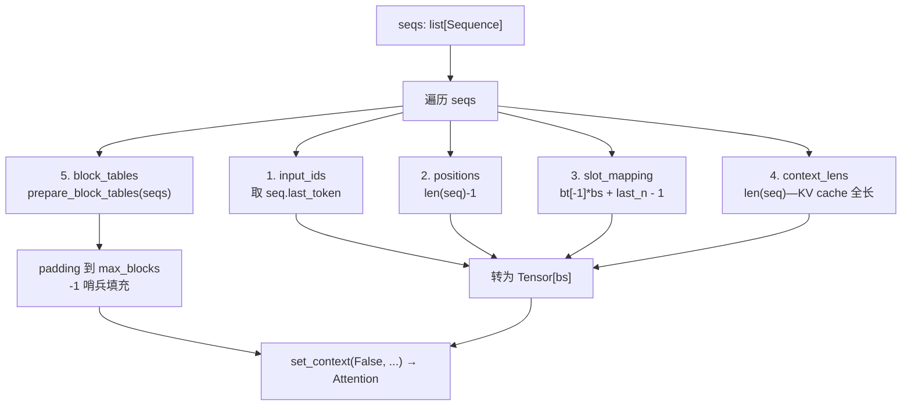
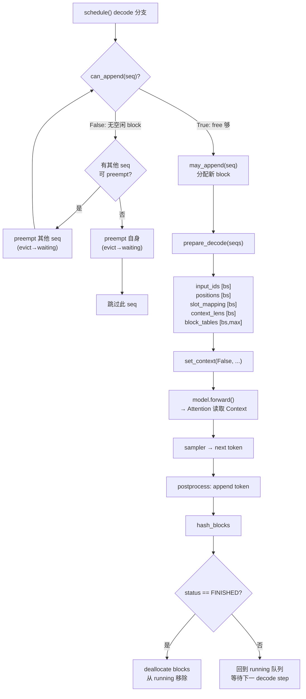
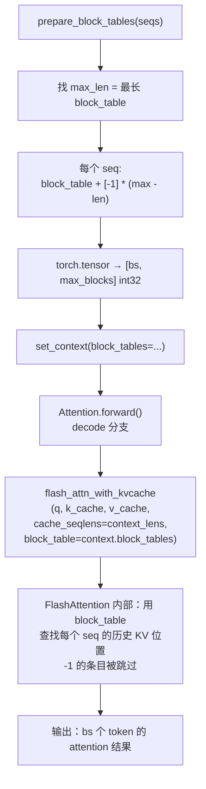
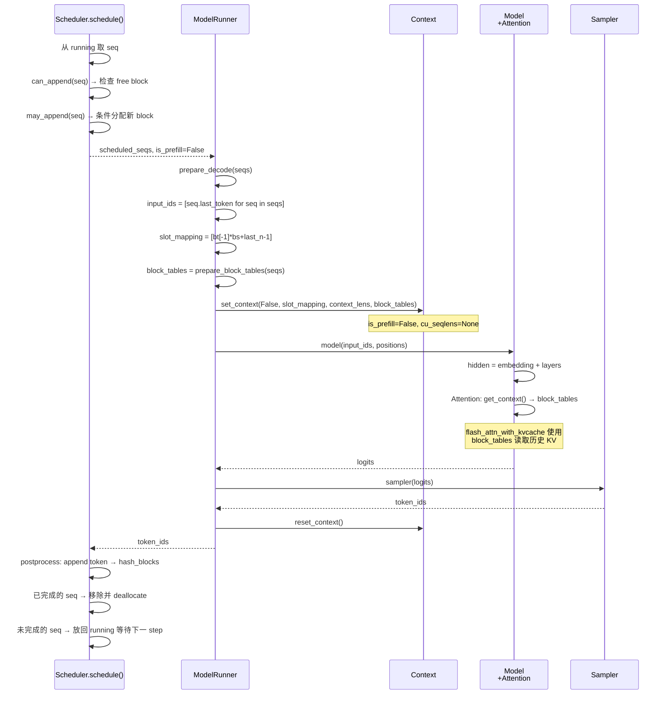

<h1 class="text-4xl font-bold!">第 6 课</h1>
<h2 class="text-2xl mt-4 font-normal opacity-80">Decode 一步生成与 Block Tables</h2>

<div class="mt-12 text-sm opacity-60">
nano-vllm 实战课程 · 源码拆解 LLM 推理引擎
</div>

<!-- 封面页：本课主题为 Decode 一步生成与 Block Tables，进入模型执行层的 decode 阶段。 -->

---
layout: default
---

# 本课在课程中的位置

<div style="height: 50px;"></div>
<div class="mt-4 text-sm max-w-2xl mx-auto">

<div class="flex justify-center gap-1 mb-2">
  <div class="bg-gray-700 text-gray-200 rounded px-3 py-1.5 w-28 text-center">L01<br/><span class="text-xs text-gray-400">generate→step</span></div>
  <div class="flex items-center text-gray-400 text-lg">→</div>
  <div class="bg-gray-700 text-gray-200 rounded px-3 py-1.5 w-28 text-center">L02<br/><span class="text-xs text-gray-400">Sequence</span></div>
  <div class="flex items-center text-gray-400 text-lg">→</div>
  <div class="bg-gray-700 text-gray-200 rounded px-3 py-1.5 w-28 text-center">L03<br/><span class="text-xs text-gray-400">调度器</span></div>
  <div class="flex items-center text-gray-400 text-lg">→</div>
  <div class="bg-gray-700 text-gray-200 rounded px-3 py-1.5 w-28 text-center">L04<br/><span class="text-xs text-gray-400">Block 管理</span></div>
</div>

<div class="flex justify-center mb-1">
  <div class="text-gray-400 text-lg">↓</div>
</div>

<div class="flex justify-center gap-1">
  <div class="bg-gray-700 text-gray-200 rounded px-3 py-1.5 w-28 text-center">L05<br/><span class="text-xs text-gray-400">Prefill</span></div>
  <div class="flex items-center text-gray-400 text-lg">→</div>
  <div class="bg-blue-600 text-white rounded px-3 py-1.5 font-bold w-28 text-center">L06<br/><span class="text-xs font-normal opacity-80">Decode</span></div>
  <div class="flex items-center text-gray-400 text-lg">→</div>
  <div class="bg-gray-700 text-gray-200 rounded px-3 py-1.5 w-28 text-center">L07<br/><span class="text-xs text-gray-400">Attention</span></div>
  <div class="flex items-center text-gray-400 text-lg">→</div>
  <div class="bg-gray-700 text-gray-200 rounded px-3 py-1.5 w-28 text-center">L08<br/><span class="text-xs text-gray-400">优化全景</span></div>
</div>

</div>

<div v-click class="mt-4 p-3 bg-blue-500/10 border-l-3 border-blue-500 rounded-r text-sm">
  L05 学习了 prefill 批构建。L06 进入 decode 阶段：每 seq 每次只生成 1 个 token——张量形状从 Σscheduled 缩为 bs。核心问题变成：<strong>一个 token 写入 KV cache 的哪个 slot？block_table 如何支持 attention 读取历史 KV？</strong>
</div>

<!-- 展示课程路线图，L06 聚焦 Decode 阶段——每 seq 1 token，核心是 slot_mapping 与 block_tables 的交互。 -->

---
layout: default
---

# 1.1 课时安排

decode 阶段每 seq 仅生成 1 个 token，但 block_table 查找与 may_append 分配机制是核心。

| 阶段 | 时长 | 内容要点 |
|------|------|----------|
| 原理铺垫 | 15 min | Decode 的独特挑战：单 token 批处理、KV cache 追加写入 |
| 代码走读 | 40 min | prepare_decode: input_ids/positions (bs,)、slot_mapping 公式、block_tables padding、may_append |
| 脚本演示 | 10 min | L06_decode.py 的 5 个 section |
| 动手练习 | 15 min | 手算 decode slot 与 may_append 触发时机 |
| 答疑讨论 | 10 min | 为什么 decode 不需要 cu_seqlens？block_tables 为什么用 -1 哨兵？ |

<!-- 本课分为原理铺垫、代码走读、脚本演示和动手练习四个阶段，共 90 分钟。 -->

---
layout: default
---

# 1.2 学习目标

<div class="mt-6 space-y-4">

<div v-click="1" class="flex items-start gap-3 p-3 bg-blue-500/10 border-l-3 border-blue-500 rounded-r">
  <span class="text-blue-400 font-bold">Q1</span>
  <span>decode 时 <code>input_ids</code> 的形状为什么是 <code>[bs]</code> 而不是 <code>[Σscheduled]</code>？</span>
</div>

<div v-click="2" class="flex items-start gap-3 p-3 bg-blue-500/10 border-l-3 border-blue-500 rounded-r">
  <span class="text-blue-400 font-bold">Q2</span>
  <span>decode slot 公式 <code>block_table[-1] × block_size + last_block_num_tokens - 1</code> 的含义是什么？</span>
</div>

<div v-click="3" class="flex items-start gap-3 p-3 bg-blue-500/10 border-l-3 border-blue-500 rounded-r">
  <span class="text-blue-400 font-bold">Q3</span>
  <span><code>may_append</code> 何时触发新 block 分配？<code>-1</code> 哨兵在 block_tables padding 中起什么作用？</span>
</div>

</div>

<!-- 三个核心学习目标：decode bs 形状的原因、slot 公式含义、may_append 与 -1 哨兵。 -->

---
layout: section
---

# 2. 原理说明
## Decode 阶段的独特挑战

<!-- 进入原理铺垫：decode 与 prefill 的核心差异——每 seq 1 token vs 展平拼接。 -->

---
layout: default
---

# 2.1 Decode vs Prefill：张量形状的核心差异

<div class="grid grid-cols-2 gap-4 mt-4 text-sm">
<div class="p-3 bg-blue-500/10 border-l-3 border-blue-500 rounded-r">
  <strong>Prefill</strong><br/><br/>
  多个 seq 的 token 区间<strong>展平拼接</strong>成 1D 张量：<br/>
  <code>input_ids.shape = [Σscheduled]</code><br/><br/>
  需要 cu_seqlens 标记每个 seq 的边界，<br/>
  用 FlashAttention varlen API。
</div>
<div class="p-3 bg-green-500/10 border-l-3 border-green-500 rounded-r">
  <strong>Decode</strong><br/><br/>
  每 seq 只生成 1 个新 token，直接<strong>等长批处理</strong>：<br/>
  <code>input_ids.shape = [bs]</code><br/><br/>
  不需要 cu_seqlens（只有 1 个 token 每 seq），<br/>
  用 FlashAttention <code>flash_attn_with_kvcache</code> API。
</div>
</div>

<div v-click class="mt-4 p-3 bg-yellow-500/10 border-l-3 border-yellow-500 rounded-r text-sm">
  <strong>为什么 decode 如此不同？</strong>因为 decode 阶段每个 seq 恰好生成 1 个 token——所有 seq 等长，天然形成形状 [bs] 的规则张量。但代价是：需要 <strong>block_tables</strong> 来定位历史 KV cache，因为 attention 要读取全部历史，而不仅是当前 token。
</div>

<!-- Prefill 展平拼接 vs Decode 等长批处理：decode 形状规整但需要 block_tables 定位历史 KV。 -->

---
layout: default
---

# 2.2 张量形状的二维规整：bs 维 + padding 哨兵

<div class="text-sm mt-4">

decode 阶段每 seq 固定贡献 1 个 token，所以批维度天然规整为 `bs`：

<div class="grid grid-cols-2 gap-4 mt-4">
<div>

**规整的 1D 向量**（长度 = bs）：
- `input_ids: [bs]` — 每 seq 的 last_token
- `positions: [bs]` — 每 seq 的当前位置
- `context_lens: [bs]` — 每 seq 的 cache 有效长度
- `slot_mapping: [bs]` — 每 seq 的写入 slot

</div>
<div>

**不规整的 2D 矩阵**（需 padding）：
- `block_tables: [bs, max_blocks]` — 每 seq 的 block_table 长度不一
- 用 `-1` 哨兵补齐到等长（和算法题里"无效 index"同理）
- `-1` 是非法 block_id，flash_attn 内部跳过

</div>
</div>

</div>

<div v-click class="mt-4 p-3 bg-green-500/10 border-l-3 border-green-500 rounded-r text-sm">
  <strong>关键规律</strong>：decode 只需要两种形状——1D [bs] 向量和 2D [bs, max_blocks] 矩阵。prefill 的 Σscheduled 展平拼接和 cu_seqlens 边界标记在这里完全不需要。唯一需要"对齐"的只有 block_tables 的长度——通过 -1 padding 解决。
</div>

<!-- 2.2 decode 批维度天然规整为 [bs]，唯一不规整的是 block_tables 长度，用 -1 哨兵补齐。 -->

---
layout: section
---

# 3. 代码走读
## prepare_decode 的五大步

<!-- 进入代码走读环节，跟踪 prepare_decode 的五个步骤：从 Sequence 列表到批张量。 -->

---
layout: default
---

# prepare_decode 全景图

<div class="flex justify-center">



</div>

<div v-click class="mt-3 p-3 bg-green-500/10 border-l-3 border-green-500 rounded-r text-sm">
  <strong>五步总览</strong>：遍历 seqs → 收集 ① input_ids ② positions ③ slot_mapping ④ context_lens → 转为形状 [bs] 的等长张量 → ⑤ block_tables padding → set_context(False)。与 prefill 的六大步相比，少了 cu_seqlens 和 max_seqlen，多了 context_lens。
</div>

<!-- prepare_decode 全景图：五步从 Sequence 列表生成 [bs] 形状的批张量，block_tables 需要 -1 哨兵 padding。 -->

---
layout: default
---

# 3.1 input_ids 与 positions

<SourceCode file="nanovllm/engine/model_runner.py" lines="172-188" />

```python {all|2-3|4-6}
def prepare_decode(self, seqs: list[Sequence]):
    input_ids = []                                    # ① 初始化收集列表
    positions = []
    slot_mapping = []
    context_lens = []
    for seq in seqs:
        input_ids.append(seq.last_token)              # ② 每 seq 1 个 token
        positions.append(len(seq) - 1)                # ③ 绝对位置
        context_lens.append(len(seq))
        slot_mapping.append(...)                      # 见 3.3
    input_ids = torch.tensor(input_ids, dtype=torch.int64)   # ④ [bs]!
    positions = torch.tensor(positions, dtype=torch.int64)   # [bs]!
```

<div v-click class="mt-2 p-3 bg-green-500/10 border-l-3 border-green-500 rounded-r text-sm">
  <strong>要点总览</strong>：decode 使用 <code>append</code> 而非 <code>extend</code>——每 seq 只追加 1 个元素，结果是形状 <code>[bs]</code> 的等长张量。positions = len(seq)-1 是当前生成 token 的绝对位置（在 RoPE 编码中与历史位置连续）。
</div>

<div v-click class="mt-2 p-3 bg-yellow-500/10 border-l-3 border-yellow-500 rounded-r text-sm">
  💡 与 prefill 的 <code>extend(seq[start:end])</code> 形成鲜明对比：prefill 可能一个 seq 就拼接几十上百个 token，而 decode 每 seq 只有 1 个。这是 decode 形状规整为 [bs] 的根本原因。
</div>

<!-- 3.1 input_ids 和 positions：decode 每 seq 仅 1 token，append 得到 [bs] 形状。 -->

---
layout: default
---

# 3.2 context_lens：cache 的有效长度

<SourceCode file="nanovllm/engine/model_runner.py" lines="172-188" />

```python {all|1}
context_lens.append(len(seq))          # prompt + 已生成 token 总数
```

<div class="mt-4 text-sm">

| 角色 | 说明 |
|------|------|
| 值 | `len(seq)` — seq 中所有 token（prompt + 已生成）的总数 |
| 传给谁 | `flash_attn_with_kvcache(cache_seqlens=context_lens)` |
| 作用 | 限制每个 seq 在 KV cache 中可访问的有效范围——"这个 seq 能往前看多少" |
| 形状 | `[bs]` int32 — 每 seq 一个长度值 |

</div>

<div v-click class="mt-4 p-3 bg-green-500/10 border-l-3 border-green-500 rounded-r text-sm">
  <strong>为什么 decode 需要 context_lens？</strong>每个 seq 的 KV cache 中实际有效长度不同（有的刚生成 10 token，有的已生成 200）。FlashAttention 需要知道"这个 seq 最多能往前看多少 token"——即 <code>cache_seqlens</code>。它和 <code>block_tables</code> 一起，完整描述了"从哪里读、读多少"。
</div>

<div v-click class="mt-3 p-3 bg-yellow-500/10 border-l-3 border-yellow-500 rounded-r text-sm">
  ⚠️ 注意区分：<code>context_lens</code> 是 KV cache 中有效 token 的总数（等于 len(seq)），<strong>不是</strong>最后一个 block 中的 token 数（那是 <code>seq.last_block_num_tokens</code>）。
</div>

<!-- 3.2 context_lens = len(seq)，告诉 flash_attn_with_kvcache 每个 seq 在 KV cache 中的有效范围。 -->

---
layout: default
---

# prepare_decode 完整代码走读（上）

<SourceCode file="nanovllm/engine/model_runner.py" lines="172-181" />

```python {all|2-5|6-9|10-12}
def prepare_decode(self, seqs: list[Sequence]):
    input_ids = []                                    # ① 初始化
    positions = []
    slot_mapping = []
    context_lens = []
    for seq in seqs:
        input_ids.append(seq.last_token)              # ② 每 seq 取最后 token
        positions.append(len(seq) - 1)                # ③ RoPE 绝对位置
        context_lens.append(len(seq))                 # ④ KV cache 全长
        slot_mapping.append(                          # ⑤ 写入位置
            seq.block_table[-1] * self.block_size
            + seq.last_block_num_tokens - 1)
```

<div class="mt-3 grid grid-cols-2 gap-2 text-sm">
<div v-click="1" class="p-3 bg-blue-500/10 border-l-3 border-blue-500 rounded-r">
  <strong>① 初始化</strong><br/>四个收集列表：input_ids/positions/slot_mapping/context_lens。比 prefill 少了 cu_seqlens_q/k 和 max_seqlen。
</div>
<div v-click="2" class="p-3 bg-blue-500/10 border-l-3 border-blue-500 rounded-r">
  <strong>② 循环体：input_ids、positions、context_lens</strong><br/><code>seq.last_token</code> 是刚生成的新 token；<code>len(seq)-1</code> 是当前位置索引；<code>len(seq)</code> 是 KV cache 全长（用于 flash_attn_with_kvcache 的 cache_seqlens）。
</div>
</div>

<div v-click="3" class="mt-2 p-3 bg-yellow-500/10 border-l-3 border-yellow-500 rounded-r text-sm">
  <strong>⑤ slot_mapping 公式</strong>：<code>block_table[-1] × block_size + last_block_num_tokens - 1</code>。完整拆解见下一页。
</div>

<!-- prepare_decode 上部分：初始化四个收集列表 + 循环体内的 ②③④⑤ 四步收集。 -->

---
layout: default
---

# 3.3 slot_mapping：一个 token 写到哪里？

<SourceCode file="nanovllm/engine/model_runner.py" lines="172-188" />

```python
slot_mapping = []
for seq in seqs:
    slot_mapping.append(
        seq.block_table[-1] * self.block_size       # 物理 block 基址
        + seq.last_block_num_tokens - 1              # 块内偏移（末尾位置）
    )                                                 # → 这个 token 的写入 slot
```

<div class="mt-3 text-sm">

**decode slot 公式拆解：**

| 部分 | 含义 | 示例 (block_size=256) |
|------|------|-----------------------|
| `block_table[-1]` | 最后（最新）的物理 block_id | seq 的 block_table=[5,12] → `bt[-1]=12` |
| `block_size` | 每 block 的 slot 数 | 256 |
| `last_block_num_tokens` | 最后一个 block 中的 token 数 | seq 有 300 token → last=44 |
| **slot** | 新 token 的 KV cache 写入位置 | `12×256 + 44 - 1 = 3115` |

</div>

<div v-click class="mt-3 p-3 bg-green-500/10 border-l-3 border-green-500 rounded-r text-sm">
  <strong>公式核心</strong>：<code>slot = block_table[-1] × block_size + (num_tokens - 1) % block_size</code>。新 token 总是写入 <strong>最后一个 block</strong> 的 <strong>末尾位置</strong>。与 prefill 的 batch slot_mapping 不同，decode 每 seq 只计算 1 个 slot。
</div>

<!-- slot_mapping 公式详解：bt[-1]*bs + last_block_num_tokens - 1，写入最后一个 block 的末尾位置。 -->

---
layout: default
---

# slot_mapping 示例走读

<div class="text-sm">

**场景**：block_size=256，seq 的 block_table=[5, 12]，当前已生成 300 个 token

**计算过程：**

| 变量 | 值 | 说明 |
|------|-----|------|
| `block_table[-1]` | 12 | 最新 block 的物理 ID |
| `last_block_num_tokens` | 300-(256×1)=44 | 最后一块包含 44 个 token |
| `slot = 12×256 + 44 - 1` | **3115** | 新 token 写入此位置 |

**可视化：**

```
block 5 (物理 5): [token 0..255]     ← 已满
block 12 (物理 12): [t256..t299]     ← 当前最后一块
                                   ↑ slot=3115 写入这里
```

</div>

<div v-click class="mt-3 p-3 bg-yellow-500/10 border-l-3 border-yellow-500 rounded-r text-sm">
  <strong>与 prefill 的区别</strong>：prefill 用 <code>extend</code> 批量生成多个 slot，范围可能跨越多个 block；decode 每 seq 只算 1 个 slot——因为只生成 1 个 token，且这个 token 必须写在最后一个 block 的末尾。
</div>

<!-- slot_mapping 示例：block_table=[5,12]，300 token，slot=3115。突出与 prefill 的差异。 -->

---
layout: default
---

# prepare_decode 完整代码走读（下）：张量创建与 Context 注入

<SourceCode file="nanovllm/engine/model_runner.py" lines="182-188" />

```python {all|1-4|5|6-8}
    input_ids = torch.tensor(input_ids, dtype=torch.int64)     # ⑥ [bs] int64
    positions = torch.tensor(positions, dtype=torch.int64)     # ⑥ [bs] int64
    slot_mapping = torch.tensor(slot_mapping, dtype=torch.int32)  # ⑥ [bs] int32
    context_lens = torch.tensor(context_lens, dtype=torch.int32)  # ⑥ [bs] int32
    block_tables = self.prepare_block_tables(seqs)             # ⑦ padding
    set_context(False, slot_mapping=slot_mapping,              # ⑧ Context 注入
                context_lens=context_lens, block_tables=block_tables)
    return input_ids, positions                                  # 返回
```

<div class="mt-3 grid grid-cols-2 gap-2 text-sm">
<div v-click="1" class="p-3 bg-blue-500/10 border-l-3 border-blue-500 rounded-r">
  <strong>⑥ 张量创建</strong><br/>四个张量形状均为 [bs]。int64 用于 ids/pos，int32 用于 slot/context_lens。pin_memory + non_blocking 加速 GPU 传输。
</div>
<div v-click="2" class="p-3 bg-blue-500/10 border-l-3 border-blue-500 rounded-r">
  <strong>⑦ prepare_block_tables</strong><br/>对不等长 block_table 做 padding（详细见 3.4）。decode 必须传递 block_tables（vs prefill 仅 prefix cache 时）。
</div>
</div>

<div v-click="3" class="mt-2 p-3 bg-green-500/10 border-l-3 border-green-500 rounded-r text-sm">
  <strong>⑧ set_context</strong>：<code>is_prefill=False</code>，只传 slot_mapping、context_lens、block_tables。不传 cu_seqlens（decode 不需要变长边界）。<code>return input_ids, positions</code>——与 prefill 返回类型一致。
</div>

<!-- prepare_decode 下部分：张量创建（[bs] 四件套）、prepare_block_tables padding、set_context(False) 注入。 -->

---
layout: default
---

# 3.4 block_tables padding

<SourceCode file="nanovllm/engine/model_runner.py" lines="123-127" />

```python {all|1|2|3-4}
def prepare_block_tables(self, seqs: list[Sequence]):
    max_len = max(len(seq.block_table) for seq in seqs)       # ① 找最长
    block_tables = [
        seq.block_table + [-1] * (max_len - len(seq.block_table))  # ② 补齐
        for seq in seqs
    ]
    block_tables = torch.tensor(block_tables, dtype=torch.int32)   # ③ [bs, max_blocks]
    return block_tables
```

<div v-click class="mt-2 p-3 bg-green-500/10 border-l-3 border-green-500 rounded-r text-sm">
  <strong>要点总览</strong>：三个步骤——① 找到最长 block_table → ② 每个 seq 用 <code>-1</code> 哨兵 padding 到等长 → ③ 转为形状 [bs, max_blocks] 的 int32 张量。<code>-1</code> 哨兵在 attention 中会被跳过（flash_attn_with_kvcache 的 block_table 接收 -1 为无效值）。
</div>

<div v-click class="mt-3 p-3 bg-yellow-500/10 border-l-3 border-yellow-500 rounded-r text-sm">
  ⚠️ <strong>为什么用 -1 而不是 0？</strong>因为 block_id=0 是合法物理 block，用 0 做哨兵会导致 attention 读到 block 0 的历史 KV（非本 seq）-1 是非法 block_id，flash_attn 会跳过对应位置。
</div>

<!-- block_tables padding：找最长 → -1 补齐到等长 → 转 int32 张量。-1 保证安全。 -->

---
layout: default
---

# block_tables padding 示例

<div class="text-sm">

**三个 seq 的不等长 block_table：**

| seq | block_table | 长度 | padding 后 |
|-----|-------------|:----:|:----------:|
| A | [3, 7] | 2 | [3, 7, -1] |
| B | [5, 12, 8] | 3 | [5, 12, 8] |
| C | [1] | 1 | [1, -1, -1] |

**拼接为 2D 张量：**

```
block_tables = [
    [ 3,  7, -1],
    [ 5, 12,  8],
    [ 1, -1, -1],
]  # shape: [3, 3]
```

</div>

<div v-click class="mt-3 p-3 bg-green-500/10 border-l-3 border-green-500 rounded-r text-sm">
  <strong>为什么需要 padding？</strong>因为 torch 要求 2D 张量每行等长。不等长的 block_table 通过 <code>+ [-1] * (max_len - len)</code> 补齐为矩形张量。<code>-1</code> 标记的无效位置在 flash_attn_with_kvcache 内部被安全跳过。
</div>

<div v-click class="mt-3 p-3 bg-purple-500/10 border-l-3 border-purple-500 rounded-r text-sm">
  <strong>与 prefill 的对比</strong>：在 prefill 中，block_tables 仅在 prefix cache 时需要（cu_seqlens_k > cu_seqlens_q）。在 decode 中，<strong>每步都需要</strong>——因为 flash_attn_with_kvcache 必须通过 block_table 定位历史 KV。
</div>

<!-- block_tables padding 示例：三个不等长 block_table 用 -1 补齐为 [3,3] 张量。 -->

---
layout: default
---

# 3.5 may_append：何时分配新 block？

<SourceCode file="nanovllm/engine/block_manager.py" lines="103-108" />

```python {all|1|2-3}
def can_append(self, seq: Sequence) -> bool:            # 检查是否能追加
    return len(self.free_block_ids) >= (len(seq) % self.block_size == 1)

def may_append(self, seq: Sequence):                    # 条件分配新 block
    if len(seq) % self.block_size == 1:                 # ① 跨 block 边界？
        seq.block_table.append(self._allocate_block())  # ② 分配新 block
```

<div v-click class="mt-2 p-3 bg-green-500/10 border-l-3 border-green-500 rounded-r text-sm">
  <strong>要点总览</strong>：<code>may_append</code> 的触发条件是一个布尔表达式——<code>len(seq) % block_size == 1</code> 为 True 时才需要新 block。此时当前 block 刚好填满，新 token 必须写入下一个 block。<code>can_append</code> 在调度循环中先检查 free_blocks 是否够用。
</div>

<div v-click class="mt-3 p-3 bg-blue-500/10 border-l-3 border-blue-500 rounded-r text-sm">
  💡 <code>len(seq) % block_size == 1</code> 意味着：当 seq 长度为 1, 5, 9, 13, ... 时触发——即 <strong>每 block 的最后一个 token 刚被写入后</strong>。此时当前 block 已满，下一个 token 需要新 block。
</div>

<!-- may_append 的触发条件：len(seq) % block_size == 1 时分配新 block，can_append 提前检查 free 是否够。 -->

---
layout: default
---

# may_append 的完整调用链

<SourceCode file="nanovllm/engine/scheduler.py" lines="57-73" />

```python
# schedule() 的 decode 分支
while self.running and len(scheduled_seqs) < self.max_num_seqs:
    seq = self.running.popleft()
    while not self.block_manager.can_append(seq):     # ① 检查 free block
        if self.running:
            self.preempt(self.running.pop())           # ② preempt 其他 seq
        else:
            self.preempt(seq)                          # ③ preempt 自己
            break
    else:
        seq.num_scheduled_tokens = 1                   # ④ 每步 1 token
        seq.is_prefill = False
        self.block_manager.may_append(seq)             # ⑤ 条件分配
        scheduled_seqs.append(seq)
```

<div v-click class="mt-2 p-3 bg-green-500/10 border-l-3 border-green-500 rounded-r text-sm">
  <strong>调用链总览</strong>：调度器循环中 → ① can_append 检查是否有空闲 block → ② 不够则 preempt 其他 seq → ③ 无法 preempt 则 preempt 自己 → ④ 设置 num_scheduled_tokens=1 → ⑤ may_append 条件分配新 block（len % bs == 1 时触发）。
</div>

<!-- may_append 的完整调用链：从 schedule() 的 decode 分支到 can_append 检查到 may_append 条件分配。 -->

---
layout: default
---

# may_append 触发边界示例

<div class="text-sm">

**block_size=4 时 len(seq) 与触发条件的关系：**

| len(seq) | len % 4 | 触发？ | 原因 |
|:--------:|:-------:|:-----:|------|
| 1 | 1 | ✅ | 第一个 token，需要初始 block |
| 2 | 2 | ❌ | 第 2 个 token，block 还空 3 个 slot |
| 3 | 3 | ❌ | 第 3 个 token |
| 4 | 0 | ❌ | 刚好填满第 1 个 block（末尾 slot 已占用） |
| 5 | 1 | ✅ | 刚刚填满 block 0 → 需要 block 1 |
| 6 | 2 | ❌ | block 1 还有空位 |
| 7 | 3 | ❌ | block 1 还有空位 |
| 8 | 0 | ❌ | 刚好填满 block 1 |
| 9 | 1 | ✅ | 刚刚填满 block 1 → 需要 block 2 |

</div>

<div v-click class="mt-3 p-3 bg-yellow-500/10 border-l-3 border-yellow-500 rounded-r text-sm">
  <strong>规律</strong>：每次 token 写入的"时机"是写完一个 block 的最后一个位置后（即 len % block_size == 0 时写入完毕），下一个 token (<code>len % block_size == 1</code>) 需要新 block。所以 may_append 在 len % block_size == 1 时触发。
</div>

<!-- may_append 触发边界示例：block_size=4 时，len=1/5/9 触发新 block 分配。 -->

---
layout: default
---

# 完整 decode 流程

<div class="flex justify-center">



</div>

<div v-click class="mt-2 p-3 bg-green-500/10 border-l-3 border-green-500 rounded-r text-sm">
  <strong>完整 decode 一步流程</strong>：schedule() 检查 can_append → may_append 分配 → prepare_decode 构造四件套 → set_context → model forward → sampler → postprocess 追加 token → hash_blocks。每 decode step 恰好推进 1 个 token。
</div>

<!-- 完整 decode 流程图展示了从 schedule 到 postprocess 的完整一步。 -->

---
layout: default
---

# decode 的 block_table 查找过程

<div class="flex justify-center">



</div>

<div v-click class="mt-2 p-3 bg-blue-500/10 border-l-3 border-blue-500 rounded-r text-sm">
  从 padding 到 FlashAttention 的完整链路：prepare_block_tables 将不等长 block_table 补齐 → set_context 注入 → flash_attn_with_kvcache 读取 block_table 定位每个 seq 的历史 KV cache 块。
</div>

<!-- block_table 查找过程：prepare_block_tables → set_context → flash_attn_with_kvcache 使用 block_table 定位历史 KV。 -->

---
layout: default
---

# decode step 端到端时序图

<div class="flex justify-center">



</div>

<div v-click class="mt-2 p-3 bg-green-500/10 border-l-3 border-green-500 rounded-r text-sm">
  <strong>端到端时序</strong>：scheduler 检查 can_append/may_append → prepare_decode 构造四件套 → set_context 注入 → model.forward 使用 block_tables → sampler → reset_context → postprocess。整个周期在 engine.step() 的每次调用中完成。
</div>

<!-- 端到端时序图：从 schedule 到 postprocess 的完整 decode step，突出 block_tables 在 Attention 中的使用。 -->

---
layout: default
---

# Prefill vs Decode Context 注入对比

<div class="text-sm">

| 字段 | Prefill (is_prefill=True) | Decode (is_prefill=False) |
|------|:-------------------------:|:-------------------------:|
| `input_ids` | [Σscheduled] int64 | [bs] int64 |
| `positions` | [Σscheduled] int64 | [bs] int64 |
| `slot_mapping` | [Σscheduled] int32 | [bs] int32 |
| `cu_seqlens_q` | [bs+1] int32 | ❌ None |
| `cu_seqlens_k` | [bs+1] int32 | ❌ None |
| `max_seqlen_q` | int | ❌ 0 |
| `max_seqlen_k` | int | ❌ 0 |
| `context_lens` | ❌ None | [bs] int32 |
| `block_tables` | ⚠️ 仅 prefix cache | [bs, max_blocks] int32 |

</div>

<div v-click class="mt-3 p-3 bg-blue-500/10 border-l-3 border-blue-500 rounded-r text-sm">
  <strong>核心规律</strong>：prefill 依赖 cu_seqlens 处理变长批，set_context 传入 6 个字段（含 max_seqlen 和 block_tables 可选）；decode 依赖 context_lens + block_tables，set_context 只传 3 个字段。两者共享同一 set_context 接口，但注入字段完全不同——Attention.forward 根据 is_prefill 选择读取哪些字段。
</div>

<!-- Prefill vs Decode Context 注入对比：prefill 用 cu_seqlens 六字段，decode 用 context_lens+block_tables 三字段。 -->

---
layout: section
---

# 4. L06 验证脚本
## L06_decode.py 走读

<!-- 进入验证脚本环节，预览 L06_decode.py 的 5 个 section。 -->

---
layout: default
---

# L06_decode.py：5 个 section

<div class="grid grid-cols-2 gap-3 mt-3 text-sm">
<div class="bg-blue-500/10 p-3 rounded">
  <strong>§1: slot 公式验证</strong><br/>
  验证 slot = block_table[-1] × bs + last_block_num_tokens - 1<br/>
  三种场景：新 block 起始 / 末端 / 中间位置
</div>
<div class="bg-green-500/10 p-3 rounded">
  <strong>§2: may_append 触发条件</strong><br/>
  len(seq) % block_size == 1 时触发<br/>
  逐长度打印 1-13，标记触发点
</div>
<div class="bg-purple-500/10 p-3 rounded">
  <strong>§3: can_append 配合</strong><br/>
  free_blocks 与 needs_block 的比较关系<br/>
  free_blocks=0 且需新 block → preempt
</div>
<div class="bg-yellow-500/10 p-3 rounded">
  <strong>§4: block_tables padding</strong><br/>
  [[3,7], [5,12,8], [1]] → -1 补齐<br/>
  验证 [-1] 乘法和 sentinel 值
</div>
<div class="bg-red-500/10 p-3 rounded">
  <strong>§5: 真实 torch 张量</strong><br/>
  构造 decode 四件套 [bs] 张量<br/>
  展示 shape/dtype/Context 注入
</div>
</div>

<!-- 五宫格概览：slot 公式、may_append、can_append、block_tables padding、真实 torch 张量五个验证场景。 -->

---
layout: default
---

# §1 详解：slot 公式与 prepare_decode

📍 公式推导参见 **3.3 slot_mapping**：`slot = block_table[-1] × block_size + last_block_num_tokens - 1`

```python
def slot(block_table_last, block_size, last_block_num_tokens):
    """对齐 model_runner.py:L181"""
    return block_table_last * block_size + last_block_num_tokens - 1

# 场景1: 新 block 的第 0 个位置
assert slot(3, 256, 1) == 3 * 256
# 场景2: block 的最后一个位置
assert slot(3, 256, 256) == 4 * 256 - 1
# 场景3: block 中间位置
assert slot(3, 256, 128) == 3 * 256 + 127
```

<div v-click class="mt-3 p-3 bg-green-500/10 border-l-3 border-green-500 rounded-r text-sm">
  <strong>验证要点</strong>：slot 公式的核心是 <code>block_table[-1] × block_size + offset</code>。新 token 总是写入最后一个物理 block 的 <code>last_block_num_tokens - 1</code> 位置。三种场景验证了起始、末端、中间三种偏移边界。
</div>

<!-- §1 验证 slot 公式：三种场景覆盖新 block 起始、block 末尾、中间位置。公式引用参见 3.3。 -->

---
layout: default
---

# §2-3 详解：may_append 与 can_append

📍 源码分析参见 **3.5 may_append**：`may_append` 在 `len(seq) % block_size == 1` 时触发

```python
block_size = 4
for length in range(1, 14):
    need_new_block = (length % block_size == 1)
    marker = " ← 触发!" if need_new_block else ""

# 关键边界断言
assert (1 % block_size == 1) == True    # 第 1 个 token → 初始 block
assert (4 % block_size == 1) == False   # 填满 block 0 → 不触发
assert (5 % block_size == 1) == True    # 跨 block 边界 → 触发
```

<div v-click class="mt-2 p-3 bg-green-500/10 border-l-3 border-green-500 rounded-r text-sm">
  <strong>验证要点</strong>：may_append 在 seq 长度达到 block_size+1 时触发——即当前 block 刚写满，下一个 token 需要新 block。can_append 提前对比 <code>free_blocks >= needs_new_block</code>，判断调度器是否可继续。
</div>

<div v-click class="mt-3 p-3 bg-purple-500/10 border-l-3 border-purple-500 rounded-r text-sm">
  <strong>关键联动</strong>：can_append 在调度循环中先于 may_append 执行。如果 free_blocks 不够且无 seq 可 preempt，当前 seq 自己被 preempt 回 waiting 队列——这保障了系统的 OOM 安全。
</div>

<!-- §2-3 验证 may_append 触发条件和 can_append/free_blocks 联动。源码引用参见 3.5。 -->

---
layout: default
---

# §4 详解：block_tables padding

📍 源码分析参见 **3.4 block_tables padding**：`-1` 哨兵填充不等长 block_table

```python
block_tables_raw = [
    [3, 7],           # seq_a: 2 blocks
    [5, 12, 8],       # seq_b: 3 blocks
    [1],               # seq_c: 1 block
]

max_len = max(len(bt) for bt in block_tables_raw)  # → 3
padded = [bt + [-1] * (max_len - len(bt)) for bt in block_tables_raw]

assert padded == [
    [3, 7, -1],
    [5, 12, 8],
    [1, -1, -1],
]
```

<div v-click class="mt-2 p-3 bg-green-500/10 border-l-3 border-green-500 rounded-r text-sm">
  <strong>验证要点</strong>：<code>max_len=3</code>，每个 seq 用 <code>[-1] * (3 - len(bt))</code> 补齐。-1 是安全的哨兵值（非法 block_id），flash_attn_with_kvcache 内部会跳过 -1 条目。
</div>

<!-- §4 验证 block_tables padding：找最长 → -1 哨兵补齐 → 断言结果，-1 保证 flash_attn 安全跳过。 -->

---
layout: default
---

# §5 详解：真实 torch 张量构造

```python
seq_a = Sequence([100, 200, 300] + [1000], sp)
seq_b = Sequence([400, 500] + [2000, 2001, 2002], sp)
seq_a.block_table = [0]; seq_b.block_table = [1]

input_ids = []
positions = []
context_lens = []
slot_mapping = []
for seq in seqs:
    input_ids.append(seq.last_token)
    positions.append(len(seq) - 1)
    context_lens.append(len(seq))
    slot_mapping.append(
        seq.block_table[-1] * block_size + seq.last_block_num_tokens - 1
    )
```

<div v-click="1" class="mt-2 p-3 bg-green-500/10 border-l-3 border-green-500 rounded-r text-sm">
  <strong>验证要点</strong>：所有张量形状均为 [bs]（而非 prefill 的 [Σscheduled]）。set_context 仅注入 slot_mapping、context_lens、block_tables——cu_seqlens 为 None。reset_context 后所有字段清空。
</div>

<div v-click="2" class="mt-4 p-3 bg-purple-500/10 border-l-3 border-purple-500 rounded-r text-sm">
  <strong>Prefill vs Decode 张量对比</strong>：input_ids/positions 从 1D Σscheduled 缩为 [bs]；cu_seqlens 被 context_lens 替代；slot_mapping 从批量变为每 seq 1 个。这是 L06 与 L05 最核心的差异。
</div>

<!-- §5 用真实 torch 张量验证 prepare_decode 的输出形状和 Context 注入。变量名与源码一致。 -->

---
layout: default
---

# 4.1 课堂练习

```python
def calc_decode_slot(block_table, block_size, num_tokens):
    """手写 decode slot 公式"""
    last_block = block_table[-1]
    last_block_tokens = num_tokens - (len(block_table) - 1) * block_size
    return last_block * block_size + last_block_tokens - 1

# 场景1: block_table=[5], num_tokens=100
print(calc_decode_slot([5], 256, 100))  # 5*256+100-1 = 1379

# 场景2: block_table=[5,12], num_tokens=300
print(calc_decode_slot([5, 12], 256, 300))  # 12*256+44-1 = 3115
```

<div v-click class="mt-3 p-3 bg-green-500/10 border-l-3 border-green-500 rounded-r text-sm">
  <strong>练习要点</strong>：手写 <code>calc_decode_slot</code> 理解公式三要素——最后一个物理 block_id、block_size、最后一个 block 内 token 数。对比 may_append 触发条件 <code>len(seq) % block_size == 1</code>，理解"何时需要新 block"与"新 token 写哪个 slot"的联动关系。
</div>

<!-- 课堂练习：手写 calc_decode_slot 验证公式三要素，理解 slot 与 may_append 的联动。 -->

---
layout: default
---

# 4.2 课后自测题

<SelfTest
  id="l06-q1"
  type="text"
  question="1. decode 时 input_ids 的形状为什么是 [bs] 而不是 [Σscheduled]？如果 decode 也能处理多个 token 每 seq，会有什么问题？"
  answer="<strong>原因</strong>：decode 阶段每 seq 每次只生成 1 个新 token——所有 seq 等长，天然形成 [bs] 形状。<br><strong>如果 decode 也能处理多个 token per seq</strong>：那就不叫 decode 了——那就是 prefill。decode 的核心约束是自回归生成永远只能看到历史 token，不能看到未来 token。如果每步生成了 K>1 个 token，有两种方案：① 投机解码（Speculative Decoding）——用小模型草稿 K 个候选，大模型验证。② 每步只生成 1 个 token（标准做法）。naive 的每步多 token 会破坏因果约束。"
/>

<SelfTest
  id="l06-q2"
  type="text"
  question="2. slot_mapping 在 prefill 和 decode 中的计算方式有何不同？为什么 decode 的 slot 公式比 prefill 简单得多？"
  answer="<strong>Prefill</strong>：逐 block 遍历 <code>start_block → end_block</code>，对每个 block 计算 slot 范围，再 <code>extend</code> 收集——可能跨多个 block，需要处理首块偏移和末块余量。<br><strong>Decode</strong>：每 seq 只算 1 个 slot——<code>block_table[-1] × block_size + last_block_num_tokens - 1</code>。直接取最新 block 的末尾位置。<br><strong>为什么简单得多？</strong>因为只生成 1 个 token，只需要 1 个写入位置。prefill 一个 seq 可能写几十上百个 slot（跨多个 block），所以需要复杂的逐 block 循环。"
/>

<!-- 课后自测第 1-2 题：decode [bs] 形状的原因、prefill vs decode slot_mapping 计算差异。 -->

---
layout: default
---

# 课后自测题（续）

<SelfTest
  id="l06-q3"
  type="text"
  question="3. 为什么 block_tables 在 decode 中是必须的，而在 prefill 中仅当 prefix cache 命中时才需要？"
  answer="<strong>Decode 必须用 block_tables</strong>：flash_attn_with_kvcache 需要通过 block_tables 找到每个 seq 的历史 KV 在物理 cache 中的位置。decode 的 Q 只有 1 个 token，但 K/V 需要读全部历史（可能几百个 block），没有 block_tables 就无法定位。<br><strong>Prefill 可选 block_tables</strong>：无 prefix cache 时，所有 K/V 都是本轮新计算的——Q 和 K/V 都在同一个 1D 展平张量中，用 cu_seqlens 就能确定边界。有 prefix cache 时，部分 K/V 已存在物理 cache 中（不在展平张量里），需要通过 block_tables 读取。<br><strong>一句话总结</strong>：只要 Attention 需要从物理 KV cache 中读取历史数据，就需要 block_tables。"
/>

<SelfTest
  id="l06-q4"
  type="text"
  question="4. may_append 的触发条件 len(seq) % block_size == 1 是怎么推导出来的？"
  answer="<strong>推导过程</strong>：<br>① 每个 block 容纳 block_size 个 token。<br>② 当 seq 长度为 block_size 时，当前 block 刚好填满。<br>③ 此时如果来了新 token（seq 长度变为 block_size+1），它已经属于下一个 block 了——所以需要分配新 block。<br>④ 一般化：seq 长度为 1（初始）、1+block_size（第一次跨 block）、1+2×block_size（第二次跨 block）...时触发。<br>⑤ 公式：<code>len(seq) ≡ 1 (mod block_size)</code>→ <code>len(seq) % block_size == 1</code>。<br><strong>为什么不是 len % block_size == 0？</strong>因为 len=block_size 时，最后一个 token 刚刚写入——此时 block 已满，但不需要额外操作。下一个 token（len=block_size+1）才需要新 block——这就是为什么是 == 1 而不是 == 0。"
/>

<!-- 课后自测第 3-4 题：block_tables 必要性区分、may_append 触发条件的推导。 -->

---
layout: center
---

# 🎉 第 6 课完成

<div class="mt-6 text-lg opacity-80">
  掌握了 decode 一步生成与 Block Tables 的核心机制
</div>

<div class="mt-4 grid grid-cols-4 gap-3 text-sm max-w-2xl mx-auto">
  <div class="bg-blue-500/10 p-3 rounded">✅ [bs] 张量</div>
  <div class="bg-green-500/10 p-3 rounded">✅ slot 公式</div>
  <div class="bg-purple-500/10 p-3 rounded">✅ block_tables</div>
  <div class="bg-yellow-500/10 p-3 rounded">✅ may_append</div>
</div>

<div class="mt-10">
  <a href="#" class="text-blue-400 hover:underline text-lg">下一课：Attention 内核与 KV Cache →</a>
</div>

<!-- 第 6 课总结：掌握 decode 批构建——[bs] 张量、slot 公式、block_tables padding、may_append 触发条件。 -->
