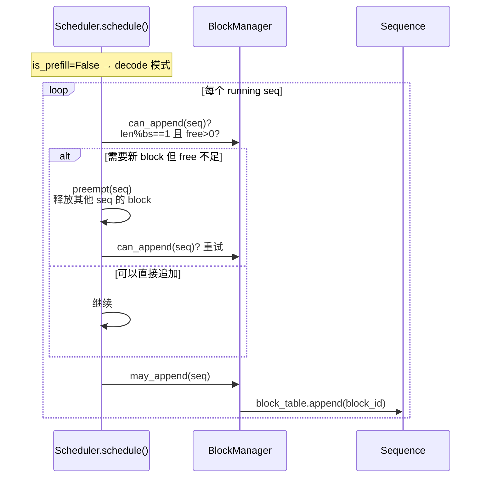
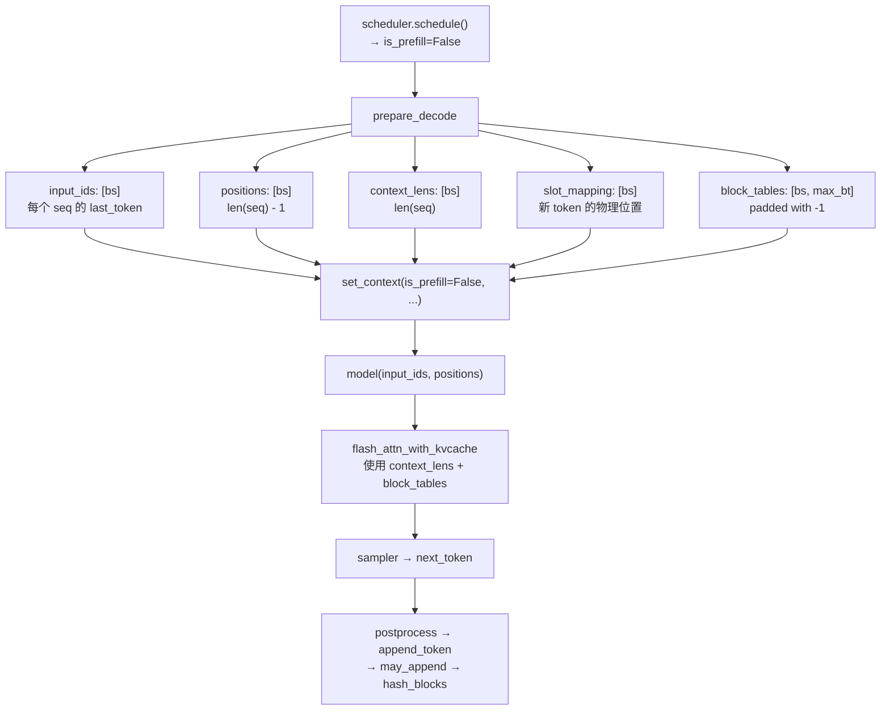
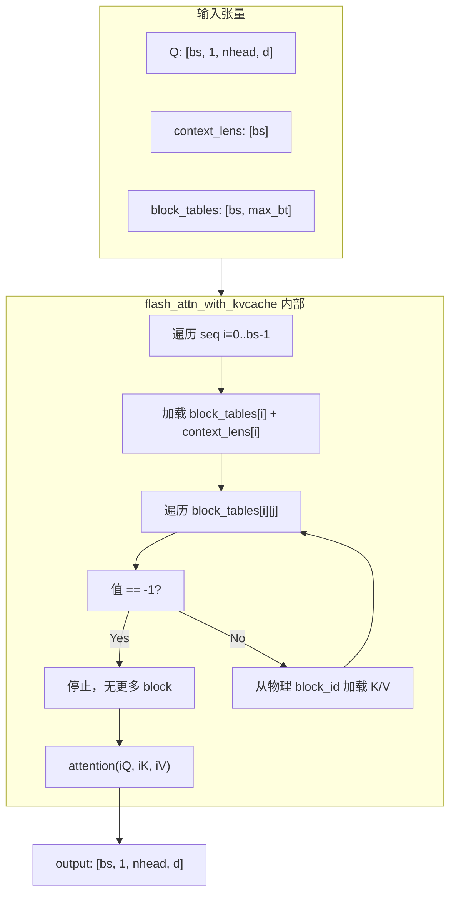
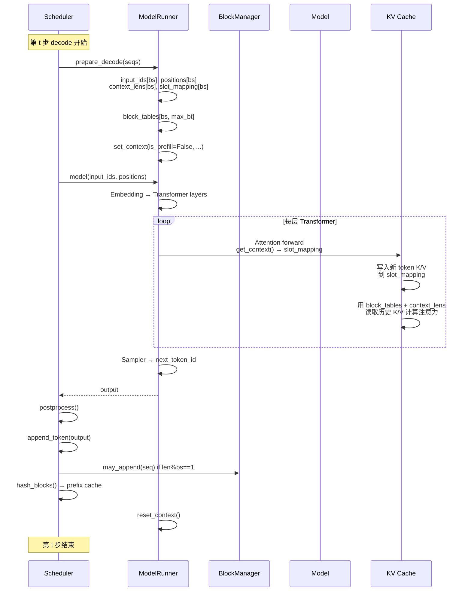

<h1 class="text-4xl font-bold!">第 6 课</h1>
<h2 class="text-2xl mt-4 font-normal opacity-80">Decode 一步生成与 Block Tables</h2>

<div class="mt-12 text-sm opacity-60">
nano-vllm 实战课程 · 源码拆解 LLM 推理引擎
</div>

---
layout: default
---

# 本课在课程中的位置

<div style="height: 50px;"></div>
<div class="mt-4 text-sm max-w-2xl mx-auto">

<div class="flex justify-center gap-1 mb-2">
  <div class="bg-gray-700 text-gray-200 rounded px-3 py-1.5 w-28 text-center">L01<br/><span class="text-xs text-gray-400">generate→step</span></div>
  <div class="flex items-center text-gray-400 text-lg">→</div>
  <div class="bg-gray-700 text-gray-200 rounded px-3 py-1.5 w-28 text-center">L02<br/><span class="text-xs text-gray-400">Sequence</span></div>
  <div class="flex items-center text-gray-400 text-lg">→</div>
  <div class="bg-gray-700 text-gray-200 rounded px-3 py-1.5 w-28 text-center">L03<br/><span class="text-xs text-gray-400">调度器</span></div>
  <div class="flex items-center text-gray-400 text-lg">→</div>
  <div class="bg-gray-700 text-gray-200 rounded px-3 py-1.5 w-28 text-center">L04<br/><span class="text-xs text-gray-400">Block 管理</span></div>
</div>

<div class="flex justify-center mb-1">
  <div class="text-gray-400 text-lg">↓</div>
</div>

<div class="flex justify-center gap-1">
  <div class="bg-gray-700 text-gray-200 rounded px-3 py-1.5 w-28 text-center">L05<br/><span class="text-xs text-gray-400">Prefill</span></div>
  <div class="flex items-center text-gray-400 text-lg">→</div>
  <div class="bg-blue-600 text-white rounded px-3 py-1.5 font-bold w-28 text-center">L06<br/><span class="text-xs font-normal opacity-80">Decode</span></div>
  <div class="flex items-center text-gray-400 text-lg">→</div>
  <div class="bg-gray-700 text-gray-200 rounded px-3 py-1.5 w-28 text-center">L07<br/><span class="text-xs text-gray-400">Attention</span></div>
  <div class="flex items-center text-gray-400 text-lg">→</div>
  <div class="bg-gray-700 text-gray-200 rounded px-3 py-1.5 w-28 text-center">L08<br/><span class="text-xs text-gray-400">优化全景</span></div>
</div>

</div>

<div v-click class="mt-4 text-sm opacity-80">
  L05 掌握了 prefill 的展平拼接。L06 对比 decode 的简化——每个 seq 只送 1 个 token，张量形状完全不同。
</div>

---
layout: default
---

# 1.1 课时安排

decode 阶段每个 step 具体需要准备哪些张量——decode 比 prefill 简单得多，因为每个请求只送入 1 个 token。

| 阶段 | 时长 | 内容要点 |
|------|------|----------|
| 概念回顾 | 10 min | 回顾「decode 每步 1 token」+ KV cache 已存历史 |
| 代码走读 | 40 min | prepare_decode: last_token、context_lens、slot_mapping、block_tables padding、may_append |
| 脚本演示 | 10 min | L06_decode.py 的 5 个 section |
| 动手练习 | 15 min | 手算 slot 公式 + 推导 may_append 触发条件 |
| 答疑讨论 | 15 min | 对比 prefill 与 decode 的张量形状差异 |

---
layout: default
---

# 1.2 学习目标

<div class="mt-6 space-y-4">

<div v-click="1" class="flex items-start gap-3 p-3 bg-blue-500/10 border-l-3 border-blue-500 rounded-r">
  <span class="text-blue-400 font-bold">Q1</span>
  <span>decode 批的输入为何是 <code>input_ids: (bs,)</code> 的一维张量，而不是 prefill 那样的展平拼接？</span>
</div>

<div v-click="2" class="flex items-start gap-3 p-3 bg-blue-500/10 border-l-3 border-blue-500 rounded-r">
  <span class="text-blue-400 font-bold">Q2</span>
  <span><code>context_lens</code> 与 <code>block_tables</code> 在注意力算子里分别扮演什么角色？</span>
</div>

<div v-click="3" class="flex items-start gap-3 p-3 bg-blue-500/10 border-l-3 border-blue-500 rounded-r">
  <span class="text-blue-400 font-bold">Q3</span>
  <span><code>may_append</code> 什么时候会为 seq 新增一个 block？触发条件的公式是什么？</span>
</div>

</div>

---
layout: section
---

# 2. 原理说明
## Decode 为什么比 Prefill 更简单

---
layout: default
---

# 2.1 自回归 + KV cache = 每步只需 1 个 token

回顾第 1 课：历史 token 的 K/V 已缓存，当前输入只是上一步的输出 token。

<div class="grid grid-cols-2 gap-6 mt-4">
<div>

**Prefill（本课对比）**
- `input_ids`: 1D, 长度 = Σ scheduled
- 需要 `cu_seqlens` 标记变长边界
- 需要 `slot_mapping` 告诉每个 token 写到哪里
- `positions` 不连续

</div>
<div>

**Decode（本课重点）**
- `input_ids`: 1D, 长度 = bs
- 不需要 `cu_seqlens`——每个 seq 恰好 1 个 token
- 需要 `slot_mapping`——但每个 seq 只写 1 个位置
- `positions` 连续

</div>
</div>

---
layout: default
---

# 2.2 张量形状：bs 维向量 + block_tables padding

<div class="grid grid-cols-2 gap-4 mt-4 text-sm">
<div>

**一维向量（长度 = bs）**
- `input_ids`: [bs] — 每个 seq 的 last_token
- `positions`: [bs] — 每个 seq 的 `len(seq) - 1`
- `context_lens`: [bs] — 每个 seq 的 `len(seq)`
- `slot_mapping`: [bs] — 每个 seq 新 token 的物理槽位

</div>
<div>

**二维矩阵（唯一例外）**
- `block_tables`: [bs, max_num_blocks]
- 不同 seq 的 block_table 长度不一
- 短 table 用 `-1` 填充到 max_len

```
block_tables = [[3, 7, -1],
                [5, 12, 8],
                [1, -1, -1]]
```

</div>
</div>

---
layout: section
---

# 3. 代码走读
## prepare_decode 的五大步

---
layout: default
---

# 3.1 input_ids 与 positions

<SourceCode file="nanovllm/engine/model_runner.py" lines="178-180" />

```python
input_ids_list = [seq.last_token for seq in seqs]      # 只取最后一个 token
positions_list = [len(seq) - 1 for seq in seqs]         # 最后一个位置
context_lens_list = [len(seq) for seq in seqs]          # KV cache 有效长度

input_ids = torch.tensor(input_ids_list, dtype=torch.int32)    # [bs]
positions = torch.tensor(positions_list, dtype=torch.int32)    # [bs]
context_lens = torch.tensor(context_lens_list, dtype=torch.int32)  # [bs]
```

<div v-click class="mt-3 text-sm">
  <strong>与 prefill 的关键区别</strong>：prefill 的 <code>input_ids</code> 是展平后的 <code>[total_tokens]</code>（可能几千个元素）；decode 永远是 <code>[bs]</code>。decode 不需要 <code>cu_seqlens</code>，因为每个 seq 严格只处理 1 个 token。
</div>

---
layout: default
---

# 3.1a decode input_ids 详解

<SourceCode file="nanovllm/engine/model_runner.py" lines="178-180" />

```python
input_ids_list = [seq.last_token for seq in seqs]      # 只取最后一个 token
```

<div class="mt-3 text-sm">

**为什么每 step 只取 1 个 token？** 自回归解码 + KV cache 意味着历史 token 的 K/V 已在 cache 中。当前输入只需要新预测的 token——即上一步的输出。

**示例：3 个 seq，每步只取 last_token**

| step | input_ids | 长度 |
|:----:|-----------|:----:|
| prefill step | [0,1,2, 10,11,12,13, 20,21] | 9 tokens 展平 |
| decode step 1 | [g0, g1, g2] | 3 tokens = bs |
| decode step 2 | [h0, h1, h2] | 3 tokens = bs |

</div>

<div v-click class="mt-2 text-sm bg-blue-500/10 p-3 rounded">
  <strong>形状恒为 [bs]</strong>，与 seq 长度无关。seq 已生成 1000 个 token 还是 10 个，decode step 的 input_ids 永远是 [bs]——这是 KV cache 的核心优势。
</div>

---
layout: default
---

# 3.1b decode positions/context_lens 详解

```python
positions_list = [len(seq) - 1 for seq in seqs]         # 最后位置的索引
context_lens_list = [len(seq) for seq in seqs]           # KV cache 有效长度
```

<div class="mt-3 text-sm">

**positions = len(seq) - 1**：当前新 token 在原始序列中的绝对位置，用于 RoPE 编码。

**context_lens = len(seq)**：KV cache 中存储了多少个历史 token。

**示例：3 个 seq 在不同 decode step 的值**

| seq | step | positions | context_lens | 说明 |
|-----|:----:|:---------:|:-----------:|------|
| A | 1 (首步) | 3 | 4 | 共 4 个 token，新 token 是第 4 个 |
| A | 2 | 4 | 5 | 追加了一个，现在共 5 个 |
| A | 3 | 5 | 6 | 再追加一个，共 6 个 |
| B | 1 | 7 | 8 | B 有 8 个 token |
| C | 1 | 1 | 2 | C 只有 2 个 token |

</div>

<div v-click class="mt-2 text-sm text-yellow-400">
  ⚠️ context_lens 不是 num_cached_tokens——它是 seq 的总长度（已缓存 + 已生成）。每次 decode 后 append_token，context_lens 自动 +1。
</div>

---
layout: default
---

# 3.2 slot_mapping：decode 的写入位置

<SourceCode file="nanovllm/engine/model_runner.py" lines="182-184" />

```python
slot_mapping_list = []
for seq in seqs:
    # 最后一个 block 的物理位置
    slot = seq.block_table[-1] * self.block_size + seq.last_block_num_tokens - 1
    slot_mapping_list.append(slot)
```

<div v-click class="mt-3 text-sm">

**公式**：`slot = block_table[-1] × block_size + last_block_num_tokens - 1`

<div class="grid grid-cols-3 gap-3 mt-2">
<div class="bg-gray-800/50 p-2 rounded text-xs">
  block_table[-1]=3, block_size=256, last=1<br/>
  slot = 3×256 + 1 - 1 = <strong>768</strong> (新block第0位)
</div>
<div class="bg-gray-800/50 p-2 rounded text-xs">
  block_table[-1]=3, block_size=256, last=256<br/>
  slot = 3×256 + 256 - 1 = <strong>1023</strong> (block最后位)
</div>
<div class="bg-gray-800/50 p-2 rounded text-xs">
  block_table[-1]=3, block_size=256, last=128<br/>
  slot = 3×256 + 128 - 1 = <strong>895</strong> (block中间位)
</div>
</div>

</div>

---
layout: default
---

# 3.2a slot_mapping 边界场景详解

<SourceCode file="nanovllm/engine/model_runner.py" lines="182-184" />

```python
slot = seq.block_table[-1] * self.block_size + seq.last_block_num_tokens - 1
```

<div class="text-sm mt-3">

<div class="grid grid-cols-3 gap-3 mt-2">
<div class="bg-gray-800/50 p-3 rounded text-gray-200">

**场景 A：新 block 第 0 位**
```
block_table[-1] = 7
block_size = 256
last_block_num_tokens = 1
```
slot = 7×256+1-1 = **1792**

token 写在新 block 开头——256 的整数倍。

</div>
<div class="bg-gray-800/50 p-3 rounded text-gray-200">

**场景 B：block 末尾**
```
block_table[-1] = 7
block_size = 256
last_block_num_tokens = 256
```
slot = 7×256+256-1 = **2047**

该 block 最后一个位置，下次触发 may_append！

</div>
<div class="bg-gray-800/50 p-3 rounded text-gray-200">

**场景 C：block 中间**
```
block_table[-1] = 7
block_size = 256
last_block_num_tokens = 128
```
slot = 7×256+128-1 = **1919**

最常见场景——block 还有空位，直接写入。

</div>
</div>

</div>

<div v-click class="mt-3 text-sm">
  <strong>与 prefill 对比</strong>：prefill 每个 token 一个 slot，decode 固定 1 个 slot。但公式核心完全一样：<code>block_id × block_size + offset</code>。
</div>

---
layout: default
---

# 3.3 block_tables padding：-1 哨兵

<SourceCode file="nanovllm/engine/model_runner.py" lines="123-127" />

```python
def prepare_block_tables(self, seqs):
    max_len = max(len(seq.block_table) for seq in seqs)
    padded = torch.full((len(seqs), max_len), -1, dtype=torch.int32)
    for i, seq in enumerate(seqs):
        bt = seq.block_table
        padded[i, :len(bt)] = torch.tensor(bt, dtype=torch.int32)
    return padded
```

<div v-click class="mt-3 text-sm">
  <strong>为什么用 -1 哨兵？</strong>注意力 kernel 在遍历 block_table 时遇到 -1 就停止查找。这比传一个单独的长度数组更简单——GPU kernel 直接检查值。
</div>

---
layout: default
---

# 3.3a block_tables padding 逐行实现

<SourceCode file="nanovllm/engine/model_runner.py" lines="123-127" />

```python
def prepare_block_tables(self, seqs):
    # ① 找出最长 block_table
    max_len = max(len(seq.block_table) for seq in seqs)

    # ② 全部用 -1 填充
    padded = torch.full((len(seqs), max_len), -1, dtype=torch.int32)

    # ③ 逐行覆盖真实值
    for i, seq in enumerate(seqs):
        bt = seq.block_table
        padded[i, :len(bt)] = torch.tensor(bt, dtype=torch.int32)

    return padded
```

<div class="mt-3 text-sm">

**逐行走读：**

| 行 | 操作 | 示例 (3 seqs) |
|---|------|-------------|
| ① | max_len = max([2, 3, 1]) → 3 | seq_a=[3,7], seq_b=[5,12,8], seq_c=[1] |
| ② | shape (3, 3) 全填 -1 | `[[-1,-1,-1],[-1,-1,-1],[-1,-1,-1]]` |
| ③ | 逐行覆盖 | `[[3,7,-1],[5,12,8],[1,-1,-1]]` |

</div>

<div v-click class="mt-2 text-sm">
  这是 model_runner 中<strong>唯一需要 2D padding</strong> 的地方。其他所有张量（input_ids, positions, slot_mapping, context_lens）都是 1D。
</div>

---
layout: default
---

# 3.3b 为什么 padding 用 -1 而不是 0

<div class="mt-4 text-sm">

**问题**：为什么不用常见 0 来填充短 block_table？

```python
# 实际：用 -1
padded = torch.full((len(seqs), max_len), -1, dtype=torch.int32)
# 为什么不是 0？
padded = torch.zeros((len(seqs), max_len), dtype=torch.int32)
```

<div v-click class="mt-3 p-3 bg-red-500/10 rounded">

**如果 block_id=0 是合法的物理 block？**

在 BlockManager 中，block_id 从 0 开始分配。block_id=0 表示第 1 个物理 block。如果 padding 用 0，attention kernel 无法区分：
- 这是一个有效的 block_id=0
- 这是一个 padding 位置

</div>

<div v-click class="mt-3 p-3 bg-green-500/10 rounded">

**-1 是安全的哨兵值**

block_id 从 0 开始递增，-1 永远不可能是合法 block_id。Attention kernel 遍历 <code>block_tables[i]</code>，遇到 -1 就停止查找该 seq 的后续 block。

类似 C 语言字符串的 <code>\0</code> 终止符——不需要额外传长度数组。

</div>
</div>

---
layout: default
---

# 3.4 may_append：跨 block 边界时新增 block

<SourceCode file="nanovllm/engine/block_manager.py" lines="103-108" />

```python
def can_append(self, seq):
    needs_block = (len(seq) % self.block_size == 1)
    return not needs_block or len(self.free_block_ids) > 0

def may_append(self, seq):
    if len(seq) % self.block_size == 1:
        block_id = self.free_block_ids.pop()
        self.used_block_ids.add(block_id)
        seq.block_table.append(block_id)
```

<div v-click class="mt-3 text-sm">
  <strong>触发条件</strong>：<code>len(seq) % block_size == 1</code>。当一个新 token 需要写入新 block 的第一个位置时触发。例如 block_size=4：len=1→需要、len=4→不需要、len=5→需要、len=8→不需要、len=9→需要。
</div>

---
layout: default
---

# 3.4a may_append 触发条件详解

<SourceCode file="nanovllm/engine/block_manager.py" lines="103-108" />

```python
def may_append(self, seq):
    if len(seq) % self.block_size == 1:
        block_id = self.free_block_ids.pop()
        self.used_block_ids.add(block_id)
        seq.block_table.append(block_id)
```

<div class="mt-3 text-sm">

**触发条件**：`len(seq) % block_size == 1`

**直觉**：seq 刚达到「需要新 block 来容纳第 1 个 token」的状态。

**示例 (block_size=4)：**

| len(seq) | len%4 | 触发？ | 原因 |
|:--------:|:-----:|:-----:|------|
| 0 | 0 | ❌ | seq 为空 |
| 1 | **1** | ✅ | 新 seq，分配第 1 个 block |
| 2 | 2 | ❌ | block 0 还有 2 个空位 |
| 3 | 3 | ❌ | block 0 还有 1 个空位 |
| 4 | 0 | ❌ | block 0 刚好填满 |
| 5 | **1** | ✅ | 需要第 2 个 block |
| 9 | **1** | ✅ | 需要第 3 个 block |

</div>

<div v-click class="mt-2 text-sm">
  <strong>规律</strong>：每 block_size 个 token 触发一次分配。block_size=256 时，token 索引 1, 257, 513, ... 触发 may_append。
</div>

---
layout: default
---

# 3.4b can_append vs may_append 职责分离

```python
def can_append(self, seq):
    needs_block = (len(seq) % self.block_size == 1)
    return not needs_block or len(self.free_block_ids) > 0

def may_append(self, seq):
    if len(seq) % self.block_size == 1:
        block_id = self.free_block_ids.pop()
        self.used_block_ids.add(block_id)
        seq.block_table.append(block_id)
```

<div class="grid grid-cols-2 gap-4 mt-3 text-sm">
<div class="bg-blue-500/10 p-3 rounded">

**can_append：检查**
- 不需要新 block → 总是 True
- 需要新 block → 检查 free 池
- **纯查询，无副作用**

</div>
<div class="bg-green-500/10 p-3 rounded">

**may_append：执行**
- 检查条件（与 can_append 同）
- 从 free 池弹出 block_id
- 追加到 seq.block_table
- **有副作用**

</div>
</div>

<div v-click class="mt-3 text-sm bg-yellow-500/10 p-3 rounded">
  <strong>为什么分开</strong>：can_append 在 schedule() 控制循环中调用——如果返回 False，引擎先执行 preempt 再重试。分开让控制流更清晰：检查 →（不够）抢占 → 执行。
</div>

---
layout: default
---

# 3.4c may_append 的完整调用链



<div v-click class="mt-3 text-sm">
  <strong>关键点</strong>：may_append 在 decode 调度循环中<strong>每 step 最多被调用一次</strong>。因为每 step 最多追加 1 个 token。
</div>

---
layout: default
---

# 3.4d prepare_decode 完整代码走读（上）

<SourceCode file="nanovllm/engine/model_runner.py" lines="175-190" />

```python
def prepare_decode(self, seqs: list[Sequence]):
    input_ids_list = []
    positions_list = []
    context_lens_list = []
    slot_mapping_list = []

    for seq in seqs:                                      # ← 遍历每个 seq
        input_ids_list.append(seq.last_token)              # ① 末位 token

        positions_list.append(len(seq) - 1)                # ② 末位索引
        context_lens_list.append(len(seq))                 # ③ KV 有效长度

        # ④ slot：block_table[-1] × block_size + last_block_num_tokens - 1
        slot = seq.block_table[-1] * self.block_size \
             + seq.last_block_num_tokens - 1
        slot_mapping_list.append(slot)

    input_ids = torch.tensor(input_ids_list, dtype=torch.int32)    # [bs]
    positions = torch.tensor(positions_list, dtype=torch.int32)    # [bs]
    context_lens = torch.tensor(context_lens_list, dtype=torch.int32)  # [bs]
    slot_mapping = torch.tensor(slot_mapping_list, dtype=torch.int32)  # [bs]
```

<div class="mt-2 text-xs opacity-70">上半部分：逐 seq 收集 last_token/positions/context_lens/slot_mapping → [bs] 张量。</div>

---
layout: default
---

# 3.4e prepare_decode 完整代码走读（中）

<SourceCode file="nanovllm/engine/model_runner.py" lines="191-196" />

```python
    # ⑤ block_tables padding（复用 prepare_block_tables）
    block_tables = self.prepare_block_tables(seqs)
    # block_tables.shape = [bs, max_len_bt]
```

<div class="mt-4 text-sm">

**block_tables padding 示例：**

```
seq_a.block_table = [3, 7]          → [3, 7, -1]
seq_b.block_table = [5, 12, 8]      → [5, 12, 8]
seq_c.block_table = [1]             → [1, -1, -1]
                                        ↑ max_len = 3
```

<div v-click class="mt-3 p-3 bg-blue-500/10 rounded">
  <strong>为什么 -1 出现在末尾？</strong>因为 block_table 是在序列生成过程中逐步 append 的——最早分配的 block 在前面，最新的在最后。padding 在右侧补齐，-1 不干扰前面的有效 block_id。
</div>

</div>

---
layout: default
---

# 3.4f prepare_decode 完整代码走读（下）

<SourceCode file="nanovllm/engine/model_runner.py" lines="197-210" />

```python
    # ⑦ 构造 max_seqlen_k
    max_seqlen_k = max(context_lens_list) if context_lens_list else 0

    # ⑧ Context 注入（is_prefill=False）
    set_context(
        is_prefill=False,
        slot_mapping=slot_mapping,
        block_tables=block_tables,
        context_lens=context_lens,
        max_seqlen_k=max_seqlen_k,
    )
    return input_ids, positions, slot_mapping
```

<div v-click class="mt-4 text-sm bg-blue-500/10 p-3 rounded">

**与 prefill 的 set_context 对比：**

| 参数 | prefill | decode |
|------|:------:|:------:|
| cu_seqlens_q | ✅ [bs+1] | ❌ |
| cu_seqlens_k | ✅ [bs+1] | ❌ |
| context_lens | ❌ | ✅ [bs] |
| 核心区别 | 变长边界 | 每 seq KV 长度 |

</div>

<div v-click class="mt-2 text-sm">
  解码完成后，<code>reset_context()</code> 清空所有字段。下一轮再次 set_context。
</div>

---
layout: default
---

# 3.5 完整 decode 流程



---
layout: default
---

# 3.5a decode 与 prefill 的输入对比

<div class="text-sm mt-3">

| 对比维度 | Prefill | Decode |
|---------|:------:|:------:|
| input_ids 形状 | [Σscheduled] 展平 | [bs] 逐个 |
| 每 seq 贡献 token 数 | scheduled >= 1 | 恰好 1 |
| 需要 cu_seqlens？ | ✅ 标记变长边界 | ❌ 不需要 |
| slot_mapping 大小 | [Σscheduled] | [bs] |
| positions 是否连续 | ❌ 可能跳跃 | ✅ 连续 |
| block_tables 需要？ | ⚠️ 仅 prefix cache | ✅ 总是需要 |
| context_lens 需要？ | ❌ | ✅ |
| 注意力 API | flash_attn_varlen_func | flash_attn_with_kvcache |

</div>

<div v-click class="mt-3 text-sm bg-blue-500/10 p-3 rounded">
  <strong>根本原因</strong>：prefill 需要把多个不等长 seq 的多个 token 一次送入模型并行计算；decode 每个 seq 只有 <strong>1 个新 token</strong>，天然就是 [bs] 形状。
</div>

---
layout: default
---

# 3.5b decode 的 block_table 查找过程

<div class="text-sm">



</div>

<div v-click class="mt-2 text-sm bg-purple-500/10 p-3 rounded">
  block_tables 就是 block_id 的「地址簿」：kernel 逐 block 遍历，遇到 -1 就停，从有效 block 中逐个读取 K/V 行。
</div>

---
layout: default
---

# 3.5c decode step 端到端时序图



---
layout: section
---

# 4. L06 验证脚本
## L06_decode.py 走读

---
layout: default
---

# L06_decode.py：5 个 section

<div class="grid grid-cols-2 gap-3 mt-3 text-sm">
<div class="bg-blue-500/10 p-3 rounded">
  <strong>§1: Decode slot 公式</strong><br/>
  三个场景验证 slot 计算<br/>
  新 block 首位、block 末位、中间位
</div>
<div class="bg-green-500/10 p-3 rounded">
  <strong>§2: may_append 触发</strong><br/>
  遍历 len=1..13, block_size=4<br/>
  标记 len%4==1 的位置
</div>
<div class="bg-purple-500/10 p-3 rounded">
  <strong>§3: can_append vs may_append</strong><br/>
  free=0 时验证 can_append 返回值<br/>
  len%4≠1 → True / len%4==1 → False
</div>
<div class="bg-yellow-500/10 p-3 rounded">
  <strong>§4: block_tables padding</strong><br/>
  [[3,7],[5,12,8],[1]] → -1 哨兵填充
</div>
<div class="bg-red-500/10 p-3 rounded">
  <strong>§5: 真实 torch 张量</strong><br/>
  构造 decode 张量，验证形状<br/>
  input_ids/positions 都是 (bs,)
</div>
</div>

---
layout: default
---

# 4.0a §1 详解：Decode slot 公式

```python
def decode_slot(block_table_last, block_size, last_block_num_tokens):
    return block_table_last * block_size + last_block_num_tokens - 1

# 场景 1: 新 block 第 0 个位置
assert decode_slot(3, 256, 1) == 768      # 3×256 + 1 - 1 = 768

# 场景 2: block 最后一个位置
assert decode_slot(3, 256, 256) == 1023   # 3×256 + 256 - 1 = 1023

# 场景 3: block 中间位置
assert decode_slot(3, 256, 128) == 895    # 3×256 + 128 - 1 = 895
```

<div v-click class="mt-3 text-sm">

**为什么是 block_table[-1] 而不是 block_table[0]？**

因为新 token 总是写入<strong>最后一个 block</strong>——当前 seq 已经拥有的最后一个 block 中还有空位（或者刚触发 may_append 分配了一个新 block，也是最后一个）。

</div>

<div v-click class="mt-2 text-sm">
  <code>last_block_num_tokens - 1</code> 把 1-based 计数转为 0-based 的 slot 偏移。例如 block 有 256 个位置，last=256 → offset=255（最后一个位置）。
</div>

---
layout: default
---

# 4.0b §2-3 详解：may_append 与 can_append

```python
# §2: may_append 触发条件 (block_size=4)
triggers = []
for length in range(1, 14):
    if length % 4 == 1:
        triggers.append(length)
print(triggers)  # [1, 5, 9, 13]

# §3: can_append 职责分离
class SimpleBM:
    def __init__(self):
        self.free = 2
    def can_append(self, seq_len, bs):
        needs = seq_len % bs == 1
        return not needs or self.free > 0
    def may_append(self, seq_len, bs):
        if seq_len % bs == 1:
            self.free -= 1; return True
        return False

bm = SimpleBM()
for length in [1, 2, 3, 4, 5, 6]:
    can = bm.can_append(length, 4)
    if can: bm.may_append(length, 4)
    print(f"len={length}: can={can}, free={bm.free}")
```

<div v-click class="mt-2 text-sm text-yellow-400">
  len=9 时 can_append 返回 False——控制流回到 scheduler 触发 preempt，释放其他 seq 的 block 后重试。
</div>

---
layout: default
---

# 4.1 课堂练习

```python
# 练习 1: slot 计算公式
def decode_slot(block_table_last, block_size, last_block_num_tokens):
    return block_table_last * block_size + last_block_num_tokens - 1

# 验证三个场景
assert decode_slot(3, 256, 1) == 768     # 新 block 第 0 个位置
assert decode_slot(3, 256, 256) == 1023  # block 最后一个位置
assert decode_slot(3, 256, 128) == 895   # block 中间位置

# 练习 2: may_append 触发条件 (block_size=4)
for length in range(1, 14):
    needs = length % 4 == 1
    print(f"len={length:2d}: {'NEW_BLOCK' if needs else 'no'}")

# len= 1: NEW_BLOCK  len= 5: NEW_BLOCK  len= 9: NEW_BLOCK  len=13: NEW_BLOCK
```

---
layout: default
---

# 4.2 课后自测题

<SelfTest
  id="l06-q1"
  type="text"
  question="1. decode 每步只有 1 个新 token，为什么 flash_attn_with_kvcache 仍然需要完整的 block_tables？内部各 seq 的 look-up 范围有多大？"
  answer="虽然只送入 1 个新 token，但注意力计算需要新 token 的 Q 去「匹配」<strong>全部</strong>历史 K/V。历史 K/V 分散在多个不连续的物理 block 中——<code>block_tables</code> 告诉 kernel 每个 seq 的 block 列表。kernel 按 <code>block_tables[i]</code> 遍历物理 block_id，累计读取 <code>context_lens[i]</code> 个位置的 K/V。<br>例如 seq 有 1024 个历史 token (4 个 block)，新 token 要看全部 1024 个历史 token 的 K/V。kernel 通过 block_table 知道这些历史 K/V 在 block 3、7、12、5 中。"
/>

<SelfTest
  id="l06-q2"
  type="text"
  question="2. 用 ASCII 画出 4 个 block 的填充过程，标注每次触发 may_append 的时刻。如果 block_size=4，token 0 到 token 12 分别占用哪些 block 位置？"
  answer="<code>Block 0: [t0][t1][t2][t3] ← len=0→1: may_append (分配 Block 0)</code><br><code>Block 1: [t4][t5][t6][t7] ← len=4→5: may_append (分配 Block 1)</code><br><code>Block 2: [t8][t9][t10][t11] ← len=8→9: may_append (分配 Block 2)</code><br><code>Block 3: [t12][  ][  ][  ] ← len=12→13: may_append (分配 Block 3)</code><br>注意：每次 len 从 4 的倍数变成 4 的倍数+1 时（即 <code>len%4==1</code>），触发新 block 分配。第一次分配发生在初始化时（len=0→1），之后 len=4→5、8→9、12→13..."
/>

---
layout: default
---

# 4.2 课后自测题（续）

<SelfTest
  id="l06-q3"
  type="text"
  question="3. 如果去掉 can_append 的空闲 block 检查，直接用 may_append 尝试分配，当 free 池为空时会怎样？preempt 机制还能正常触发吗？"
  answer="<strong>直接 may_append</strong>：当 <code>free_block_ids</code> 为空时，<code>pop()</code> 会抛出 KeyError 异常。不会优雅降级，整个推理进程会崩溃。<br><strong>can_append + preempt 的协作</strong>：<code>can_append</code> 提前检查是否有足够空闲 block。如果不够，控制流回到 <code>schedule()</code> 的 decode 循环，触发 <code>preempt</code> 释放其他 seq 的 block。preempt 会调用 <code>deallocate</code> 将 block 归还 free 池。然后 <code>can_append</code> 再次检查——此时有空闲了，继续分配。<br>去掉 <code>can_append</code> 等于去掉了「缓冲带」，让 preempt 无法在安全的时点介入。"
/>

---
layout: center
---

# 🎉 第 6 课完成

<div class="mt-6 text-lg opacity-80">
  掌握了 decode 的张量准备、slot 公式与 block_tables padding
</div>

<div class="mt-4 grid grid-cols-4 gap-3 text-sm max-w-2xl mx-auto">
  <div class="bg-blue-500/10 p-3 rounded">✅ last_token</div>
  <div class="bg-green-500/10 p-3 rounded">✅ context_lens</div>
  <div class="bg-purple-500/10 p-3 rounded">✅ slot_mapping</div>
  <div class="bg-yellow-500/10 p-3 rounded">✅ may_append</div>
</div>

<div class="mt-10">
  <a href="#" class="text-blue-400 hover:underline text-lg">下一课：Attention 与 KV Cache 写入 →</a>
</div>
