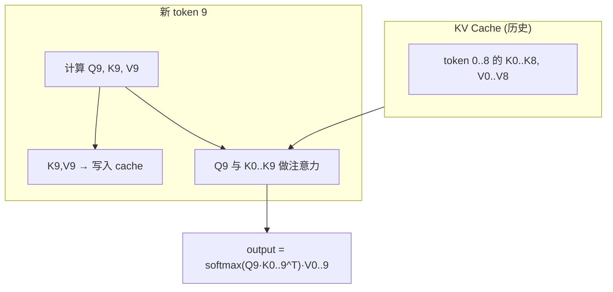
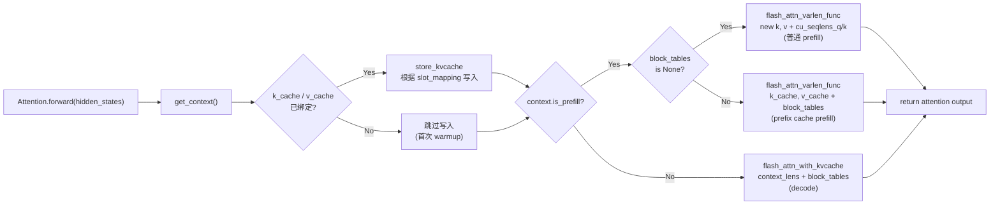
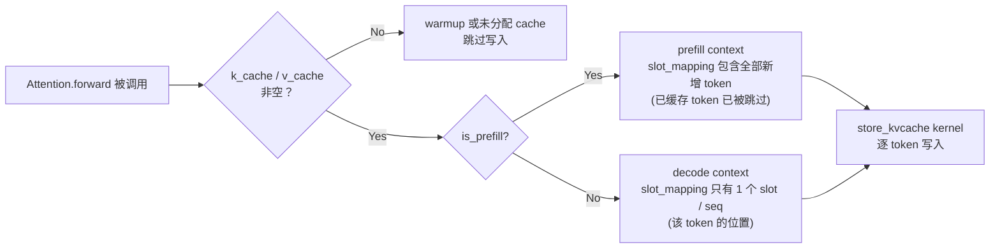
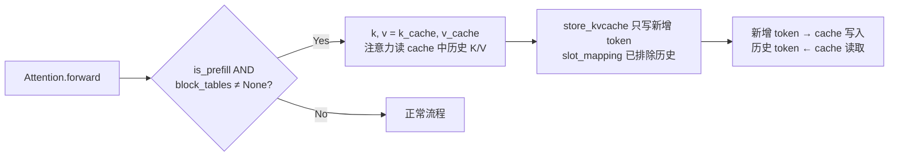
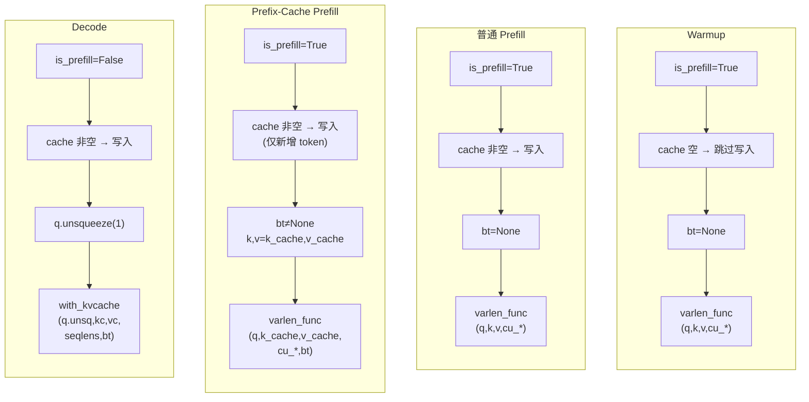
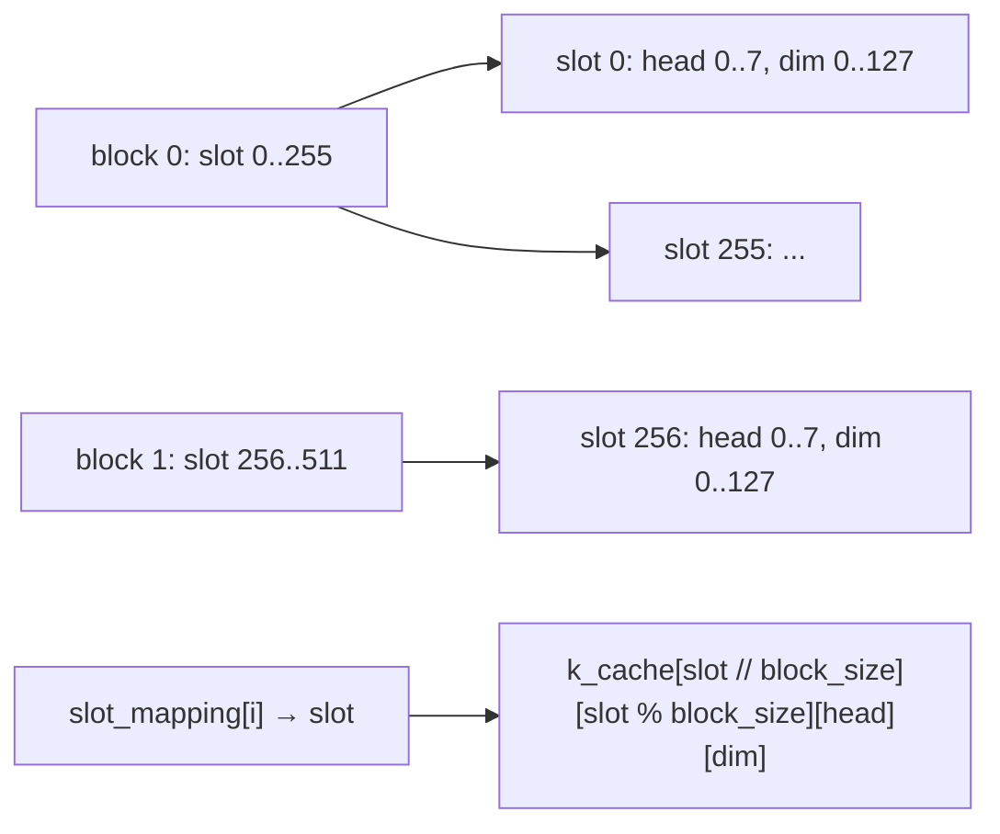
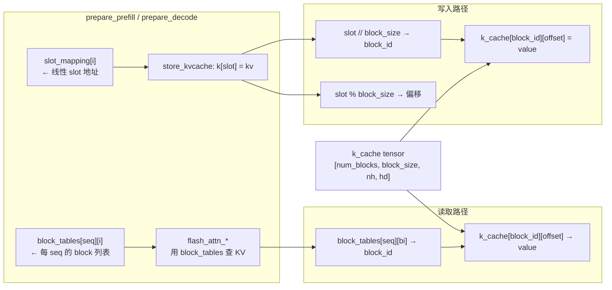
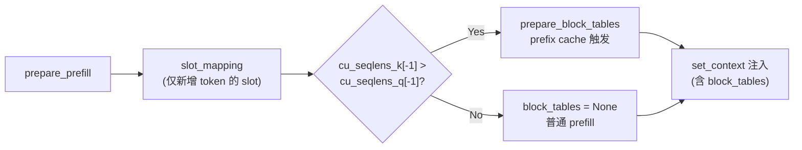
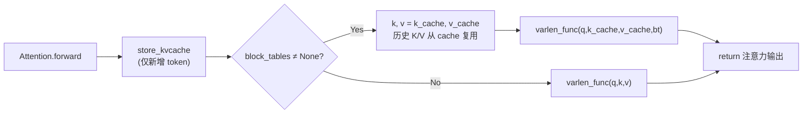

<h1 class="text-4xl font-bold!">第 7 课</h1>
<h2 class="text-2xl mt-4 font-normal opacity-80">Attention：KV 写入与算子分支</h2>

<div class="mt-12 text-sm opacity-60">
nano-vllm 实战课程 · 源码拆解 LLM 推理引擎
</div>

<!-- 本节课从 KV Cache 的数学动机出发，讲解 Attention.forward 如何根据上下文选择四条计算路径——store_kvcache 写入、varlen_func 处理普通 prefill、varlen_func+cache 处理 prefix cache prefill、with_kvcache 处理 decode。建议学生打开 attention.py 和 context.py 跟读。-->

---
layout: default
---

# 本课在课程中的位置

<div style="height: 50px;"></div>
<div class="mt-4 text-sm max-w-2xl mx-auto">

<div class="flex justify-center gap-1 mb-2">
  <div class="bg-gray-700 text-gray-200 rounded px-3 py-1.5 w-28 text-center">L01<br/><span class="text-xs text-gray-400">generate→step</span></div>
  <div class="flex items-center text-gray-400 text-lg">→</div>
  <div class="bg-gray-700 text-gray-200 rounded px-3 py-1.5 w-28 text-center">L02<br/><span class="text-xs text-gray-400">Sequence</span></div>
  <div class="flex items-center text-gray-400 text-lg">→</div>
  <div class="bg-gray-700 text-gray-200 rounded px-3 py-1.5 w-28 text-center">L03<br/><span class="text-xs text-gray-400">调度器</span></div>
  <div class="flex items-center text-gray-400 text-lg">→</div>
  <div class="bg-gray-700 text-gray-200 rounded px-3 py-1.5 w-28 text-center">L04<br/><span class="text-xs text-gray-400">Block 管理</span></div>
</div>

<div class="flex justify-center mb-1">
  <div class="text-gray-400 text-lg">↓</div>
</div>

<div class="flex justify-center gap-1">
  <div class="bg-gray-700 text-gray-200 rounded px-3 py-1.5 w-28 text-center">L05<br/><span class="text-xs text-gray-400">Prefill</span></div>
  <div class="flex items-center text-gray-400 text-lg">→</div>
  <div class="bg-gray-700 text-gray-200 rounded px-3 py-1.5 w-28 text-center">L06<br/><span class="text-xs text-gray-400">Decode</span></div>
  <div class="flex items-center text-gray-400 text-lg">→</div>
  <div class="bg-blue-600 text-white rounded px-3 py-1.5 font-bold w-28 text-center">L07<br/><span class="text-xs font-normal opacity-80">Attention</span></div>
  <div class="flex items-center text-gray-400 text-lg">→</div>
  <div class="bg-gray-700 text-gray-200 rounded px-3 py-1.5 w-28 text-center">L08<br/><span class="text-xs text-gray-400">优化全景</span></div>
</div>

</div>

<div v-click class="mt-4 text-sm bg-blue-500/10 border-l-3 border-blue-500 rounded-r p-3">
  L05/L06 准备了上下文字段。L07 把这些字段真正 <strong>"用"</strong>起来——Attention.forward 如何根据上下文选择不同的计算路径。
</div>

<!-- L07 位于模型执行层底部。L05/L06 准备了上下文字段（slot_mapping、block_tables、context_lens），L07 把这些字段真正"用"起来——Attention.forward 是上下文字段的消费者。学生应能画出从前两课到本课的数据流连线。-->

---
layout: default
---

# 1.1 课时安排

把前两课注入的上下文字段真正落到注意力计算函数里。

| 阶段 | 时长 | 内容要点 |
|------|------|----------|
| 原理铺垫 | 15 min | KV Cache 的数学动机（为什么可以只算新 token 的 Q） |
| 代码走读 | 40 min | store_kvcache kernel、prefill 算子 (varlen)、decode 算子 (with_kvcache)、prefix cache 分支 |
| 脚本演示 | 10 min | L07_attention.py 的 4 个 section |
| 动手练习 | 15 min | 模拟 slot_mapping 的 -1 哨兵语义 |
| 答疑讨论 | 10 min | 为什么 prefill 和 decode 用不同的 FlashAttention API |

<!-- 原理铺垫 15 分钟快速回顾 KV Cache 的数学动机（可加速）。代码走读 40 分钟是重点——必须打开 attention.py 逐行跟读 store_kvcache kernel 和三个分支。动手练习模拟 -1 哨兵语义，为理解 CUDA Graph 做准备。-->

---
layout: default
---

# 1.2 学习目标

<div class="mt-6 space-y-4">

<div v-click="1" class="flex items-start gap-3 p-3 bg-blue-500/10 border-l-3 border-blue-500 rounded-r">
  <span class="text-blue-400 font-bold">Q1</span>
  <span><code>store_kvcache</code> 在什么条件下触发？它写入的物理地址由什么决定？</span>
</div>

<div v-click="2" class="flex items-start gap-3 p-3 bg-blue-500/10 border-l-3 border-blue-500 rounded-r">
  <span class="text-blue-400 font-bold">Q2</span>
  <span>prefill 与 decode 在注意力算子调用上有什么差异？为什么不能用同一个 API？</span>
</div>

<div v-click="3" class="flex items-start gap-3 p-3 bg-blue-500/10 border-l-3 border-blue-500 rounded-r">
  <span class="text-blue-400 font-bold">Q3</span>
  <span>prefix cache 下 <code>k, v = k_cache, v_cache</code> 为什么要替换？此时 <code>store_kvcache</code> 还会对已缓存的 token 再次写入吗？</span>
</div>

</div>

<!-- 三个核心问题：① store_kvcache 何时触发、写入地址由什么决定？② prefill 和 decode 为什么用不同的 FlashAttention API？③ prefix cache 下 k,v 为什么要替换为 k_cache,v_cache，store_kvcache 还会重复写入吗？建议学生课前读一遍，课后回来自检。-->

---
layout: section
---

# 2. 原理说明
## KV Cache 的数学直觉与分支决策

<!-- 进入原理铺垫——从数学角度理解 KV Cache 为什么可以避免重复计算历史 token 的 K/V，以及 prefill 和 decode 为什么需要不同的 FlashAttention API。本节为后续代码走读建立直觉。-->

---
layout: default
---

# 2.1 为什么 decode 只需送 1 个 token

历史 token 的 K 和 V 不会因为新 token 的加入而改变：

<div class="flex justify-center">



</div>

<div v-click class="mt-3 text-sm bg-blue-500/10 border-l-3 border-blue-500 rounded-r p-3">
  不需要重算历史 token 的 Q（没人在乎"token 3 关注谁"，只在乎"新 token 9 关注谁"）。不需要重算历史 K/V（它们没变）。只需新 token 的 Q/K/V，其中新 K/V 追加存储。
</div>

<!-- 用 mermaid 图展示 KV Cache 的核心思想：历史 token 的 K/V 不会因新 token 加入而改变，只需把新 token 的 K9/V9 写入 cache，然后用 Q9 与 cache 中所有 K0..K9 做注意力。可以提问：如果不做 KV cache，每步重算整个序列需要多少额外计算？-->

---
layout: default
---

# 2.2 Prefill vs Decode：不同 API 的原因

| 场景 | FlashAttention API | 原因 |
|------|-------------------|------|
| Prefill (无 prefix cache) | `flash_attn_varlen_func` | 变长序列，需 cu_seqlens 标记边界 |
| Prefill (有 prefix cache) | `flash_attn_varlen_func` with cache | K/V 来自 cache，用 block_tables 定位 |
| Decode | `flash_attn_with_kvcache` | BS 个查询，每个查不同长度的 cache |

<div v-click class="mt-3 text-sm bg-purple-500/10 border-l-3 border-purple-500 rounded-r p-3">
  <strong>核心差异</strong>：prefill 处理多个 token 的完整注意力（需要 cu_seqlens 分离不同 seq）；decode 处理单 token 对历史 cache 的查询（每个 seq 恰好 1 个 Q，用 context_lens + block_tables 查询 cache）。
</div>

<!-- 三个场景的 API 选择：普通 prefill 用 varlen_func（变长序列需 cu_seqlens 标记边界），prefix cache prefill 用 varlen_func + cache 中的 K/V（block_tables 定位），decode 用 with_kvcache（每 seq 1 个 Q，用 context_lens + block_tables 从 cache 查询历史）。核心差异在于数据来源和序列长度分布。-->

---
layout: section
---

# 3. 代码走读
## Attention.forward 的完整分支树

<!-- 进入代码走读——逐行跟踪 Attention.forward 的完整分支树。三组决策（cache 是否绑定、is_prefill、block_tables 是否为 None）产生四条路径。建议学生同时打开 attention.py L59-L75 和 context.py L5-L19。-->

---
layout: default
---

# Attention.forward 分支树

<div class="flex justify-center">



</div>

<div v-click class="mt-3 p-3 bg-green-500/10 border-l-3 border-green-500 rounded-r text-sm">
  <strong>三个决策点 → 四条路径</strong>：<br/>① cache 是否绑定？→ 决定是否 store_kvcache；<br/>② is_prefill？→ 决定 prefill/decode 分支；<br/>③ block_tables 是否为 None？→ 决定普通 prefill 还是 prefix cache prefill。四条路径最终汇合 return attention output。
</div>

<!-- Attention.forward 分支树：三个决策点（cache 绑定、is_prefill、block_tables）产生四条路径——warmup prefill、普通 prefill、prefix-cache prefill、decode。-->

---
layout: default
---

# 3.1 get_context：上下文来源

<SourceCode file="nanovllm/utils/context.py" lines="16-19" />

```python
from nanovllm.utils.context import get_context

context = get_context()                          # ① 获取 _CONTEXT 模块级单例
```

<div v-click class="mt-3 p-3 bg-green-500/10 border-l-3 border-green-500 rounded-r text-sm">
  <strong>get_context()</strong> 返回 <code>_CONTEXT</code> 模块级单例（context.py:L16-L19）。<br/>
  Scheduler 在每步 step 前通过 <code>set_context()</code> 注入当前调度环境——包括 is_prefill、slot_mapping、block_tables、context_lens 等全部字段。
</div>

<!-- get_context() 返回 _CONTEXT 模块级单例。set_context() 在每步 step 前注入当前调度环境的所有字段。Attention.forward 只需一行 get_context() 即可获取全部上下文，无需通过函数参数层层传递。-->

---
layout: default
---

# forward 方法完整代码（上）：签名 + KV 写入

<SourceCode file="nanovllm/layers/attention.py" lines="59-63" />

```python {all|2|3|4-6}
def forward(self, q: torch.Tensor, k: torch.Tensor, v: torch.Tensor):
    context = get_context()                          # ① 取出线程局部的 Context
    k_cache, v_cache = self.k_cache, self.v_cache    # ② 获取绑定的 K/V cache tensor
    if k_cache.numel() and v_cache.numel():          # ③ warmup 后 cache 非空
        store_kvcache(k, v, k_cache, v_cache,        # ④ 将当前 token 的 KV 写入 cache
                      context.slot_mapping)
    ...
```

<div class="mt-3 grid grid-cols-2 gap-2 text-sm">
<div v-click="1" class="p-3 bg-blue-500/10 border-l-3 border-blue-500 rounded-r">
  <strong>① get_context()</strong><br/>返回模块级单例 <code>_CONTEXT</code>（context.py:L16）。所有上下文字段由 ModelRunner 在 step 前通过 <code>set_context()</code> 注入。
</div>
<div v-click="2" class="p-3 bg-blue-500/10 border-l-3 border-blue-500 rounded-r">
  <strong>② k_cache, v_cache 绑定</strong><br/><code>allocate_kv_cache()</code> 后，每个 Attention 模块的 <code>self.k_cache/v_cache</code> 指向全局 KV cache tensor 的对应层切片。
</div>
</div>

<div v-click="3" class="mt-2 p-3 bg-green-500/10 border-l-3 border-green-500 rounded-r text-sm">
  <strong>③ warmup 检查</strong>：首次 warmup 时 cache 为空（shape [0]），<code>numel()</code> 返回 0，跳过写入。正常运行后 ④ <code>store_kvcache</code> 根据 <code>context.slot_mapping</code> 将 K/V 写入物理 cache 位置。<code>slot_mapping</code> 是 [N] 长度 tensor，每个元素是物理 slot 地址或 -1 哨兵。
</div>

<!-- 打开 attention.py L59-L63。三步动画：① get_context 取出上下文 → ② k_cache/v_cache 获取绑定 → ③④ warmup 检查 + store_kvcache 写入。warmup 阶段 cache 为空，不会触发写入。让学生注意 slot_mapping 从 context 取出——这就是 L05/L06 构造的字段。-->

---
layout: default
---

# forward 方法完整代码（中）：Prefill 分支

<SourceCode file="nanovllm/layers/attention.py" lines="64-70" />

```python {all|3|4-5|6-12}
    ...

    if context.is_prefill:                           # ⑤ prefill 还是 decode？
        if context.block_tables is not None:          # ⑥ prefix cache 命中
            k, v = k_cache, v_cache                   # ⑦ 用 cache 中的 K/V 替换
        o = flash_attn_varlen_func(q, k, v,           # ⑧ 变长 batched attention
                                   max_seqlen_q=context.max_seqlen_q,
                                   cu_seqlens_q=context.cu_seqlens_q,
                                   max_seqlen_k=context.max_seqlen_k,
                                   cu_seqlens_k=context.cu_seqlens_k,
                                   softmax_scale=self.scale, causal=True,
                                   block_table=context.block_tables)
    ...
```

<div class="mt-3 grid grid-cols-2 gap-2 text-sm">
<div v-click="1" class="p-3 bg-blue-500/10 border-l-3 border-blue-500 rounded-r">
  <strong>⑤ is_prefill 判断</strong><br/>由 <code>prepare_prefill</code>（设为 True）或 <code>prepare_decode</code>（设为 False）在 step 前注入 Context。
</div>
<div v-click="2" class="p-3 bg-blue-500/10 border-l-3 border-blue-500 rounded-r">
  <strong>⑥ prefix cache 检查</strong><br/>触发条件：<code>cu_seqlens_k[-1] > cu_seqlens_q[-1]</code>（model_runner.py:L162）。命中后 ⑦ <code>k, v = k_cache, v_cache</code>——用 cache 中已有的 K/V 替换本轮新计算的。
</div>
</div>

<div v-click="3" class="mt-2 p-3 bg-green-500/10 border-l-3 border-green-500 rounded-r text-sm">
  <strong>⑧ flash_attn_varlen_func</strong>：8 个参数全部来自 Context——<code>max_seqlen_q/k</code> 和 <code>cu_seqlens_q/k</code> 处理变长序列边界，<code>block_table</code> 仅在 prefix cache 时非 None，<code>softmax_scale</code> 和 <code>causal=True</code> 来自模块自身。
</div>

<!-- Prefill 分支（attention.py L64-L70）：三步动画 —— ⑤ is_prefill 判断 → ⑥⑦ prefix cache + K/V 替换 → ⑧ flash_attn_varlen_func 全部参数。重点：cu_seqlens_q/k、max_seqlen_q/k 全部从 context 取出。-->

---
layout: default
---

# forward 方法完整代码（下）：Decode 分支 + 返回

<SourceCode file="nanovllm/layers/attention.py" lines="71-75" />

```python {all|3|4-8|9}
    ...

    else:  # decode                                  # ⑨ 逐 token 生成
        o = flash_attn_with_kvcache(                  # ⑩ 带 cache 的注意力
            q.unsqueeze(1), k_cache, v_cache,          # ⑪ q 形状 → [bs, 1, nh, hd]
            cache_seqlens=context.context_lens,        # ⑫ 每 seq 已有的 KV 长度
            block_table=context.block_tables,          # ⑬ 物理 block 映射表
            softmax_scale=self.scale, causal=True)
    return o                                           # ⑭ 返回注意力输出
```

<div class="mt-3 grid grid-cols-2 gap-2 text-sm">
<div v-click="1" class="p-3 bg-blue-500/10 border-l-3 border-blue-500 rounded-r">
  <strong>⑨ decode 分支入口</strong><br/>每 seq 只处理 1 个 token。与 prefill 不同：Q 只有一个 token，K/V 全部来自 cache，不重新计算。
</div>
<div v-click="2" class="p-3 bg-blue-500/10 border-l-3 border-blue-500 rounded-r">
  <strong>⑩ flash_attn_with_kvcache</strong><br/>⑪ <code>q.unsqueeze(1)</code> 增加 seqlen=1 维度（[bs]→[bs,1,nh,hd]）。⑫ <code>context_lens</code> 是每 seq 的 cache 长度。⑬ <code>block_tables</code> 定位物理 cache 块。K/V 永远是 <code>k_cache, v_cache</code>。
</div>
</div>

<div v-click="3" class="mt-2 p-3 bg-green-500/10 border-l-3 border-green-500 rounded-r text-sm">
  <strong>⑭ return o</strong>：返回注意力输出。与 prefill 分支汇总 return，形状因分支而异——prefill 返回 [Σscheduled, nh, hd]，decode 返回 [bs, 1, nh, hd]。
</div>

<!-- Decode 分支（attention.py L71-L75）：三步动画 —— ⑨ else: decode 入口 → ⑩⑪⑫⑬ flash_attn_with_kvcache 参数 → ⑭ return o。重点对比与 prefill 的参数差异：cache_seqlens vs cu_seqlens，K/V 永远是 k_cache/v_cache。-->

---
layout: default
---

# 3.2 store_kvcache：用 slot_mapping 写入 KV cache

<SourceCode file="nanovllm/layers/attention.py" lines="10-30" />

```python
@triton.jit
def store_kvcache_kernel(key_ptr, key_stride, value_ptr, value_stride,
                         k_cache_ptr, v_cache_ptr, slot_mapping_ptr, D: tl.constexpr):
    idx = tl.program_id(0)
    slot = tl.load(slot_mapping_ptr + idx)
    if slot == -1:
        return                          # -1 哨兵：跳过，不写入
    # 按 slot 位置写入 k_cache 和 v_cache
    cache_offsets = slot * D + tl.arange(0, D)
    key = tl.load(key_ptr + idx * key_stride + tl.arange(0, D))
    tl.store(k_cache_ptr + cache_offsets, key)
    value = tl.load(value_ptr + idx * value_stride + tl.arange(0, D))
    tl.store(v_cache_ptr + cache_offsets, value)
```

<div v-click class="mt-2 p-3 bg-green-500/10 border-l-3 border-green-500 rounded-r text-sm">
  🔑 <strong>-1 哨兵</strong>：<code>slot = -1</code> 的 token 直接 return。CUDA Graph replay 时，slot_mapping 预填充为 -1，只覆盖前 bs 个位置。
</div>

<!-- 展示完整的 Triton kernel 代码（attention.py L10-L30）。核心机制：对每个 token 读 slot_mapping[idx]，slot==-1 直接 return（哨兵跳过），否则按 slot*D 地址写入 k_cache 和 v_cache。CUDA Graph replay 时 slot_mapping 预填充 -1 再覆盖前 bs 个——未使用的 slot 自动跳过。-->

---
layout: default
---

# store_kvcache Triton kernel 逐行解读

```python {all|4-6|7-10|11-13}
@triton.jit
def store_kvcache_kernel(key_ptr, key_stride, value_ptr, value_stride,
                         k_cache_ptr, v_cache_ptr, slot_mapping_ptr, D: tl.constexpr):
    idx = tl.program_id(0)                           # ① 一个 program = 一个 token
    slot = tl.load(slot_mapping_ptr + idx)           # ② 读取该 token 的 slot
    if slot == -1: return                            # ③ -1 哨兵：跳过
    key_offsets = idx * key_stride + tl.arange(0, D) # ④ 输入 K 的偏移
    value_offsets = idx * value_stride + tl.arange(0, D)
    key = tl.load(key_ptr + key_offsets)             # ⑤ 加载 K 值
    value = tl.load(value_ptr + value_offsets)
    cache_offsets = slot * D + tl.arange(0, D)       # ⑥ Cache 位置 = slot × D
    tl.store(k_cache_ptr + cache_offsets, key)       # ⑦ 写入 k_cache
    tl.store(v_cache_ptr + cache_offsets, value)     # ⑧ 写入 v_cache
```

<div class="mt-3 grid grid-cols-2 gap-2 text-sm">
<div v-click="1" class="p-3 bg-blue-500/10 border-l-3 border-blue-500 rounded-r">
  <strong>①②③ 读 slot + 哨兵跳过</strong><br/><code>program_id(0)</code> → 每个 token 一个 program。读取 <code>slot_mapping[idx]</code>，<code>slot == -1</code> 时直接 return——CUDA Graph 未使用的 padding 位置自动跳过。
</div>
<div v-click="2" class="p-3 bg-blue-500/10 border-l-3 border-blue-500 rounded-r">
  <strong>④⑤ 加载输入 K/V</strong><br/>计算输入张量偏移（<code>idx * key_stride</code>），从输入 K/V 张量加载当前 token 的 key 和 value 向量。
</div>
</div>

<div v-click="3" class="mt-2 p-3 bg-green-500/10 border-l-3 border-green-500 rounded-r text-sm">
  <strong>⑥⑦⑧ 计算 cache 地址 + 写入</strong>：<code>cache_offsets = slot × D</code>，其中 <code>D = num_heads × head_dim</code>（compile-time constexpr）。将 K/V 分别写入 <code>k_cache</code> 和 <code>v_cache</code> 的对应 slot 位置。Python wrapper（L33-L40）做形状断言，以 <code>(N,)</code> 个 program 启动 kernel。
</div>

<!-- store_kvcache kernel 三步动画：①②③ program_id → slot → sentinel → ④⑤ 加载输入 K/V → ⑥⑦⑧ cache 地址 + 写入。D = num_heads × head_dim 在 compile-time 展开。-->

---
layout: default
---

# store_kvcache 的调用时机与条件

```python
# attention.py:L62-L63
if k_cache.numel() and v_cache.numel():
    store_kvcache(k, v, k_cache, v_cache, context.slot_mapping)
```

<div class="flex justify-center">



</div>

<div v-click class="mt-3 p-3 bg-green-500/10 border-l-3 border-green-500 rounded-r text-sm">
  <strong>关键条件</strong>：<br/>
  - <code>k_cache.numel() > 0</code> 保证 cache 已分配（warmup 后）。<br/>
  - slot_mapping 在 prepare_prefill/prepare_decode 中构造。<br/>
  - CUDA Graph replay 时 <code>fill_(-1)</code> 再覆盖前 bs 个位置 → 未使用的 slot 自动跳过（-1 哨兵）。
</div>

<!-- 用流程图展示 store_kvcache 的触发路径：cache 非空 → is_prefill? → prefill 时 slot_mapping 包含全部新增 token（已缓存 token 被跳过），decode 时 slot_mapping 只有 1 个 slot/seq。两个分支最终都调用同一个 Triton kernel 逐 token 写入。-->

---
layout: default
---

# 3.3 Prefill 分支：varlen_func

<SourceCode file="nanovllm/layers/attention.py" lines="64-70" />

```python {all|1|2-3|4-13}
if context.is_prefill:                               # ⑤ is_prefill 判断
    if context.block_tables is not None:              # ⑥ prefix cache 命中
        k, v = k_cache, v_cache                       # ⑦ 用 cache 中的 K/V 替换
    o = flash_attn_varlen_func(                       # ⑧ 变长 batched attention
        q, k, v,
        max_seqlen_q=context.max_seqlen_q,
        cu_seqlens_q=context.cu_seqlens_q,
        max_seqlen_k=context.max_seqlen_k,
        cu_seqlens_k=context.cu_seqlens_k,
        block_table=context.block_tables,             # 仅 prefix cache 时有值
        softmax_scale=self.scale,
        causal=True,
    )
```

<div class="mt-3 grid grid-cols-2 gap-2 text-sm">
<div v-click="1" class="p-3 bg-blue-500/10 border-l-3 border-blue-500 rounded-r">
  <strong>⑤ is_prefill 判断</strong><br/>由 <code>prepare_prefill</code> 在 step 前通过 <code>set_context</code> 注入。prefill 走此分支，decode 走 else。
</div>
<div v-click="2" class="p-3 bg-blue-500/10 border-l-3 border-blue-500 rounded-r">
  <strong>⑥⑦ prefix cache 处理</strong><br/><code>block_tables is not None</code> 时命中 prefix cache——⑦ 将 k, v 替换为 <code>k_cache, v_cache</code>，跳过本轮新计算的 K/V。
</div>
</div>

<div v-click="3" class="mt-2 p-3 bg-green-500/10 border-l-3 border-green-500 rounded-r text-sm">
  <strong>⑧ flash_attn_varlen_func</strong>：8 个参数——<code>q, k, v</code> 来自模型 forward；<code>max_seqlen_q/k</code> 和 <code>cu_seqlens_q/k</code> 来自 prepare_prefill 构造的 Context；<code>block_table</code> 仅 prefix cache 时非 None；<code>softmax_scale</code> 和 <code>causal=True</code> 来自 Attention 模块自身。参数映射详见下一页表格。
</div>

<!-- 3.3 Prefill 分支：三步动画 —— ⑤ is_prefill 判断 → ⑥⑦ prefix cache → ⑧ flash_attn_varlen_func 参数。参数映射见下页表格。-->

---
layout: default
---

# varlen_func 的参数映射

| flash_attn_varlen_func 参数 | Context 字段 | 含义 | 来源 |
|---|---|---|---|
| <code>q, k, v</code> | — | 输入 tensor | 模型 forward 输出 |
| <code>max_seqlen_q</code> | <code>context.max_seqlen_q</code> | batch 中最长 Q 序列长度 | prepare_prefill 计算 |
| <code>cu_seqlens_q</code> | <code>context.cu_seqlens_q</code> | Q 侧变长序列累积边界 | prepare_prefill 构造 |
| <code>max_seqlen_k</code> | <code>context.max_seqlen_k</code> | cache 中最长 K 序列长度 | prepare_prefill 计算 |
| <code>cu_seqlens_k</code> | <code>context.cu_seqlens_k</code> | K 侧变长序列累积边界 | prepare_prefill 构造 |
| <code>block_table</code> | <code>context.block_tables</code> | 物理 block 映射表（prefix cache 时） | prepare_block_tables |
| <code>softmax_scale</code> | <code>self.scale</code> | 注意力缩放系数 | Attention.__init__ |
| <code>causal</code> | 固定 <code>True</code> | 因果掩码 | 始终开启 |

<div v-click class="mt-3 p-3 bg-green-500/10 border-l-3 border-green-500 rounded-r text-xs">
  <strong>注意</strong>：prefix cache 命中时 <code>k, v</code> 被替换为 <code>k_cache, v_cache</code>，其余参数不变。<code>block_table</code> 仅在 <code>block_tables is not None</code> 时传入，否则为 <code>None</code>。
</div>

<!-- 8 个参数逐一映射：q/k/v 来自模型 forward，max_seqlen_q/k 和 cu_seqlens_q/k 来自 prepare_prefill，block_table 来自 prepare_block_tables（仅 prefix cache 时非 None），softmax_scale 和 causal 来自 Attention 模块自身。强调 prefix cache 命中时 k,v 被替换但其余参数不变。-->

---
layout: default
---

# 3.4 Decode 分支：with_kvcache

<SourceCode file="nanovllm/layers/attention.py" lines="71-75" />

```python {all|1|2-3|4-5}
else:  # decode                                  # ⑨ 逐 token 生成
    o = flash_attn_with_kvcache(                  # ⑩ 带 cache 的注意力
        q.unsqueeze(1), k_cache, v_cache,         # ⑪ q → [bs,1,nh,hd]，K/V 来自 cache
        cache_seqlens=context.context_lens,        # ⑫ 每 seq 已有的 KV 长度
        block_table=context.block_tables,          # ⑬ 物理 block 映射表
        softmax_scale=self.scale, causal=True)
```

<div class="mt-3 grid grid-cols-2 gap-2 text-sm">
<div v-click="1" class="p-3 bg-blue-500/10 border-l-3 border-blue-500 rounded-r">
  <strong>⑨ decode 分支入口</strong><br/>每 seq 只处理 1 个 token。与 prefill 的关键区别：Q 只有一个 token，K/V 全部来自 cache（不重新计算）。
</div>
<div v-click="2" class="p-3 bg-blue-500/10 border-l-3 border-blue-500 rounded-r">
  <strong>⑩⑪ q.unsqueeze + K/V from cache</strong><br/><code>q.unsqueeze(1)</code> 增加 seqlen=1 维度（[bs]→[bs,1,nh,hd]）。K/V 永远是 <code>k_cache, v_cache</code>（历史缓存），不是本轮新计算的 k, v——这是与 prefill 最核心的差异。
</div>
</div>

<div v-click="3" class="mt-2 p-3 bg-green-500/10 border-l-3 border-green-500 rounded-r text-sm">
  <strong>⑫⑬ cache_seqlens + block_table</strong>：<code>cache_seqlens</code> 是一维数组（每 seq 一个长度），对比 prefill 的 <code>cu_seqlens_q/k</code>（累积边界数组）。<code>block_tables</code> 每步都传（prefill 仅 prefix cache 时需要）。参数映射详见下一页表格。
</div>

<!-- 展示 decode 分支的完整代码（attention.py L71-L75）。三个关键操作：q.unsqueeze(1) 增加 seqlen=1 维度（形状 [bs,1,nh,hd]）；K/V 永远是 k_cache/v_cache（不是新计算的 k,v）；cache_seqlens 是一维数组（每 seq 一个历史长度）。-->

---
layout: default
---

# with_kvcache 的参数映射

| flash_attn_with_kvcache 参数 | Context 字段 | 含义 | 来源 |
|---|---|---|---|
| <code>q</code> | — | 新 token 的 Q（形状 [bs, 1, nh, hd]） | 模型 forward, <code>q.unsqueeze(1)</code> |
| <code>k_cache, v_cache</code> | <code>self.k_cache, self.v_cache</code> | 历史 K/V 缓存 tensor | allocate_kv_cache 后绑定 |
| <code>cache_seqlens</code> | <code>context.context_lens</code> | 每个 seq 的 cache 中 token 数 | prepare_decode 构造 |
| <code>block_table</code> | <code>context.block_tables</code> | 物理 block 映射表 | prepare_block_tables |
| <code>softmax_scale</code> | <code>self.scale</code> | 注意力缩放系数 | Attention.__init__ |
| <code>causal</code> | 固定 <code>True</code> | 因果掩码 | 始终开启 |

<div v-click class="mt-3 p-3 bg-green-500/10 border-l-3 border-green-500 rounded-r text-sm">
  <strong>与 prefill 的关键差异</strong>：<br/>
  - q 传入前做了 <code>unsqueeze(1)</code>，增加 seqlen=1 维度。<br/>
  - K/V 永远是 cache tensor（prefill 中 K/V 可以是新计算的）。<br/>
  - 参数名 <code>cache_seqlens</code>（一维数组）vs prefill 的 <code>cu_seqlens_q/k</code>（累积边界数组）。
</div>

<!-- 6 个参数映射表。与 varlen_func 表格对照讲解：q 需要 unsqueeze(1)；k_cache/v_cache 替代 k,v；cache_seqlens 是一维数组（vs prefill 的 cu_seqlens 累积边界数组）；block_table 每步都传（vs prefill 仅 prefix cache 时传）。-->

---
layout: default
---

# Prefix cache 命中时的特殊处理

<div class="flex justify-center">


</div>

<div v-click class="mt-3 p-3 bg-green-500/10 border-l-3 border-green-500 rounded-r text-sm">
  💡 <strong>关键</strong>：prefix cache 仅影响注意力计算的输入（k,v 替换为 cache），不影响 <code>store_kvcache</code> 的写入——slot_mapping 中的 <code>-1</code> 已排除已缓存 token。两者通过不同上下文字段解耦。
</div>

<!-- Prefix cache：is_prefill + block_tables≠None → k,v=k_cache,v_cache → 注意力读 cache → store_kvcache 只写新增。解耦点：注意力输入 vs KV 写入走不同字段。-->

---
layout: default
---

# 三个分支的完整代码路径对比

<div class="flex justify-center">



</div>

<div v-click class="mt-2 text-sm bg-green-500/10 border-l-3 border-green-500 rounded-r p-3">
  四条路径共享 <code>get_context()</code> 和 <code>k_cache/v_cache</code> 绑定逻辑，分歧点只有三个：是否写 cache、是否替换 K/V、调用哪个 FlashAttention API。
</div>

<!-- 四条路径 LR 并列对比：Warmup（cache 空→跳过写入→varlen_func）/ 普通 Prefill（cache 非空→写入→varlen_func）/ Prefix-Cache Prefill（cache 非空→写入新增→k,v 替换为 cache→varlen_func+bt）/ Decode（cache 非空→写入→q.unsqueeze→with_kvcache）。分歧点：是否写 cache、是否替换 K/V、调用哪个 API。-->

---
layout: default
---

# KV cache tensor 的物理布局

<div class="grid grid-cols-2 gap-4 mt-3">
<div>

<SourceCode file="nanovllm/engine/model_runner.py" lines="115-115" />

```python
# model_runner.py:L115
self.kv_cache = torch.empty(
    2, hf_config.num_hidden_layers,
    config.num_kvcache_blocks,
    self.block_size, num_kv_heads, head_dim,
)
```

<div class="mt-2 grid grid-cols-3 gap-1 text-xs text-center">
  <div class="bg-blue-500/10 p-1 rounded">[2]<br/>k/v</div>
  <div class="bg-blue-500/10 p-1 rounded">[num_hidden_layers]<br/>每层独立</div>
  <div class="bg-blue-500/10 p-1 rounded">[num_kvcache_blocks]<br/>总 block 数</div>
  <div class="bg-green-500/10 p-1 rounded">[block_size]<br/>= 256</div>
  <div class="bg-green-500/10 p-1 rounded">[num_kv_heads]<br/>TP 分片后</div>
  <div class="bg-green-500/10 p-1 rounded">[head_dim]<br/>= 128</div>
</div>

</div>
<div class="flex justify-center items-center">



</div>
</div>

<div v-click class="mt-3 p-3 bg-green-500/10 border-l-3 border-green-500 rounded-r text-sm">
  <strong>Triton kernel 访问</strong>：<code>cache_offsets = slot × D</code>（D = num_heads × head_dim）。slot 是线性地址，kernel 不感知 block/offset 拆分。
</div>

<!-- 展示 allocate_kv_cache 中分配的 k_cache tensor 的 5 维形状：[num_blocks, block_size, num_heads, head_dim]。用 mermaid 图展示 slot → block/offset 的映射关系。Triton kernel 中 slot*D 直接定位到连续地址——因为 D = num_heads × head_dim 在 compile-time 展开，无需关注多维索引拆分。-->

---
layout: default
---

# 注意力计算量对比

| 维度 | Prefill | Decode |
|------|---------|--------|
| Q token 数 | 变长（多个 token） | 每 seq 1 个 |
| K/V token 数 | = Q token 数 | 历史生成的全部 token |
| 注意力矩阵 | Q_len × K_len | bs × 1 × total_cache_len |
| 单层 FLOPs | 2 × Q_len × K_len × head_dim × num_heads | 2 × 1 × total_cache_len × head_dim × num_heads |
| 计算瓶颈 | <strong>Compute-bound</strong> | <strong>Memory-bound</strong> |
| 主要开销 | 矩阵乘法 MFU | KV cache 访存带宽 |
| 典型优化 | Tensor Parallel, FlashAttention | CUDA Graph, KV cache 量化 |

<div v-click class="mt-3 p-3 bg-purple-500/10 border-l-3 border-purple-500 rounded-r text-xs">
  <strong>具体数值</strong>（Qwen3-0.6B, head_dim=128, 8 KV heads, bs=16, 每 seq 已有 1000 tokens）：<br/>
  Prefill（512 tokens/seq）：FLOPs ≈ 2 × 512 × 512 × 128 × 8 × 16 ≈ <strong>8.6 GFLOPS</strong>/layer<br/>
  Decode（1 token/seq）：FLOPs ≈ 2 × 1 × 1000 × 128 × 8 × 16 ≈ <strong>32.8 MFLOPS</strong>/layer<br/>
  两者相差约 <strong>260 倍</strong>——decode 的瓶颈明显在显存带宽而非算力。
</div>

<!-- 注意力计算量对比：prefill compute-bound（8.6 GFLOPS/layer）vs decode memory-bound（32.8 MFLOPS/layer），相差 260 倍。decode 瓶颈在显存带宽——这解释了为什么 L08 优化手段（CUDA Graph、KV cache 量化）都在 decode 侧发力。-->

---
layout: default
---

# slot_mapping → store_kvcache → block_tables 的数据流

<div class="flex justify-center">



</div>

<div v-click class="mt-2 p-3 bg-green-500/10 border-l-3 border-green-500 rounded-r text-sm">
  <strong>两个概念服务于不同目的</strong>：<br/>
  <code>slot_mapping</code> → <strong>写入</strong>：将新 token 的 K/V 存入连续线性地址。<br/>
  <code>block_tables</code> → <strong>读取</strong>：注意力 kernel 按 block 列表分段读取 cache。<br/>
  转换关系：<code>slot = block_id × block_size + offset</code>。
</div>

<!-- 一图展示两个核心概念的对称关系：slot_mapping → 写入路径（slot // block_size → block_id, slot % block_size → offset → k_cache[block][offset]）；block_tables → 读取路径（block_tables[seq][i] → block_id → k_cache[block][offset]）。转换公式：slot = block_id × block_size + offset。两个概念服务于不同目的——写入 vs 读取。-->

---
layout: default
---

# prefix cache 命中时的完整执行路径（上）：调度侧

<div class="flex justify-center">



</div>

<div v-click class="mt-3 p-3 bg-green-500/10 border-l-3 border-green-500 rounded-r text-sm">
  <strong>调度侧</strong>：slot_mapping 的 range 是 <code>[num_cached_tokens, num_cached_tokens+num_scheduled_tokens)</code>——已跳过历史 token。cu_seqlens_k > cu_seqlens_q 时触发 prefix cache，prepare_block_tables 后通过 set_context 注入 block_tables。
</div>

<!-- prefix cache 执行路径（上）：prepare_prefill → slot_mapping 过滤历史 → cu_seqlens 判断 → prepare_block_tables → set_context。-->

---

# prefix cache 命中时的完整执行路径（下）：Attention 侧

<div class="flex justify-center">



</div>

<div v-click class="mt-3 p-3 bg-green-500/10 border-l-3 border-green-500 rounded-r text-sm">
  <strong>Attention 侧</strong>：store_kvcache 只写新增 token（slot_mapping 已过滤历史）。block_tables ≠ None 时 k,v 替换为 k_cache,v_cache——替换的是<strong>注意力计算的输入</strong>，不是 KV 写入逻辑。两者通过不同上下文字段解耦。
</div>

<!-- prefix cache 执行路径（下）：Attention.forward → store_kvcache 仅写新增 → block_tables 判断 → k,v 替换 → varlen_func → return。-->

---
layout: section
---

# 4. L07 验证脚本
## L07_attention.py 走读

<!-- 进入验证脚本环节。L07_attention.py 的 4 个 section 分别验证：-1 哨兵语义、分支决策树、prefix cache 触发条件、真实 Context 类 + store_kvcache 端到端写入。建议按顺序逐个运行，每步 pause 检查断言。-->

---
layout: default
---

# §1：store_kvcache 的 -1 哨兵验证

```python
def store_kv_sim(cache, slot_mapping, keys, values):
    for idx, slot in enumerate(slot_mapping):
        if slot == -1:
            continue
        cache[slot] = (keys[idx], values[idx])
    return cache

cache = {}
store_kv_sim(cache,
    slot_mapping=[10, -1, 12, -1, 15],
    keys=["k0", "k1", "k2", "k3", "k4"],
    values=["v0", "v1", "v2", "v3", "v4"],
)
# → cache = {10: (k0,v0), 12: (k2,v2), 15: (k4,v4)}
# → 只写入 3 个条目, 跳过 idx=1 和 idx=3
```

<div v-click class="mt-3 p-3 bg-green-500/10 border-l-3 border-green-500 rounded-r text-sm">
  <strong>CUDA Graph 场景</strong>：slot_mapping 预填充为全 -1（<code>fill_(-1)</code>），然后只覆盖前 bs 个位置。graph replay 时没有实际 token 的 slot 仍是 -1，kernel 自动跳过。
</div>

<!-- 用 Python 函数 store_kv_sim 模拟 Triton kernel 的 -1 哨兵语义。slot==-1 的条目被 continue 跳过，只写入有效 slot（10,12,15）。强调 CUDA Graph 场景：slot_mapping fill_(-1) 预填充 → 覆盖前 bs=3 个 → graph replay 时未覆盖的 slot 仍是 -1 → kernel 自动跳过。-->

---
layout: default
---

# §2：注意力分支决策树验证

```python
def attention_branch(context):
    steps = []
    steps.append("store_kvcache" if context["has_cache"] else "跳过(warmup)")
    if context["is_prefill"]:
        if context.get("has_block_tables"):
            steps.append("prefix: k,v=k_cache,v_cache")
            api = "flash_attn_varlen_func(q, k_cache, v_cache, …block_table=…)"
        else:
            api = "flash_attn_varlen_func(q, k, v, …)"
    else:
        steps.append("decode")
        api = "flash_attn_with_kvcache(q.unsqueeze(1), …)"
    return api, steps
```

<div v-click class="mt-3 p-3 bg-green-500/10 border-l-3 border-green-500 rounded-r text-sm">
  验证 4 个场景：warmup prefill、普通 prefill、prefix cache prefill、decode — 检查每步决策和 API 是否与 attention.py:L59-L75 一致。
</div>

<!-- 用 Python 函数 attention_branch(context) 验证 4 个场景的决策路径。检查 has_cache、is_prefill、has_block_tables 三个标志的 4 种组合：warmup prefill、普通 prefill、prefix cache prefill、decode。每步验证 API 选择和 steps 列表是否与 attention.py L59-L75 一致。-->

---
layout: default
---

# §3-4：prefix cache 触发条件 + 真实 Context 类

<div class="grid grid-cols-2 gap-4 mt-3 text-sm">
<div>

**§3: prefix cache 触发条件**

```python
cases = [
    ([0, 3, 8], [0, 8, 13], True),   # K 侧更长 → 触发
    ([0, 3, 8], [0, 3, 8],  False),  # 相等 → 不触发
]
for cu_q, cu_k, expected in cases:
    needs_bt = cu_k[-1] > cu_q[-1]
    assert needs_bt == expected
```

<div class="mt-2 p-2 bg-purple-500/10 border-l-3 border-purple-500 rounded-r text-xs">
  cu_seqlens_k[-1] > cu_seqlens_q[-1] 时触发 prefix cache——意味着 K 侧包含已缓存的 token，需要 block_tables 定位。
</div>

</div>
<div>

**§4: 真实 Context 类 + store_kvcache**

```python
# KV cache 分配（对齐 model_runner.py:L115）
k_cache = torch.zeros(4, 256, 8, 128)
v_cache = torch.zeros(4, 256, 8, 128)

# store_kvcache 模拟：slot → block/pos → 写入
slots = torch.tensor([10, 256, 511])
block_ids = slots // 256    # [0, 1, 1]
positions = slots % 256     # [10, 0, 255]
for idx in range(3):
    k_cache[block_ids[idx], positions[idx]] = k_new[idx]
```

<div class="mt-2 p-2 bg-yellow-500/10 border-l-3 border-yellow-500 rounded-r text-xs">
  同时验证 Context 完整生命周期：<code>set_context</code>（注入 prefill/decode 字段）→ <code>get_context</code>（Attention 读取）→ <code>reset_context</code>（清空）。
</div>

</div>
</div>

<div v-click class="mt-3 p-3 bg-green-500/10 border-l-3 border-green-500 rounded-r text-sm">
  <strong>验证要点</strong>：§3 确认 block_tables 是按 batch 级别的标志位（任一 seq 需要则全 batch 传递）。§4 确认 slot_mapping → block_id + offset → KV cache 写入的完整链路，以及 Context 的 set→get→reset 三步不被泄漏。
</div>

<!-- §3-4 验证：prefix cache 触发条件（cu_k[-1] > cu_q[-1]）+ Context 生命周期（set→get→reset）+ store_kvcache 张量模拟（slot→block/pos→写入）。-->

---
layout: default
---

# 4.1 课堂练习

```python
# 📍 store_kvcache 的写入逻辑参见 §1 详解
# CUDA Graph 场景
slot_mapping = [-1] * 8                   # 预填充为全 -1
slot_mapping[:3] = [10, 12, 15]           # 只设前 bs=3 个
store_kv_sim(kc, vc, slot_mapping, k, v)
# → 只写入 slot 10, 12, 15
```

<div v-click class="mt-3 text-sm bg-green-500/10 border-l-3 border-green-500 rounded-r p-3">
  📍 验收要点：Triton kernel 在 <code>slot == -1</code> 时直接 return（<code>attention.py:L21-L24</code>）；decode 的 graph replay 会先 <code>fill_(-1)</code> 再覆盖有效部分。
</div>

<!-- 让学生亲手模拟 CUDA Graph 场景：slot_mapping = [-1]*8 预填充 → slot_mapping[:3] = [10,12,15] 覆盖有效位置 → store_kv_sim 写入。验收要点：Triton kernel 在 slot==-1 时直接 return（attention.py L21-L24），decode graph replay 先 fill_(-1) 再覆盖有效部分（model_runner.py L206-L208）。-->

---
layout: default
---

# 4.2 课后自测题

<SelfTest
  id="l07-q1"
  type="text"
  question="1. -1 哨兵跳过无效位置 vs 只传有效 slot 数组——两种设计在 CUDA Graph 场景下的差异是什么？"
  answer="<strong>-1 哨兵</strong>：slot_mapping 是固定大小的 tensor，CUDA Graph capture 时的大小确定了，replay 时通过 <code>fill_(-1)</code> 然后覆盖前 bs 个位置。不需要修改 tensor 大小。<br><strong>只传有效 slot</strong>：需要动态大小的 tensor——不同 batch size 需要不同长度的 slot_mapping。这会导致 CUDA Graph 需要为每个 batch size 单独 capture（nano-vllm 已经这样做），但 tensor 形状本身就分层了。<br>实际上 nano-vllm 两种都用：为每个 bs 捕获不同的 graph（形状不同），同时在 graph replay 时用 -1 哨兵填充固定形状中未使用的尾部位置。"
/>

<SelfTest
  id="l07-q2"
  type="text"
  question="2. flash_attn_varlen_func 和 flash_attn_with_kvcache 的参数差异——为什么 prefill 需要 cu_seqlens 而 decode 需要 cache_seqlens？"
  answer="<strong>prefill 用 cu_seqlens</strong>：一个 batch 中有多个不等长序列，每个序列内部又是多个 Q token 对应多个 K token。需要 <code>cu_seqlens_q</code> 分割 Q token、<code>cu_seqlens_k</code> 分割 K token——每个 seq 内部的注意力矩阵大小不同。<br><strong>decode 用 cache_seqlens</strong>：每个 seq 只有 1 个 Q token，因此 Q 侧不需要分割。K/V 都在 cache 中，只需知道每个 seq 的 cache 长度（<code>cache_seqlens[i]</code>）和 block 列表（<code>block_tables[i]</code>），kernel 自己累计查找。"
/>

<!-- Q1 关于 -1 哨兵 vs 动态数组在 CUDA Graph 场景下的设计取舍——固定 tensor 大小避免重新 capture。Q2 关于 prefill 需要 cu_seqlens 而 decode 需要 cache_seqlens 的根本原因——从输入 shape 角度解释：prefill 变长多 token 需累积边界，decode 每 seq 固定 1 Q 只需 cache 长度。-->

---
layout: default
---

# 4.2 课后自测题（续）

<SelfTest
  id="l07-q3"
  type="text"
  question="3. prefix cache 命中时 k,v = k_cache, v_cache，此时 store_kvcache 还会对 prefix token 再次调用吗？如果调用了，会覆盖已有数据吗？"
  answer="<strong>不会对 prefix token 重复写入</strong>：store_kvcache 依赖 slot_mapping 决定写入位置。在 prepare_prefill 中，slot_mapping 只包含<strong>本轮新增</strong> token 的槽位——已缓存 token 的槽位根本不在 slot_mapping 中。因此 store_kvcache kernel 遍历 idx 时，每个 idx 对应的 slot 都是新增 token 的物理位置，不会覆盖已缓存的 block。<br><strong>验证</strong>：回顾 L05 的 prepare_prefill——<code>start = seq.num_cached_tokens</code>，<code>end = start + seq.num_scheduled_tokens</code>。slot_mapping 的 range 是 <code>[start, end)</code>——已经跳过了已缓存的 token。"
/>

<!-- Q3 关于 prefix cache 下 store_kvcache 是否对已缓存 token 重复写入——答案是不会，因为 slot_mapping 的 range 是 [num_cached_tokens, num_cached_tokens+num_scheduled_tokens)，已跳过历史 token 的 slot。k,v=k_cache,v_cache 只替换注意力计算的输入，不影响写入逻辑。可让学生回顾 L05 的 prepare_prefill 中 start/end 的计算。-->

---
layout: center
---

# 🎉 第 7 课完成

<div class="mt-6 p-3 bg-blue-500/10 border-l-3 border-blue-500 rounded-r text-lg">
  掌握了 Attention 的 KV 写入机制与三种分支路径
</div>

<div class="mt-4 grid grid-cols-4 gap-3 text-sm max-w-2xl mx-auto">
  <div class="bg-blue-500/10 p-3 rounded">✅ store_kvcache</div>
  <div class="bg-green-500/10 p-3 rounded">✅ varlen_func</div>
  <div class="bg-purple-500/10 p-3 rounded">✅ with_kvcache</div>
  <div class="bg-yellow-500/10 p-3 rounded">✅ prefix cache 分支</div>
</div>

<div class="mt-10">
  <a href="#" class="text-blue-400 hover:underline text-lg">下一课：优化全景图 →</a>
</div>

<!-- 本课四个核心要点：store_kvcache 的 -1 哨兵写入机制、varlen_func 处理 prefill（含 prefix cache 分支）、with_kvcache 处理 decode、三个决策点产生的四条路径共享 get_context。下一课进入优化全景图——CUDA Graph、Tensor Parallel、prefix caching 等。建议留 5 分钟答疑。-->
