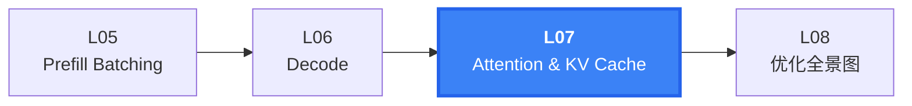
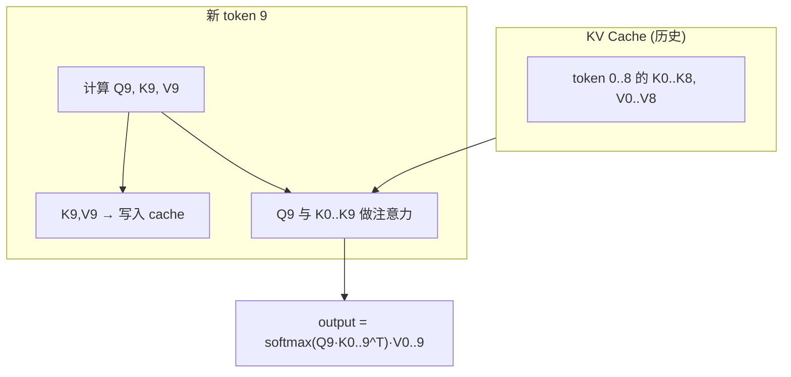
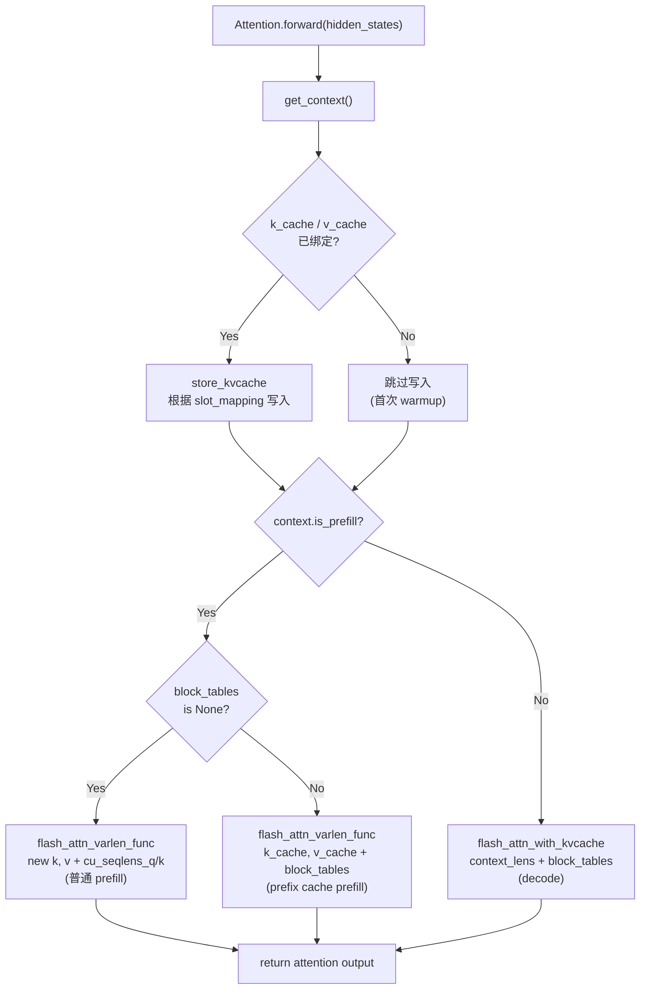
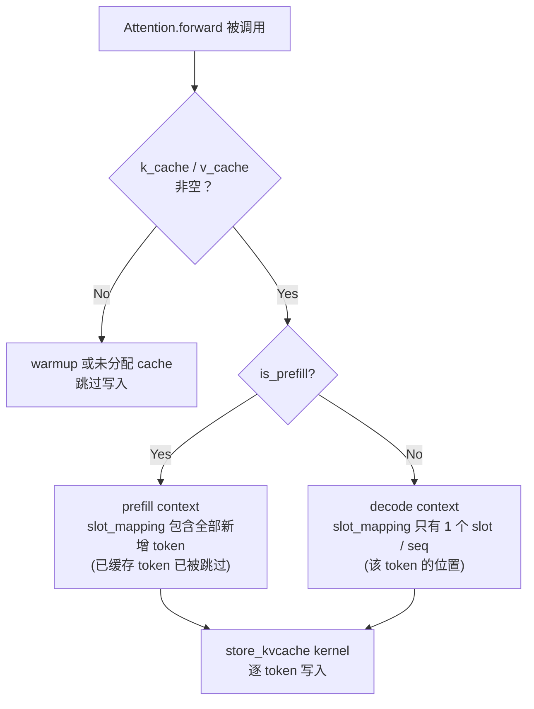
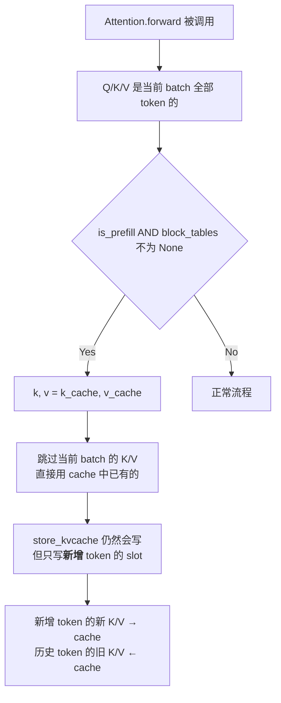
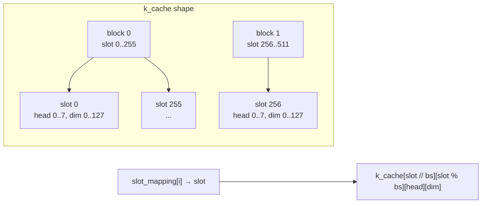
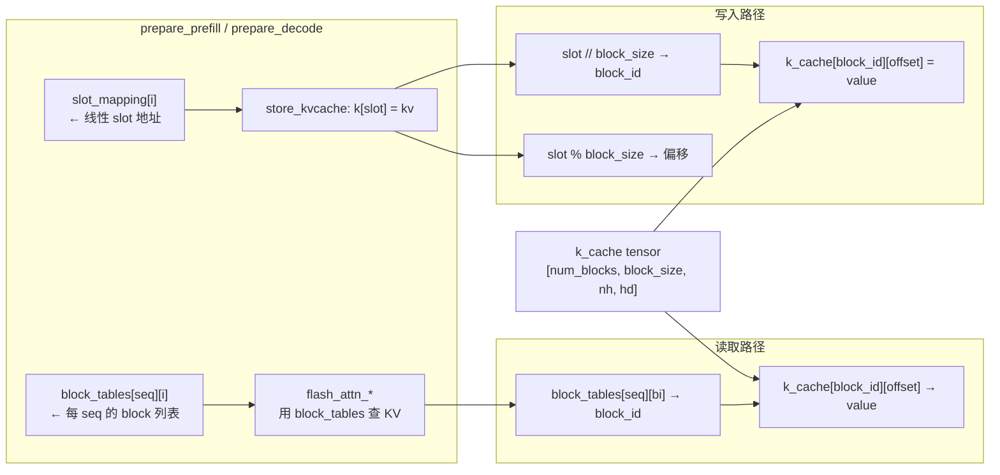
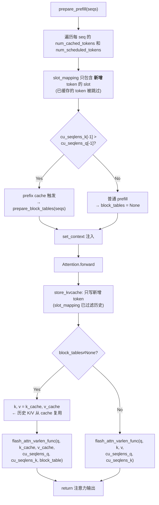

<h1 class="text-4xl font-bold!">第 7 课</h1>
<h2 class="text-2xl mt-4 font-normal opacity-80">Attention：KV 写入与算子分支</h2>

<div class="mt-12 text-sm opacity-60">
nano-vllm 实战课程 · 从源码走读 LLM 推理引擎
</div>

---
layout: default
---

# 本课在课程中的位置



<div v-click class="mt-4 text-sm opacity-80">
  L05/L06 准备了上下文字段。L07 把这些字段真正 <strong>"用"</strong>起来——Attention.forward 如何根据上下文选择不同的计算路径。
</div>

---
layout: default
---

# 1.1 课时安排

把前两课注入的上下文字段真正落到注意力计算函数里。

| 阶段 | 时长 | 内容要点 |
|------|------|----------|
| 原理铺垫 | 15 min | KV Cache 的数学动机（为什么可以只算新 token 的 Q） |
| 代码走读 | 40 min | store_kvcache kernel、prefill 算子 (varlen)、decode 算子 (with_kvcache)、prefix cache 分支 |
| 脚本演示 | 10 min | L07_attention.py 的 4 个 section |
| 动手练习 | 15 min | 模拟 slot_mapping 的 -1 哨兵语义 |
| 答疑讨论 | 10 min | 为什么 prefill 和 decode 用不同的 FlashAttention API |

---
layout: default
---

# 1.2 学习目标

<div class="mt-6 space-y-4">

<div v-click="1" class="flex items-start gap-3 p-3 bg-blue-500/10 border-l-3 border-blue-500 rounded-r">
  <span class="text-blue-400 font-bold">Q1</span>
  <span><code>store_kvcache</code> 在什么条件下触发？它写入的物理地址由什么决定？</span>
</div>

<div v-click="2" class="flex items-start gap-3 p-3 bg-blue-500/10 border-l-3 border-blue-500 rounded-r">
  <span class="text-blue-400 font-bold">Q2</span>
  <span>prefill 与 decode 在注意力算子调用上有什么差异？为什么不能用同一个 API？</span>
</div>

<div v-click="3" class="flex items-start gap-3 p-3 bg-blue-500/10 border-l-3 border-blue-500 rounded-r">
  <span class="text-blue-400 font-bold">Q3</span>
  <span>prefix cache 下 <code>k, v = k_cache, v_cache</code> 为什么要替换？此时 <code>store_kvcache</code> 还会对已缓存的 token 再次写入吗？</span>
</div>

</div>

---
layout: section
---

# 2. 原理说明
## KV Cache 的数学直觉与分支决策

---
layout: default
---

# 2.1 为什么 decode 只需送 1 个 token

历史 token 的 K 和 V 不会因为新 token 的加入而改变：



<div v-click class="mt-3 text-sm opacity-80">
  不需要重算历史 token 的 Q（没人在乎"token 3 关注谁"，只在乎"新 token 9 关注谁"）。不需要重算历史 K/V（它们没变）。只需新 token 的 Q/K/V，其中新 K/V 追加存储。
</div>

---
layout: default
---

# 2.2 Prefill vs Decode：不同 API 的原因

| 场景 | FlashAttention API | 原因 |
|------|-------------------|------|
| Prefill (无 prefix cache) | `flash_attn_varlen_func` | 变长序列，需 cu_seqlens 标记边界 |
| Prefill (有 prefix cache) | `flash_attn_varlen_func` with cache | K/V 来自 cache，用 block_tables 定位 |
| Decode | `flash_attn_with_kvcache` | BS 个查询，每个查不同长度的 cache |

<div v-click class="mt-3 text-sm opacity-80">
  <strong>核心差异</strong>：prefill 处理多个 token 的完整注意力（需要 cu_seqlens 分离不同 seq）；decode 处理单 token 对历史 cache 的查询（每个 seq 恰好 1 个 Q，用 context_lens + block_tables 查询 cache）。
</div>

---
layout: section
---

# 3. 代码走读
## Attention.forward 的完整分支树

---
layout: default
---

# Attention.forward 分支树



---
layout: default
---

# forward 方法完整代码（上）：签名 + KV 写入

<SourceCode file="nanovllm/layers/attention.py" lines="59-63" />

```python
def forward(self, q: torch.Tensor, k: torch.Tensor, v: torch.Tensor):
    context = get_context()                          # ① 取出线程局部的 Context
    k_cache, v_cache = self.k_cache, self.v_cache    # ② 获取绑定的 K/V cache tensor
    if k_cache.numel() and v_cache.numel():          # ③ warmup 后 cache 非空
        store_kvcache(k, v, k_cache, v_cache,        # ④ 将当前 token 的 KV 写入 cache
                      context.slot_mapping)
    ...
```

<div v-click class="mt-3 text-sm">
  <strong>①②③④ 说明</strong>：<br/>
  ① <code>get_context()</code> 返回线程局部变量 <code>_CONTEXT</code>（context.py:L16）。<br/>
  ② <code>k_cache/v_cache</code> 在 <code>allocate_kv_cache()</code> 后绑定到每个 Attention 模块。<br/>
  ③ warmup 阶段 cache 为空（shape [0]），不会触发 store_kvcache。<br/>
  ④ <code>slot_mapping</code> 是 [N] 长度 tensor，每个元素是物理 slot 地址或 -1。
</div>

---

layout: default
---

# forward 方法完整代码（中）：Prefill 分支

<SourceCode file="nanovllm/layers/attention.py" lines="64-70" />

```python
    ...

    if context.is_prefill:                           # ⑤ prefill 还是 decode？
        if context.block_tables is not None:          # ⑥ prefix cache 命中
            k, v = k_cache, v_cache                   # ⑦ 用 cache 中的 K/V 替换
        o = flash_attn_varlen_func(q, k, v,           # ⑧ 变长 batched attention
                                   max_seqlen_q=context.max_seqlen_q,
                                   cu_seqlens_q=context.cu_seqlens_q,
                                   max_seqlen_k=context.max_seqlen_k,
                                   cu_seqlens_k=context.cu_seqlens_k,
                                   softmax_scale=self.scale, causal=True,
                                   block_table=context.block_tables)
    ...
```

<div v-click class="mt-3 text-sm">
  <strong>⑤⑥⑦⑧ 说明</strong>：<br/>
  ⑤ <code>is_prefill</code> 由 prepare_prefill/prepare_decode 设置。<br/>
  ⑥ prefix cache 的判断条件：<code>cu_seqlens_k[-1] > cu_seqlens_q[-1]</code>（model_runner.py:L162）。<br/>
  ⑦ 替换后 K/V 不再是新计算的 tensor，而是 cache 中已有的数据。<br/>
  ⑧ <code>flash_attn_varlen_func</code> 用 cu_seqlens 分隔不同序列。
</div>

---
layout: default
---

# forward 方法完整代码（下）：Decode 分支 + 返回

<SourceCode file="nanovllm/layers/attention.py" lines="71-75" />

```python
    ...

    else:  # decode                                  # ⑨ 逐 token 生成
        o = flash_attn_with_kvcache(                  # ⑩ 带 cache 的注意力
            q.unsqueeze(1), k_cache, v_cache,          # ⑪ q 形状 → [bs, 1, nh, hd]
            cache_seqlens=context.context_lens,        # ⑫ 每 seq 已有的 KV 长度
            block_table=context.block_tables,          # ⑬ 物理 block 映射表
            softmax_scale=self.scale, causal=True)
    return o                                           # ⑭ 返回注意力输出
```

<div v-click class="mt-3 text-sm">
  <strong>⑨-⑭ 说明</strong>：<br/>
  ⑨ decode 每 seq 只处理 1 个 token。⑩ <code>flash_attn_with_kvcache</code> 自动从 cache 查找历史 K/V。<br/>
  ⑪ <code>q.unsqueeze(1)</code> 增加 seqlen=1 维度。⑫ <code>context_lens[i]</code> = seq i 的 cache token 总数。<br/>
  ⑬ <code>block_tables[i][j]</code> = seq i 的第 j 个 block 在 k_cache 中的物理索引。
</div>

---
layout: default
---

# 3.1 store_kvcache：用 slot_mapping 写入 KV cache

<SourceCode file="nanovllm/layers/attention.py" lines="10-30" />

```python
@triton.jit
def store_kvcache_kernel(key_ptr, key_stride, value_ptr, value_stride,
                         k_cache_ptr, v_cache_ptr, slot_mapping_ptr, D: tl.constexpr):
    idx = tl.program_id(0)
    slot = tl.load(slot_mapping_ptr + idx)
    if slot == -1:
        return                          # -1 哨兵：跳过，不写入
    # 按 slot 位置写入 k_cache 和 v_cache
    c_offs = slot * D + tl.arange(0, D)
    k = tl.load(key_ptr + idx * key_stride + tl.arange(0, D))
    tl.store(k_cache_ptr + c_offs, k)
    v = tl.load(value_ptr + idx * value_stride + tl.arange(0, D))
    tl.store(v_cache_ptr + c_offs, v)
```

<div v-click class="mt-2 text-sm">
  🔑 <strong>-1 哨兵</strong>：<code>slot = -1</code> 的 token 直接 return。CUDA Graph replay 时，slot_mapping 预填充为 -1，只覆盖前 bs 个位置。
</div>

---
layout: default
---

# store_kvcache Triton kernel 逐行解读

```python
@triton.jit
def store_kvcache_kernel(
    key_ptr, key_stride, value_ptr, value_stride,   # 输入: 当前 token 的 K/V
    k_cache_ptr, v_cache_ptr,                        # 输出: KV cache tensor
    slot_mapping_ptr, D: tl.constexpr,               # 写入位置映射 + 隐藏维度
):
    idx = tl.program_id(0)                           # ① 一个 program = 一个 token
    slot = tl.load(slot_mapping_ptr + idx)           # ② 读取该 token 的 slot
    if slot == -1: return                            # ③ -1 哨兵：跳过
    key_offsets = idx * key_stride + tl.arange(0, D) # ④ 输入 K 的偏移
    value_offsets = idx * value_stride + tl.arange(0, D)
    key = tl.load(key_ptr + key_offsets)             # ⑤ 加载 K 值
    value = tl.load(value_ptr + value_offsets)
    cache_offsets = slot * D + tl.arange(0, D)       # ⑥ Cache 位置 = slot × D
    tl.store(k_cache_ptr + cache_offsets, key)       # ⑦ 写入 k_cache
    tl.store(v_cache_ptr + cache_offsets, value)     # ⑧ 写入 v_cache
```

<div v-click class="mt-3 text-sm">
  <strong>行号对应</strong>：① = L21, ②-③ = L22-23, ④-⑤ = L24-26, ⑥-⑧ = L28-30。<br/>
  <code>store_kvcache()</code> Python wrapper（L33-L40）做形状断言，以 <code>(N,)</code> 个 program 启动 kernel。<br/>
  <code>D = num_heads × head_dim</code>，在 compile-time 作为 constexpr 展开。
</div>

---

layout: default

# store_kvcache 的调用时机与条件

```python
# attention.py:L62-L63
if k_cache.numel() and v_cache.numel():
    store_kvcache(k, v, k_cache, v_cache, context.slot_mapping)
```



<div v-click class="mt-3 text-sm">
  <strong>关键条件</strong>：<br/>
  - <code>k_cache.numel() > 0</code> 保证 cache 已分配（warmup 后）。<br/>
  - slot_mapping 在 prepare_prefill/prepare_decode 中构造。<br/>
  - CUDA Graph replay 时 <code>fill_(-1)</code> 再覆盖前 bs 个位置 → 未使用的 slot 自动跳过（-1 哨兵）。
</div>

---
layout: default
---

# 3.2 Prefill 分支：varlen_func

<SourceCode file="nanovllm/layers/attention.py" lines="64-70" />

```python
if context.is_prefill:
    if context.block_tables is not None:        # prefix cache 命中
        k, v = self.k_cache, self.v_cache      # 用缓存的 K/V 替代新计算的
    output = flash_attn_varlen_func(
        q, k, v,
        max_seqlen_q=context.max_seqlen_q,
        cu_seqlens_q=context.cu_seqlens_q,
        max_seqlen_k=context.max_seqlen_k,
        cu_seqlens_k=context.cu_seqlens_k,
        block_table=context.block_tables,       # 仅在 prefix cache 时有值
        softmax_scale=self.scale,
        causal=True,
    )
```

---
layout: default
---

# varlen_func 的参数映射

| flash_attn_varlen_func 参数 | Context 字段 | 含义 | 来源 |
|---|---|---|---|
| <code>q, k, v</code> | — | 输入 tensor | 模型 forward 输出 |
| <code>max_seqlen_q</code> | <code>context.max_seqlen_q</code> | batch 中最长 Q 序列长度 | prepare_prefill 计算 |
| <code>cu_seqlens_q</code> | <code>context.cu_seqlens_q</code> | Q 侧变长序列累积边界 | prepare_prefill 构造 |
| <code>max_seqlen_k</code> | <code>context.max_seqlen_k</code> | cache 中最长 K 序列长度 | prepare_prefill 计算 |
| <code>cu_seqlens_k</code> | <code>context.cu_seqlens_k</code> | K 侧变长序列累积边界 | prepare_prefill 构造 |
| <code>block_table</code> | <code>context.block_tables</code> | 物理 block 映射表（prefix cache 时） | prepare_block_tables |
| <code>softmax_scale</code> | <code>self.scale</code> | 注意力缩放系数 | Attention.__init__ |
| <code>causal</code> | 固定 <code>True</code> | 因果掩码 | 始终开启 |

<div v-click class="mt-3 text-sm">
  <strong>注意</strong>：prefix cache 命中时 <code>k, v</code> 被替换为 <code>k_cache, v_cache</code>，其余参数不变。<br/>
  <code>block_table</code> 仅在 <code>block_tables is not None</code> 时传入，否则为 <code>None</code>。
</div>

---
layout: default
---

# 3.3 Decode 分支：with_kvcache

<SourceCode file="nanovllm/layers/attention.py" lines="71-75" />

```python
else:  # decode
    output = flash_attn_with_kvcache(
        q, k, v,
        cache_seqlens=context.context_lens,     # 每个 seq 的有效 KV 长度
        block_table=context.block_tables,       # 每个 seq 的物理 block 列表
        softmax_scale=self.scale,
        causal=True,
    )
```

<div v-click class="mt-3 text-sm">
  <strong>参数对比</strong>：
  <ul class="mt-1 space-y-1">
    <li>prefill 用 <code>cu_seqlens_q/k</code> — 变长序列的累积边界数组</li>
    <li>decode 用 <code>cache_seqlens</code> — 每个 seq 的一个整数，表示 cache 中已有的 KV 长度</li>
    <li>decode 的 <code>k, v</code> 是<strong>新 token 的</strong>（形状 [bs, 1, num_heads, head_dim]）</li>
    <li>prefill 的 <code>k, v</code> 是<strong>所有 token 的</strong>（形状 [total_tokens, num_heads, head_dim]）</li>
  </ul>
</div>

---
layout: default
---

# with_kvcache 的参数映射

| flash_attn_with_kvcache 参数 | Context 字段 | 含义 | 来源 |
|---|---|---|---|
| <code>q</code> | — | 新 token 的 Q（形状 [bs, 1, nh, hd]） | 模型 forward, <code>q.unsqueeze(1)</code> |
| <code>k_cache, v_cache</code> | <code>self.k_cache, self.v_cache</code> | 历史 K/V 缓存 tensor | allocate_kv_cache 后绑定 |
| <code>cache_seqlens</code> | <code>context.context_lens</code> | 每个 seq 的 cache 中 token 数 | prepare_decode 构造 |
| <code>block_table</code> | <code>context.block_tables</code> | 物理 block 映射表 | prepare_block_tables |
| <code>softmax_scale</code> | <code>self.scale</code> | 注意力缩放系数 | Attention.__init__ |
| <code>causal</code> | 固定 <code>True</code> | 因果掩码 | 始终开启 |

<div v-click class="mt-3 text-sm">
  <strong>与 prefill 的关键差异</strong>：<br/>
  - q 传入前做了 <code>unsqueeze(1)</code>，增加 seqlen=1 维度。<br/>
  - K/V 永远是 cache tensor（prefill 中 K/V 可以是新计算的）。<br/>
  - 参数名 <code>cache_seqlens</code>（一维数组）vs prefill 的 <code>cu_seqlens_q/k</code>（累积边界数组）。
</div>

---
layout: default
---

# 3.4 Prefix cache 命中时的特殊处理



<div v-click class="mt-3 text-sm">
  💡 <strong>关键</strong>：prefix cache 仅影响 prefill 的注意力输入（用 cache 中的 K/V 替代新计算的），不影响 <code>store_kvcache</code> 的行为——slot_mapping 中的 <code>-1</code> 已经排除了已缓存的 token。
</div>

---
layout: default

# 三个分支的完整代码路径对比

```mermaid {scale: 0.5}
flowchart TD
    subgraph WARMUP["Warmup"]
        W1["is_prefill=True"] --> W2["k_cache.numel=0 → skip store_kvcache"]
        W2 --> W3["block_tables=None → 普通 prefill"]
        W3 --> W4["flash_attn_varlen_func(q, k, v, cu_seqlens_q, cu_seqlens_k)"]
    end
    subgraph PREFILL["普通 Prefill"]
        P1["is_prefill=True"] --> P2["k_cache.numel>0 → store_kvcache"]
        P2 --> P3["block_tables=None"]
        P3 --> P4["flash_attn_varlen_func(q, k, v, cu_seqlens_q, cu_seqlens_k)"]
    end
    subgraph PCP["Prefix-Cache Prefill"]
        C1["is_prefill=True"] --> C2["k_cache.numel>0 → store_kvcache<br/>(仅新增 token)"]
        C2 --> C3["block_tables≠None → k,v = k_cache,v_cache"]
        C3 --> C4["flash_attn_varlen_func(q, k_cache, v_cache, cu_seqlens_q, cu_seqlens_k, block_table=…)"]
    end
    subgraph DECODE["Decode"]
        D1["is_prefill=False"] --> D2["k_cache.numel>0 → store_kvcache"]
        D2 --> D3["q.unsqueeze(1)"]
        D3 --> D4["flash_attn_with_kvcache(q.unsqueeze(1), k_cache, v_cache, cache_seqlens, block_table)"]
    end
```



<div v-click class="mt-2 text-sm opacity-80">
  四条路径共享 <code>get_context()</code> 和 <code>k_cache/v_cache</code> 绑定逻辑，分歧点只有三个：是否写 cache、是否替换 K/V、调用哪个 FlashAttention API。
</div>

---

layout: default

# KV cache tensor 的物理布局

<SourceCode file="nanovllm/engine/model_runner.py" lines="103-121" />

```python
# allocate_kv_cache 中分配 (model_runner.py:L115)
self.kv_cache = torch.empty(
    2,                                     # [0] = k_cache, [1] = v_cache
    hf_config.num_hidden_layers,            # 每层独立 cache
    config.num_kvcache_blocks,              # 总 block 数
    self.block_size,                        # block_size = 256
    num_kv_heads // world_size,             # TP 分片后的 KV head 数
    head_dim,                               # head_dim = 128
)
```



<div v-click class="mt-2 text-sm">
  Triton kernel 中的访问：<code>cache_offsets = slot * D + tl.arange(0, D)</code>，其中 <code>D = num_heads × head_dim</code>。<br/>
  每层 <code>k_cache</code> 的形状是 <code>[num_blocks, block_size, num_heads, head_dim]</code>。
</div>

---

layout: default

# 注意力计算量对比

| 维度 | Prefill | Decode |
|------|---------|--------|
| Q token 数 | 变长（多个 token） | 每 seq 1 个 |
| K/V token 数 | = Q token 数 | 历史生成的全部 token |
| 注意力矩阵 | Q_len × K_len | bs × 1 × total_cache_len |
| 单层 FLOPs | 2 × Q_len × K_len × head_dim × num_heads | 2 × 1 × total_cache_len × head_dim × num_heads |
| 计算瓶颈 | <strong>Compute-bound</strong> | <strong>Memory-bound</strong> |
| 主要开销 | 矩阵乘法 MFU | KV cache 访存带宽 |
| 典型优化 | Tensor Parallel, FlashAttention | CUDA Graph, KV cache 量化 |

<div v-click class="mt-3 p-3 bg-gray-800/50 rounded text-sm">
  <strong>具体数值</strong>（Qwen3-0.6B, head_dim=128, 8 KV heads, bs=16, 每 seq 已有 1000 tokens）：<br/>
  Prefill（512 tokens/seq）：FLOPs ≈ 2 × 512 × 512 × 128 × 8 × 16 ≈ <strong>8.6 TFLOPS</strong>/layer<br/>
  Decode（1 token/seq）：FLOPs ≈ 2 × 1 × 1000 × 128 × 8 × 16 ≈ <strong>32.8 GFLOPS</strong>/layer<br/>
  两者相差约 <strong>260 倍</strong>——decode 的瓶颈明显在显存带宽而非算力。
</div>

---

layout: default

# slot_mapping → store_kvcache → block_tables 的数据流



<div v-click class="mt-2 text-sm">
  <strong>两个概念服务于不同目的</strong>：<br/>
  <code>slot_mapping</code> → <strong>写入</strong>：将新 token 的 K/V 存入连续线性地址。<br/>
  <code>block_tables</code> → <strong>读取</strong>：注意力 kernel 按 block 列表分段读取 cache。<br/>
  转换关系：<code>slot = block_id × block_size + offset</code>。
</div>

---

layout: default

# prefix cache 命中时的完整执行路径



<div v-click class="mt-2 text-sm">
  <strong>验证点</strong>：slot_mapping 的 range 是 <code>[num_cached_tokens, num_cached_tokens + num_scheduled_tokens)</code>。<br/>
  store_kvcache 不会对已缓存的 token 重复写入（它们不在 slot_mapping 中）。<br/>
  k,v = k_cache,v_cache 替换的是<strong>注意力计算的输入</strong>，不是 KV 写入逻辑。
</div>

---

layout: section

# 4. L07 验证脚本
## L07_attention.py 走读

---
layout: default
---

# §1：store_kvcache 的 -1 哨兵验证

```python
def store_kv_sim(cache, slot_mapping, keys, values):
    for idx, slot in enumerate(slot_mapping):
        if slot == -1:
            continue
        cache[slot] = (keys[idx], values[idx])
    return cache

cache = {}
store_kv_sim(cache,
    slot_mapping=[10, -1, 12, -1, 15],
    keys=["k0", "k1", "k2", "k3", "k4"],
    values=["v0", "v1", "v2", "v3", "v4"],
)
# → cache = {10: (k0,v0), 12: (k2,v2), 15: (k4,v4)}
# → 只写入 3 个条目, 跳过 idx=1 和 idx=3
```

<div v-click class="mt-3 text-sm">
  <strong>CUDA Graph 场景</strong>：slot_mapping 预填充为全 -1（<code>fill_(-1)</code>），然后只覆盖前 bs 个位置。graph replay 时没有实际 token 的 slot 仍是 -1，kernel 自动跳过。
</div>

---

layout: default

# §2：注意力分支决策树验证

```python
def attention_branch(context):
    steps = []
    if context["has_cache"]:
        steps.append("k_cache/v_cache 已绑定 → store_kvcache")
    else:
        steps.append("未绑定 → 跳过 KV 写入（warmup）")
    if context["is_prefill"]:
        if context.get("has_block_tables"):
            steps.append("prefill + block_tables≠None → prefix cache 分支")
            steps.append("k, v = k_cache, v_cache")
            api = "flash_attn_varlen_func(q, k_cache, v_cache, …block_table=…)"
        else:
            steps.append("prefill + block_tables=None → 普通 prefill")
            api = "flash_attn_varlen_func(q, k, v, …)"
    else:
        steps.append("decode → flash_attn_with_kvcache")
        api = "flash_attn_with_kvcache(q.unsqueeze(1), …)"
    return api, steps
```

<div v-click class="mt-3 text-sm">
  验证 4 个场景：warmup prefill、普通 prefill、prefix cache prefill、decode — 检查每步决策和 API 是否与 attention.py:L59-L75 一致。
</div>

---

layout: default

# §3-4：prefix cache 触发条件 + 真实 Context 类

<div class="grid grid-cols-2 gap-3 mt-3 text-sm">
<div class="bg-purple-500/10 p-3 rounded">
  <strong>§3: prefix cache 触发条件</strong><br/>
  cu_k[-1] > cu_q[-1] → need_bt<br/>
  验证两个元组的预期布尔值
</div>
<div class="bg-yellow-500/10 p-3 rounded">
  <strong>§4: 真实 Context 类 + store_kvcache</strong><br/>
  分配 (4,256,8,128) K/V cache tensor<br/>
  用 3 个模拟 token 写入并验证
</div>
</div>

---
layout: default
---

# 4.1 课堂练习

```python
# 用 Python 伪代码复现 "slot == -1 时跳过写入" 的语义
def store_kv_sim(k_cache, v_cache, slot_mapping, k_new, v_new):
    """模拟 store_kvcache 的写入行为"""
    for idx, slot in enumerate(slot_mapping):
        if slot == -1:
            continue                      # -1 哨兵：直接跳过
        k_cache[slot] = k_new[idx]
        v_cache[slot] = v_new[idx]

# CUDA Graph 场景
slot_mapping = [-1] * 8                   # 预填充为全 -1
slot_mapping[:3] = [10, 12, 15]           # 只设前 bs=3 个
store_kv_sim(kc, vc, slot_mapping, k, v)
# → 只写入 slot 10, 12, 15
```

<div v-click class="mt-3 text-sm opacity-80">
  📍 验收要点：Triton kernel 在 <code>slot == -1</code> 时直接 return（<code>attention.py:L21-L24</code>）；decode 的 graph replay 会先 <code>fill_(-1)</code> 再覆盖有效部分。
</div>

---
layout: default
---

# 4.2 课后自测题

<SelfTest
  id="l07-q1"
  type="text"
  question="1. -1 哨兵跳过无效位置 vs 只传有效 slot 数组——两种设计在 CUDA Graph 场景下的差异是什么？"
  answer="<strong>-1 哨兵</strong>：slot_mapping 是固定大小的 tensor，CUDA Graph capture 时的大小确定了，replay 时通过 <code>fill_(-1)</code> 然后覆盖前 bs 个位置。不需要修改 tensor 大小。<br><strong>只传有效 slot</strong>：需要动态大小的 tensor——不同 batch size 需要不同长度的 slot_mapping。这会导致 CUDA Graph 需要为每个 batch size 单独 capture（nano-vllm 已经这样做），但 tensor 形状本身就分层了。<br>实际上 nano-vllm 两种都用：为每个 bs 捕获不同的 graph（形状不同），同时在 graph replay 时用 -1 哨兵填充固定形状中未使用的尾部位置。"
/>

<SelfTest
  id="l07-q2"
  type="text"
  question="2. flash_attn_varlen_func 和 flash_attn_with_kvcache 的参数差异——为什么 prefill 需要 cu_seqlens 而 decode 需要 cache_seqlens？"
  answer="<strong>prefill 用 cu_seqlens</strong>：一个 batch 中有多个不等长序列，每个序列内部又是多个 Q token 对应多个 K token。需要 <code>cu_seqlens_q</code> 分割 Q token、<code>cu_seqlens_k</code> 分割 K token——每个 seq 内部的注意力矩阵大小不同。<br><strong>decode 用 cache_seqlens</strong>：每个 seq 只有 1 个 Q token，因此 Q 侧不需要分割。K/V 都在 cache 中，只需知道每个 seq 的 cache 长度（<code>cache_seqlens[i]</code>）和 block 列表（<code>block_tables[i]</code>），kernel 自己累计查找。"
/>

---
layout: default
---

# 4.2 课后自测题（续）

<SelfTest
  id="l07-q3"
  type="text"
  question="3. prefix cache 命中时 k,v = k_cache, v_cache，此时 store_kvcache 还会对 prefix token 再次调用吗？如果调用了，会覆盖已有数据吗？"
  answer="<strong>不会对 prefix token 重复写入</strong>：store_kvcache 依赖 slot_mapping 决定写入位置。在 prepare_prefill 中，slot_mapping 只包含<strong>本轮新增</strong> token 的槽位——已缓存 token 的槽位根本不在 slot_mapping 中。因此 store_kvcache kernel 遍历 idx 时，每个 idx 对应的 slot 都是新增 token 的物理位置，不会覆盖已缓存的 block。<br><strong>验证</strong>：回顾 L05 的 prepare_prefill——<code>start = seq.num_cached_tokens</code>，<code>end = start + seq.num_scheduled_tokens</code>。slot_mapping 的 range 是 <code>[start, end)</code>——已经跳过了已缓存的 token。"
/>

---
layout: center
---

# 🎉 第 7 课完成

<div class="mt-6 text-lg opacity-80">
  掌握了 Attention 的 KV 写入机制与三种分支路径
</div>

<div class="mt-4 grid grid-cols-4 gap-3 text-sm max-w-2xl mx-auto">
  <div class="bg-blue-500/10 p-3 rounded">✅ store_kvcache</div>
  <div class="bg-green-500/10 p-3 rounded">✅ varlen_func</div>
  <div class="bg-purple-500/10 p-3 rounded">✅ with_kvcache</div>
  <div class="bg-yellow-500/10 p-3 rounded">✅ prefix cache 分支</div>
</div>

<div class="mt-10">
  <a href="#" class="text-blue-400 hover:underline text-lg">下一课：优化全景图 →</a>
</div>
