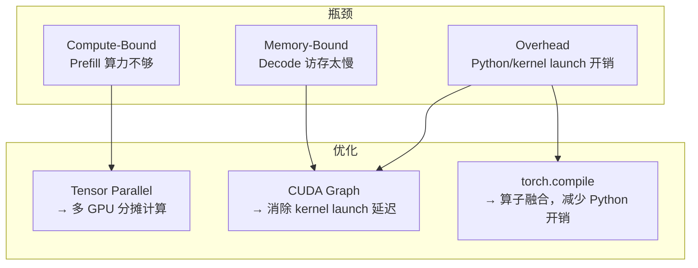
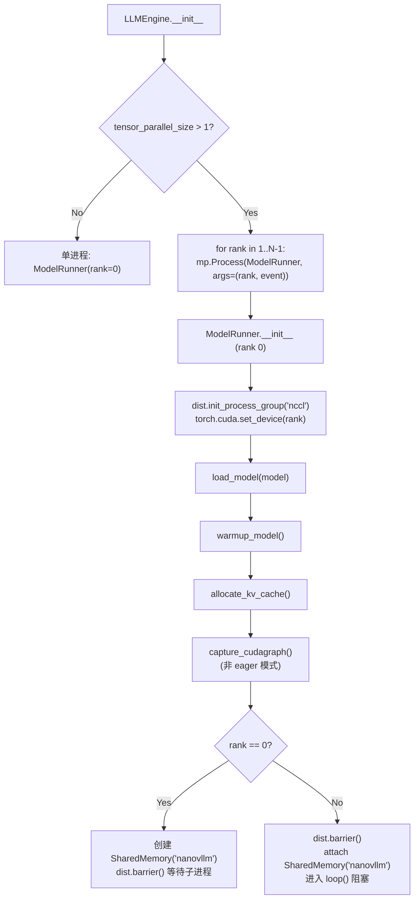
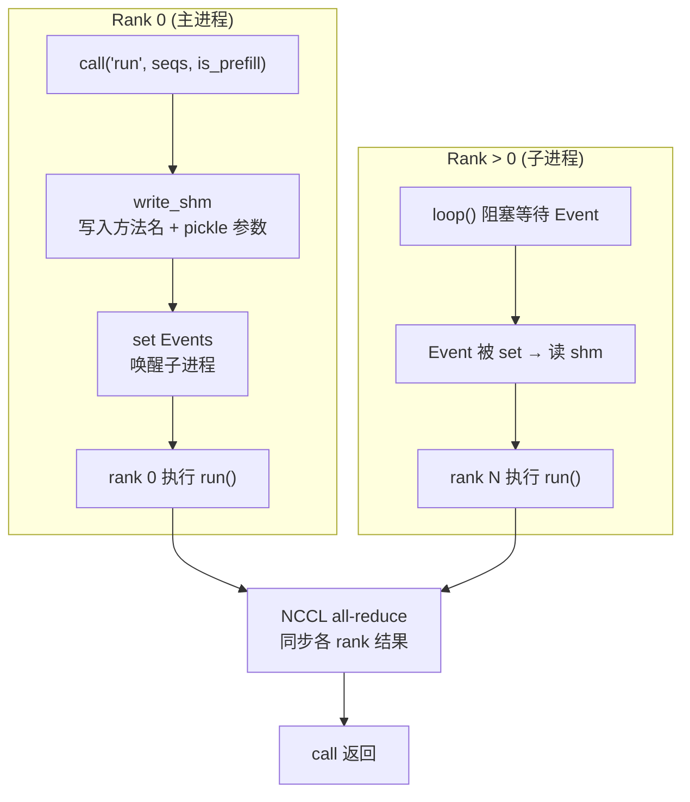
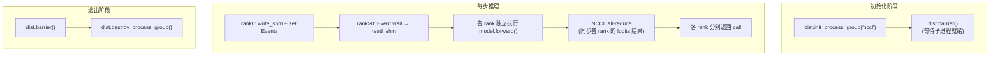

<h1 class="text-4xl font-bold!">第 8 课</h1>
<h2 class="text-2xl mt-4 font-normal opacity-80">常见优化的「位置感」</h2>

<div class="mt-12 text-sm opacity-60">
nano-vllm 实战课程 · 源码拆解 LLM 推理引擎
</div>

---
layout: default
<!-- 讲解：本课封面，介绍课程主题——常见优化（TP、CUDA Graph、torch.compile）的"位置感"。 -->
---

# 本课在课程中的位置

<div style="height: 50px;"></div>
<div class="mt-4 text-sm max-w-2xl mx-auto">

<div class="flex justify-center gap-1 mb-2">
  <div class="bg-gray-700 text-gray-200 rounded px-3 py-1.5 w-28 text-center">L01<br/><span class="text-xs text-gray-400">generate→step</span></div>
  <div class="flex items-center text-gray-400 text-lg">→</div>
  <div class="bg-gray-700 text-gray-200 rounded px-3 py-1.5 w-28 text-center">L02<br/><span class="text-xs text-gray-400">Sequence</span></div>
  <div class="flex items-center text-gray-400 text-lg">→</div>
  <div class="bg-gray-700 text-gray-200 rounded px-3 py-1.5 w-28 text-center">L03<br/><span class="text-xs text-gray-400">调度器</span></div>
  <div class="flex items-center text-gray-400 text-lg">→</div>
  <div class="bg-gray-700 text-gray-200 rounded px-3 py-1.5 w-28 text-center">L04<br/><span class="text-xs text-gray-400">Block 管理</span></div>
</div>

<div class="flex justify-center mb-1">
  <div class="text-gray-400 text-lg">↓</div>
</div>

<div class="flex justify-center gap-1">
  <div class="bg-gray-700 text-gray-200 rounded px-3 py-1.5 w-28 text-center">L05<br/><span class="text-xs text-gray-400">Prefill</span></div>
  <div class="flex items-center text-gray-400 text-lg">→</div>
  <div class="bg-gray-700 text-gray-200 rounded px-3 py-1.5 w-28 text-center">L06<br/><span class="text-xs text-gray-400">Decode</span></div>
  <div class="flex items-center text-gray-400 text-lg">→</div>
  <div class="bg-gray-700 text-gray-200 rounded px-3 py-1.5 w-28 text-center">L07<br/><span class="text-xs text-gray-400">Attention</span></div>
  <div class="flex items-center text-gray-400 text-lg">→</div>
  <div class="bg-blue-600 text-white rounded px-3 py-1.5 font-bold w-28 text-center">L08<br/><span class="text-xs font-normal opacity-80">优化全景</span></div>
</div>

</div>

<div v-click class="mt-4 p-3 bg-blue-500/10 border-l-3 border-blue-500 rounded-r text-sm">
  前 7 课覆盖了推理引擎的完整功能。L08 站在更高的视角——三种常见优化（TP、CUDA Graph、torch.compile）分别住在代码的哪里、攻击什么瓶颈。
</div>

---
layout: default
<!-- 讲解：展示 L01-L08 的课程地图，标注 L08 在本课程中的位置。 -->
---

# 1.1 课时安排

建立一张"优化地图"——三种常见优化（TP、CUDA Graph、torch.compile）分别"住在"代码的哪里。

| 阶段 | 时长 | 内容要点 |
|------|------|----------|
| 概念回顾 | 10 min | 回顾推理主链路，标注"优化可以作用的位置" |
| 代码走读 | 35 min | TP 进程模型、CUDA Graph capture/replay、torch.compile 位置 |
| 脚本演示 | 10 min | L08_optimizations.py 的 4 个 section |
| 动手练习 | 15 min | 复刻 replay 判定条件 |
| 答疑讨论 | 20 min | 这些优化分别影响延迟/吞吐/显存的哪个维度 |

---
layout: default
<!-- 讲解：本课的课时安排，包括概念回顾、代码走读、脚本演示、动手练习和答疑讨论。 -->
---

# 1.2 学习目标

<div class="mt-6 space-y-4">

<div v-click="1" class="flex items-start gap-3 p-3 bg-blue-500/10 border-l-3 border-blue-500 rounded-r">
  <span class="text-blue-400 font-bold">Q1</span>
  <span>Tensor Parallel 的进程模型在代码中的入口在哪？rank0 和子进程之间如何通信？</span>
</div>

<div v-click="2" class="flex items-start gap-3 p-3 bg-blue-500/10 border-l-3 border-blue-500 rounded-r">
  <span class="text-blue-400 font-bold">Q2</span>
  <span>CUDA Graph replay 的触发条件是什么？为什么它只覆盖 decode 的一部分场景？</span>
</div>

<div v-click="3" class="flex items-start gap-3 p-3 bg-blue-500/10 border-l-3 border-blue-500 rounded-r">
  <span class="text-blue-400 font-bold">Q3</span>
  <span><code>torch.compile</code> 出现在哪个模块上？为什么只编译采样模块，而不是整个 Transformer？</span>
</div>

</div>

---
layout: section
<!-- 讲解：三个核心学习问题——TP 进程模型、CUDA Graph replay 触发条件、torch.compile 的位置选择。 -->
---

# 2. 原理说明
## 三种优化各自攻击的瓶颈

---
layout: default
<!-- 讲解：进入原理说明部分，介绍三种优化各自攻击的瓶颈。 -->
---

# 三种瓶颈与对应的优化

<div class="flex justify-center">

</div>

<div v-click class="mt-3 p-3 bg-blue-500/10 border-l-3 border-blue-500 rounded-r text-sm">
  三种优化不互斥，存在于代码的不同位置。本课不深入实现细节，而是建立"在哪里、触发条件是什么"的位置感。
</div>

---
layout: default
<!-- 讲解：用流程图展示 Compute-Bound、Memory-Bound、Overhead 三种瓶颈与 TP、CUDA Graph、torch.compile 三种优化的对应关系。 -->
---

# 优化地图一览

| 优化 | 攻击瓶颈 | 代码入口 | 覆盖范围 |
|------|----------|----------|----------|
| **Tensor Parallel** | Compute (算力) | `llm_engine.py:L22-L34` `model_runner.py:L41-L89` | 整个模型执行 |
| **CUDA Graph** | Kernel launch 延迟 | `model_runner.py:L222-L257` (capture) `model_runner.py:L195-L212` (replay) | Decode 路径 |
| **torch.compile** | Python 解释器开销 | `sampler.py:L5-L12` | 采样模块 |

---
layout: section
<!-- 讲解：用表格汇总三种优化的攻击瓶颈、代码入口和覆盖范围。 -->
---

# 3. 代码走读
## 三种优化的代码位置

---
layout: default
<!-- 讲解：进入代码走读部分，深入三种优化的代码实现位置。 -->
---

# 3.1 Tensor Parallel：多进程 + 共享内存广播

<SourceCode file="nanovllm/engine/llm_engine.py" lines="22-34" />

```python
# LLMEngine.__init__ 中启动 TP 子进程
if config.tensor_parallel_size > 1:
    for rank in range(1, config.tensor_parallel_size):
        p = mp.Process(target=ModelRunner, args=(config, rank, ...))
        p.start()
```

<SourceCode file="nanovllm/engine/model_runner.py" lines="76-89" />

```python
def call(self, method_name, *args):
    if self.world_size > 1 and self.rank == 0:
        self.write_shm(method_name, *args)
    method = getattr(self, method_name, None)
    return method(*args)
```

<div v-click class="mt-3 p-3 bg-green-500/10 border-l-3 border-green-500 rounded-r text-sm">
  <strong>要点</strong>：rank0 将方法名+参数写入共享内存，所有 rank 通过 <code>getattr</code> 调用同名方法。NCCL all-reduce 在 linear 层内部隐式触发，call() 中无显式 barrier。
</div>

---
layout: default
<!-- 讲解：展示 TP 子进程启动代码，以及 call() 方法如何广播方法调用到子进程。 -->
---

# TP 初始化完整流程

<div class="flex justify-center">

</div>

<div v-click class="mt-2 text-sm">
  <strong>启动时序</strong>：rank0 先完成模型加载 → 创建共享内存 → barrier 释放子进程 → 子进程 attach 内存 → 进入 loop 等待命令。<br/>
  <code>ModelRunner</code> 同一份代码兼具两种角色：rank0 执行 forward + 管理，rank>0 执行 loop 等待 Event。
</div>

---

layout: default

<!-- 讲解：展示 TP 初始化完整的 mermaid 流程图，包括 init_process_group、模型加载、shm 创建和子进程 loop。 -->
---

# TP call() 方法逐行解读

```python
def call(self, method_name, *args):
    # model_runner.py:L85-L89
    if self.world_size > 1 and self.rank == 0:
        self.write_shm(method_name, *args)  # ① 写 shm + set Events
    method = getattr(self, method_name, None)
    return method(*args)                     # ② rank 0 直接调用
                                            # ③ rank>0 通过 loop()→call() 递归
```

```python
def write_shm(self, method_name, *args):
    # model_runner.py:L76-L83
    data = pickle.dumps([method_name, *args])  # ① pickle 序列化
    n = len(data)
    self.shm.buf[0:4] = n.to_bytes(4, "little") # ② 写长度到前 4 字节
    self.shm.buf[4:n+4] = data                   # ③ 写数据
    for event in self.event:
        event.set()                              # ④ 唤醒所有子进程
```

```python
def loop(self):                                 # rank>0 的主循环
    # model_runner.py:L61-L66
    while True:
        method_name, args = self.read_shm()     # ① 阻塞等 Event
        self.call(method_name, *args)            # ② 递归调 call()
        if method_name == "exit":                # ③ exit 时退出
            break
```

<div v-click class="mt-3 p-3 bg-green-500/10 border-l-3 border-green-500 rounded-r text-sm">
  <strong>要点</strong>：rank0 将方法名+参数 pickle 后写入共享内存，子进程反序列化后调用。NCCL 同步在 <code>call</code> 返回前由 linear 层的 all-reduce 触发。
</div>

---

layout: default

<!-- 讲解：逐行解读 call()、write_shm()、loop() 三个方法的实现细节。 -->
---

# TP 通信模型

<div class="flex justify-center">

</div>

---
layout: default
<!-- 讲解：展示 mermaid 流程图，说明 rank 0 和子进程之间的通信模型。 -->
---

# TP 的 NCCL 同步点

Tensor Parallel 涉及多处 NCCL 集合通信操作，覆盖整个模型生命周期：

<div class="flex justify-center">


</div>

<div v-click class="mt-3 text-sm">
  代码中所有 <code>dist.barrier()</code> 调用点（model_runner.py）：
  <ul>
    <li>L44/L46：init 阶段 barrier → 确保 shm 创建完毕</li>
    <li>L53：exit 阶段 barrier → 确保所有 rank 完成</li>
    <li>L85-89 (call 方法)：rank0 写 shm + 直接执行，无显式 barrier（NCCL all-reduce 在 TP linear 层内部触发）</li>
  </ul>
  NCCL all-reduce 在 <code>model.compute_logits()</code> 内部隐式调用（TP linear 层自动触发）。
</div>

---
layout: default
<!-- 讲解：列举所有 dist.barrier() 的位置，澄清 call() 方法内无显式 barrier。 -->
---

# 3.2 CUDA Graph：capture

<SourceCode file="nanovllm/engine/model_runner.py" lines="222-257" />

```python
@torch.inference_mode()
def capture_cudagraph(self):
    if self.enforce_eager:
        return
    max_bs = min(self.config.max_num_seqs, 512)
    max_nb = (self.config.max_model_len + self.block_size - 1) // self.block_size
    # 预分配 tensor（固定地址，CUDA Graph 录制地址后 replay 读同一地址）
    input_ids = torch.zeros(max_bs, dtype=torch.int64)
    positions = torch.zeros(max_bs, dtype=torch.int64)
    slot_mapping = torch.zeros(max_bs, dtype=torch.int32)
    context_lens = torch.zeros(max_bs, dtype=torch.int32)
    block_tables = torch.zeros(max_bs, max_nb, dtype=torch.int32)
    outputs = torch.zeros(max_bs, self.config.hf_config.hidden_size)
    self.graph_bs = [1, 2, 4, 8] + list(range(16, max_bs + 1, 16))
    self.graphs = {}
    for bs in reversed(self.graph_bs):
        g = torch.cuda.CUDAGraph()
        set_context(False, slot_mapping=slot_mapping[:bs], context_lens=context_lens[:bs], block_tables=block_tables[:bs])
        outputs[:bs] = self.model(input_ids[:bs], positions[:bs])  # warmup
        with torch.cuda.graph(g, self.graph_pool):                  # capture
            outputs[:bs] = self.model(input_ids[:bs], positions[:bs])
        self.graphs[bs] = g
        torch.cuda.synchronize()
        reset_context()
    self.graph_vars = dict(input_ids=input_ids, positions=positions,
        slot_mapping=slot_mapping, context_lens=context_lens, block_tables=block_tables, outputs=outputs)
```

<div v-click class="mt-3 p-3 bg-green-500/10 border-l-3 border-green-500 rounded-r text-sm">
  在 <code>ModelRunner.__init__</code> 的 warmup 后调用。graph 字典覆盖 <code>[1, 2, 4, 8, 16, 32, ..., max_bs]</code>，replay 时按 bs 选择最近的 bucket。
</div>

---
layout: default
<!-- 讲解：展示 capture_cudagraph() 的完整代码，包括预分配、warmup 和录制流程。 -->
---

# capture_cudagraph 逐段解读

```

@torch.inference_mode()
def capture_cudagraph(self):
    if self.enforce_eager:                  # ① eager 模式跳过
        return
    max_bs = min(config.max_num_seqs, 512)  # ② 不超过 512
    # ┄ 预分配 tensor ┄
    input_ids = torch.zeros(max_bs, ...)    # ③ 固定最大形状
    slot_mapping = torch.zeros(max_bs, ...)
    block_tables = torch.zeros(max_bs, max_num_blocks, ...)
    
    self.graph_bs = [1,2,4,8] + list(range(16, max_bs+1, 16))
    for bs in reversed(self.graph_bs):      # ④ 从大到小 capture
        graph = torch.cuda.CUDAGraph()
        set_context(..., slot_mapping[:bs], ...)   # ⑤ 按 bs 设上下文
        outputs[:bs] = model(input_ids[:bs], ...)  # ⑥ warmup → 触发编译
        with torch.cuda.graph(graph, pool):         # ⑦ 录制开始
            outputs[:bs] = model(input_ids[:bs], ...)
        self.graphs[bs] = graph                    # ⑧ 存入字典
```

<div v-click class="mt-2 text-sm">
  <strong>关键点</strong>：<br/>
  ① enforce_eager 时完全跳过 capture。② 最大 bs 512（硬编码阈值）。③ 所有 tensor 按 max_bs 预分配，只 slice 前 bs 个给 graph。<br/>
  ④ 从大到小 capture 确保 graph pool 覆盖所有 bucket。⑤ 注入对应 bs 的 context。⑥ warmup 触发 Triton 编译，确保 capture 时不包含编译延迟。⑦ capture 在 <code>torch.cuda.graph</code> 上下文管理器内自然录制。⑧ <code>self.graphs</code> 字典按 bs 索引。
</div>

---

layout: default
<!-- 讲解：逐段解读 capture 过程中的关键步骤——enforce_eager 检查、max_bs 限制、set_context、warmup 和 capture 的分离。 -->
---

# graph_vars 的设计：为什么用预分配 tensor

```python
# capture_cudagraph 末尾 (L250-L257)
self.graph_vars = dict(
    input_ids=input_ids,        # [max_bs]
    positions=positions,        # [max_bs]
    slot_mapping=slot_mapping,  # [max_bs]
    context_lens=context_lens,  # [max_bs]
    block_tables=block_tables,  # [max_bs, max_num_blocks]
    outputs=outputs,            # [max_bs, hidden_size]
)
```

<div v-click class="mt-3 p-3 bg-green-500/10 border-l-3 border-green-500 rounded-r text-sm">
  <strong>要点</strong>：CUDA Graph 录制时会记录每个 tensor 的<strong>内存地址</strong>。replay 时读取相同地址的数据。如果 tensor 每次重新分配，地址不同 → graph replay 读到错误数据 → 崩溃。
</div>

<div v-click class="mt-3 text-sm">
  <strong>graph_vars 的固定地址 + data copy 模式</strong>：
  <ul>
    <li>录制阶段：<code>graph_vars</code> 的内容（地址）被硬编码到 graph 中</li>
    <li>replay 阶段（model_runner.py:L204-L210）：将新输入 <strong>copy</strong> 到 graph_vars 的预分配 buffer</li>
    <li><code>graph_vars["slot_mapping"].fill_(-1)</code> → 原地修改已有 tensor</li>
    <li><code>graph_vars["slot_mapping"][:bs] = context.slot_mapping</code> → slice copy</li>
    <li>replay 时 CUDA 引擎直接读取这些 buffer → 无需重新分配内存</li>
  </ul>
</div>

---
layout: default
<!-- 讲解：解释 graph_vars 预分配的设计原因——CUDA Graph 录制内存地址，replay 时需要固定 buffer。 -->
---

# CUDA Graph：replay 条件

<SourceCode file="nanovllm/engine/model_runner.py" lines="195-212" />

```python
@torch.inference_mode()
def run_model(self, input_ids, positions, is_prefill):
    if is_prefill or self.enforce_eager or input_ids.size(0) > 512:
        return self.model.compute_logits(self.model(input_ids, positions))

    bs = input_ids.size(0)
    context = get_context()
    graph = self.graphs[next(x for x in self.graph_bs if x >= bs)]
    graph_vars = self.graph_vars
    graph_vars["input_ids"][:bs] = input_ids       # ① copy 新输入到预分配 buffer
    graph_vars["positions"][:bs] = positions
    graph_vars["slot_mapping"].fill_(-1)            # ② 更新 context
    graph_vars["slot_mapping"][:bs] = context.slot_mapping
    graph_vars["context_lens"].zero_()
    graph_vars["context_lens"][:bs] = context.context_lens
    graph_vars["block_tables"][:bs, :context.block_tables.size(1)] = context.block_tables
    graph.replay()                                   # ③ 回放录制好的 GPU 指令
    return self.model.compute_logits(graph_vars["outputs"][:bs])
```

<div v-click class="mt-3 p-3 bg-green-500/10 border-l-3 border-green-500 rounded-r text-sm">
  <strong>要点</strong>：replay 前需将所有输入 copy 到预分配的 <code>graph_vars</code> buffer，通过 <code>get_context()</code> 获取当前调度的 context 信息。graph 按向上取整选择 bucket。
</div>

---
layout: default
<!-- 讲解：展示 run_model 方法的分支逻辑——prefill/eager/bs>512 走 eager，其余走 graph replay。 -->
---

# replay 条件三选一

| 条件 | 为什么不能 replay |
|------|-------------------|
| `is_prefill` | prefill 的 token 总数变化大，无法提前 capture 所有可能大小 |
| `enforce_eager` | 调试开关，强制逐 kernel 执行 |
| `bs > 512` | 超出 capture 的最大 batch size (512) |

<div v-click class="mt-4 p-3 bg-blue-500/10 border-l-3 border-blue-500 rounded-r text-sm">
  <strong>为什么只 cover decode？</strong>Decode 阶段输入形状稳定——每个 seq 刚好 1 个 token，batch size 是唯一的变量。CUDA Graph 把整个 forward 路径录制成一个"重放录像"，消除了每个 kernel 逐个 launch 的 CPU 开销。这对 decode 特别重要，因为 decode 的 kernel 很小（每次 1 token × N heads），CPU launch 延迟占比高。
</div>

---
layout: default
<!-- 讲解：用表格说明三种不能 replay 的条件及其原因。 -->
---

# CUDA Graph 显存开销分析

每个 graph bucket 需要存储完整的 forward 计算图中间状态。以 <code>max_bs=512</code> 为例：

| bucket (bs) | 1 | 2 | 4 | 8 | 16 | 32 | 64 | 128 | 256 | 512 |
|-----------|----|----|----|----|----|----|----|----|----|----|
| graph 个数 | 1 | 1 | 1 | 1 | 1 | 1 | 1 | 1 | 1 | 1 |

每个 graph 占用显存估算：

```
graph_memory ≈ (input_ids + positions + outputs + slot_mapping + 
                context_lens + block_tables) × bs × dtype_size
              ≈ (4 + 4 + 2048 + 4 + 4 + 4×64) × bs × 4 bytes
              ≈ 2304 × bs × 4 bytes
```

| bs=1 | bs=64 | bs=512 | 总计 (10 buckets) |
|------|-------|--------|-------------------|
| ~9 KB | ~576 KB | ~4.5 MB | ~15-25 MB（含头部） |

<div v-click class="mt-3 text-sm">
  <strong>结论</strong>：CUDA Graph 的显存开销在 Qwen3-0.6B 规模下可以忽略（<30 MB）。对于大模型（7B+），每个 graph 的显存占用线性增长，但仍远低于 KV cache 的显存开销。
</div>

---

layout: default
<!-- 讲解：估算 CUDA Graph 的显存开销，说明在 Qwen3-0.6B 规模下可忽略。 -->
---

# 3.3 torch.compile：只编译采样模块

<SourceCode file="nanovllm/layers/sampler.py" lines="5-12" />

```python
class Sampler(nn.Module):
    @torch.compile
    def forward(self, logits: torch.Tensor, temperatures: torch.Tensor):
        # Gumbel-Max 技巧：等价于按概率采样
        logits = logits.float().div_(temperatures.unsqueeze(dim=1))
        probs = torch.softmax(logits, dim=-1)
        sample_tokens = probs.div_(
            torch.empty_like(probs).exponential_(1).clamp_min_(1e-10)
        ).argmax(dim=-1)
        return sample_tokens
```

<div v-click class="mt-3 p-3 bg-green-500/10 border-l-3 border-green-500 rounded-r text-sm">
  <strong>要点</strong>：采样模块的计算图稳定（没有动态 shape），且是纯 PyTorch op（无 Triton kernel），编译器可以自由融合。Transformer 前向包含 FlashAttention 的 Triton kernel 和动态 shape，编译会触发大量重编译。<br/>
  Gumbel-Max 技巧：<code>-log(-log(U)) / temperature + logits</code> → argmax，等价于从 softmax 分布中采样。
</div>

---
layout: default
<!-- 讲解：展示 Sampler 的代码，解释为什么只编译采样模块而非整个 Transformer。 -->
---

# enforce_eager=True 时跳过哪些优化

| 优化 | 代码位置 | 跳过原因 |
|------|----------|----------|
| **CUDA Graph capture** | `capture_cudagraph()` (L36) | `if not self.enforce_eager: self.capture_cudagraph()` |
| **CUDA Graph replay** | `run_model()` (L197) | `if ...or self.enforce_eager...: → eager 路径` |
| **torch.compile** | Sampler.forward (L7) | 不受 enforce_eager 影响，始终开启 |

<div v-click class="mt-3 text-sm">
  <strong>enforce_eager 的作用域</strong>：只控制 CUDA Graph 的 capture 和 replay，不影响 TP（始终开启）和 torch.compile（始终开启）。<br/>
  启用后每个 kernel 独立 launch，调试友好但 decode 延迟会增加（~0.3ms/step 的 kernel launch 开销）。
</div>

---

layout: default
<!-- 讲解：说明 enforce_eager=True 时跳过的优化——只影响 CUDA Graph，不影响 TP 和 torch.compile。 -->
---

# Gumbel-Max 技巧的数学推导

```python
# Sampler.forward (L9-L11)
logits = logits.float().div_(temperatures.unsqueeze(dim=1))
probs = torch.softmax(logits, dim=-1)
sample_tokens = probs.div_(
    torch.empty_like(probs).exponential_(1).clamp_min_(1e-10)
).argmax(dim=-1)
```

<SourceCode file="nanovllm/layers/sampler.py" lines="1-12" />

**等价性证明**：从 softmax 分布采样等价于 argmax(logits + Gumbel 噪声)。

```
P(token_i) = softmax(logits/T)_i
Gumbel-Max: token = argmax(logits/T + Gumbel(0,1))
```

其中 `Gumbel(0,1) = -log(-log(U))`, `U ~ Uniform(0,1)`。`.exponential_(1)` 生成 E_i ~ Exponential(1)，数学上 E_i = -log(U_i) 其中 U_i ~ Uniform(0,1)。因此 `argmax(probs_i / E_i) = argmax(log probs_i - log E_i) = argmax(log probs_i + Gumbel_i)`，即 Gumbel-Max 技巧。

<div v-click class="mt-3 p-3 bg-green-500/10 border-l-3 border-green-500 rounded-r text-sm">
  <strong>要点</strong>：argmax 是确定性的，而 <code>torch.multinomial</code> 涉及随机索引。Gumbel-Max 通过给 logits 加噪声把随机采样转化为 argmax，更易被 torch.compile 优化。
</div>

---

layout: default
<!-- 讲解：Gumbel-Max 技巧的数学推导，说明 exponential 噪声如何等价于 Gumbel 采样。 -->
---

# 三种优化可以叠加吗？

| 组合 | 兼容性 | 说明 |
|------|--------|------|
| TP + CUDA Graph | <strong>兼容</strong> | TP 改变模型并行度，CUDA Graph 录制 decode 路径。nano-vllm 默认同时启用两者。 |
| TP + torch.compile | <strong>兼容</strong> | compile 只作用在 Sampler 上，不涉及模型并行通信。 |
| CUDA Graph + torch.compile | <strong>兼容</strong> | compile 编译 Sampler.forward，CUDA Graph 录制 Transformer forward。两者操作不同模块。 |
| 三者同时 | <strong>兼容</strong> | 三者在代码的不同位置，互不干扰。nano-vllm 默认配置即全部启用。 |

<div v-click class="mt-3 p-3 bg-green-500/10 border-l-3 border-green-500 rounded-r text-sm">
  <strong>要点</strong>：三种优化攻击不同瓶颈——TP 攻算力（ModelRunner.run）、CUDA Graph 攻 kernel launch（run_model decode）、torch.compile 攻 Python 开销（Sampler.forward）。它们作用于不同粒度和不同模块，因此可以叠加。
</div>

---

layout: default
<!-- 讲解：讨论三种优化是否可以叠加——结论是兼容，因为它们攻击不同的瓶颈。 -->
---

# 优化效果估算表

基于 Qwen3-0.6B, bs=16, decode 1024 tokens 的粗略估算：

| 优化 | 单步 decode 延迟 | 吞吐 (tokens/s) | 说明 |
|------|-----------------|-----------------|------|
| 无优化 (eager) | ~2.0 ms | ~8,000 | 所有 kernel 逐一 launch |
| + CUDA Graph | ~1.7 ms (-15%) | ~9,400 | 消除 kernel launch 开销 |
| + TP (2 GPU) | ~1.0 ms (-50%) | ~16,000 | 算力翻倍 |
| + torch.compile | ~1.9 ms (-5%) | ~8,400 | Sampler 编译优化（Sampler 占 step ~5%） |
| 三者全开 | ~0.9 ms (-55%) | ~17,800 | TP + CUDA Graph 为主要加速来源 |

<div v-click class="mt-3 text-sm">
  <strong>注意</strong>：以上为粗略估算，实际效果取决于 GPU 型号、batch size 和模型大小。TP 的加速比受 NCCL 通信开销限制；CUDA Graph 在小 batch size 下收益更明显；torch.compile 在 Sampler 上的收益有限（Sampler 只占整个 step 的 ~5%）。
</div>

---

layout: default
<!-- 讲解：给出 Qwen3-0.6B 上各优化组合的延迟和吞吐估算。 -->
---

# 未来可能的优化方向

| 优化方向 | 攻击瓶颈 | 在 nano-vllm 中的现状 | 复杂度 |
|---------|----------|----------------------|--------|
| **Continuous Batching** | 调度效率 | 已实现（Scheduler） | 已有 |
| **Prefix Caching** | Prefill 计算量 | 已实现（BlockManager） | 已有 |
| **INT8/FP8 KV Cache 量化** | KV cache 显存 | 未实现 | 高 |
| **PageAttention（vLLM 式）** | KV cache 碎片 | 未实现 | 高 |
| **Speculative Decoding** | 解码延迟 | 未实现 | 高 |
| **FlashAttention 3** | Attention 带宽 | 未用（需 Hopper GPU，换库即可） | 低 |
| **Async Engine** | 请求级延迟 | 未实现 | 高 |

<div v-click class="mt-3 text-sm">
  nano-vllm 作为教学项目只实现了最基础的优化。实际生产系统（vLLM、TensorRT-LLM）会组合上述所有优化。理解 nano-vllm 的优化位置感后，阅读 vLLM 源码会容易很多。
</div>

---
layout: section
<!-- 讲解：列出未来可做的优化方向，包括量化、Speculative Decoding、FlashAttention 3 等。 -->
---

# 4. L08 验证脚本
## L08_optimizations.py 走读

---
layout: default
<!-- 讲解：进入验证脚本走读部分，介绍 L08_optimizations.py 的四个 section。 -->
---

# §1：CUDA Graph replay 条件验证

```python
def will_replay(is_prefill, enforce_eager, batch_size):
    # 简化版（实际脚本返回 tuple[bool, str]）
    return not is_prefill and not enforce_eager and batch_size <= 512

def pick_bucket(bs, buckets=[1,2,4,8,16,32,64,128,256,512]):
    return min(b for b in buckets if b >= bs)

# 6 个测试用例：prefill→False, eager→False, bs>512→False, bs<=512→True
```

---

layout: default
<!-- 讲解：展示 will_replay 和 pick_bucket 函数的实现及测试用例。 -->
---

# §2：TP 广播流程模拟

```python
def simulate_tp_broadcast(method_name, world_size):
    log = []
    log.append(f"[rank0] call('{method_name}')")
    log.append(f"[rank0] pickle.dumps → shm.buf")
    for i in range(1, world_size):
        log.append(f"[rank0] event[{i-1}].set() → rank{i}")
        log.append(f"[rank{i}] event.wait() → 读 shm")
        log.append(f"[rank{i}] pickle.loads → '{method_name}'")
        log.append(f"[rank{i}] 执行 {method_name}(*args)")
    log.append(f"NCCL all-reduce: 各 rank 结果同步")
    log.append(f"[rank0] 返回, rank>0 返回 None")
    return log
```

<div v-click class="mt-3 p-3 bg-green-500/10 border-l-3 border-green-500 rounded-r text-sm">
  <strong>要点</strong>：模拟 3 进程 (world_size=3) 场景：rank0 写 shm → set Event → rank1,2 被唤醒 → 读 shm → 执行 + NCCL 同步。对齐 model_runner.py:L61-L89。
</div>

---

layout: default
<!-- 讲解：展示 simulate_tp_broadcast 函数，模拟多进程广播流程。 -->
---

# §3-4：torch.compile + 优化地图总结

<div class="grid grid-cols-2 gap-3 mt-3 text-sm">
<div class="bg-purple-500/10 p-3 rounded">
  <strong>§3: torch.compile 位置</strong><br/>
  打印 sampler.py 源码<br/>
  解释 Gumbel-Max 技巧<br/>
  分析为什么适合 compile
</div>
<div class="bg-yellow-500/10 p-3 rounded">
  <strong>§4: 优化地图总结</strong><br/>
  ASCII 表格：优化→瓶颈→入口<br/>
  触发条件摘要
</div>
</div>

---
layout: default
<!-- 讲解：§3 torch.compile 位置与 §4 优化地图总结的概览。 -->
---

# 4.1 课堂练习

```python
# 复刻 run_model 的 replay 判定逻辑
def run_model_sim(is_prefill, enforce_eager, batch_size):
    """模拟 ModelRunner.run_model 的分支选择"""
    if is_prefill or enforce_eager or batch_size > 512:
        path = f"eager: prefill={is_prefill}, "
        path += f"eager={enforce_eager}, bs={batch_size}"
        return {"path": "eager", "reason": path}
    else:
        return {"path": "replay", "bucket": pick_bucket(batch_size)}

# 测试不同场景
print(run_model_sim(True, False, 4))    # eager (prefill)
print(run_model_sim(False, True, 4))    # eager (enforce)
print(run_model_sim(False, False, 600)) # eager (large bs)
print(run_model_sim(False, False, 64))  # replay (bucket 64)
print(run_model_sim(False, False, 50))  # replay (bucket 64)
```

<div v-click class="mt-3 p-3 bg-green-500/10 border-l-3 border-green-500 rounded-r text-sm">
  <strong>要点</strong>：复刻 run_model 的分支逻辑——prefill/enforce_eager/bs>512 走 eager，其余走 graph replay 并自动选择最近的 bucket。
</div>

---
layout: default
<!-- 讲解：课堂练习——复刻 run_model 的 replay 判定逻辑。 -->
---

# 4.2 课后自测题

<SelfTest
  id="l08-q1"
  type="text"
  question="1. CUDA Graph replay 的阈值 bs > 512 改成 1024 需要什么额外操作？为什么不是越大越好？"
  answer="<strong>需要的操作</strong>：在 <code>capture_cudagraph</code> 中添加 <code>bs=1024</code> 的 capture（在 <code>[1,2,4,...,512]</code> 后面加 <code>1024</code>），同时将 <code>run_model</code> 中的阈值改为 <code>> 1024</code>。<br><strong>为什么不是越大越好</strong>：每个 capture 占用显存（需要存储整个 graph 的中间状态），graph 越多显存浪费越多。而且实际 decode 的 batch size 受限于显存中的 KV cache 可用量——如果只能同时服务 50 个 seq，capture 1024 的 graph 完全没有用武之地。"
/>

<SelfTest
  id="l08-q2"
  type="text"
  question="2. TP 用 spawn + 共享内存而不是 fork。fork 和 spawn 在 CUDA 上下文继承上的根本差异是什么？"
  answer="<strong>fork vs spawn</strong>：<code>fork()</code> 子进程继承父进程的全部内存（包括 CUDA context），在 Linux 上如果父进程已经初始化了 CUDA，子进程使用继承的 CUDA context 会导致不可预测的行为（cuda runtime 不支持 fork）。<code>spawn</code> 创建全新 Python 解释器，子进程独立初始化 CUDA——每个子进程有自己的 CUDA context，通过 NCCL 通信。这是 vLLM 等生产框架也使用 spawn 的根本原因。<br><strong>代价</strong>：spawn 需要序列化参数传递给子进程（这就是为什么 Sequence 需要 <code>__getstate__/__setstate__</code>）。"
/>

---
layout: default
<!-- 讲解：课后自测题，覆盖 CUDA Graph 阈值选择、TP spawn vs fork 的问题。 -->
---

# 4.2 课后自测题（续）

<SelfTest
  id="l08-q3"
  type="text"
  question="3. torch.compile 只用在 Sampler.forward。如果给整个 Transformer 前向加上 compile 会遇到什么问题？"
  answer="<strong>会遇到的问题</strong>：<br>1.<strong>动态 shape</strong>：Transformer 前向的输入形状随 batch size 和 seq 长度变化。每次 shape 变化都会触发 torch.compile 的<strong>重编译</strong>（recompilation），导致编译开销远超收益。<br>2.<strong>Triton kernel 互操作</strong>：FlashAttention 是 Triton kernel，torch.compile 无法对 Triton kernel 做额外优化——compiler 只能优化 PyTorch 层的 op 融合。<br>3.<strong>CUDA Graph 冲突</strong>：torch.compile 生成的代码可能包含动态分配或 control flow，与 CUDA Graph 的静态录制要求冲突。<br>4.<strong>编译时间</strong>：整个 Transformer 的编译可能需要数分钟，而推理只需几秒——得不偿失。<br><strong>Sampler 为什么适合</strong>：输入形状固定（bs × vocab_size），没有动态分支，纯 PyTorch op（div、softmax、exponential、argmax），编译后可以融合为少量 kernel。"
/>

---
layout: center
<!-- 讲解：课程总结 —— 全部 8 课完成，回顾从 LLM.generate 到 CUDA Graph 的完整链路。 -->
---

# 🎉 全部 8 课完成！

<div class="mt-6 text-lg p-3 bg-blue-500/10 border-l-3 border-blue-500 rounded-r">
  从 LLM.generate 到 CUDA Graph，完成了 nano-vllm 的源码走读
</div>

<div class="mt-4 grid grid-cols-4 gap-3 text-sm max-w-2xl mx-auto">
  <div class="bg-blue-500/10 p-3 rounded">L01 端到端流程</div>
  <div class="bg-green-500/10 p-3 rounded">L02-L04 调度层</div>
  <div class="bg-purple-500/10 p-3 rounded">L05-L07 执行层</div>
  <div class="bg-yellow-500/10 p-3 rounded">L08 优化全景</div>
</div>

<div class="mt-6 grid grid-cols-3 gap-2 text-sm max-w-xl mx-auto">
  <div class="bg-blue-500/10 p-2 rounded">✅ Tensor Parallel</div>
  <div class="bg-green-500/10 p-2 rounded">✅ CUDA Graph</div>
  <div class="bg-purple-500/10 p-2 rounded">✅ torch.compile</div>
</div>

<div class="mt-8 text-sm opacity-60">
  复习建议：从 <code>L01_end_to_end.py</code> 重新跑一遍，对照幻灯片回顾每课知识点
</div>
<!-- 讲解：课程总结，回顾 L01-L08 的完整知识体系，鼓励学员通盘复习。 -->
